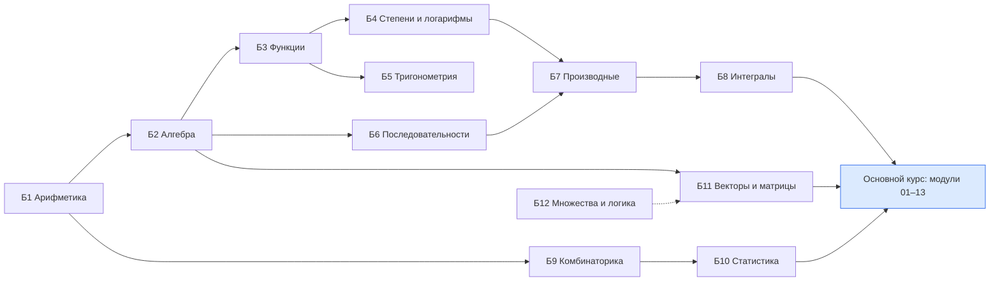
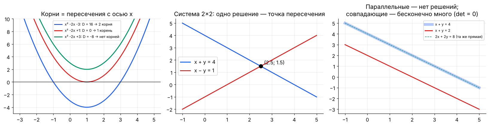
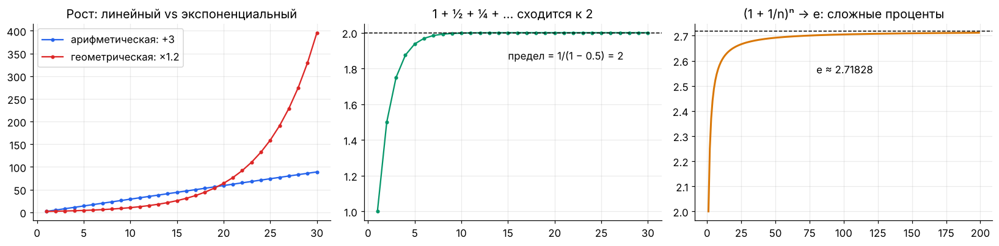
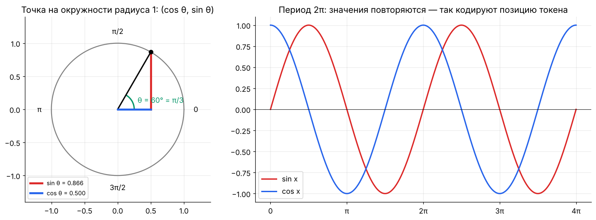
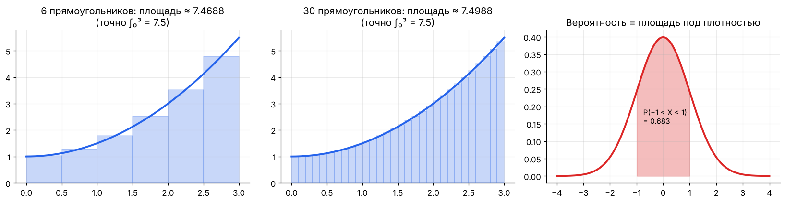
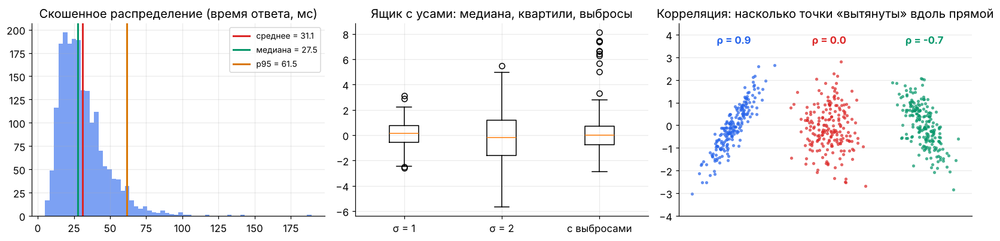
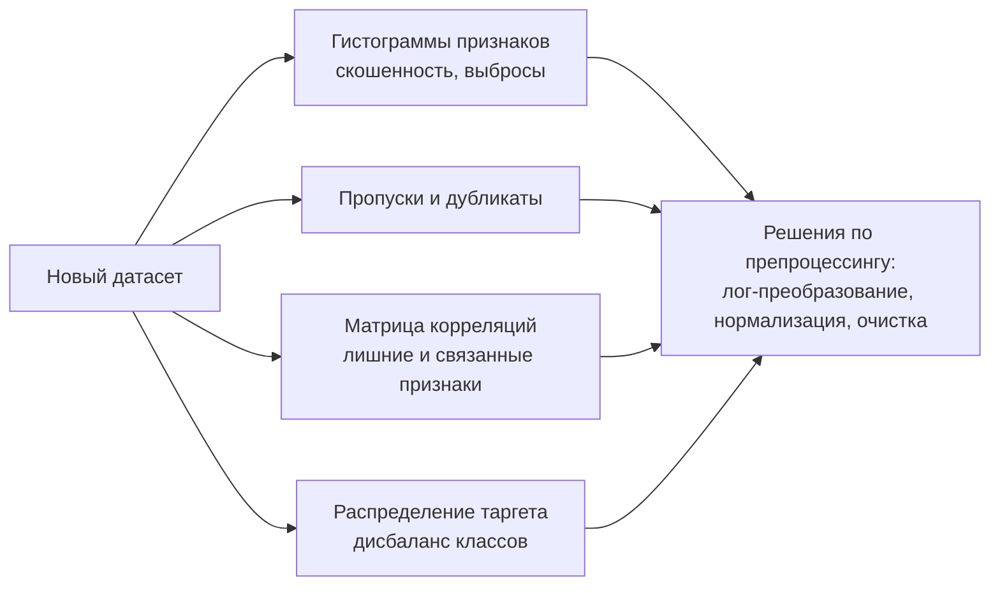
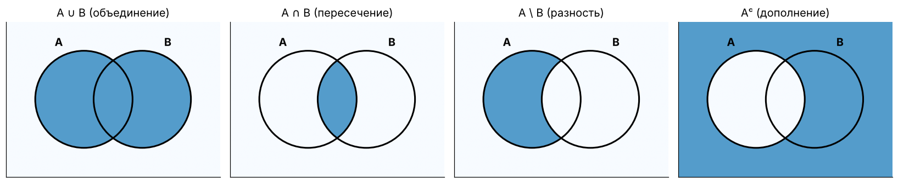

# 🟢 Математическая база с нуля — для тех, кто идёт в ИИ и ML

> Отдельный справочник к курсу [**Математика для ИИ и ML 2026**](README.md). Здесь — вся школьная и первокурсная математика, без которой не читаются формулы в статьях и в основном курсе. Объяснения простыми словами, картинки, примеры «где это в нейросети» и 36 задач с ответами.
>
> **Как пользоваться:** пройди [входной тест](#test) — он подскажет, какие разделы можно пропустить. Каждый раздел заканчивается мини-практикой с ответами под спойлером.

> 📓 [Ноутбук с кодом и иллюстрациями](notebooks/00a_basics_full.ipynb) · [](https://colab.research.google.com/github/justxor/math-for-ai-2026/blob/main/notebooks/00a_basics_full.ipynb) · 📖 [Глоссарий терминов RU ↔ EN](GLOSSARY.md)


## 📚 Содержание

| № | Раздел | Где пригодится в ML |
|---|--------|---------------------|
| [Б1](#b1) | Арифметика: дроби, проценты, порядки величин | метрики, learning rate, размеры моделей |
| [Б2](#b2) | Алгебра: выражения, уравнения, системы, неравенства | вывод формул, линейная регрессия |
| [Б3](#b3) | Функции и графики | модель = функция, активации |
| [Б4](#b4) | Степени, экспонента, логарифмы | softmax, лоссы, сложность алгоритмов |
| [Б5](#b5) | Тригонометрия | позиционные кодировки, RoPE, Фурье |
| [Б6](#b6) | Последовательности, суммы, пределы | дисконтирование, EMA, сходимость |
| [Б7](#b7) | Производные шаг за шагом | градиентный спуск, backprop |
| [Б8](#b8) | Интегралы: площадь под графиком | вероятности, матожидание |
| [Б9](#b9) | Комбинаторика | вероятности, сэмплирование |
| [Б10](#b10) | Описательная статистика | анализ данных, метрики |
| [Б11](#b11) | Векторы и матрицы с нуля | всё глубокое обучение |
| [Б12](#b12) | Множества, логика и чтение формул | статьи и документация |
| [📖](#greek) | Греческий алфавит и частые символы | — |
| [🧪](#test) | Входной и итоговый тест | — |

## 🗺️ Порядок изучения



<a id="test"></a>

## 🧪 Входной тест (10 минут)

Ответь на бумаге, потом сверься. Если ответ верный и дался без усилий — соответствующий раздел можно пролистать до практики.

| № | Вопрос | Раздел |
|---|--------|--------|
| 1 | Сколько будет 15% от 240? | Б1 |
| 2 | Решите: $3x - 7 = 11$ | Б2 |
| 3 | Где пересекает ось $y$ прямая $y = 2x + 5$? | Б3 |
| 4 | Чему равно $\log_2 32$? | Б4 |
| 5 | Чему равен $\sin 90°$? | Б5 |
| 6 | Сумма $1 + 2 + \dots + 100$? | Б6 |
| 7 | Производная $x^3$? | Б7 |
| 8 | Площадь под $y = 2$ на отрезке $[0, 5]$? | Б8 |
| 9 | Сколькими способами выбрать 2 человек из 5? | Б9 |
| 10 | Медиана чисел 3, 9, 1, 7, 5? | Б10 |
| 11 | $(1, 2) \cdot (3, 4) = ?$ (скалярное произведение) | Б11 |
| 12 | Что значит $x \in A \cap B$? | Б12 |

<details><summary>▶️ Ответы</summary>

1) 36; 2) $x = 6$; 3) в точке $(0, 5)$; 4) 5; 5) 1; 6) 5050; 7) $3x^2$; 8) 10; 9) 10; 10) 5; 11) 11; 12) $x$ лежит одновременно и в $A$, и в $B$.
</details>

---

<a id="b1"></a>

# Б1. Арифметика: дроби, проценты, порядки величин

## Дроби

```math
\frac{a}{b} + \frac{c}{d} = \frac{ad + bc}{bd}, \qquad \frac{a}{b} \cdot \frac{c}{d} = \frac{ac}{bd}, \qquad \frac{a}{b} : \frac{c}{d} = \frac{a}{b} \cdot \frac{d}{c}
```

- Делить на дробь = умножать на перевёрнутую.
- Сокращать можно только **множители**, не слагаемые: $\frac{2x}{2y} = \frac{x}{y}$, но $\frac{x + 2}{y + 2} \ne \frac{x}{y}$.

**Где в ML:** precision $= \frac{TP}{TP + FP}$ — это просто дробь «сколько из предсказанных позитивов правильные».

## Проценты и доли

| Задача | Формула | Пример |
|--------|---------|--------|
| p% от числа | $N \cdot p / 100$ | 15% от 240 = 36 |
| Какой процент A от B | $A / B \cdot 100\%$ | 36 из 240 = 15% |
| Изменение в процентах | $\frac{\text{новое} - \text{старое}}{\text{старое}} \cdot 100\%$ | 0.80 → 0.84: +5% |
| Процентные пункты (п.п.) | разность процентов | 80% → 84%: +4 п.п. |

> ⚠️ Ловушка: «accuracy выросла на 4%» и «на 4 п.п.» — разные вещи. С 80% до 84% — это **+4 п.п.**, но **+5%** относительно. Ошибка «упала с 20% до 16%» — минус 4 п.п., но минус **20%** ошибок.

**Несколько изменений подряд перемножаются:** +10%, затем −10% — это $1.1 \cdot 0.9 = 0.99$, итог −1%, а не 0.

## Порядок действий и округление

Скобки → степени → умножение и деление → сложение и вычитание. В коде то же: `2 + 3 * 4 ** 2 == 50`.

**Значащие цифры:** 0.000123 — три значащие цифры. Float32 хранит ~7 значащих цифр, поэтому `1.0 + 1e-8 == 1.0` (подробнее — модуль 13 основного курса).

## Научная запись и порядки величин

$123\,000 = 1.23 \cdot 10^5$, $0.00042 = 4.2 \cdot 10^{-4}$. В коде: `1.23e5`, `4.2e-4`.

| Приставка | Множитель | Пример в ML |
|-----------|-----------|-------------|
| К (кило) | $10^3$ | 4K контекст ≈ 4096 токенов |
| М (мега) | $10^6$ | 125M параметров (GPT-2 small) |
| G / B (гига, billion) | $10^9$ | 7B параметров |
| T (тера, trillion) | $10^{12}$ | 15T токенов обучения |
| P (пета) | $10^{15}$ | PFLOP/s — производительность кластера |
| м (милли) | $10^{-3}$ | lr = 3e-4 = 0.3 милли |

**Прикидка «на салфетке»** — ключевой навык: $7 \cdot 10^9$ параметров × 2 байта = $14 \cdot 10^9$ байт ≈ 14 ГБ.

## 🏋️ Практика Б1

**Б1.1.** Модель улучшила F1 с 0.62 до 0.71. На сколько процентных пунктов и на сколько процентов?

<details><summary>▶️ Ответ</summary>

+9 п.п.; относительный рост $(0.71 - 0.62)/0.62 \approx 14.5\%$.
</details>

**Б1.2.** Датасет 1.2 млн картинок, батч 256. Сколько шагов в эпохе? Сколько шагов за 90 эпох?

<details><summary>▶️ Ответ</summary>

$1\,200\,000 / 256 = 4687.5$ → 4688 шагов (последний батч неполный). За 90 эпох ≈ 421 900 шагов.
</details>

**Б1.3.** Сколько гигабайт займут 50 млн эмбеддингов размерности 768 во float32 (4 байта)?

<details><summary>▶️ Ответ</summary>

$5 \cdot 10^7 \cdot 768 \cdot 4 \approx 1.54 \cdot 10^{11}$ байт ≈ 154 ГБ. В float16 — 77 ГБ, с квантизацией в int8 — 38 ГБ. Поэтому в векторных базах используют сжатие (PQ).
</details>

---

<a id="b2"></a>

# Б2. Алгебра: выражения, уравнения, системы, неравенства

## Преобразования выражений

```math
a(b + c) = ab + ac, \qquad (a + b)^2 = a^2 + 2ab + b^2, \qquad (a - b)^2 = a^2 - 2ab + b^2, \qquad a^2 - b^2 = (a - b)(a + b)
```

**Где в ML:** раскрытие $(y - \hat{y})^2$ — первый шаг любого вывода про MSE; формула $(a - b)^2$ лежит в основе дисперсии $\mathbb{E}[(X - \mu)^2]$.

## Линейные уравнения

Цель — оставить $x$ одного: с обеими частями делаем одно и то же.

```math
3x - 7 = 11 \;\Rightarrow\; 3x = 18 \;\Rightarrow\; x = 6
```

**Выразить переменную из формулы** — постоянная задача: из $z = (x - \mu)/\sigma$ получаем $x = \mu + \sigma z$ (это и есть «денормализация» и трюк репараметризации).

## Квадратные уравнения

```math
ax^2 + bx + c = 0, \qquad D = b^2 - 4ac, \qquad x_{1,2} = \frac{-b \pm \sqrt{D}}{2a}
```

$D > 0$ — два корня, $D = 0$ — один, $D < 0$ — вещественных корней нет. Вершина параболы — в $x = -\frac{b}{2a}$: это **минимум** (при $a > 0$) — так находится оптимум любой квадратичной функции потерь от одного параметра.



## Системы линейных уравнений

```math
\begin{cases} x + y = 4 \\ x - y = 1 \end{cases} \;\Rightarrow\; 2x = 5,\ x = 2.5,\ y = 1.5
```

Геометрически — точка пересечения прямых. В матричной форме $A\mathbf{x} = \mathbf{b}$ (раздел Б11). Решений может быть одно, ни одного (параллельные прямые) или бесконечно много (совпадающие). **Линейная регрессия** — это «решить систему», в которой уравнений (объектов) больше, чем неизвестных, поэтому ищут лучшее приближённое решение.

## Неравенства и модуль

- При умножении или делении на **отрицательное** число знак неравенства меняется: $-2x < 6 \Rightarrow x > -3$.
- $\lvert x\rvert$ — расстояние до нуля; $\lvert x - a\rvert < r \iff a - r < x < a + r$.
- **Где в ML:** clipping $\mathrm{clip}(x, -c, c)$ ограничивает $\lvert x\rvert \le c$; условие сходимости градиентного спуска $\lvert 1 - \eta\lambda\rvert < 1$ — двойное неравенство на learning rate.

## 🏋️ Практика Б2

**Б2.1.** Раскройте и упростите $(y - wx)^2$.

<details><summary>▶️ Ответ</summary>

$y^2 - 2wxy + w^2x^2$. Как функция от $w$ — парабола с минимумом в $w = xy/x^2 = y/x$.
</details>

**Б2.2.** Найдите минимум $f(w) = 2w^2 - 8w + 3$.

<details><summary>▶️ Ответ</summary>

Вершина $w = -(-8)/(2 \cdot 2) = 2$, $f(2) = 8 - 16 + 3 = -5$.
</details>

**Б2.3.** При каких $\eta$ выполняется $\lvert 1 - 4\eta\rvert < 1$?

<details><summary>▶️ Ответ</summary>

$-1 < 1 - 4\eta < 1 \Rightarrow 0 < \eta < 0.5$. Это условие устойчивости GD для функции с кривизной 4.
</details>

---

<a id="b3"></a>

# Б3. Функции и графики

## Что такое функция

Функция $f: X \to Y$ каждому входу ставит в соответствие **ровно один** выход. Нейросеть — функция $f_\theta: \text{картинка} \to \text{вероятности классов}$, где $\theta$ — веса.

- **Область определения** — где функция имеет смысл: $\ln x$ только при $x > 0$, $\sqrt{x}$ — при $x \ge 0$, $1/x$ — при $x \ne 0$. Половина ошибок `NaN` в обучении — выход за область определения.
- **Монотонность:** возрастает, если больший вход даёт больший выход. Монотонные преобразования ($\log$, $\exp$, сигмоида) **не меняют argmax** — поэтому можно максимизировать log-правдоподобие вместо правдоподобия.


## Композиция и обратная функция

- **Композиция** $(f \circ g)(x) = f(g(x))$ — сначала $g$, потом $f$. Нейросеть — это композиция слоёв: $f_3(f_2(f_1(x)))$.
- **Обратная функция** $f^{-1}$ «отменяет» $f$: $\ln$ — обратная к $\exp$, $\mathrm{logit}(p) = \ln\frac{p}{1-p}$ — обратная к сигмоиде.

## Кусочные функции

```math
\mathrm{ReLU}(x) = \max(0, x) = \begin{cases} x, & x > 0 \\ 0, & x \le 0 \end{cases}
```

Кусочные функции — основа активаций (ReLU), функций потерь (hinge, Huber) и деревьев решений (кусочно-постоянные предсказания).

## Преобразования графиков

| Запись | Что происходит с графиком |
|--------|---------------------------|
| $f(x) + c$ | сдвиг вверх на $c$ |
| $f(x - a)$ | сдвиг вправо на $a$ |
| $c \cdot f(x)$ | растяжение по вертикали |
| $f(kx)$ | сжатие по горизонтали в $k$ раз |
| $-f(x)$ | отражение относительно оси $x$ |

Нейрон $\sigma(wx + b)$: $w$ задаёт крутизну «ступеньки», $b/w$ — её положение. Обучение двигает и растягивает эти ступеньки, а их сумма приближает любую функцию.

## 🏋️ Практика Б3

**Б3.1.** Найдите область определения $f(x) = \ln(1 - x^2)$.

<details><summary>▶️ Ответ</summary>

$1 - x^2 > 0 \iff -1 < x < 1$.
</details>

**Б3.2.** Покажите, что логит обратен к сигмоиде.

<details><summary>▶️ Ответ</summary>

$p = \frac{1}{1 + e^{-z}} \Rightarrow 1 + e^{-z} = \frac{1}{p} \Rightarrow e^{-z} = \frac{1-p}{p} \Rightarrow z = \ln\frac{p}{1-p}$.
</details>

**Б3.3.** Где «ступенька» $\sigma(4x - 8)$ проходит через 0.5 и насколько она крутая по сравнению с $\sigma(x)$?

<details><summary>▶️ Ответ</summary>

$\sigma(z) = 0.5$ при $z = 0$: $4x - 8 = 0$, $x = 2$. Наклон в центре в 4 раза больше: $4 \cdot 0.25 = 1$ против $0.25$.
</details>

---

<a id="b4"></a>

# Б4. Степени, экспонента, логарифмы

## Степени

```math
a^m a^n = a^{m+n}, \quad \frac{a^m}{a^n} = a^{m-n}, \quad (a^m)^n = a^{mn}, \quad (ab)^n = a^n b^n, \quad a^{-n} = \frac{1}{a^n}, \quad a^{m/n} = \sqrt[n]{a^m}
```

Удобные числа: $2^{10} = 1024$, $2^{16} = 65\,536$, $2^{20} \approx 10^6$, $2^{32} \approx 4.3 \cdot 10^9$.

## Откуда берётся число e

Сложные проценты: 100% годовых, начисляем $n$ раз в год по $100/n$ %: итог $(1 + 1/n)^n$. При $n \to \infty$ это стремится к $e \approx 2.71828$ — «непрерывный рост».



Экспонента $e^x$ — единственная функция, равная своей производной. Поэтому она везде, где «скорость изменения пропорциональна величине»: рост, затухание, softmax.

## Логарифмы

$\log_a b = c \iff a^c = b$.

```math
\log(xy) = \log x + \log y, \qquad \log\frac{x}{y} = \log x - \log y, \qquad \log x^k = k\log x, \qquad \log_a x = \frac{\ln x}{\ln a}
```

| Где в ML | Почему логарифм |
|----------|-----------------|
| Cross-entropy $-\ln p$ | превращает вероятность в штраф: $p = 1 \to 0$, $p \to 0 \Rightarrow \infty$ |
| Log-likelihood | произведение миллионов вероятностей → сумма, без underflow |
| Log-scale графики | лосс, learning rate, законы масштабирования — прямые в лог-лог |
| Сложность $O(\log n)$ | бинарный поиск, деревья: каждый шаг делит задачу пополам |
| Энтропия в битах | $\log_2$ — сколько вопросов «да/нет» нужно |

## 🏋️ Практика Б4

**Б4.1.** Упростите $\ln(e^3 \cdot e^{-1})$ и $\log_2(64) - \log_2(4)$.

<details><summary>▶️ Ответ</summary>

$\ln e^2 = 2$; $\log_2(64/4) = \log_2 16 = 4$.
</details>

**Б4.2.** Вероятность каждого из 1000 независимых событий — 0.99. Посчитайте вероятность, что произойдут все, через логарифм.

<details><summary>▶️ Ответ</summary>

$\ln P = 1000 \cdot \ln 0.99 \approx 1000 \cdot (-0.01005) = -10.05$, $P = e^{-10.05} \approx 4.3 \cdot 10^{-5}$.
</details>

**Б4.3.** Learning rate ищут перебором по сетке 1e-5, 3e-5, 1e-4, 3e-4, 1e-3. Почему шаг сетки «×3», а не «+0.0002»?

<details><summary>▶️ Ответ</summary>

Важен **порядок** величины, а не абсолютная разница: равномерная сетка по логарифму покрывает диапазон в 100 раз пятью точками. Линейная сетка с шагом 0.0002 потратила бы все точки на диапазон около 1e-3 и пропустила бы 1e-5.
</details>

---

<a id="b5"></a>

# Б5. Тригонометрия

## Единичная окружность

Точка на окружности радиуса 1 под углом $\theta$ имеет координаты $(\cos\theta, \sin\theta)$.



- **Радианы:** полный оборот $= 2\pi$ рад $= 360°$; $\pi$ рад $= 180°$; 1 рад ≈ 57.3°. В коде и формулах — всегда радианы: `np.sin(np.pi / 2) == 1.0`.
- Основное тождество: $\sin^2\theta + \cos^2\theta = 1$ (теорема Пифагора на окружности).
- Периодичность: $\sin(\theta + 2\pi) = \sin\theta$.

| θ | 0 | π/6 | π/4 | π/3 | π/2 | π |
|---|---|-----|-----|-----|-----|---|
| sin | 0 | 1/2 | √2/2 | √3/2 | 1 | 0 |
| cos | 1 | √3/2 | √2/2 | 1/2 | 0 | −1 |

## Поворот

Повернуть точку $(x, y)$ на угол $\theta$:

```math
\begin{pmatrix} x' \\ y' \end{pmatrix} = \begin{pmatrix} \cos\theta & -\sin\theta \\ \sin\theta & \cos\theta \end{pmatrix} \begin{pmatrix} x \\ y \end{pmatrix}
```

**Где в ML:**
- **RoPE** — позиционное кодирование почти всех современных LLM — поворачивает пары координат запросов и ключей на угол, пропорциональный номеру токена.
- **Синусоидальные позиционные кодировки** исходного трансформера — набор синусов и косинусов разных частот.
- **Косинусное сходство** эмбеддингов — косинус угла между векторами.
- **Cosine learning rate schedule** — половина периода косинуса от пика LR до минимума.
- **Преобразование Фурье** раскладывает сигнал (звук, временной ряд) на синусоиды.

## 🏋️ Практика Б5

**Б5.1.** Переведите 45° и 120° в радианы.

<details><summary>▶️ Ответ</summary>

$45° = \pi/4 \approx 0.785$; $120° = 2\pi/3 \approx 2.094$.
</details>

**Б5.2.** Поверните вектор $(1, 0)$ на 90°. Что с его длиной?

<details><summary>▶️ Ответ</summary>

$(\cos 90°, \sin 90°) = (0, 1)$. Длина осталась 1 — повороты не меняют длины, поэтому RoPE не портит масштаб векторов.
</details>

**Б5.3.** Косинус угла между эмбеддингами равен 0.5. Какой угол? А если −1?

<details><summary>▶️ Ответ</summary>

60°: похожи частично. −1 — 180°, противоположны по смыслу направления.
</details>

---

<a id="b6"></a>

# Б6. Последовательности, суммы, пределы

## Прогрессии

| | Арифметическая | Геометрическая |
|---|---|---|
| Правило | $a_{n} = a_1 + (n-1)d$ | $b_n = b_1 q^{n-1}$ |
| Сумма n членов | $\frac{(a_1 + a_n)\,n}{2}$ | $b_1 \frac{1 - q^n}{1 - q}$ |
| Бесконечная сумма | расходится (при $d \ne 0$) | $\frac{b_1}{1 - q}$ при $\lvert q\rvert < 1$ |
| Где в ML | линейный warmup LR | дисконт $\gamma^t$ в RL, EMA, затухание LR |

Сумма $1 + 2 + \dots + 100 = \frac{(1 + 100) \cdot 100}{2} = 5050$ (история про юного Гаусса).

## Пределы — «к чему стремится»

$\lim_{n \to \infty} a_n = L$ — члены последовательности сколь угодно близко подходят к $L$.

- $\lim \frac{1}{n} = 0$, $\lim (1 + \frac{1}{n})^n = e$, $\lim q^n = 0$ при $\lvert q\rvert < 1$.
- **Сходимость обучения** — это тоже предел: лосс по шагам стремится к некоторому значению.
- Производная — предел отношения $\frac{f(x + h) - f(x)}{h}$ при $h \to 0$ (раздел Б7).

## Скорость роста и O-нотация

$O(f(n))$ — «растёт не быстрее, чем $f(n)$, с точностью до константы». Иерархия:

```math
1 \ll \log n \ll \sqrt{n} \ll n \ll n\log n \ll n^2 \ll n^3 \ll 2^n \ll n!
```

| Операция | Сложность |
|----------|-----------|
| Поиск по индексу HNSW | ≈ $O(\log n)$ |
| Сортировка | $O(n \log n)$ |
| Self-attention по длине последовательности | $O(n^2)$ |
| Умножение матриц $n \times n$ | $O(n^3)$ |
| Перебор всех подмножеств признаков | $O(2^n)$ — невозможно уже при $n = 50$ |

## 🏋️ Практика Б6

**Б6.1.** Learning rate растёт линейно от 0 до 3e-4 за 2000 шагов warmup. Какой LR на шаге 500?

<details><summary>▶️ Ответ</summary>

$3 \cdot 10^{-4} \cdot 500/2000 = 7.5 \cdot 10^{-5}$.
</details>

**Б6.2.** Найдите $\sum_{t=0}^{\infty} 0.95^t$.

<details><summary>▶️ Ответ</summary>

$1/(1 - 0.95) = 20$. «Горизонт» агента с $\gamma = 0.95$ — около 20 шагов.
</details>

**Б6.3.** Контекст увеличили с 4K до 32K токенов. Во сколько раз выросло время self-attention?

<details><summary>▶️ Ответ</summary>

$O(n^2)$: $(32/4)^2 = 64$ раза. Поэтому для длинного контекста нужны FlashAttention, разреженное или линейное внимание.
</details>

---

<a id="b7"></a>

# Б7. Производные шаг за шагом

## Смысл


```math
f'(x) = \lim_{h \to 0} \frac{f(x + h) - f(x)}{h}
```

Производная — **скорость изменения** и **наклон касательной**. Если $f'(x) = 3$, то при увеличении $x$ на 0.01 функция вырастет примерно на 0.03.

## Таблица и правила

| $f(x)$ | $f'(x)$ |
|--------|---------|
| $c$ (константа) | $0$ |
| $x^n$ | $n x^{n-1}$ |
| $e^x$ | $e^x$ |
| $a^x$ | $a^x \ln a$ |
| $\ln x$ | $1/x$ |
| $\sin x$ / $\cos x$ | $\cos x$ / $-\sin x$ |

```math
(cf)' = cf', \quad (f + g)' = f' + g', \quad (fg)' = f'g + fg', \quad \left(\frac{f}{g}\right)' = \frac{f'g - fg'}{g^2}, \quad \bigl(f(g(x))\bigr)' = f'(g(x))\cdot g'(x)
```

## Цепное правило — медленно, по шагам

$h(x) = (3x + 1)^2$. Внешняя функция $u^2$, внутренняя $u = 3x + 1$:

1. Производная внешней по своему аргументу: $2u$.
2. Производная внутренней: $3$.
3. Перемножить и подставить: $h'(x) = 2(3x + 1) \cdot 3 = 6(3x + 1)$.

Нейросеть — это цепочка из десятков вложенных функций, и **backpropagation** — это цепное правило, применённое ко всей цепочке справа налево.

## Экстремумы

- В точке минимума или максимума гладкой функции $f'(x) = 0$.
- Вторая производная говорит, что это: $f'' > 0$ — минимум (чашка ∪), $f'' < 0$ — максимум (шапка ∩).

## Частные производные

У функции нескольких переменных $f(x, y)$ производная по $x$ считается, «замораживая» $y$ как константу:

```math
f(x, y) = x^2 y + 3y \quad\Rightarrow\quad \frac{\partial f}{\partial x} = 2xy, \qquad \frac{\partial f}{\partial y} = x^2 + 3
```

Вектор всех частных производных — **градиент** $\nabla f = (2xy,\ x^2 + 3)$. Он показывает направление самого быстрого роста; градиентный спуск идёт в противоположную сторону.

## 🏋️ Практика Б7

**Б7.1.** Найдите производные: $5x^4 - 2x$, $e^{-x^2}$, $\ln(3x)$.

<details><summary>▶️ Ответ</summary>

$20x^3 - 2$; $-2x\,e^{-x^2}$; $\frac{3}{3x} = \frac{1}{x}$.
</details>

**Б7.2.** Найдите градиент $L(w, b) = (wx + b - y)^2$ по $w$ и $b$.

<details><summary>▶️ Ответ</summary>

$\frac{\partial L}{\partial w} = 2(wx + b - y)\cdot x$, $\frac{\partial L}{\partial b} = 2(wx + b - y)$. Это градиенты линейной регрессии на одном примере.
</details>

**Б7.3.** Проверьте численно: производная $\sin x$ в точке 1 равна $\cos 1$.

<details><summary>▶️ Ответ</summary>

```python
import numpy as np
h = 1e-6
print((np.sin(1 + h) - np.sin(1 - h)) / (2 * h), np.cos(1))   # 0.5403 0.5403
```
</details>

---

<a id="b8"></a>

# Б8. Интегралы: площадь под графиком

## Смысл

Определённый интеграл $\int_a^b f(x)\,dx$ — площадь под графиком $f$ от $a$ до $b$ (части ниже оси считаются со знаком минус). Его можно приблизить суммой прямоугольников — так интегралы и считают численно.



## Связь с производной

**Основная теорема анализа:** если $F' = f$, то

```math
\int_a^b f(x)\,dx = F(b) - F(a)
```

Пример: $\int_0^3 (0.5x^2 + 1)\,dx = \left[\frac{x^3}{6} + x\right]_0^3 = 4.5 + 3 = 7.5$ — совпадает с суммой прямоугольников на картинке.

| $f(x)$ | первообразная $F(x)$ |
|--------|----------------------|
| $x^n$ ($n \ne -1$) | $\frac{x^{n+1}}{n+1}$ |
| $1/x$ | $\ln\lvert x\rvert$ |
| $e^x$ | $e^x$ |

## Зачем интегралы в ML

- **Плотность вероятности:** вероятность попасть в интервал — площадь под плотностью: $P(a < X < b) = \int_a^b p(x)\,dx$. Вся площадь равна 1.
- **Матожидание** непрерывной величины: $\mathbb{E}[X] = \int x\,p(x)\,dx$ — «взвешенное среднее» по всем значениям.
- **Маргинализация:** $p(x) = \int p(x, z)\,dz$ — «проинтегрировать по скрытой переменной». Этот интеграл обычно не считается, отсюда VAE, ELBO и сэмплирование.
- **AUC** — буквально площадь под ROC-кривой.
- На практике интегралы почти всегда заменяют **средним по сэмплам** (метод Монте-Карло): $\mathbb{E}[f(X)] \approx \frac{1}{N}\sum f(x_i)$.

## 🏋️ Практика Б8

**Б8.1.** Посчитайте $\int_0^2 3x^2\,dx$.

<details><summary>▶️ Ответ</summary>

$[x^3]_0^2 = 8$.
</details>

**Б8.2.** Плотность $p(x) = 2x$ на $[0, 1]$. Проверьте, что площадь равна 1, и найдите $\mathbb{E}[X]$.

<details><summary>▶️ Ответ</summary>

$\int_0^1 2x\,dx = [x^2]_0^1 = 1$. $\mathbb{E}[X] = \int_0^1 x \cdot 2x\,dx = [2x^3/3]_0^1 = 2/3$.
</details>

**Б8.3.** Оцените $\int_0^1 e^{-x^2}dx$ методом Монте-Карло.

<details><summary>▶️ Ответ</summary>

```python
import numpy as np
u = np.random.rand(1_000_000)
print(np.exp(-u**2).mean())    # ≈ 0.7468
```
Среднее значение функции на отрезке длины 1 равно интегралу.
</details>

---

<a id="b9"></a>

# Б9. Комбинаторика

## Правила суммы и произведения

- **Произведение:** если первый выбор — $m$ вариантов, второй — $n$, то пар $m \cdot n$. Пароль из 4 цифр: $10^4$ вариантов.
- **Сумма:** если выбираем **либо** одно из $m$, **либо** одно из $n$ (без пересечений) — $m + n$ вариантов.

## Перестановки, размещения, сочетания

| Что считаем | Формула | Пример |
|-------------|---------|--------|
| Перестановки $n$ объектов | $n! = 1 \cdot 2 \cdots n$ | порядков 5 карт: 120 |
| Упорядоченный выбор $k$ из $n$ | $\frac{n!}{(n-k)!}$ | призовые места 3 из 10: 720 |
| Неупорядоченный выбор $k$ из $n$ | $\binom{n}{k} = \frac{n!}{k!(n-k)!}$ | пары из 5 человек: 10 |
| С повторениями, порядок важен | $n^k$ | последовательностей из 10 токенов словаря 50k: $50000^{10}$ |

$n!$ растёт быстрее экспоненты: $10! \approx 3.6 \cdot 10^6$, $20! \approx 2.4 \cdot 10^{18}$.

## Бином Ньютона и треугольник Паскаля

```math
(a + b)^n = \sum_{k=0}^{n} \binom{n}{k} a^k b^{n-k}
```

Коэффициенты — строки треугольника Паскаля (1; 1 1; 1 2 1; 1 3 3 1; …). Отсюда биномиальное распределение: вероятность $k$ успехов из $n$ — $\binom{n}{k}p^k(1-p)^{n-k}$.

## Где в ML

- **Пространство поиска:** перебрать все подмножества из 30 признаков — $2^{30} \approx 10^9$ вариантов; поэтому используют жадные методы и регуляризацию.
- **Попарные сравнения:** для $n$ объектов $\binom{n}{2} \approx n^2/2$ пар — столько пар нужно для contrastive loss или кластеризации.
- **Beam search** с шириной $k$ хранит $k$ лучших из $k \cdot V$ продолжений вместо всех $V^T$ последовательностей.

## 🏋️ Практика Б9

**Б9.1.** Сколько разных батчей по 4 примера можно составить из 10?

<details><summary>▶️ Ответ</summary>

$\binom{10}{4} = 210$.
</details>

**Б9.2.** Вероятность ровно 3 орлов из 5 бросков честной монеты?

<details><summary>▶️ Ответ</summary>

$\binom{5}{3}/2^5 = 10/32 = 0.3125$.
</details>

**Б9.3.** Сколько пар для contrastive loss в батче из 256 примеров (каждый с каждым)?

<details><summary>▶️ Ответ</summary>

$\binom{256}{2} = 32\,640$. В CLIP-лоссе матрица $256 \times 256$ даёт 256 позитивных и ~65 000 негативных пар «картинка — текст».
</details>

---

<a id="b10"></a>

# Б10. Описательная статистика

## Центр и разброс

| Мера | Формула / смысл | Чувствительна к выбросам? |
|------|-----------------|---------------------------|
| Среднее $\bar{x}$ | $\frac{1}{n}\sum x_i$ | да |
| Медиана | середина отсортированного списка | нет |
| Мода | самое частое значение | нет |
| Дисперсия $s^2$ | $\frac{1}{n-1}\sum (x_i - \bar{x})^2$ | очень |
| Стандартное отклонение $s$ | $\sqrt{s^2}$, в единицах данных | очень |
| Перцентиль $p_q$ | значение, ниже которого $q\%$ данных | нет |
| Межквартильный размах IQR | $p_{75} - p_{25}$ | нет |



- У скошенных распределений (время ответа, доходы, длины текстов) среднее больше медианы — хвост тянет его вправо.
- **Почему делят на $n - 1$:** среднее посчитано по тем же данным, и отклонения от него в среднем меньше, чем от истинного $\mu$; поправка Бесселя компенсирует это.
- **z-оценка** $z = (x - \bar{x})/s$ — сколько стандартных отклонений от среднего. $\lvert z\rvert > 3$ — кандидат в выбросы.

## Связь двух переменных

**Корреляция Пирсона:**

```math
r = \frac{\sum (x_i - \bar{x})(y_i - \bar{y})}{\sqrt{\sum (x_i - \bar{x})^2}\sqrt{\sum (y_i - \bar{y})^2}} \in [-1, 1]
```

- $r$ ловит только **линейную** связь; корреляция Спирмена — любую монотонную (считается по рангам).
- **Корреляция ≠ причинность:** продажи мороженого и число утоплений коррелируют из-за третьего фактора — жары.

## Визуализация данных — что смотреть первым



## 🏋️ Практика Б10

**Б10.1.** Данные: 2, 4, 4, 4, 5, 5, 7, 9. Найдите среднее, медиану, моду и стандартное отклонение (по $n$).

<details><summary>▶️ Ответ</summary>

Среднее 5, медиана 4.5, мода 4, σ = 2 (дисперсия по $n$ равна 4).
</details>

**Б10.2.** Время ответа сервиса: p50 = 120 мс, p99 = 2400 мс. Что это говорит о сервисе?

<details><summary>▶️ Ответ</summary>

Типичный запрос быстрый, но 1% запросов в 20 раз медленнее — тяжёлый хвост. Среднее тут почти бесполезно; оптимизировать нужно хвост (таймауты, батчинг, кэш).
</details>

**Б10.3.** Посчитайте корреляцию между $x = (1, 2, 3, 4, 5)$ и $y = x^2$ и между $x = (-2, -1, 0, 1, 2)$ и $y = x^2$.

<details><summary>▶️ Ответ</summary>

```python
import numpy as np
x = np.arange(1, 6); print(np.corrcoef(x, x**2)[0, 1])     # 0.98 — почти линейная связь
x = np.arange(-2, 3); print(np.corrcoef(x, x**2)[0, 1])    # 0.0 — связь есть, но нелинейная
```
</details>

---

<a id="b11"></a>

# Б11. Векторы и матрицы с нуля

## Векторы

Вектор — упорядоченный список чисел $\mathbf{v} = (v_1, \dots, v_n)$. Геометрически — стрелка из начала координат.

| Операция | Как считается | Смысл |
|----------|---------------|-------|
| Сложение | поэлементно | сдвиг: «король − мужчина + женщина ≈ королева» |
| Умножение на число | каждый элемент × c | растяжение |
| Длина | $\lVert\mathbf{v}\rVert = \sqrt{v_1^2 + \dots + v_n^2}$ | Пифагор в n измерениях |
| Скалярное произведение | $\mathbf{a}\cdot\mathbf{b} = \sum a_i b_i$ | похожесть направлений |

## Матрицы

Матрица — таблица чисел $m \times n$ ($m$ строк, $n$ столбцов). **Умножение матрицы на вектор** — каждая строка скалярно умножается на вектор:

```math
\begin{pmatrix} 1 & 2 \\ 3 & 4 \\ 5 & 6 \end{pmatrix} \begin{pmatrix} 10 \\ 1 \end{pmatrix} = \begin{pmatrix} 1\cdot10 + 2\cdot1 \\ 3\cdot10 + 4\cdot1 \\ 5\cdot10 + 6\cdot1 \end{pmatrix} = \begin{pmatrix} 12 \\ 34 \\ 56 \end{pmatrix}
```

**Это ровно то, что делает слой нейросети:** 2 входа → 3 выхода, каждая строка матрицы — веса одного нейрона.

**Умножение матриц** $C = AB$: элемент $C_{ij}$ — скалярное произведение $i$-й строки $A$ на $j$-й столбец $B$. Размерности: `(m×k)·(k×n) → (m×n)`, внутренние должны совпасть.

```python
import numpy as np
W = np.array([[1, 2], [3, 4], [5, 6]])     # слой: 2 входа → 3 нейрона
x = np.array([10, 1])
print(W @ x)                                # [12 34 56]
X = np.array([[10, 1], [0, 1], [1, 1]])     # батч из 3 примеров
print(X @ W.T)                              # каждый пример через слой: форма (3, 3)
```

## Транспонирование, единичная и обратная матрицы

- $A^\top$ — строки становятся столбцами: размер $m \times n$ → $n \times m$.
- $I$ — единичная: $I\mathbf{x} = \mathbf{x}$.
- $A^{-1}$: $AA^{-1} = I$. Система $A\mathbf{x} = \mathbf{b}$ решается как $\mathbf{x} = A^{-1}\mathbf{b}$ (в коде — `np.linalg.solve(A, b)`).
- Обратная существует, только если определитель $\det A \ne 0$. Для матрицы $2\times2$:

```math
\det\begin{pmatrix} a & b \\ c & d\end{pmatrix} = ad - bc
```

## 🏋️ Практика Б11

**Б11.1.** Найдите длину вектора $(3, 4)$ и косинус угла между $(1, 0)$ и $(1, 1)$.

<details><summary>▶️ Ответ</summary>

$\sqrt{9 + 16} = 5$. $\cos = \frac{1}{1 \cdot \sqrt{2}} \approx 0.707$ — угол 45°.
</details>

**Б11.2.** Какой формы будет результат: матрица $(32 \times 768)$ умножить на $(768 \times 3072)$?

<details><summary>▶️ Ответ</summary>

$(32 \times 3072)$ — батч из 32 токенов прошёл через расширяющий слой FFN трансформера.
</details>

**Б11.3.** Решите систему $2x + y = 5$, $x - y = 1$ через матрицы.

<details><summary>▶️ Ответ</summary>

```python
A = np.array([[2, 1], [1, -1]]); b = np.array([5, 1])
print(np.linalg.solve(A, b))       # [2. 1.]
```
$\det A = -2 - 1 = -3 \ne 0$ — решение единственное.
</details>

---

<a id="b12"></a>

# Б12. Множества, логика и чтение формул

## Множества



| Запись | Читается | Пример |
|--------|----------|--------|
| $x \in A$ | x принадлежит A | $3 \in \mathbb{N}$ |
| $A \subseteq B$ | A — подмножество B | целые ⊆ вещественные |
| $A \cup B$ | объединение | train ∪ val |
| $A \cap B$ | пересечение | train ∩ test должно быть пусто! |
| $A \setminus B$ | разность | словарь без стоп-слов |
| $\varnothing$ | пустое множество | |
| $\lvert A\rvert$ | мощность (число элементов) | размер словаря |
| $\mathbb{N}, \mathbb{Z}, \mathbb{R}$ | натуральные, целые, вещественные | $\mathbf{x} \in \mathbb{R}^{768}$ |
| $[a, b]$, $(a, b)$ | отрезок (с концами), интервал (без) | $p \in [0, 1]$ |

**Запись через условие:** $\lbrace x \in \mathbb{R} : x > 0 \rbrace$ — «все вещественные $x$, такие что $x > 0$».

**IoU** в детекции и сегментации — $\frac{\lvert A \cap B\rvert}{\lvert A \cup B\rvert}$ — прямо формула про множества пикселей.

## Логика и кванторы

| Символ | Смысл | Пример |
|--------|-------|--------|
| $\forall$ | для всех | $\forall x: x^2 \ge 0$ |
| $\exists$ | существует | $\exists x: x^2 = 4$ |
| $\Rightarrow$ | следует | $x > 2 \Rightarrow x > 1$ |
| $\iff$ | тогда и только тогда | $x^2 = 0 \iff x = 0$ |
| $\wedge$, $\vee$, $\neg$ | и, или, не | |

Ловушка: из «$A \Rightarrow B$» **не** следует «$B \Rightarrow A$». «Если модель переобучилась, то train-лосс низкий» — верно; обратное — нет.

## Как читать формулу из статьи

1. Выпиши все обозначения и их размерности (что вектор, что матрица, что число).
2. Найди, **по чему** идёт сумма или ожидание: $\sum_{i}$, $\mathbb{E}_{x \sim p}$.
3. Переведи в псевдокод: $\sum$ → цикл, $\mathbb{E}$ → среднее по сэмплам, $\arg\max$ → `argmax`.
4. Подставь маленькие числа (2×2 матрицы, 3 примера) и посчитай руками или в NumPy.
5. Проверь крайние случаи: что будет при $T \to 0$, $\lambda = 0$, одном примере.

**Пример.** $\mathcal{L} = -\frac{1}{N}\sum_{i=1}^{N} \log p_\theta(y_i \mid \mathbf{x}_i)$ читается: «средний по N примерам минус логарифм вероятности, которую модель с параметрами θ присвоила правильному ответу $y_i$ для входа $\mathbf{x}_i$» — это cross-entropy.

## 🏋️ Практика Б12

**Б12.1.** Train — примеры с id 1–800, test — 750–1000. Найдите пересечение. Что не так?

<details><summary>▶️ Ответ</summary>

Пересечение — id 750–800, 51 пример. Это **утечка данных**: модель видела часть теста на обучении, оценка качества завышена. Должно быть train ∩ test = ∅.
</details>

**Б12.2.** Предсказанная рамка — 100 пикселей, истинная — 80, общих — 60. IoU?

<details><summary>▶️ Ответ</summary>

$\lvert A \cup B\rvert = 100 + 80 - 60 = 120$. IoU = 60/120 = 0.5 — обычный порог «детекция засчитана».
</details>

**Б12.3.** Прочитайте вслух: $\forall \varepsilon > 0\ \exists N: \forall n > N\ \lvert a_n - L\rvert < \varepsilon$.

<details><summary>▶️ Ответ</summary>

«Для любой сколь угодно малой точности ε найдётся номер N, начиная с которого все члены последовательности отличаются от L меньше чем на ε» — определение предела $a_n \to L$.
</details>

---

<a id="greek"></a>

# 📖 Греческий алфавит и частые символы

| Буква | Название | Обычно обозначает в ML |
|-------|----------|------------------------|
| α | альфа | learning rate, уровень значимости, коэффициент LoRA |
| β | бета | моменты в Adam, сила KL в RLHF/DPO, параметр распределения |
| γ | гамма | дисконт в RL, масштаб в нормализации |
| δ | дельта | маленькое изменение, вероятность «провала» в оценках |
| ε | эпсилон | маленькое число, шум, точность |
| η | эта | learning rate |
| θ | тета | параметры модели |
| λ | лямбда | сила регуляризации, собственное число |
| μ | мю | среднее |
| σ | сигма | стандартное отклонение, сигмоида |
| Σ | Сигма | сумма, матрица ковариации |
| π | пи | 3.14159…, политика в RL |
| ρ | ро | корреляция, отношение вероятностей в PPO |
| τ | тау | температура, траектория в RL |
| φ, ψ | фи, пси | параметры энкодера, признаковые преобразования |
| ∇ | набла | градиент |
| ∂ | «дэ» | частная производная |
| ∝ | пропорционально | равенство с точностью до константы |
| ≈ | примерно равно | |
| ≜, := | по определению | |

---

# 🧪 Итоговый тест

> 12 вопросов по всем разделам. 10+ правильных — смело переходите к [основному курсу](README.md).

| № | Вопрос |
|---|--------|
| 1 | Accuracy выросла с 90% до 93%. На сколько п.п. и на сколько процентов упала доля ошибок? |
| 2 | Минимум функции $3w^2 - 12w + 1$? |
| 3 | Область определения $\ln(x - 2)$? |
| 4 | $\log_{10} 0.001$? |
| 5 | $\cos \pi$? |
| 6 | Сумма $1 + 0.9 + 0.81 + \dots$ (бесконечно)? |
| 7 | Производная $e^{3x}$? |
| 8 | $\int_0^1 x\,dx$? |
| 9 | $\binom{6}{2}$? |
| 10 | Почему для времени ответа смотрят p99, а не среднее? |
| 11 | Форма результата $(10 \times 4) \cdot (4 \times 7)$? |
| 12 | Что означает пустое пересечение train и test? |

<details><summary>▶️ Ответы</summary>

1) +3 п.п.; ошибок стало 7% вместо 10% — минус 30%. 2) $w = 2$, значение $-11$. 3) $x > 2$. 4) $-3$. 5) $-1$. 6) $1/(1 - 0.9) = 10$. 7) $3e^{3x}$. 8) $1/2$. 9) 15. 10) Распределение скошено, важен хвост медленных запросов. 11) $(10 \times 7)$. 12) Нет утечки: тестовые примеры не встречались в обучении.
</details>

---

➡️ **Дальше:** [модуль 00½](modules/00b_basics_short.md#m00b) кратко повторяет эту базу, затем [модуль 01](modules/01_notation.md#m01) вводит язык обозначений основного курса. Вопросы и ошибки — в [Issues](https://github.com/justxor/math-for-ai-2026/issues).
