# 🧮 Математика для ИИ и ML 2026 — курс-шпаргалка

> Вся математика, которая реально нужна ML/AI-инженеру и Data Scientist'у, в одном репозитории:
> линейная алгебра, анализ, оптимизация, вероятности, статистика, теория информации и математика трансформеров, диффузии и LLM.
> Интуиция → формула → картинка → код на NumPy → задачи с собеседований.


---

> 🎯 **Принцип курса:** никаких доказательств ради доказательств. Каждая тема отвечает на вопрос «где это в нейросети?» и проверяется кодом в 5–15 строк.
> 🏋️ В конце каждого модуля — блок **«Практика модуля»** с решениями под спойлером, в конце курса — [Практикум на 40 задач](#practice) и [100 вопросов с собеседований](#questions).

## 📚 Оглавление

- [00. Как пользоваться курсом и что реально нужно знать](#m00)
- [01. Язык математики: обозначения, функции, логарифмы](#m01)
- [02. Линейная алгебра](#m02)
- [03. Матанализ: производные, градиенты, цепное правило](#m03)
- [04. Backpropagation и автодифференцирование](#m04)
- [05. Оптимизация: от градиентного спуска до AdamW](#m05)
- [06. Теория вероятностей](#m06)
- [07. Статистика: оценки, MLE/MAP, A/B-тесты](#m07)
- [08. Теория информации: энтропия, кросс-энтропия, KL](#m08)
- [09. Функции потерь и метрики](#m09)
- [10. Математика классического ML](#m10)
- [11. Математика глубокого обучения и трансформеров](#m11)
- [12. Генеративные модели: VAE, GAN, диффузия, LLM](#m12)
- [13. Численная устойчивость и форматы чисел](#m13)
- [🏋️ Практикум: 40 задач с решениями](#practice)
- [⚡ Шпаргалка на одной странице](#cheatsheet)
- [❓ 100 вопросов с собеседований](#questions)
- [🗺️ Дорожная карта и лучшие источники](#roadmap)

## 🗺️ Карта курса

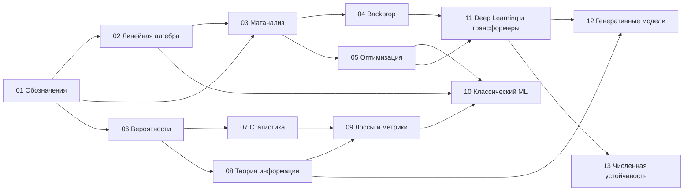

---

<a id="m00"></a>

# 00. Как пользоваться курсом и что реально нужно знать

## Сколько математики нужно — по ролям

| Роль | Минимум | Желательно | Можно пропустить |
|------|---------|-----------|------------------|
| ML-инженер (продакшн) | 01–05, 08, 09 | 06–07, 11, 13 | глубокую теорию 12 |
| Data Scientist / аналитик | 01, 02 (до PCA), 06–09 | 10, 05 | 11–12 |
| Deep Learning / LLM-инженер | 01–05, 08, 11, 13 | 06, 12 | A/B-тесты из 07 |
| Research Scientist | всё | + выпуклая оптимизация, теория меры, статистическая теория обучения | — |

> 💡 Правило 80/20: **матричное умножение, градиент + цепное правило, вероятность + логарифм** покрывают ~80% того, что происходит внутри любой нейросети.

## Как читать каждый модуль

1. **Интуиция** — одним абзацем, что это и зачем.
2. **Формула** — ровно в том виде, в каком она встречается в статьях.
3. **Картинка** — все иллюстрации генерируются скриптом [`scripts/make_figures.py`](scripts/make_figures.py), их можно перерисовать и покрутить параметры.
4. **Код** — NumPy/PyTorch, чтобы потрогать руками.
5. **🎯 На собеседовании** — как это спрашивают.
6. **🏋️ Практика модуля** — 2–3 задачи с решениями.

## План подготовки

### 🏃 3 недели (интенсив, ~2 часа в день)

| Дни | Модули |
|-----|--------|
| 1–2 | 01 Обозначения + 02 Линейная алгебра (векторы, матрицы) |
| 3–4 | 02: собственные числа, SVD, PCA |
| 5–6 | 03 Матанализ + 04 Backprop (руками!) |
| 7–8 | 05 Оптимизация |
| 9–10 | 06 Вероятности |
| 11–12 | 07 Статистика |
| 13 | 08 Теория информации |
| 14 | 09 Лоссы и метрики |
| 15–16 | 10 Классический ML |
| 17–18 | 11 Deep Learning и трансформеры |
| 19 | 12 Генеративные модели |
| 20 | 13 Численная устойчивость + шпаргалка |
| 21 | 100 вопросов вслух, мок-интервью |

### 🚶 8 недель (спокойно, с нуля)
Тот же порядок, по 3–4 дня на модуль, плюс параллельно видео 3Blue1Brown (см. [дорожную карту](#roadmap)) и все задачи практикума.

## Установка окружения

```bash
python -m venv .venv && source .venv/bin/activate
pip install -r requirements.txt jupyter
python scripts/make_figures.py      # перерисовать все иллюстрации
```

## Чек-лист «я готов к ML-собеседованию по математике»

- [ ] Могу на бумаге перемножить матрицы и сказать размерности результата.
- [ ] Могу объяснить SVD и PCA на картинке.
- [ ] Могу вывести градиент логистической регрессии и softmax + cross-entropy.
- [ ] Могу посчитать backprop для двухслойной сети руками.
- [ ] Знаю, чем Adam отличается от SGD с momentum, и зачем AdamW.
- [ ] Могу применить формулу Байеса к задаче про тест на болезнь.
- [ ] Могу объяснить MLE и почему MSE = MLE при гауссовском шуме.
- [ ] Знаю, что такое KL-дивергенция и почему она несимметрична.
- [ ] Могу объяснить, зачем делить на √d в attention.
- [ ] Знаю, почему softmax считают через вычитание максимума.

## 📌 Лучшие ресурсы для подготовки

Telegram-каналы, которые удобно читать между модулями — коротко, по делу и с практикой:

| Канал | О чём |
|-------|-------|
| 🧠 [Machine Learning](https://t.me/+IikNImh3FuNmM2Ji) | Практическое применение AI: генерация кода и баз данных, всё, что нужно знать об ИИ |
| 🖥 [DevOps Academy](https://t.me/+7HWlD5t-Zqw2YjMy) | Сложные концепции DevOps на понятных схемах и в коротких видео — пригодится для MLOps |
| 🐳 [Docker](https://t.me/+WGQi6w2QiiE4MGMy) | Фишки и приёмы работы с контейнерами — упаковка моделей и окружений |
| ⚡️ [Kali Linux](https://t.me/+jnI7_NwRnd0zY2Yy) | Информационная безопасность и этичный хакинг с нуля |
| 🐹 [Golang](https://t.me/+mACTfs56f6g5YjBi) · [ещё о Go](https://t.me/+VBSfUDFUflE2M2E6) | Разработка на Go и высоконагруженные сервисы — инференс в продакшене |

> 🔥 Всё сразу — в [папке лучших ресурсов](https://t.me/addlist/VWTKxdkpYBcxYzNi): подпишись одним кликом и прокачай уровень до следующего грейда.

---

<a id="m01"></a>

# 01. Язык математики: обозначения, функции, логарифмы

> Половина «непонятности» статей по ML — это просто незнакомые обозначения. Этот модуль — словарь.

## Словарь обозначений

| Обозначение | Читается | Что значит | В коде |
|-------------|----------|-----------|--------|
| $x \in \mathbb{R}$ | x принадлежит R | вещественное число | `float` |
| $\mathbf{x} \in \mathbb{R}^n$ | вектор длины n | столбец из n чисел | `x.shape == (n,)` |
| $X \in \mathbb{R}^{m \times n}$ | матрица m на n | m строк, n столбцов | `X.shape == (m, n)` |
| $x_i$, $X_{ij}$ | i-й элемент | индексация (в математике с 1!) | `x[i-1]`, `X[i-1, j-1]` |
| $X^\top$ | транспонирование | строки ↔ столбцы | `X.T` |
| $\sum_{i=1}^{n} x_i$ | сумма | $x_1 + \dots + x_n$ | `x.sum()` |
| $\prod_{i=1}^{n} x_i$ | произведение | $x_1 \cdot \ldots \cdot x_n$ | `x.prod()` |
| $\lVert \mathbf{x} \rVert_2$ | норма | длина вектора | `np.linalg.norm(x)` |
| $\nabla_\theta L$ | градиент L по θ | вектор частных производных | `loss.backward(); theta.grad` |
| $\frac{\partial L}{\partial w}$ | частная производная | чувствительность L к w | — |
| $\mathbb{E}[X]$ | матожидание | среднее по распределению | `x.mean()` (оценка) |
| $p(y \mid x)$ | p от y при условии x | условная вероятность | выход модели |
| $\sim$ | распределено как | $x \sim \mathcal{N}(0, 1)$ | `np.random.randn()` |
| $\arg\max_x f(x)$ | аргмакс | **точка**, где f максимальна | `np.argmax` |
| $\odot$ | произведение Адамара | поэлементное умножение | `a * b` |
| $\mathbb{1}[\cdot]$ | индикатор | 1 если условие верно, иначе 0 | `(cond).astype(int)` |
| $\triangleq$, $:=$ | по определению | вводим обозначение | `=` |
| $\propto$ | пропорционально | равно с точностью до константы | — |
| $\theta$, $W$, $b$ | параметры | веса модели | `model.parameters()` |
| $\hat{y}$ | y с крышкой | предсказание модели | `model(x)` |

> 💡 Соглашение в ML: векторы — **столбцы**, но батч данных $X \in \mathbb{R}^{N \times d}$ хранит объекты в **строках**. Поэтому в статьях пишут $W\mathbf{x}$, а в коде — `X @ W.T`.

## Экспонента и логарифм — главная пара в ML

```math
\log(ab) = \log a + \log b, \qquad \log a^k = k \log a, \qquad e^{\log x} = x, \qquad \log e^{x} = x
```

**Почему логарифмы везде:**
1. **Произведение → сумма.** Правдоподобие $\prod_i p(y_i)$ из миллиона множителей < 1 даёт 0 в float. Сумма логарифмов $\sum_i \log p(y_i)$ — нормальное число.
2. **Монотонность.** $\arg\max_\theta \prod p = \arg\max_\theta \sum \log p$ — оптимум не меняется.
3. **Удобные производные.** $(\log x)' = 1/x$, $(e^x)' = e^x$.

```python
import numpy as np
p = np.full(1000, 0.01)
print(np.prod(p))          # 0.0  — underflow
print(np.sum(np.log(p)))   # -4605.17 — всё в порядке
```

## Сигмоида и softmax — превращают числа в вероятности

```math
\sigma(z) = \frac{1}{1 + e^{-z}}, \qquad \sigma'(z) = \sigma(z)\,(1 - \sigma(z)), \qquad \sigma(-z) = 1 - \sigma(z)
```

```math
\operatorname{softmax}(\mathbf{z})_i = \frac{e^{z_i}}{\sum_{j=1}^{K} e^{z_j}}, \qquad \sum_i \operatorname{softmax}(\mathbf{z})_i = 1
```

- Сигмоида: одно число (логит) → вероятность класса 1 из 2.
- Softmax: K логитов → распределение по K классам. Сигмоида — частный случай softmax для K = 2: $\sigma(z) = \operatorname{softmax}([z, 0])_1$.
- Softmax не меняется от сдвига: $\operatorname{softmax}(\mathbf{z} + c) = \operatorname{softmax}(\mathbf{z})$ — на этом построен стабильный расчёт (модуль 13).

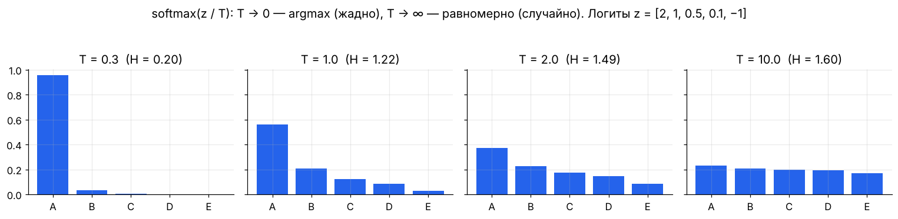

**Температура** $T$: $\operatorname{softmax}(\mathbf{z}/T)$. Маленькая T — уверенно и детерминированно, большая — разнообразно и случайно. Это та самая `temperature` в API LLM.

## Полезные функции и их графики — запомнить «форму»

| Функция | Форма | Где в ML |
|---------|-------|----------|
| $e^x$ | быстро растёт, всегда > 0 | softmax, правдоподобие |
| $\log x$ | медленно растёт, $\log 1 = 0$, $\to -\infty$ при $x \to 0$ | лоссы, энтропия |
| $-\log p$ | 0 при p = 1, → ∞ при p → 0 | cross-entropy: штраф за уверенную ошибку |
| $x^2$ | парабола, гладкая | MSE, L2-регуляризация |
| $\lvert x\rvert$ | «галочка», недифференцируема в 0 | MAE, L1-регуляризация |
| $\max(0, x)$ | ReLU | активации, hinge loss |
| $\log(1 + e^x)$ | softplus — гладкий ReLU | стабильная запись BCE |

## Суммы, которые надо узнавать в лицо

```math
\sum_{i=1}^{n} i = \frac{n(n+1)}{2}, \qquad \sum_{k=0}^{\infty} r^k = \frac{1}{1-r}\ (|r| < 1), \qquad \frac{1}{n}\sum_{i=1}^{n} x_i = \bar{x}
```

Геометрическая прогрессия встречается в **дисконтировании наград** в RL ($\sum_t \gamma^t r_t$) и в **экспоненциальном скользящем среднем** в Adam и BatchNorm: вес наблюдения $k$ шагов назад равен $(1-\beta)\beta^k$, эффективное окно ≈ $1/(1-\beta)$ (β = 0.9 → ~10 шагов, β = 0.999 → ~1000).

## 🎯 На собеседовании

1. **Почему оптимизируют log-likelihood, а не likelihood?** — Численная устойчивость (произведение → сумма) и тот же argmax.
2. **Чем softmax отличается от сигмоиды?** — Softmax нормирует по K классам (взаимоисключающие), сигмоида даёт независимые вероятности (multi-label).
3. **Что делает температура?** — Делит логиты: T < 1 обостряет распределение, T > 1 сглаживает.

## 🏋️ Практика модуля

**1.1.** Докажите, что $\sigma'(z) = \sigma(z)(1-\sigma(z))$, и проверьте численно.

<details><summary>▶️ Решение</summary>

```math
\sigma'(z) = \frac{e^{-z}}{(1+e^{-z})^2} = \frac{1}{1+e^{-z}} \cdot \frac{e^{-z}}{1+e^{-z}} = \sigma(z)\,\bigl(1-\sigma(z)\bigr)
```
```python
import numpy as np
s = lambda z: 1 / (1 + np.exp(-z))
z, h = 0.7, 1e-6
print((s(z + h) - s(z - h)) / (2 * h), s(z) * (1 - s(z)))   # 0.2217 0.2217
```
Максимум производной — 0.25 в нуле. Поэтому через 10 сигмоидных слоёв градиент умножается минимум на $0.25^{10} \approx 10^{-6}$ — затухание градиента.
</details>

**1.2.** Покажите, что softmax двух классов равен сигмоиде от разности логитов.

<details><summary>▶️ Решение</summary>

```math
\frac{e^{z_1}}{e^{z_1} + e^{z_2}} = \frac{1}{1 + e^{-(z_1 - z_2)}} = \sigma(z_1 - z_2)
```
Вывод: бинарный классификатор с 2 выходами и softmax эквивалентен 1 выходу с сигмоидой — лишний выход избыточен.
</details>

**1.3.** Эффективное окно EMA с β = 0.99 — сколько шагов? Какой вес у наблюдения 100 шагов назад?

<details><summary>▶️ Решение</summary>

Окно ≈ $1/(1-0.99) = 100$ шагов. Вес: $(1 - 0.99) \cdot 0.99^{100} \approx 0.01 \cdot 0.366 = 0.0037$ — в $e \approx 2.7$ раза меньше веса свежего наблюдения (0.01).
</details>

---

<a id="m02"></a>

# 02. Линейная алгебра

> Нейросеть — это в основном матричные умножения, перемежающиеся нелинейностями. Эмбеддинг — вектор. Батч — матрица. Изображение — тензор. Attention — три матричных умножения и softmax.

## Векторы

Вектор — это одновременно **точка в пространстве**, **стрелка** (направление + длина) и **список признаков** (эмбеддинг слова в $\mathbb{R}^{4096}$).

**Операции:** сложение покомпонентно, умножение на число растягивает. Линейная комбинация $a\mathbf{u} + b\mathbf{v}$ — основа всего.

### Нормы — «длина» вектора

```math
\lVert \mathbf{x} \rVert_1 = \sum_i |x_i|, \qquad \lVert \mathbf{x} \rVert_2 = \sqrt{\sum_i x_i^2}, \qquad \lVert \mathbf{x} \rVert_\infty = \max_i |x_i|
```

- $L_2$ — евклидова длина, в L2-регуляризации (weight decay).
- $L_1$ — «манхэттенская», даёт разреженность в Lasso.
- $L_\infty$ — в adversarial-атаках («изменить каждый пиксель не более чем на ε»).

### Скалярное произведение — главная операция ML

```math
\mathbf{a} \cdot \mathbf{b} = \mathbf{a}^\top \mathbf{b} = \sum_i a_i b_i = \lVert \mathbf{a} \rVert \, \lVert \mathbf{b} \rVert \cos\theta
```

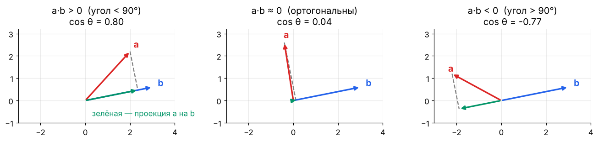

**Смысл:** насколько векторы смотрят в одну сторону. Нейрон $\mathbf{w}^\top\mathbf{x} + b$ — это скалярное произведение входа с «шаблоном» $\mathbf{w}$. Attention score $\mathbf{q}^\top\mathbf{k}$ — насколько запрос похож на ключ.

**Косинусное сходство** — скалярное произведение нормированных векторов, от −1 до 1. Стандарт для поиска по эмбеддингам (RAG, рекомендации):

```math
\cos(\mathbf{a}, \mathbf{b}) = \frac{\mathbf{a}^\top \mathbf{b}}{\lVert \mathbf{a} \rVert \, \lVert \mathbf{b} \rVert}
```

**Проекция** $\mathbf{a}$ на $\mathbf{b}$: $\operatorname{proj}_{\mathbf{b}}\mathbf{a} = \dfrac{\mathbf{a}^\top\mathbf{b}}{\mathbf{b}^\top\mathbf{b}}\,\mathbf{b}$ — основа PCA и метода наименьших квадратов.

```python
import numpy as np
a, b = np.array([1., 2, 3]), np.array([2., 0, 1])
cos = a @ b / (np.linalg.norm(a) * np.linalg.norm(b))   # 0.598
# Поиск ближайших эмбеддингов: нормируем один раз, дальше — одно матричное умножение
E = np.random.randn(10_000, 768); E /= np.linalg.norm(E, axis=1, keepdims=True)
q = E[42] + 0.1 * np.random.randn(768); q /= np.linalg.norm(q)
top5 = np.argsort(-(E @ q))[:5]    # 42 будет первым
```

## Матрицы

### Три взгляда на матрицу

1. **Таблица чисел** (датасет: строки — объекты, столбцы — признаки).
2. **Линейное преобразование** $\mathbf{x} \mapsto A\mathbf{x}$: поворот, растяжение, сдвиг, проекция. **Столбцы $A$ — это то, куда переходят базисные векторы.**
3. **Слой нейросети**: $\mathbf{h} = W\mathbf{x} + \mathbf{b}$.

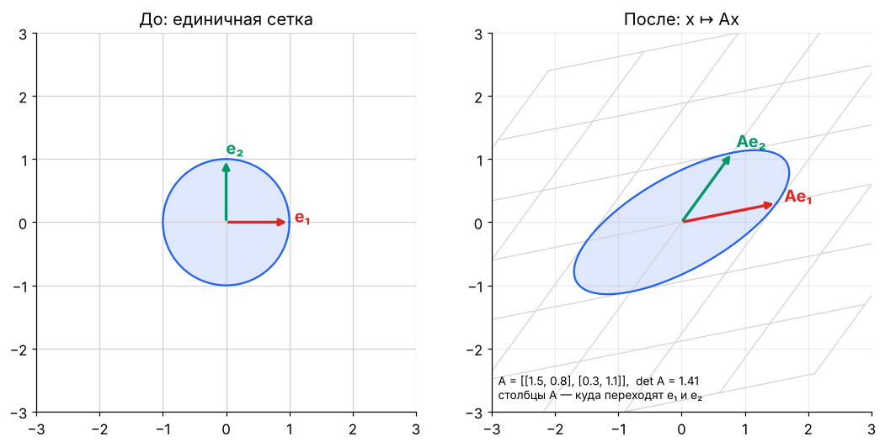

### Умножение матриц

```math
(AB)_{ij} = \sum_k A_{ik} B_{kj}, \qquad A \in \mathbb{R}^{m \times k},\ B \in \mathbb{R}^{k \times n} \Rightarrow AB \in \mathbb{R}^{m \times n}
```

**Правило размерностей:** внутренние совпадают, внешние остаются: `(m×k)·(k×n) → (m×n)`. Если на собеседовании не уверен — пиши размерности под каждой матрицей.

Свойства:
- $AB \ne BA$ в общем случае (порядок преобразований важен).
- $(AB)C = A(BC)$ — ассоциативность; порядок скобок меняет **стоимость** вычисления, а не результат.
- $(AB)^\top = B^\top A^\top$.
- Композиция слоёв без нелинейности $W_2(W_1\mathbf{x}) = (W_2W_1)\mathbf{x}$ — **один** линейный слой. Поэтому нужны активации.

**Стоимость:** $(m \times k)\cdot(k \times n)$ — это $m \cdot k \cdot n$ умножений-сложений, ≈ $2mkn$ FLOP. Отсюда правило для трансформеров: прямой проход ≈ $2 \times$ (число параметров) FLOP на токен, обучение ≈ $6 \times$.

### Особые матрицы

| Матрица | Определение | Где встречается |
|---------|-------------|-----------------|
| Единичная $I$ | $I\mathbf{x} = \mathbf{x}$ | residual connections: $\mathbf{x} + f(\mathbf{x})$ |
| Диагональная | ненулевая только диагональ | масштабирование признаков, LayerNorm γ |
| Симметричная | $A = A^\top$ | ковариация, гессиан, ядра |
| Ортогональная | $Q^\top Q = I$ | повороты; сохраняет длины; ортогональная инициализация |
| Положительно определённая | $\mathbf{x}^\top A \mathbf{x} > 0$ для всех $\mathbf{x} \neq 0$ | ковариация, гессиан в минимуме |
| Низкоранговая | $A = UV^\top$, $U \in \mathbb{R}^{m \times r}$, $r \ll m$ | LoRA, сжатие моделей |

### Ранг, обратная матрица, определитель

- **Ранг** — число линейно независимых столбцов = размерность образа. Матрица $UV^\top$ с $U, V \in \mathbb{R}^{d \times r}$ имеет ранг ≤ r: вместо $d^2$ параметров — $2dr$. **Это LoRA.**
- **Определитель** $\det A$ — во сколько раз преобразование меняет объём (и меняет ли ориентацию). $\det A = 0$ ⇔ пространство «сплющивается» ⇔ необратима. Встречается в нормализующих потоках (normalizing flows) и формуле плотности многомерного нормального.
- **Обратная** $A^{-1}$: $AA^{-1} = I$. На практике **никогда не считают** `inv(A) @ b` — решают систему `np.linalg.solve(A, b)` (быстрее и точнее).
- **Число обусловленности** $\kappa(A) = \sigma_{\max}/\sigma_{\min}$ — насколько ошибки во входе усиливаются. Большое κ → вытянутые «долины» лосса → медленный градиентный спуск (модуль 05).

## Собственные числа и векторы

```math
A\mathbf{v} = \lambda \mathbf{v}
```

Собственный вектор не меняет направления под действием $A$, только растягивается в $\lambda$ раз.

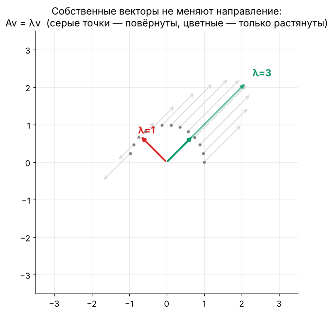

**Спектральная теорема:** симметричная матрица раскладывается как

```math
A = Q \Lambda Q^\top, \qquad Q^\top Q = I,\ \Lambda = \operatorname{diag}(\lambda_1, \dots, \lambda_n)
```

То есть любое симметричное преобразование = поворот → растяжение вдоль осей → поворот обратно.

**Где в ML:**
- **PCA** — собственные векторы матрицы ковариации.
- **Гессиан** в точке: все $\lambda > 0$ — минимум, разных знаков — седловая точка (в нейросетях их подавляющее большинство).
- **Устойчивость RNN**: $\lvert\lambda_{\max}(W)\rvert > 1$ — градиенты взрываются, $< 1$ — затухают.
- **PageRank, спектральная кластеризация** — собственные векторы графовых матриц.

Полезные факты: $\operatorname{tr} A = \sum \lambda_i$, $\det A = \prod \lambda_i$, $A^k = Q\Lambda^kQ^\top$.

## SVD — самое полезное разложение

Любая матрица (даже прямоугольная):

```math
A = U \Sigma V^\top, \qquad A \in \mathbb{R}^{m\times n},\ U \in \mathbb{R}^{m\times m},\ \Sigma \in \mathbb{R}^{m\times n},\ V \in \mathbb{R}^{n\times n}
```

$U, V$ ортогональные, $\Sigma$ — диагональ из **сингулярных чисел** $\sigma_1 \ge \sigma_2 \ge \dots \ge 0$.

**Геометрия:** поворот ($V^\top$) → растяжение по осям ($\Sigma$) → поворот ($U$).

**Теорема Эккарта–Янга:** лучшее приближение ранга k (по норме Фробениуса) — оставить k крупнейших сингулярных чисел:

```math
A_k = \sum_{i=1}^{k} \sigma_i \mathbf{u}_i \mathbf{v}_i^\top
```

Где применяется: PCA, сжатие изображений и весов, рекомендательные системы (matrix factorization), псевдообратная матрица, LSA, анализ рангов весов LLM (почему LoRA работает: обновления весов при дообучении имеют низкий «эффективный ранг»).

```python
U0, _ = np.linalg.qr(np.random.randn(512, 256)); V0, _ = np.linalg.qr(np.random.randn(256, 256))
A = U0 @ np.diag(np.exp(-np.arange(256) / 5)) @ V0.T     # матрица с быстро убывающим спектром, как у реальных данных
U, S, Vt = np.linalg.svd(A, full_matrices=False)
k = 20
A_k = U[:, :k] * S[:k] @ Vt[:k]
print(np.linalg.norm(A - A_k) / np.linalg.norm(A))   # ≈ 0.018: ошибка ~2% при 20 компонентах из 256
print((512 * 256), k * (512 + 256 + 1))             # 131072 → 15380 чисел
```

## PCA — метод главных компонент

**Задача:** найти направления, вдоль которых данные изменяются сильнее всего, и спроецировать на первые k из них.

**Алгоритм:**
1. Центрировать: $X_c = X - \bar{\mathbf{x}}$ (обязательно!), часто ещё и стандартизировать.
2. SVD: $X_c = U\Sigma V^\top$. Главные компоненты — строки $V^\top$.
3. Проекция: $Z = X_c V_k$.
4. Доля объяснённой дисперсии компоненты i: $\sigma_i^2 / \sum_j \sigma_j^2$.

Эквивалентно: собственные векторы ковариации $C = \frac{1}{N-1}X_c^\top X_c$, собственные числа $\lambda_i = \sigma_i^2/(N-1)$.

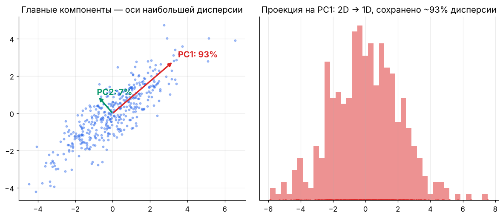

```python
from sklearn.decomposition import PCA
X = np.random.randn(1000, 300)
Z = PCA(n_components=50).fit_transform(X)       # (1000, 50) — то же самое, что SVD выше
```

**Ограничения:** только линейные структуры (для нелинейных — t-SNE, UMAP, автоэнкодеры), чувствителен к масштабу признаков и выбросам.

## Тензоры и broadcasting

Тензор — многомерный массив. Типичные формы:

| Данные | Форма | Пример |
|--------|-------|--------|
| Батч векторов | `(B, D)` | эмбеддинги |
| Батч изображений | `(B, C, H, W)` | PyTorch, `(32, 3, 224, 224)` |
| Батч последовательностей | `(B, T, D)` | токены в трансформере |
| Attention-веса | `(B, heads, T, T)` | |

**Broadcasting:** размерности сравниваются справа налево; совпадают или одна из них = 1.

```python
X = np.random.randn(32, 10)     # батч
mu = X.mean(axis=0)              # (10,)
Xc = X - mu                      # (32,10) - (10,) → работает
# Попарные расстояния без циклов: (N,1,D) - (1,M,D) → (N,M,D)
A, B = np.random.randn(5, 3), np.random.randn(4, 3)
D = np.sqrt(((A[:, None, :] - B[None, :, :])**2).sum(-1))
```

**einsum** — универсальная запись тензорных операций, обязательна для чтения кода трансформеров:

```python
A, B = np.random.randn(3, 4), np.random.randn(4, 5)
Q = K = np.random.randn(2, 8, 16, 64)   # (batch, heads, T, d)
np.einsum('ij,jk->ik', A, B)            # матричное умножение
np.einsum('bhtd,bhsd->bhts', Q, K)      # attention scores по батчу и головам
np.einsum('ii->', A @ A.T)              # след
```

## 🎯 На собеседовании

1. **Что такое ранг и как он связан с LoRA?** — Обновление весов $\Delta W = BA$ с $B \in \mathbb{R}^{d\times r}, A \in \mathbb{R}^{r\times k}$ имеет ранг ≤ r: обучаем $r(d+k)$ параметров вместо $dk$.
2. **SVD vs собственное разложение?** — Собственное — только для квадратных (и устойчиво хорошее — для симметричных); SVD — для любых, сингулярные числа ≥ 0. Для симметричной положительно полуопределённой они совпадают.
3. **Зачем центрировать данные перед PCA?** — Иначе первая компонента указывает на среднее, а не на направление разброса.
4. **Почему без нелинейностей глубокая сеть = линейная модель?** — Произведение матриц — матрица.
5. **Сложность умножения $(n\times n)\cdot(n\times n)$?** — $O(n^3)$ наивно; на GPU упирается в пропускную способность памяти для малых матриц и в FLOPs — для больших.

## 🏋️ Практика модуля

**2.1.** Матрица поворота на угол θ:

```math
R = \begin{pmatrix}\cos\theta & -\sin\theta \\ \sin\theta & \cos\theta\end{pmatrix}
```

Докажите, что она ортогональна и сохраняет длины. Какой у неё определитель?

<details><summary>▶️ Решение</summary>

```math
R^\top R = \begin{pmatrix}\cos^2\theta+\sin^2\theta & 0 \\ 0 & \sin^2\theta+\cos^2\theta\end{pmatrix} = I
```

Тогда $\lVert R\mathbf{x}\rVert^2 = \mathbf{x}^\top R^\top R\mathbf{x} = \lVert\mathbf{x}\rVert^2$. $\det R = \cos^2\theta + \sin^2\theta = 1$ — объём и ориентация сохраняются.

Связь с ML: **RoPE** (позиционное кодирование в LLaMA и почти всех современных LLM) поворачивает пары координат q и k на угол, пропорциональный позиции, — поэтому $\mathbf{q}_m^\top\mathbf{k}_n$ зависит только от разности $m - n$.
</details>

**2.2.** Слой `nn.Linear(4096, 4096)` дообучают через LoRA с r = 16. Во сколько раз меньше обучаемых параметров?

<details><summary>▶️ Решение</summary>

Полный: $4096^2 \approx 16.8$ млн. LoRA: $16 \cdot (4096 + 4096) = 131\,072$. В **128 раз** меньше. В общем случае отношение $\frac{dk}{r(d+k)} = \frac{d}{2r}$ для квадратной матрицы.
</details>

**2.3.** Реализуйте PCA через SVD и сравните со sklearn.

<details><summary>▶️ Решение</summary>

```python
import numpy as np
from sklearn.decomposition import PCA
X = np.random.randn(500, 10) @ np.random.randn(10, 10)
Xc = X - X.mean(0)
U, S, Vt = np.linalg.svd(Xc, full_matrices=False)
Z = Xc @ Vt[:3].T
ratio = S**2 / (S**2).sum()
sk = PCA(3).fit(X)
print(np.allclose(np.abs(Z), np.abs(sk.transform(X))))      # True (знак компоненты произволен!)
print(np.allclose(ratio[:3], sk.explained_variance_ratio_))  # True
```
**Ловушка:** знак собственного/сингулярного вектора не определён — сравнивать по модулю.
</details>

---

<a id="m03"></a>

# 03. Матанализ: производные, градиенты, цепное правило

> Обучение нейросети = «подвинуть веса туда, где лосс меньше». Куда двигать, говорит градиент. Как его посчитать через 100 слоёв — говорит цепное правило.

## Производная

```math
f'(x) = \lim_{h \to 0} \frac{f(x+h) - f(x)}{h}
```

**Смысл:** насколько изменится выход при маленьком изменении входа: $f(x + \Delta) \approx f(x) + f'(x)\,\Delta$. Это **линейная аппроксимация** — фундамент градиентного спуска.

### Таблица, которую надо знать наизусть

| $f(x)$ | $f'(x)$ | Где в ML |
|--------|---------|----------|
| $x^n$ | $n x^{n-1}$ | MSE |
| $e^x$ | $e^x$ | softmax |
| $\log x$ | $1/x$ | log-likelihood |
| $\sigma(x)$ | $\sigma(x)(1-\sigma(x))$ | логистическая регрессия |
| $\tanh x$ | $1 - \tanh^2 x$ | RNN, LSTM |
| $\operatorname{ReLU}(x)$ | $\mathbb{1}[x > 0]$ | почти все сети |
| $\lvert x\rvert$ | $\operatorname{sign}(x)$ | MAE, L1 (субградиент в 0) |
| $\log(1+e^x)$ | $\sigma(x)$ | softplus |

### Правила

```math
(f + g)' = f' + g', \qquad (fg)' = f'g + fg', \qquad \left(\frac{f}{g}\right)' = \frac{f'g - fg'}{g^2}, \qquad \bigl(f(g(x))\bigr)' = f'(g(x))\,g'(x)
```

Последнее — **цепное правило**, на нём держится всё глубокое обучение.

## Частные производные и градиент

Для функции многих переменных $f(\mathbf{x})$, $\mathbf{x} \in \mathbb{R}^n$:

```math
\nabla f(\mathbf{x}) = \left( \frac{\partial f}{\partial x_1}, \dots, \frac{\partial f}{\partial x_n} \right)^\top
```

**Три ключевых свойства градиента:**
1. Указывает направление **наискорейшего роста** функции. Значит, $-\nabla f$ — наискорейшего убывания.
2. **Перпендикулярен линиям уровня** (контурам) — см. картинки в модуле 05.
3. В точке минимума (гладкой функции) $\nabla f = \mathbf{0}$.

**Производная по направлению:** $D_{\mathbf{u}} f = \nabla f^\top \mathbf{u}$ — максимальна при $\mathbf{u} \parallel \nabla f$ (неравенство Коши–Буняковского).

## Якобиан и гессиан

| Объект | Для функции | Форма | Смысл |
|--------|-------------|-------|-------|
| Градиент $\nabla f$ | $\mathbb{R}^n \to \mathbb{R}$ | $n$ | наклон |
| Якобиан $J$ | $\mathbb{R}^n \to \mathbb{R}^m$ | $m \times n$, $J_{ij} = \partial f_i / \partial x_j$ | линейное приближение векторной функции |
| Гессиан $H$ | $\mathbb{R}^n \to \mathbb{R}$ | $n \times n$, $H_{ij} = \partial^2 f / \partial x_i \partial x_j$ | кривизна |

**Ряд Тейлора** второго порядка — как выглядит лосс вблизи точки:

```math
f(\mathbf{x} + \boldsymbol{\delta}) \approx f(\mathbf{x}) + \nabla f(\mathbf{x})^\top \boldsymbol{\delta} + \tfrac{1}{2}\, \boldsymbol{\delta}^\top H(\mathbf{x})\, \boldsymbol{\delta}
```

- Собственные числа гессиана — кривизна по главным направлениям. Отношение $\lambda_{\max}/\lambda_{\min}$ (обусловленность) определяет, насколько трудно оптимизировать.
- Метод Ньютона: $\boldsymbol{\delta} = -H^{-1}\nabla f$. Для сети с $10^9$ параметров гессиан — $10^{18}$ чисел, поэтому в DL используют **первый порядок** (SGD, Adam) или дешёвые приближения кривизны (Adam — диагональ, Shampoo/SOAP — блочные).

## Матричное дифференцирование — шпаргалка

Для скалярной функции от вектора/матрицы (раскладка «по знаменателю»: градиент той же формы, что и переменная):

| $f$ | $\nabla f$ |
|-----|------------|
| $\mathbf{a}^\top\mathbf{x}$ | $\mathbf{a}$ |
| $\mathbf{x}^\top\mathbf{x} = \lVert\mathbf{x}\rVert^2$ | $2\mathbf{x}$ |
| $\mathbf{x}^\top A\mathbf{x}$ | $(A + A^\top)\mathbf{x}$, для симметричной $2A\mathbf{x}$ |
| $\lVert A\mathbf{x} - \mathbf{b}\rVert^2$ | $2A^\top(A\mathbf{x} - \mathbf{b})$ |
| $\operatorname{tr}(AX)$ по $X$ | $A^\top$ |
| $\mathbf{a}^\top X \mathbf{b}$ по $X$ | $\mathbf{a}\mathbf{b}^\top$ |

**Главное правило линейного слоя.** Для $Y = XW$ ($X$: N×d, $W$: d×k), если известен $G = \partial L/\partial Y$ (N×k):

```math
\frac{\partial L}{\partial W} = X^\top G \quad (d \times k), \qquad \frac{\partial L}{\partial X} = G\,W^\top \quad (N \times d)
```

> 💡 **Трюк размерностей:** не помнишь формулу — составь произведение из $X$, $W$, $G$ и транспонирований так, чтобы размерности сошлись с формой переменной. Почти всегда это единственный вариант.

## Два вывода, которые спрашивают на каждом собеседовании

### 1. Градиент логистической регрессии

$\hat{y} = \sigma(\mathbf{w}^\top\mathbf{x})$, $L = -[y\log\hat{y} + (1-y)\log(1-\hat{y})]$. По цепному правилу с $z = \mathbf{w}^\top\mathbf{x}$:

```math
\frac{\partial L}{\partial \hat{y}} = -\frac{y}{\hat{y}} + \frac{1-y}{1-\hat{y}}, \quad \frac{\partial \hat{y}}{\partial z} = \hat{y}(1-\hat{y}) \quad\Rightarrow\quad \frac{\partial L}{\partial z} = \hat{y} - y, \qquad \nabla_{\mathbf{w}} L = (\hat{y} - y)\,\mathbf{x}
```

### 2. Softmax + cross-entropy

$\mathbf{p} = \operatorname{softmax}(\mathbf{z})$, $L = -\sum_k y_k \log p_k$ ($\mathbf{y}$ — one-hot). Якобиан softmax: $\partial p_i/\partial z_j = p_i(\delta_{ij} - p_j)$. Перемножаем:

```math
\frac{\partial L}{\partial z_j} = -\sum_i \frac{y_i}{p_i}\, p_i(\delta_{ij} - p_j) = -y_j + p_j \sum_i y_i = p_j - y_j
\qquad\Longrightarrow\qquad \nabla_{\mathbf{z}} L = \mathbf{p} - \mathbf{y}
```

**«Предсказание минус правда».** Тот же ответ, что у MSE с линейным выходом и у логистической регрессии — не совпадение: все три — обобщённые линейные модели с каноническими функциями связи.

Именно поэтому в PyTorch `CrossEntropyLoss` принимает **логиты**, а не вероятности: softmax и логарифм объединены и в прямом проходе (стабильность), и в обратном (простой градиент).

## Численная проверка градиента

```python
import numpy as np

def grad_check(f, x, analytic, eps=1e-5):
    num = np.zeros_like(x)
    for i in range(x.size):
        e = np.zeros_like(x); e.flat[i] = eps
        num.flat[i] = (f(x + e) - f(x - e)) / (2 * eps)   # центральная разность, ошибка O(eps²)
    rel = np.linalg.norm(num - analytic) / (np.linalg.norm(num) + np.linalg.norm(analytic))
    return rel   # < 1e-7 — отлично, > 1e-4 — ищи баг

z = np.random.randn(5); y = np.eye(5)[2]
softmax = lambda z: np.exp(z - z.max()) / np.exp(z - z.max()).sum()
loss = lambda z: -np.log(softmax(z)[2])
print(grad_check(loss, z, softmax(z) - y))   # ~1e-10
```

## 🎯 На собеседовании

1. **Что показывает градиент?** — Направление наискорейшего роста; его норма — скорость роста.
2. **Выведи градиент softmax + CE.** — $\mathbf{p} - \mathbf{y}$ (вывод выше).
3. **Почему не используют метод Ньютона в DL?** — Гессиан $O(n^2)$ памяти и $O(n^3)$ на обращение, плюс в невыпуклых задачах он не положительно определён (тянет в седловые точки).
4. **Что такое седловая точка?** — Градиент 0, но по одним направлениям минимум, по другим максимум (гессиан со знакопеременными собственными числами).

## 🏋️ Практика модуля

**3.1.** Найдите градиент MSE линейной регрессии $L(\mathbf{w}) = \frac{1}{N}\lVert X\mathbf{w} - \mathbf{y}\rVert^2$ и выведите нормальное уравнение.

<details><summary>▶️ Решение</summary>

```math
\nabla_{\mathbf{w}} L = \frac{2}{N} X^\top (X\mathbf{w} - \mathbf{y}) = 0 \quad\Rightarrow\quad X^\top X \mathbf{w} = X^\top \mathbf{y} \quad\Rightarrow\quad \mathbf{w}^* = (X^\top X)^{-1} X^\top \mathbf{y}
```
Геометрически: остаток $X\mathbf{w}^* - \mathbf{y}$ ортогонален всем столбцам $X$ — $X\mathbf{w}^*$ это проекция $\mathbf{y}$ на пространство столбцов.
</details>

**3.2.** Для $f(x, y) = x^2 + 3xy + y^3$ найдите градиент и гессиан в точке (1, 2). Это минимум?

<details><summary>▶️ Решение</summary>

$\nabla f = (2x + 3y,\; 3x + 3y^2) = (8,\, 15)$ — не ноль, значит, не стационарная точка, а тем более не минимум.

```math
H = \begin{pmatrix} 2 & 3 \\ 3 & 6y \end{pmatrix} = \begin{pmatrix} 2 & 3 \\ 3 & 12 \end{pmatrix}, \quad \det H = 15 > 0,\ H_{11} > 0
```
Гессиан положительно определён — функция локально выпукла в этой точке, но до минимума нужно ещё «спуститься».
</details>

**3.3.** Проверьте численно формулу $\partial L/\partial W = X^\top G$ для $L = \operatorname{sum}(XW)^2$.

<details><summary>▶️ Решение</summary>

```python
X = np.random.randn(4, 3); W = np.random.randn(3, 2)
f = lambda W: ((X @ W) ** 2).sum()
G = 2 * (X @ W)            # dL/dY
print(grad_check(f, W, X.T @ G))   # ~1e-10
```
</details>

---

<a id="m04"></a>

# 04. Backpropagation и автодифференцирование

> Backprop — это цепное правило, применённое к графу вычислений в правильном порядке, с переиспользованием промежуточных результатов. Ничего больше.

## Граф вычислений

Любое вычисление раскладывается на элементарные операции. Пример: $L = (wx + b - y)^2$.

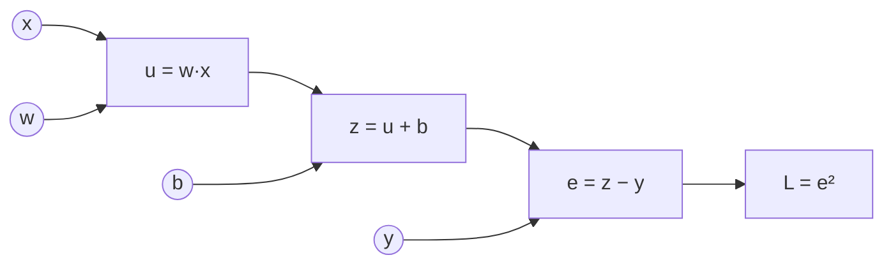

**Прямой проход** (forward): идём слева направо, считаем и **запоминаем** промежуточные значения $u, z, e$.
**Обратный проход** (backward): идём справа налево, каждый узел получает «входящий градиент» $\partial L/\partial(\text{выход})$ и умножает на свою **локальную производную**:

```math
\frac{\partial L}{\partial e} = 2e, \quad \frac{\partial L}{\partial z} = \frac{\partial L}{\partial e}\cdot 1, \quad \frac{\partial L}{\partial b} = \frac{\partial L}{\partial z}\cdot 1, \quad \frac{\partial L}{\partial w} = \frac{\partial L}{\partial z}\cdot x
```

### Шаблоны узлов — запомнить

| Узел | Forward | Backward (что отдаёт входам) |
|------|---------|------------------------------|
| Сложение $z = a + b$ | — | **раздаёт** градиент без изменений обоим |
| Умножение $z = ab$ | — | **меняет местами**: $a$ получает $g \cdot b$, $b$ получает $g \cdot a$ |
| max / ReLU | — | **маршрутизатор**: градиент идёт только в победителя |
| Разветвление (переменная используется дважды) | — | градиенты **суммируются** |
| Матричное $Y = XW$ | — | $G W^\top$ к $X$, $X^\top G$ к $W$ |

## Почему reverse mode, а не forward mode

| Режим | Стоимость | Выгоден, когда |
|-------|-----------|----------------|
| Forward mode | 1 проход на **каждый вход** | входов мало, выходов много |
| Reverse mode (backprop) | 1 проход на **каждый выход** | выход один (лосс), входов миллиарды (веса) |

Обучение — ровно второй случай: **одним** обратным проходом получаем градиент по **всем** параметрам за ~2× стоимость прямого. Цена — память: надо хранить активации всех слоёв (отсюда **gradient checkpointing**: храним часть активаций, остальные пересчитываем, меняя ~30% вычислений на кратную экономию памяти).

## Двухслойная сеть руками (то, что просят написать на собеседовании)

```math
\mathbf{h} = \operatorname{ReLU}(X W_1 + \mathbf{b}_1), \qquad \mathbf{z} = \mathbf{h} W_2 + \mathbf{b}_2, \qquad L = \operatorname{CE}(\operatorname{softmax}(\mathbf{z}), \mathbf{y})
```

```python
import numpy as np
rng = np.random.default_rng(0)
N, D, H, K = 64, 2, 32, 3

# Данные: три спирали по 64 точки
r = np.linspace(0.2, 1.0, N)
X = np.concatenate([np.c_[r * np.sin(4 * r + 2.1 * k), r * np.cos(4 * r + 2.1 * k)] for k in range(K)])
X += 0.03 * rng.normal(size=X.shape); y = np.repeat(np.arange(K), N)

W1 = rng.normal(0, np.sqrt(2 / D), (D, H)); b1 = np.zeros(H)    # He-инициализация
W2 = rng.normal(0, np.sqrt(1 / H), (H, K)); b2 = np.zeros(K)

for step in range(3000):
    # forward
    a1 = X @ W1 + b1
    h = np.maximum(0, a1)
    z = h @ W2 + b2
    z -= z.max(1, keepdims=True)                      # стабильность
    p = np.exp(z); p /= p.sum(1, keepdims=True)
    loss = -np.log(p[np.arange(len(y)), y]).mean()

    # backward — каждая строка = локальная производная × входящий градиент
    dz = p.copy(); dz[np.arange(len(y)), y] -= 1; dz /= len(y)   # p − y
    dW2 = h.T @ dz;  db2 = dz.sum(0)
    dh = dz @ W2.T
    da1 = dh * (a1 > 0)                                # ReLU пропускает градиент там, где был активен
    dW1 = X.T @ da1; db1 = da1.sum(0)

    for P, G in [(W1, dW1), (b1, db1), (W2, dW2), (b2, db2)]:
        P -= 0.5 * G
    if step % 1000 == 0:
        print(step, round(loss, 3), (p.argmax(1) == y).mean())
```

Сверка с PyTorch: autograd должен дать те же градиенты, что и ручной backward.

```python
import torch
T = lambda a: torch.tensor(a, dtype=torch.float64, requires_grad=True)
W1t, b1t, W2t, b2t = T(W1), T(b1), T(W2), T(b2)
zt = torch.relu(torch.tensor(X) @ W1t + b1t) @ W2t + b2t
torch.nn.functional.cross_entropy(zt, torch.tensor(y)).backward()

# ручной backward в текущей точке
a1 = X @ W1 + b1; h = np.maximum(0, a1); z = h @ W2 + b2
p = np.exp(z - z.max(1, keepdims=True)); p /= p.sum(1, keepdims=True)
dz = p.copy(); dz[np.arange(len(y)), y] -= 1; dz /= len(y)
dW1 = X.T @ ((dz @ W2.T) * (a1 > 0))
print(np.abs(W1t.grad.numpy() - dW1).max())   # ~1e-17
```

## Затухающие и взрывающиеся градиенты

Градиент первого слоя — произведение якобианов всех последующих:

```math
\frac{\partial L}{\partial \mathbf{h}_1} = \frac{\partial L}{\partial \mathbf{h}_L} \prod_{l=2}^{L} \frac{\partial \mathbf{h}_l}{\partial \mathbf{h}_{l-1}}
```

Если «типичный масштаб» множителей < 1 — произведение → 0 (затухание), > 1 — → ∞ (взрыв). Как с этим живут:

| Проблема | Решение | Почему работает |
|----------|---------|-----------------|
| Насыщение сигмоиды/tanh | ReLU, GELU, SiLU | производная ≈ 1 на положительной части |
| Плохой масштаб весов | Xavier/He-инициализация | дисперсия активаций сохраняется слой к слою |
| Глубина 100+ слоёв | Residual connections $\mathbf{x} + f(\mathbf{x})$ | якобиан $I + \partial f/\partial\mathbf{x}$ — градиент идёт по «шоссе» через $I$ |
| Дрейф масштаба активаций | BatchNorm / LayerNorm / RMSNorm | нормирует активации на каждом слое |
| Взрыв в RNN/трансформерах | Gradient clipping по норме | ограничивает $\lVert\mathbf{g}\rVert \le c$ |
| Долгие зависимости в RNN | LSTM/GRU, затем attention | аддитивная «ячейка памяти», прямые связи между позициями |

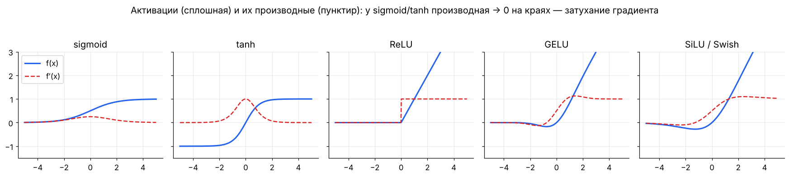

## 🎯 На собеседовании

1. **Объясни backprop без формул.** — Считаем выход и запоминаем промежуточные значения, затем идём от лосса назад и каждый узел умножает пришедший градиент на свою локальную производную; где переменная использовалась несколько раз — градиенты суммируем.
2. **Почему reverse mode?** — Один скалярный выход, миллионы входов.
3. **Сколько памяти нужно на обучение по сравнению с инференсом?** — Плюс активации всех слоёв, градиенты (= размер весов) и состояние оптимизатора (Adam: ещё 2× веса). Для смешанной точности ≈ 16 байт на параметр без активаций.
4. **Почему residual connections помогают?** — Слагаемое $I$ в якобиане: градиент доходит до ранних слоёв, даже если $\partial f/\partial\mathbf{x}$ мал.

## 🏋️ Практика модуля

**4.1.** $f = (x + y) \cdot z$ при $x = -2, y = 5, z = -4$. Посчитайте все частные производные через граф.

<details><summary>▶️ Решение</summary>

Forward: $q = x + y = 3$, $f = qz = -12$.
Backward: $\partial f/\partial f = 1$; умножение меняет местами: $\partial f/\partial q = z = -4$, $\partial f/\partial z = q = 3$; сложение раздаёт: $\partial f/\partial x = \partial f/\partial y = -4$.
</details>

**4.2.** Выведите backward для LayerNorm без обучаемых параметров: $\hat{x}_i = (x_i - \mu)/\sigma$.

<details><summary>▶️ Решение</summary>

Обозначим $g_i = \partial L/\partial \hat{x}_i$, $d$ — размерность. С учётом того, что $\mu$ и $\sigma$ зависят от всех $x_i$:

```math
\frac{\partial L}{\partial x_i} = \frac{1}{\sigma}\left( g_i - \frac{1}{d}\sum_j g_j - \hat{x}_i \cdot \frac{1}{d}\sum_j g_j \hat{x}_j \right)
```
Интерпретация: из градиента вычитаются его среднее и компонента вдоль $\hat{\mathbf{x}}$ — нормализация «съедает» изменения сдвига и масштаба. Проверьте численно функцией `grad_check` из модуля 03.
</details>

**4.3.** Почему градиент ReLU в точке 0 не мешает обучению?

<details><summary>▶️ Решение</summary>

Вероятность попасть ровно в 0 для float-значения практически нулевая; фреймворки берут субградиент 0. Реальная проблема ReLU — «мёртвые нейроны»: если пре-активация отрицательна на всех примерах, градиент всегда 0 и нейрон не восстанавливается. Лечат LeakyReLU/GELU, аккуратной инициализацией и меньшим learning rate.
</details>

---

<a id="m05"></a>

# 05. Оптимизация: от градиентного спуска до AdamW

> Обучение = минимизация эмпирического риска $\min_\theta \frac{1}{N}\sum_i \ell(f_\theta(\mathbf{x}_i), y_i) + \lambda R(\theta)$. Этот модуль — о том, как делать шаги к минимуму быстро и устойчиво.

## Градиентный спуск

```math
\theta_{t+1} = \theta_t - \eta\, \nabla_\theta L(\theta_t)
```

$\eta$ — **learning rate**, самый важный гиперпараметр.

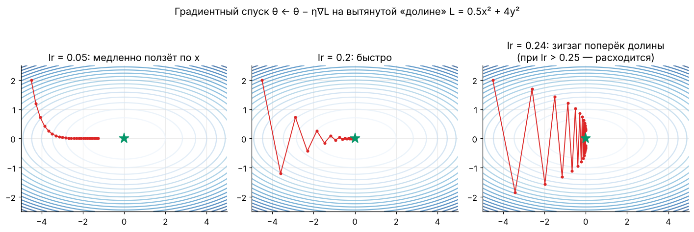

**Почему зигзаг.** У лосса $L = \frac{1}{2}(a x^2 + b y^2)$ кривизна по осям $a$ и $b$. Шаг устойчив только при $\eta < 2/\lambda_{\max}$, а скорость сходимости по пологому направлению — $(1 - \eta\lambda_{\min})$ за шаг. Итог: число шагов ∝ числу обусловленности $\kappa = \lambda_{\max}/\lambda_{\min}$. На картинке $\kappa = 8$: при $\eta = 0.24$ (почти $2/8 = 0.25$) — зигзаг поперёк, при малом η — ползём вдоль.

**Отсюда практические выводы:**
- Нормировать признаки (StandardScaler) — уменьшает κ для линейных моделей.
- BatchNorm/LayerNorm делают ландшафт «круглее».
- Адаптивные методы (Adam) масштабируют шаг по каждой координате.

## Стохастический градиентный спуск (SGD)

Полный градиент по миллиардам примеров — дорого. Берём мини-батч $B$:

```math
\mathbf{g}_t = \frac{1}{|B|}\sum_{i \in B} \nabla_\theta \ell_i(\theta_t), \qquad \mathbb{E}[\mathbf{g}_t] = \nabla L(\theta_t)
```

- Несмещённая оценка, дисперсия $\propto 1/|B|$.
- Шум **помогает**: выбивает из острых минимумов и седловых точек, острые минимумы обобщают хуже плоских.
- **Линейное правило масштабирования:** увеличил батч в k раз — увеличь η примерно в k раз (до некоторого предела; для Adam ближе к $\sqrt{k}$) — и добавь warmup.

## Momentum и Nesterov

```math
\mathbf{v}_{t+1} = \beta\,\mathbf{v}_t + \mathbf{g}_t, \qquad \theta_{t+1} = \theta_t - \eta\,\mathbf{v}_{t+1}
```

«Тяжёлый шарик»: накапливает скорость вдоль устойчивого направления, гасит колебания поперёк. β = 0.9 ≈ усреднение за последние 10 шагов. **Nesterov** считает градиент в «заглянутой вперёд» точке $\theta_t - \eta\beta\mathbf{v}_t$ — меньше проскакивает.

## Адаптивные методы

| Метод | Идея | Обновление |
|-------|------|------------|
| AdaGrad | делить на накопленную сумму квадратов градиентов | шаг только уменьшается — для разреженных признаков |
| RMSProp | то же, но EMA вместо суммы | $\mathbf{s} \leftarrow \beta\mathbf{s} + (1-\beta)\mathbf{g}^2$, шаг $\eta\,\mathbf{g}/\sqrt{\mathbf{s}}$ |
| **Adam** | momentum + RMSProp + коррекция смещения | ниже |
| **AdamW** | Adam + weight decay отдельно от градиента | стандарт для трансформеров |
| Lion, Sophia, Muon, Shampoo/SOAP | знак/ортогонализация/предобусловливание | экономнее по памяти или быстрее на LLM |

### Adam — выучить наизусть

```math
\begin{aligned}
\mathbf{m}_t &= \beta_1 \mathbf{m}_{t-1} + (1-\beta_1)\,\mathbf{g}_t && \text{(среднее — направление)}\\
\mathbf{v}_t &= \beta_2 \mathbf{v}_{t-1} + (1-\beta_2)\,\mathbf{g}_t^2 && \text{(средний квадрат — масштаб)}\\
\hat{\mathbf{m}}_t &= \frac{\mathbf{m}_t}{1-\beta_1^t}, \quad \hat{\mathbf{v}}_t = \frac{\mathbf{v}_t}{1-\beta_2^t} && \text{(коррекция: } \mathbf{m}_0 = \mathbf{v}_0 = 0\text{)}\\
\theta_t &= \theta_{t-1} - \eta\,\frac{\hat{\mathbf{m}}_t}{\sqrt{\hat{\mathbf{v}}_t} + \epsilon} - \eta\,\lambda\,\theta_{t-1} && \text{(последний член — только в AdamW)}
\end{aligned}
```

Типичные значения: $\beta_1 = 0.9$, $\beta_2 = 0.999$ (для LLM часто 0.95), $\epsilon = 10^{-8}$, $\lambda = 0.01\text{–}0.1$.

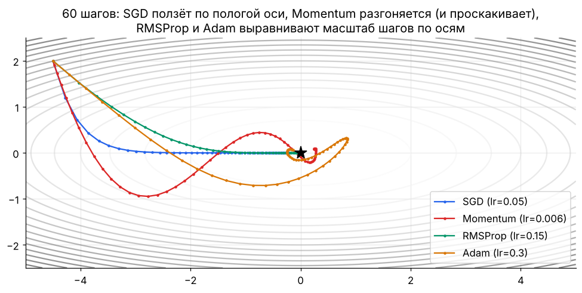

**Почему AdamW, а не Adam + L2.** В Adam L2-штраф $\lambda\theta$ попадает в градиент и затем делится на $\sqrt{\hat{\mathbf{v}}}$: у параметров с большими градиентами регуляризация слабее. AdamW вычитает $\eta\lambda\theta$ напрямую — затухание весов одинаковое для всех (Loshchilov & Hutter, 2019).

**Память:** Adam хранит $\mathbf{m}$ и $\mathbf{v}$ — ещё 2 копии размера модели. Для 7B-модели в fp32 это +56 ГБ — поэтому есть 8-битный Adam, Adafactor и шардирование оптимизатора (ZeRO).

## Learning rate schedule

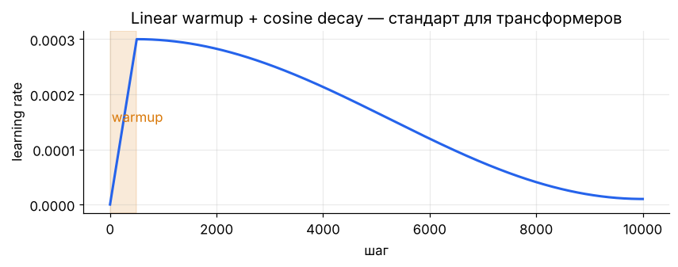

- **Warmup** (первые 1–5% шагов): в начале $\hat{\mathbf{v}}$ оценена плохо, а веса случайны — большой шаг опасен.
- **Cosine decay** до ~10% от пика: большие шаги исследуют, маленькие — «доводят» в минимум.
- **WSD** (warmup–stable–decay): постоянный LR с быстрым спадом в конце — популярно для LLM, позволяет продолжать обучение с любого чекпойнта.
- **LR range test:** растить η экспоненциально и смотреть, где лосс начинает расти, — рабочий LR на порядок ниже.

## Выпуклость

Функция выпукла, если отрезок между любыми двумя точками графика лежит не ниже графика:

```math
f(\lambda \mathbf{x} + (1-\lambda)\mathbf{y}) \le \lambda f(\mathbf{x}) + (1-\lambda) f(\mathbf{y}), \quad \lambda \in [0, 1]
```

Для дважды дифференцируемой: гессиан положительно полуопределён везде. **У выпуклой функции любой локальный минимум — глобальный.**

| Выпуклые задачи | Невыпуклые |
|-----------------|------------|
| линейная/логистическая регрессия, SVM, Lasso, Ridge | нейросети, k-means, матричная факторизация |

Почему нейросети всё равно обучаются: в огромной размерности почти все критические точки — седловые, а локальные минимумы, которые находит SGD, имеют близкий лосс. Перепараметризованные сети часто могут достичь нулевой ошибки на обучении.

## Регуляризация

```math
\min_\theta\ L(\theta) + \lambda \lVert\theta\rVert_2^2 \ \ (\text{Ridge}) \qquad\qquad \min_\theta\ L(\theta) + \lambda \lVert\theta\rVert_1 \ \ (\text{Lasso})
```

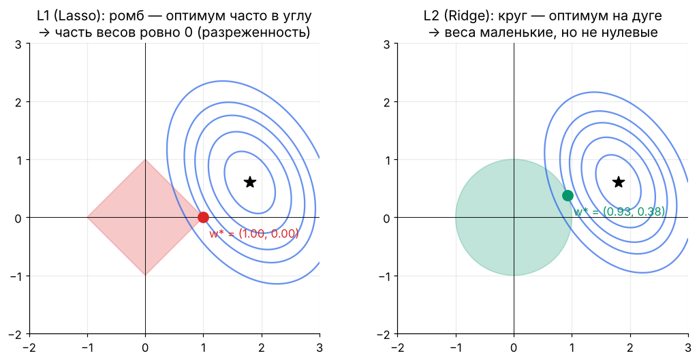

Эквивалентная форма — ограничение $\lVert\theta\rVert \le c$: минимум — точка касания линий уровня лосса с «шаром» нормы. У L1-шара (ромба) есть углы на осях → решения часто разреженные. Байесовски: L2 = гауссовский априор на веса, L1 = лапласовский (модуль 07).

Другие регуляризаторы в DL: dropout, early stopping, data augmentation, label smoothing, weight decay.

## Условная оптимизация: множители Лагранжа

Задача $\min f(\mathbf{x})$ при $g(\mathbf{x}) = 0$. В оптимуме градиенты параллельны:

```math
\nabla f = \lambda \nabla g \quad\Longleftrightarrow\quad \nabla_{\mathbf{x}, \lambda}\, \mathcal{L} = 0, \quad \mathcal{L}(\mathbf{x}, \lambda) = f(\mathbf{x}) - \lambda g(\mathbf{x})
```

Для неравенств — условия ККТ (Каруша–Куна–Таккера). Где в ML: вывод SVM и его двойственной задачи, максимальная энтропия, PCA как $\max \mathbf{w}^\top C\mathbf{w}$ при $\lVert\mathbf{w}\rVert = 1$ (ответ: собственный вектор $C$), ограничения в RLHF/PPO (KL-штраф как множитель Лагранжа).

## 🎯 На собеседовании

1. **Почему LR так важен и как его выбирать?** — Слишком большой: расходимость/осцилляции; маленький: медленно и застревание. LR range test, warmup, cosine/WSD.
2. **Adam vs SGD+momentum?** — Adam быстрее и устойчивее «из коробки», стандарт для трансформеров; SGD+momentum на CNN иногда обобщает лучше. Adam требует 2× памяти на состояние.
3. **Зачем коррекция смещения в Adam?** — $\mathbf{m}_0 = 0$, и первые оценки смещены к нулю в $(1 - \beta^t)$ раз.
4. **Как батч влияет на обучение?** — Больше батч → меньше шум, можно больший LR, но после «критического размера батча» выигрыш пропадает.
5. **Почему нейросеть с невыпуклым лоссом вообще сходится?** — Седловые точки, а не плохие минимумы; шум SGD; перепараметризация.

## 🏋️ Практика модуля

**5.1.** Для $L(x) = 3x^2$ найдите максимальный learning rate, при котором GD сходится, и оптимальный.

<details><summary>▶️ Решение</summary>

$L'(x) = 6x$, шаг: $x_{t+1} = x_t - 6\eta x_t = (1 - 6\eta)\,x_t$. Сходится при $\lvert 1 - 6\eta\rvert < 1 \Leftrightarrow 0 < \eta < 1/3$. Оптимум $\eta = 1/6$: за **один** шаг в минимум (это $\eta = 1/L''$ — шаг Ньютона).
</details>

**5.2.** Реализуйте Adam на NumPy и минимизируйте функцию Розенброка $f(x,y) = (1-x)^2 + 100(y-x^2)^2$ из точки (−1.5, 2).

<details><summary>▶️ Решение</summary>

```python
import numpy as np
f = lambda p: (1 - p[0])**2 + 100 * (p[1] - p[0]**2)**2
grad = lambda p: np.array([-2 * (1 - p[0]) - 400 * p[0] * (p[1] - p[0]**2), 200 * (p[1] - p[0]**2)])

p = np.array([-1.5, 2.0]); m = v = np.zeros(2)
lr, b1, b2, eps = 0.02, 0.9, 0.999, 1e-8
for t in range(1, 20001):
    g = grad(p)
    m = b1 * m + (1 - b1) * g
    v = b2 * v + (1 - b2) * g**2
    p = p - lr * (m / (1 - b1**t)) / (np.sqrt(v / (1 - b2**t)) + eps)
print(p, f(p))   # ≈ [1, 1], f ≈ 0
```
Попробуйте тот же старт с обычным GD: при lr > ~0.001 он расходится, а при меньшем ползёт по «банановой» долине десятки тысяч шагов.
</details>

**5.3.** Через сколько шагов коррекция смещения Adam становится несущественной (< 1%) для $\beta_2 = 0.999$?

<details><summary>▶️ Решение</summary>

$1 - \beta_2^t > 0.99 \Leftrightarrow 0.999^t < 0.01 \Leftrightarrow t > \ln 0.01 / \ln 0.999 \approx 4603$ шага. Для $\beta_1 = 0.9$ — всего ~44 шага.
</details>

---

<a id="m06"></a>

# 06. Теория вероятностей

> Классификатор выдаёт распределение $p(y \mid \mathbf{x})$, языковая модель — $p(\text{следующий токен} \mid \text{контекст})$, диффузия учит $p(\text{изображение})$. Вероятность — язык, на котором ML описывает неопределённость.

## Базовые правила

```math
\begin{aligned}
&\text{Сумма (маргинализация):} && p(x) = \sum_y p(x, y) \quad\text{или}\quad \int p(x, y)\,dy\\
&\text{Произведение:} && p(x, y) = p(x \mid y)\,p(y) = p(y \mid x)\,p(x)\\
&\text{Независимость:} && p(x, y) = p(x)\,p(y) \iff p(x \mid y) = p(x)\\
&\text{Цепное правило:} && p(x_1, \dots, x_n) = \prod_{t=1}^{n} p(x_t \mid x_1, \dots, x_{t-1})
\end{aligned}
```

**Последняя строка — это вся авторегрессионная языковая модель.** GPT моделирует каждый множитель $p(x_t \mid x_{<t})$ и генерирует токены по одному.

## Формула Байеса

```math
\underbrace{p(\theta \mid D)}_{\text{апостериорное}} = \frac{\overbrace{p(D \mid \theta)}^{\text{правдоподобие}}\ \overbrace{p(\theta)}^{\text{априорное}}}{\underbrace{p(D)}_{\text{evidence}}} \;\propto\; p(D \mid \theta)\, p(\theta)
```

### Классическая задача (спрашивают постоянно)

Болезнь у 1% людей. Тест находит её в 99% случаев (чувствительность) и даёт ложное срабатывание у 5% здоровых. Тест положительный — какова вероятность болезни?

```math
P(\text{б} \mid +) = \frac{0.99 \cdot 0.01}{0.99 \cdot 0.01 + 0.05 \cdot 0.99} = \frac{0.0099}{0.0099 + 0.0495} \approx 16.7\%
```

**Интуиция через 10 000 человек:** 100 больных → 99 положительных; 9 900 здоровых → 495 ложных положительных. Из 594 положительных больны 99 ≈ 1/6. Редкое событие + неидеальный тест = большинство тревог ложные. Это же явление — в precision при дисбалансе классов (модуль 09).

## Случайные величины, матожидание, дисперсия

```math
\mathbb{E}[X] = \sum_x x\,p(x), \qquad \operatorname{Var}[X] = \mathbb{E}\bigl[(X - \mathbb{E}X)^2\bigr] = \mathbb{E}[X^2] - (\mathbb{E}X)^2
```

**Свойства (часто нужны в выводах):**
- $\mathbb{E}[aX + bY] = a\mathbb{E}X + b\mathbb{E}Y$ — **всегда**, даже для зависимых.
- $\operatorname{Var}[aX] = a^2\operatorname{Var}X$.
- $\operatorname{Var}[X + Y] = \operatorname{Var}X + \operatorname{Var}Y + 2\operatorname{Cov}(X, Y)$; для независимых ковариация 0.
- Среднее $n$ независимых: $\operatorname{Var}[\bar{X}] = \sigma^2/n$, стандартная ошибка $\sigma/\sqrt{n}$.

**Применение — инициализация весов.** Нейрон $z = \sum_{i=1}^{n} w_i x_i$ с независимыми $w_i, x_i$ нулевого среднего: $\operatorname{Var}[z] = n\operatorname{Var}[w]\operatorname{Var}[x]$. Чтобы дисперсия не росла и не падала от слоя к слою, нужно $\operatorname{Var}[w] = 1/n$ — **Xavier/LeCun**. ReLU обнуляет половину — нужно $2/n$ — **He**-инициализация.

**Ковариация и корреляция:**

```math
\operatorname{Cov}(X, Y) = \mathbb{E}[(X - \mu_X)(Y - \mu_Y)], \qquad \rho = \frac{\operatorname{Cov}(X, Y)}{\sigma_X \sigma_Y} \in [-1, 1]
```

Корреляция ловит только **линейную** зависимость: $Y = X^2$ при симметричном $X$ даёт $\rho = 0$, хотя $Y$ полностью определяется $X$.

## Распределения — зоопарк, который нужно знать

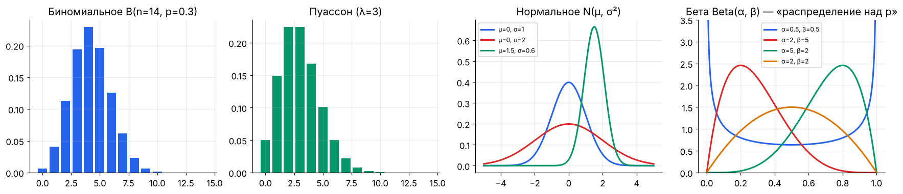

| Распределение | Параметры | $\mathbb{E}$ | Var | Где в ML |
|---------------|-----------|-------------|-----|----------|
| Бернулли | $p$ | $p$ | $p(1-p)$ | бинарная классификация, dropout-маска |
| Категориальное | $\mathbf{p} \in \Delta^{K}$ | — | — | softmax-выход, следующий токен |
| Биномиальное | $n, p$ | $np$ | $np(1-p)$ | число успехов, A/B-тест |
| Пуассон | $\lambda$ | $\lambda$ | $\lambda$ | счётчики событий, редкие события |
| Равномерное | $a, b$ | $\frac{a+b}{2}$ | $\frac{(b-a)^2}{12}$ | инициализация, сэмплирование |
| Нормальное | $\mu, \sigma^2$ | $\mu$ | $\sigma^2$ | шум, VAE, диффузия, инициализация |
| Экспоненциальное | $\lambda$ | $1/\lambda$ | $1/\lambda^2$ | время между событиями |
| Бета | $\alpha, \beta$ | $\frac{\alpha}{\alpha+\beta}$ | — | априор для вероятности, Thompson sampling |
| Дирихле | $\boldsymbol{\alpha}$ | $\alpha_i / \sum\alpha$ | — | априор над категориальным, LDA |
| Лапласа | $\mu, b$ | $\mu$ | $2b^2$ | MAE ↔ L1 |

### Нормальное распределение

```math
\mathcal{N}(x \mid \mu, \sigma^2) = \frac{1}{\sqrt{2\pi\sigma^2}} \exp\left(-\frac{(x-\mu)^2}{2\sigma^2}\right)
```

Правило 68–95–99.7: в $\mu \pm \sigma, \pm 2\sigma, \pm 3\sigma$ лежит 68%, 95%, 99.7% массы.

### Многомерное нормальное

```math
\mathcal{N}(\mathbf{x} \mid \boldsymbol{\mu}, \Sigma) = \frac{1}{(2\pi)^{d/2} |\Sigma|^{1/2}} \exp\left(-\tfrac{1}{2} (\mathbf{x}-\boldsymbol{\mu})^\top \Sigma^{-1} (\mathbf{x}-\boldsymbol{\mu})\right)
```

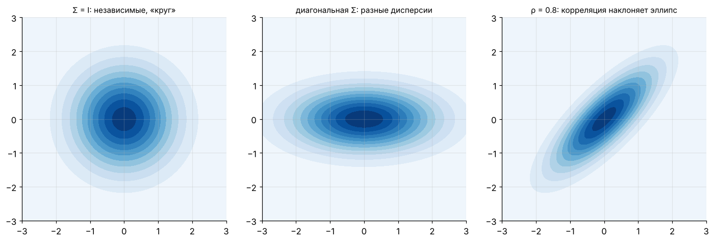

- Линии уровня — эллипсы; оси эллипса — собственные векторы $\Sigma$, полуоси ∝ $\sqrt{\lambda_i}$ (связь с PCA).
- **Репараметризация:** $\mathbf{x} = \boldsymbol{\mu} + L\boldsymbol{\varepsilon}$, $\boldsymbol{\varepsilon} \sim \mathcal{N}(0, I)$, $LL^\top = \Sigma$ (Холецкий). Это «reparameterization trick» в VAE — случайность вынесена в $\boldsymbol{\varepsilon}$, и градиент проходит через $\boldsymbol{\mu}, L$.
- Сумма независимых нормальных — нормальная; маргинальные и условные распределения — нормальные (гауссовские процессы, фильтр Калмана).

## Закон больших чисел и ЦПТ

**ЗБЧ:** выборочное среднее сходится к матожиданию. Поэтому мини-батч оценивает градиент, Монте-Карло оценивает интегралы: $\mathbb{E}[f(X)] \approx \frac{1}{n}\sum f(x_i)$, ошибка $\sim 1/\sqrt{n}$ **независимо от размерности**.

**ЦПТ:** сумма/среднее многих независимых величин с конечной дисперсией ≈ нормальное:

```math
\sqrt{n}\,(\bar{X}_n - \mu) \xrightarrow{d} \mathcal{N}(0, \sigma^2)
```

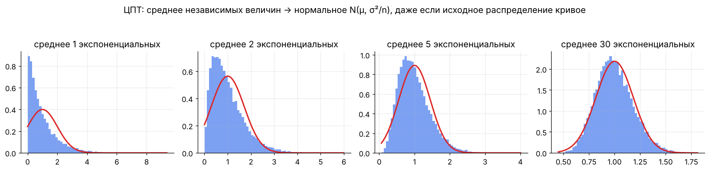

Отсюда доверительные интервалы и z-тесты в A/B (модуль 07).

## Сэмплирование

| Метод | Идея | Где |
|-------|------|-----|
| Обратная функция распределения | $x = F^{-1}(u)$, $u \sim U(0,1)$ | генераторы случайных чисел |
| Gumbel-max | $\arg\max_i (z_i + g_i)$, $g_i \sim \text{Gumbel}$ ~ категориальное(softmax z) | Gumbel-softmax, дифференцируемый дискретный выбор |
| Importance sampling | $\mathbb{E}_p[f] = \mathbb{E}_q[f\,p/q]$ | off-policy RL, PPO-отношение $\pi/\pi_{\text{old}}$ |
| MCMC (Metropolis, HMC) | цепь Маркова со стационарным $p$ | байесовский вывод |
| Langevin dynamics | $\mathbf{x} \leftarrow \mathbf{x} + \frac{\eta}{2}\nabla\log p(\mathbf{x}) + \sqrt{\eta}\,\boldsymbol{\varepsilon}$ | score-based диффузия |

## 🎯 На собеседовании

1. **Задача про тест на болезнь** (см. выше) — в разных вариациях.
2. **Независимость vs некоррелированность?** — Независимость ⇒ некоррелированность, обратное неверно (кроме совместно нормальных).
3. **Зачем He-инициализация?** — Сохранить дисперсию активаций при ReLU: $\operatorname{Var}[w] = 2/n_{\text{in}}$.
4. **Что такое reparameterization trick?** — $z = \mu + \sigma\varepsilon$ вместо $z \sim \mathcal{N}(\mu, \sigma^2)$: случайность не зависит от параметров, поэтому градиент проходит.
5. **Монетка: сколько бросков до первого орла в среднем?** — Геометрическое распределение, $1/p = 2$.

## 🏋️ Практика модуля

**6.1.** Две монеты: честная и с двумя орлами. Взяли случайную, бросили 3 раза — 3 орла. Вероятность, что монета нечестная?

<details><summary>▶️ Решение</summary>

```math
P(\text{нечестн.} \mid HHH) = \frac{1 \cdot \tfrac{1}{2}}{1 \cdot \tfrac{1}{2} + \tfrac{1}{8} \cdot \tfrac{1}{2}} = \frac{8}{9} \approx 0.89
```
</details>

**6.2.** Проверьте моделированием: при какой дисперсии весов сигнал не затухает через 50 слоёв ReLU (ширина 512)?

<details><summary>▶️ Решение</summary>

```python
import numpy as np
x0 = np.random.randn(1000, 512)
for name, std in [("0.01", 0.01), ("Xavier 1/n", np.sqrt(1/512)), ("He 2/n", np.sqrt(2/512))]:
    x = x0
    for _ in range(50):
        x = np.maximum(0, x @ (np.random.randn(512, 512) * std))
    print(f"{name:12s} std активаций после 50 слоёв: {x.std():.2e}")
# 0.01 → ~0, Xavier → затухает в ~2^25 раз, He → порядка 1
```
</details>

**6.3.** Оцените π методом Монте-Карло и найдите, сколько точек нужно для точности 0.001.

<details><summary>▶️ Решение</summary>

```python
u = np.random.rand(1_000_000, 2)
pi_hat = 4 * ((u**2).sum(1) < 1).mean()
```
Индикатор попадания — Бернулли с $p = \pi/4$; стандартная ошибка оценки $4\sqrt{p(1-p)/n} \approx 1.64/\sqrt{n}$. Для 0.001 (одна σ) нужно $n \approx 2.7$ млн точек; каждая лишняя цифра точности — в 100 раз больше точек.
</details>

---

<a id="m07"></a>

# 07. Статистика: оценки, MLE/MAP, A/B-тесты

> Вероятность: «знаем модель — какие будут данные?». Статистика: «видим данные — какая модель?». Обучение модели — статистическое оценивание параметров.

## Метод максимального правдоподобия (MLE)

```math
\hat{\theta}_{\text{MLE}} = \arg\max_\theta \prod_{i=1}^{N} p(y_i \mid \mathbf{x}_i, \theta) = \arg\min_\theta \underbrace{-\sum_{i=1}^{N} \log p(y_i \mid \mathbf{x}_i, \theta)}_{\text{NLL — negative log-likelihood}}
```

**Главная идея курса: почти каждый лосс — это NLL какого-то распределения.**

| Предположение о шуме $p(y \mid \mathbf{x})$ | NLL превращается в | Модель |
|---------------------------------------------|--------------------|--------|
| $\mathcal{N}(f(\mathbf{x}), \sigma^2)$ | **MSE** | линейная регрессия |
| Laplace$(f(\mathbf{x}), b)$ | **MAE** | робастная регрессия |
| Bernoulli$(\sigma(f(\mathbf{x})))$ | **binary cross-entropy** | логистическая регрессия |
| Categorical$(\operatorname{softmax}(f(\mathbf{x})))$ | **cross-entropy** | классификаторы, LLM |
| Poisson$(e^{f(\mathbf{x})})$ | Poisson loss | прогноз счётчиков |

**Вывод для гауссовского шума:**

```math
-\log \prod_i \frac{1}{\sqrt{2\pi\sigma^2}} e^{-\frac{(y_i - f(\mathbf{x}_i))^2}{2\sigma^2}} = \frac{1}{2\sigma^2}\sum_i (y_i - f(\mathbf{x}_i))^2 + \text{const}
```

### Простые MLE, которые просят вывести

- Монета, $k$ орлов из $n$: $\hat{p} = k/n$.
- Нормальное: $\hat{\mu} = \bar{x}$, $\hat{\sigma}^2 = \frac{1}{n}\sum(x_i - \bar{x})^2$ — **смещённая** (несмещённая — делить на $n-1$, поправка Бесселя).
- Пуассон: $\hat{\lambda} = \bar{x}$.

## MAP и регуляризация

Добавим априорное распределение на параметры:

```math
\hat{\theta}_{\text{MAP}} = \arg\max_\theta\ p(\theta \mid D) = \arg\min_\theta \Bigl[ -\log p(D \mid \theta) - \log p(\theta) \Bigr]
```

| Априор $p(\theta)$ | $-\log p(\theta)$ | Регуляризация |
|--------------------|-------------------|---------------|
| $\mathcal{N}(0, \tau^2 I)$ | $\frac{1}{2\tau^2}\lVert\theta\rVert_2^2$ | **L2 / Ridge / weight decay** |
| Laplace$(0, b)$ | $\frac{1}{b}\lVert\theta\rVert_1$ | **L1 / Lasso** |

Сила регуляризации $\lambda$ = отношение дисперсии шума к дисперсии априора: чем меньше данных или чем «уже» априор, тем сильнее тянем веса к нулю.

**Пример: сглаживание Лапласа.** MLE монеты после 3 орлов из 3 — $\hat{p} = 1$, т.е. «решка невозможна». С априором Beta(2, 2) апостериорное — Beta(5, 2), MAP: $\hat{p} = 4/5$. В NLP это add-one smoothing для частот n-грамм.

## Байесовский подход целиком

Вместо точки — всё распределение $p(\theta \mid D)$. Предсказание усредняет по моделям:

```math
p(y \mid \mathbf{x}, D) = \int p(y \mid \mathbf{x}, \theta)\, p(\theta \mid D)\, d\theta
```

Даёт оценку неопределённости. На практике в DL приближают: ансамбли, MC-dropout, Laplace approximation, вариационный вывод (модуль 12).

## Смещение и разброс (bias–variance)

Для квадратичной ошибки ожидаемая ошибка на новой точке раскладывается:

```math
\mathbb{E}\bigl[(y - \hat{f}(\mathbf{x}))^2\bigr] = \underbrace{\bigl(f(\mathbf{x}) - \mathbb{E}\hat{f}(\mathbf{x})\bigr)^2}_{\text{bias}^2} + \underbrace{\operatorname{Var}\bigl[\hat{f}(\mathbf{x})\bigr]}_{\text{variance}} + \underbrace{\sigma^2}_{\text{неустранимый шум}}
```


- **Высокий bias** (недообучение): train и test ошибки обе высокие → сложнее модель, больше признаков, меньше регуляризации.
- **Высокая variance** (переобучение): train низкая, test высокая → больше данных, регуляризация, проще модель, ансамбли (бэггинг снижает variance).
- **Double descent:** у сильно перепараметризованных моделей (нейросети) после пика на «пороге интерполяции» test-ошибка снова падает — классическая U-кривая не вся история.

## Доверительные интервалы и проверка гипотез

**95% доверительный интервал для среднего** (большая выборка, по ЦПТ):

```math
\bar{x} \pm 1.96 \cdot \frac{s}{\sqrt{n}}
```

Интерпретация: если повторять эксперимент много раз, 95% таких интервалов накроют истинное значение (а **не** «истинное значение лежит в интервале с вероятностью 95%»).

**Проверка гипотез:**
1. $H_0$ — «эффекта нет» (конверсии A и B равны).
2. Статистика — насколько данные далеки от $H_0$.
3. **p-value** — вероятность получить такое же или более экстремальное значение статистики, **если $H_0$ верна**. Это **не** вероятность того, что $H_0$ верна.
4. Если p < α (обычно 0.05) — отвергаем $H_0$.

| | $H_0$ верна | $H_0$ неверна |
|---|---|---|
| Отвергли $H_0$ | ошибка I рода (α) — ложная тревога | ✅ мощность $1-\beta$ |
| Не отвергли | ✅ | ошибка II рода (β) — пропуск эффекта |

## A/B-тест на конверсию

```math
z = \frac{\hat{p}_B - \hat{p}_A}{\sqrt{\hat{p}(1-\hat{p})\left(\frac{1}{n_A} + \frac{1}{n_B}\right)}}, \qquad \hat{p} = \frac{x_A + x_B}{n_A + n_B}
```

**Размер выборки** на группу для детекции абсолютного эффекта $\delta$ при α = 0.05 и мощности 80%:

```math
n \approx \frac{2\,(z_{1-\alpha/2} + z_{1-\beta})^2\, p(1-p)}{\delta^2} \approx \frac{16\, p(1-p)}{\delta^2}
```

Пример: базовая конверсия 5%, хотим заметить рост до 5.5% (δ = 0.005): $n \approx 16 \cdot 0.0475 / 0.000025 \approx 30\,400$ на группу.

**Ловушки A/B (любимая тема интервьюеров):**
- **Подглядывание (peeking):** смотреть p-value каждый день и остановиться при p < 0.05 — ложных открытий намного больше 5%. Решения: фиксированный горизонт, последовательные тесты, байесовский подход.
- **Множественные сравнения:** 20 метрик → одна «значимая» случайно. Поправки Бонферрони ($\alpha/m$), Холма, контроль FDR (Бенджамини–Хохберг).
- **SRM (sample ratio mismatch):** группы 50/50 по дизайну, а получилось 48/52 — баг в раздаче, результатам верить нельзя.
- **Сетевые эффекты, новизна, сезонность.**
- **CUPED** — снижение дисперсии через ковариату до эксперимента (типично −30–50% к нужной выборке).

## Бутстрап

Нет формулы для доверительного интервала (медиана, AUC, F1)? Пересэмплируй данные с возвращением:

```python
import numpy as np
def bootstrap_ci(x, stat=np.median, B=10_000, alpha=0.05):
    rng = np.random.default_rng(0)
    stats = [stat(rng.choice(x, size=len(x), replace=True)) for _ in range(B)]
    return np.quantile(stats, [alpha / 2, 1 - alpha / 2])

latency = np.random.lognormal(3, 0.8, 500)
print(bootstrap_ci(latency))                    # 95% ДИ медианной задержки
```

Для сравнения двух моделей на одном тест-сете — **парный** бутстрап: сэмплируем индексы примеров и считаем разницу метрик на одних и тех же индексах.

## 🎯 На собеседовании

1. **MLE vs MAP?** — MAP = MLE + log-априор; априор = регуляризация.
2. **Почему MSE для регрессии, CE для классификации?** — Это NLL гауссовской и категориальной моделей шума.
3. **Что такое p-value?** — Вероятность данных не менее экстремальных при верной $H_0$. Не вероятность $H_0$.
4. **Как понять, переобучилась ли модель?** — Сравнить train/val кривые; разрыв растёт — variance.
5. **A/B-тест показал p = 0.04 на 7-й день, планировали 14. Катим?** — Нет: подглядывание завышает ошибку I рода; дождаться плана или использовать последовательный тест.

## 🏋️ Практика модуля

**7.1.** Выведите MLE параметра $p$ Бернулли по $n$ наблюдениям с $k$ единицами.

<details><summary>▶️ Решение</summary>

```math
\ell(p) = k \log p + (n - k)\log(1 - p), \qquad \ell'(p) = \frac{k}{p} - \frac{n-k}{1-p} = 0 \;\Rightarrow\; \hat{p} = \frac{k}{n}
```
</details>

**7.2.** A: 200 конверсий из 4000, B: 250 из 4000. Значима ли разница на уровне 0.05?

<details><summary>▶️ Решение</summary>

```python
import numpy as np
from scipy import stats
xa, na, xb, nb = 200, 4000, 250, 4000
p = (xa + xb) / (na + nb)
z = (xb / nb - xa / na) / np.sqrt(p * (1 - p) * (1 / na + 1 / nb))
print(z, 2 * (1 - stats.norm.cdf(abs(z))))   # z ≈ 2.43, p ≈ 0.015 → значимо
```
Ещё проверить: SRM, что тест не останавливали раньше, и практическую значимость: +1.25 п.п. (рост на 25%) стоит ли затрат на внедрение.
</details>

**7.3.** Покажите моделированием, что подглядывание раздувает ошибку I рода.

<details><summary>▶️ Решение</summary>

```python
rng = np.random.default_rng(0); false_pos = 0
for _ in range(2000):                          # 2000 A/A-тестов (эффекта нет)
    a = rng.random(14 * 1000) < 0.05; b = rng.random(14 * 1000) < 0.05
    for day in range(1, 15):                   # смотрим каждый день
        n = day * 1000; pa, pb = a[:n].mean(), b[:n].mean(); pp = (pa + pb) / 2
        z = (pb - pa) / np.sqrt(pp * (1 - pp) * 2 / n)
        if abs(z) > 1.96:
            false_pos += 1; break
print(false_pos / 2000)   # ≈ 0.2 вместо 0.05
```
</details>

---

<a id="m08"></a>

# 08. Теория информации: энтропия, кросс-энтропия, KL

> Почему классификаторы и LLM обучают на cross-entropy? Что такое perplexity? Откуда KL-штраф в RLHF и VAE? Всё это — один модуль.

## Информация и энтропия

**Неожиданность** события с вероятностью $p$: $I(x) = -\log p(x)$. Редкое событие несёт больше информации; достоверное ($p = 1$) — ноль.

**Энтропия** — средняя неожиданность, мера неопределённости распределения:

```math
H(P) = -\sum_x p(x) \log p(x) = \mathbb{E}_{x \sim P}\bigl[-\log p(x)\bigr]
```

- Основание 2 — биты, $e$ — наты (в PyTorch по умолчанию наты).
- $0 \le H \le \log K$ для $K$ исходов; максимум у равномерного, минимум (0) у вырожденного.
- Смысл по Шеннону: минимальная средняя длина кода (в битах) для сообщений из $P$.

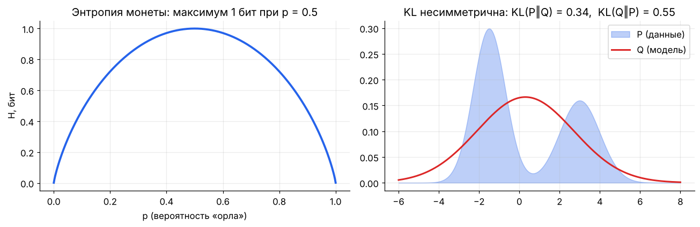

## Кросс-энтропия

Средняя длина кода, если данные из $P$, а код оптимален для $Q$:

```math
H(P, Q) = -\sum_x p(x) \log q(x) \;\ge\; H(P)
```

В классификации $P$ — one-hot правильный ответ, $Q$ — выход модели, и сумма схлопывается в один член: $H(P, Q) = -\log q(y_{\text{true}})$. **Это и есть CE-лосс**, он же NLL категориального распределения (модуль 07).

## KL-дивергенция

«Лишние биты» из-за использования $Q$ вместо $P$:

```math
D_{\mathrm{KL}}(P \,\parallel \, Q) = \sum_x p(x) \log \frac{p(x)}{q(x)} = H(P, Q) - H(P) \;\ge 0
```

Свойства:
- $D_{\mathrm{KL}} = 0 \iff P = Q$.
- **Несимметрична:** $D_{\mathrm{KL}}(P\parallel Q) \ne D_{\mathrm{KL}}(Q\parallel P)$ — это не расстояние.
- Поскольку $H(P)$ данных от модели не зависит, **минимизировать CE ⇔ минимизировать KL(данные ‖ модель) ⇔ MLE**.

### Прямая vs обратная KL — важно для генеративных моделей

| | Forward KL: $D(P_{\text{data}} \,\parallel \, Q_\theta)$ | Reverse KL: $D(Q_\theta \,\parallel \, P)$ |
|---|---|---|
| Штрафует | $q \approx 0$ там, где $p > 0$ | $q > 0$ там, где $p \approx 0$ |
| Поведение | **mass-covering**: накрывает все моды, «размазывает» | **mode-seeking**: садится на одну моду, острее |
| Где | MLE, обучение LLM | вариационный вывод (VAE), RLHF-штраф к референсной модели |

На правой картинке выше: унимодальная Q не может описать бимодальную P; forward KL растягивает Q на обе моды.

### KL между нормальными — формула для VAE

```math
D_{\mathrm{KL}}\bigl(\mathcal{N}(\mu, \sigma^2) \,\parallel \, \mathcal{N}(0, 1)\bigr) = \tfrac{1}{2}\bigl(\mu^2 + \sigma^2 - 1 - \log \sigma^2\bigr)
```

## Взаимная информация

Сколько знание $Y$ уменьшает неопределённость $X$:

```math
I(X; Y) = H(X) - H(X \mid Y) = D_{\mathrm{KL}}\bigl(p(x, y) \,\parallel \, p(x)p(y)\bigr)
```

$I = 0 \iff X, Y$ независимы (ловит и нелинейные зависимости, в отличие от корреляции). Где: отбор признаков, information gain в деревьях решений (модуль 10), контрастное обучение — **InfoNCE** является нижней оценкой взаимной информации между двумя «видами» данных (CLIP, SimCLR).

## Perplexity — метрика языковых моделей

```math
\operatorname{PPL} = \exp\left( -\frac{1}{T} \sum_{t=1}^{T} \log p(x_t \mid x_{<t}) \right) = e^{\text{средний CE-лосс в натах}}
```

Интерпретация: модель в среднем «колеблется» между PPL равновероятными вариантами. Случайная модель со словарём 50 000 — PPL = 50 000; хорошая LLM на обычном тексте — единицы. Лосс 2.0 нат ⇒ PPL ≈ 7.4.

**Bits per byte / per character** — та же CE, нормированная на байты: позволяет сравнивать модели с разными токенизаторами.

## Связь со сжатием

Модель, предсказывающая следующий символ с CE = $H$ бит, позволяет (через арифметическое кодирование) сжать текст до ~$H$ бит на символ. **Хорошее предсказание = хорошее сжатие** — один из взглядов на то, почему языковое моделирование учит «понимать» данные.

## 🎯 На собеседовании

1. **Почему CE, а не MSE для классификации?** — CE = NLL категориальной модели (принципиально), выпуклая по логитам у логистической регрессии, градиент $\mathbf{p} - \mathbf{y}$ не затухает при уверенной ошибке; MSE с сигмоидой даёт градиент с множителем $\sigma'$, который ≈ 0 при насыщении.
2. **KL симметрична?** — Нет; объясни mode-covering vs mode-seeking.
3. **Как связаны CE, KL и энтропия?** — $H(P, Q) = H(P) + D_{\mathrm{KL}}(P\parallel Q)$.
4. **Что такое perplexity?** — $e^{\text{CE}}$, «эффективное число вариантов».
5. **Зачем KL-штраф в RLHF?** — Не дать политике уйти далеко от SFT-модели и «взломать» reward model.

## 🏋️ Практика модуля

**8.1.** Энтропия честного кубика? Распределения [0.5, 0.25, 0.125, 0.125]?

<details><summary>▶️ Решение</summary>

Кубик: $\log_2 6 \approx 2.585$ бит. Второе: $0.5 \cdot 1 + 0.25 \cdot 2 + 2 \cdot 0.125 \cdot 3 = 1.75$ бит — и оптимальный префиксный код с длинами 1, 2, 3, 3 (Хаффман) достигает ровно этого.
</details>

**8.2.** Модель для правильного класса выдаёт 0.9, 0.5 и 0.01. Какой CE-лосс в каждом случае?

<details><summary>▶️ Решение</summary>

$-\ln 0.9 = 0.105$, $-\ln 0.5 = 0.693$, $-\ln 0.01 = 4.6$. Уверенная ошибка штрафуется в ~44 раза сильнее мягкой уверенности 0.9 — поэтому модели с CE склонны к переуверенности на шумных метках, и применяют label smoothing.
</details>

**8.3.** Посчитайте KL в обе стороны для P = [0.9, 0.1], Q = [0.5, 0.5].

<details><summary>▶️ Решение</summary>

```python
import numpy as np
P, Q = np.array([0.9, 0.1]), np.array([0.5, 0.5])
kl = lambda a, b: np.sum(a * np.log(a / b))
print(kl(P, Q), kl(Q, P))   # 0.368, 0.511 — разные
```
</details>

---

<a id="m09"></a>

# 09. Функции потерь и метрики

> Лосс — то, что оптимизирует модель (должен быть дифференцируемым). Метрика — то, что важно бизнесу (может быть любой). Путать их — частая ошибка.

## Регрессия

| Лосс | Формула | Градиент по $\hat{y}$ | Свойства |
|------|---------|----------------------|----------|
| MSE | $(y - \hat{y})^2$ | $2(\hat{y} - y)$ | предсказывает **среднее**; чувствителен к выбросам |
| MAE | $\lvert y - \hat{y}\rvert$ | $\operatorname{sign}(\hat{y} - y)$ | предсказывает **медиану**; робастный; градиент не уменьшается у минимума |
| Huber | квадратичный при ошибке < δ, линейный дальше | ограничен | компромисс; Smooth L1 в детекции |
| Quantile (pinball) | $\max(\tau e, (\tau - 1)e)$, $e = y - \hat{y}$ | — | предсказывает **τ-квантиль**: интервалы прогноза |
| Log-cosh | $\log\cosh(\hat{y} - y)$ | $\tanh(\hat{y} - y)$ | гладкий Huber |

**Почему MSE → среднее, MAE → медиана:** минимизируем $\sum (y_i - c)^2$ по константе $c$: производная $-2\sum(y_i - c) = 0 \Rightarrow c = \bar{y}$. Для $\sum \lvert y_i - c\rvert$ производная — (число точек ниже $c$) − (число выше) = 0 ⇒ $c$ — медиана.

## Классификация

```math
\text{BCE} = -\bigl[y \log \sigma(z) + (1-y)\log(1 - \sigma(z))\bigr] = \log(1 + e^{z}) - yz \qquad \text{(стабильная форма по логиту } z)
```

```math
\text{CE} = -\log \operatorname{softmax}(\mathbf{z})_y = -z_y + \log\sum_j e^{z_j}
```

| Лосс | Идея | Где |
|------|------|-----|
| **Focal loss** | $-(1 - p_t)^\gamma \log p_t$ — уменьшает вес лёгких примеров | детекция, сильный дисбаланс |
| **Label smoothing** | цель $(1-\varepsilon)\,\mathbf{y} + \varepsilon/K$ | борьба с переуверенностью, трансформеры |
| **Взвешенная CE** | вес класса ∝ 1/частота | дисбаланс |
| **Hinge** | $\max(0, 1 - y z)$, $y \in \{-1, +1\}$ | SVM; нужен **запас** (margin), а не только правильный знак |
| **Dice / IoU loss** | $1 - \frac{2\lvert A \cap B\rvert}{\lvert A\rvert + \lvert B\rvert}$ | сегментация |

## Метрическое и контрастное обучение

**Triplet loss:** якорь ближе к позитиву, чем к негативу, на запас $m$:

```math
\max\bigl(0,\ d(\mathbf{a}, \mathbf{p}) - d(\mathbf{a}, \mathbf{n}) + m\bigr)
```

**InfoNCE** (CLIP, SimCLR, эмбеддинги для RAG) — это просто CE, где «класс» — правильная пара среди батча:

```math
\mathcal{L} = -\log \frac{\exp(\mathbf{q}^\top \mathbf{k}^+ / \tau)}{\sum_{j=0}^{N} \exp(\mathbf{q}^\top \mathbf{k}_j / \tau)}
```

```python
import torch, torch.nn.functional as F
def clip_loss(img_emb, txt_emb, tau=0.07):
    img, txt = F.normalize(img_emb, dim=-1), F.normalize(txt_emb, dim=-1)
    logits = img @ txt.T / tau                     # (B, B): диагональ — правильные пары
    labels = torch.arange(len(img))
    return (F.cross_entropy(logits, labels) + F.cross_entropy(logits.T, labels)) / 2
```

## Метрики классификации

|  | Предсказано + | Предсказано − |
|---|---|---|
| **Реально +** | TP | FN |
| **Реально −** | FP | TN |

```math
\text{Precision} = \frac{TP}{TP + FP}, \quad \text{Recall} = \frac{TP}{TP + FN}, \quad F_1 = \frac{2PR}{P + R}, \quad F_\beta = \frac{(1+\beta^2)PR}{\beta^2 P + R}
```

- **Precision** — «из того, что мы назвали спамом, сколько спам». Важен, когда ложная тревога дорогая.
- **Recall** — «какую долю всего спама поймали». Важен, когда пропуск дорогой (болезнь, фрод).
- **Accuracy** врёт при дисбалансе: 99% — у константы «здоров», если болеют 1%.
- $F_1$ — гармоническое среднее: низкое, если хотя бы одна из метрик низкая.

### ROC-AUC и PR-AUC


- **ROC:** TPR против FPR при всех порогах. **AUC = вероятность того, что случайный позитив получит скор выше случайного негатива.** Не зависит от порога и от монотонных преобразований скоров.
- **PR-кривая** показывает precision против recall; при сильном дисбалансе честнее ROC (ROC-AUC может быть 0.95 при никуда не годной precision).
- Порог выбирают отдельно, по бизнес-стоимости ошибок, а не по умолчанию 0.5.

### Калибровка

Модель **откалибрована**, если среди примеров с предсказанием 0.8 доля позитивов ≈ 80%. Метрики: ECE (expected calibration error), Brier score $\frac{1}{N}\sum(p_i - y_i)^2$, reliability diagram. Исправление: temperature scaling (одна T на валидации), Platt scaling, изотоническая регрессия. Современные глубокие сети часто **переуверены**.

## Метрики регрессии и ранжирования

| Метрика | Формула / смысл |
|---------|----------------|
| RMSE | $\sqrt{\text{MSE}}$, в единицах целевой переменной |
| MAPE | средняя относительная ошибка; ломается при $y \approx 0$ |
| $R^2$ | $1 - \frac{\sum(y - \hat{y})^2}{\sum(y - \bar{y})^2}$ — доля объяснённой дисперсии; может быть < 0 |
| NDCG@k | качество ранжирования с дисконтом $1/\log_2(\text{позиция} + 1)$ |
| MRR | $\frac{1}{N}\sum 1/\text{ранг первого релевантного}$ |
| Recall@k | доля релевантных в топ-k — основная метрика ретривера в RAG |

## 🎯 На собеседовании

1. **Precision vs recall — пример, где важнее каждая?** — Спам-фильтр (precision: не потерять важное письмо) vs скрининг рака (recall).
2. **Что значит ROC-AUC = 0.8?** — В 80% случаев случайный позитив получает скор выше случайного негатива.
3. **Почему не accuracy при дисбалансе?** — Константный классификатор выигрывает.
4. **MSE vs MAE?** — Среднее vs медиана; выбросы; гладкость градиента.
5. **Как InfoNCE связан с CE?** — Это CE по «классам» = кандидатам в батче; τ — температура.

## 🏋️ Практика модуля

**9.1.** 1000 писем, из них 50 спама. Модель пометила 60 писем как спам, из них 40 действительно спам. Посчитайте accuracy, precision, recall, F1.

<details><summary>▶️ Решение</summary>

TP = 40, FP = 20, FN = 10, TN = 930. Accuracy = 970/1000 = 0.97. Precision = 40/60 = 0.667. Recall = 40/50 = 0.8. F1 = 2·0.667·0.8/1.467 ≈ 0.727.
</details>

**9.2.** Реализуйте ROC-AUC через вероятностное определение и сравните со sklearn.

<details><summary>▶️ Решение</summary>

```python
import numpy as np
from sklearn.metrics import roc_auc_score
y = np.random.rand(2000) < 0.1
s = np.random.randn(2000) + 1.2 * y
pos, neg = s[y], s[~y]
auc = ((pos[:, None] > neg[None, :]).mean() + 0.5 * (pos[:, None] == neg[None, :]).mean())
print(auc, roc_auc_score(y, s))   # совпадают
```
Сложность $O(n_+ n_-)$; через сортировку и ранги (статистика Манна–Уитни) — $O(n\log n)$.
</details>

**9.3.** Покажите, что BCE через логиты $\log(1 + e^z) - yz$ совпадает с обычной формулой и не ломается при $z = 1000$.

<details><summary>▶️ Решение</summary>

$-\log\sigma(z) = \log(1 + e^{-z})$, $-\log(1 - \sigma(z)) = \log(1 + e^{z})$. Подставляем: $y\log(1+e^{-z}) + (1-y)\log(1+e^z) = \log(1+e^z) - yz$ (т.к. $\log(1+e^{-z}) = \log(1+e^z) - z$). В коде: `np.logaddexp(0, z) - y * z` — при $z = 1000$ даёт 1000·(1−y), а наивный `np.log(1 - sigmoid(z))` даёт `-inf`.
</details>

---

<a id="m10"></a>

# 10. Математика классического ML

> Классические модели — лучший полигон для математики: всё выводится на одном листе. И их до сих пор спрашивают на каждом собеседовании.

## Линейная регрессия

```math
\hat{\mathbf{y}} = X\mathbf{w}, \qquad \min_{\mathbf{w}} \lVert X\mathbf{w} - \mathbf{y}\rVert^2 \;\Rightarrow\; \mathbf{w}^* = (X^\top X)^{-1} X^\top \mathbf{y}
```

- Геометрия: $X\mathbf{w}^*$ — ортогональная проекция $\mathbf{y}$ на пространство столбцов $X$ (модуль 03, задача 3.1).
- **Ridge:** $\mathbf{w}^* = (X^\top X + \lambda I)^{-1}X^\top\mathbf{y}$ — всегда обратима, лечит мультиколлинеарность: вклад направления с сингулярным числом $\sigma_i$ умножается на $\sigma_i^2/(\sigma_i^2 + \lambda)$ — слабые направления подавляются сильнее.
- Сложность закрытой формы $O(nd^2 + d^3)$ — для больших $d$ используют SGD или сопряжённые градиенты.
- Интерпретация коэффициента: изменение $\hat{y}$ при росте признака на 1 **при прочих равных** — верно, только если признаки не коррелируют сильно.

## Логистическая регрессия

```math
p(y = 1 \mid \mathbf{x}) = \sigma(\mathbf{w}^\top\mathbf{x} + b), \qquad \log\frac{p}{1-p} = \mathbf{w}^\top\mathbf{x} + b
```

- Линейна в пространстве **логарифма шансов** (log-odds); граница решений — гиперплоскость.
- Лосс — BCE (NLL Бернулли), выпуклый ⇒ единственный минимум. Градиент: $X^\top(\boldsymbol{\sigma} - \mathbf{y})$.
- Коэффициент $w_j$: рост признака на 1 умножает **шансы** на $e^{w_j}$.
- Закрытой формы нет — Newton/IRLS, L-BFGS или SGD.
- **Softmax-регрессия** — обобщение на K классов; последний слой любого нейросетевого классификатора — это она.

## SVM

Ищем разделяющую гиперплоскость с **максимальным зазором** (margin) $2/\lVert\mathbf{w}\rVert$:

```math
\min_{\mathbf{w}, b}\ \tfrac{1}{2}\lVert\mathbf{w}\rVert^2 + C\sum_i \xi_i \quad \text{при}\quad y_i(\mathbf{w}^\top\mathbf{x}_i + b) \ge 1 - \xi_i,\ \xi_i \ge 0
```

Эквивалентно: hinge loss + L2-регуляризация. Двойственная задача (через множители Лагранжа) зависит от данных только через скалярные произведения $\mathbf{x}_i^\top\mathbf{x}_j$ ⇒ **ядровой трюк**: заменить их на $K(\mathbf{x}_i, \mathbf{x}_j)$, например RBF $\exp(-\gamma\lVert\mathbf{x}_i - \mathbf{x}_j\rVert^2)$, — это скалярное произведение в бесконечномерном пространстве признаков, которое никогда не строится явно. Решение определяется только **опорными векторами** (точки на границе зазора или внутри).

## k ближайших соседей и проклятие размерности

kNN предсказывает по большинству/среднему k ближайших точек. Проблема в высокой размерности:
- Объём шара в $d$ измерениях сосредоточен у поверхности; в кубе $[0,1]^d$ доля объёма внутреннего куба со стороной 0.9 — $0.9^d$ → 0 (при $d = 100$ — 0.003%).
- Расстояния концентрируются: $\frac{d_{\max} - d_{\min}}{d_{\min}} \to 0$ — «ближайший» почти так же далёк, как «дальний».

Почему эмбеддинги всё же работают: реальные данные лежат около многообразия низкой размерности (manifold hypothesis), а поиск — по косинусу, а не по евклиду в сырых признаках. Быстрый поиск — приближённые индексы (HNSW, IVF-PQ).

## Наивный Байес

```math
p(y \mid x_1, \dots, x_d) \propto p(y) \prod_{j=1}^{d} p(x_j \mid y)
```

«Наивное» предположение — признаки условно независимы при известном классе. Неверно почти всегда, но классификация часто работает (важен только argmax). Обучение — подсчёт частот, классика для текстов (спам).

## Деревья решений и ансамбли

**Критерий разбиения** — максимальное уменьшение «нечистоты»:

```math
\text{Gini} = 1 - \sum_k p_k^2, \qquad \text{Entropy} = -\sum_k p_k \log_2 p_k, \qquad \text{IG} = H(\text{родитель}) - \sum_{c} \frac{n_c}{n} H(c)
```

Для регрессии — уменьшение дисперсии (MSE).

| Ансамбль | Как | Что снижает |
|----------|-----|-------------|
| **Bagging / Random Forest** | деревья на бутстрап-выборках + случайные подмножества признаков, усреднение | **variance**: $\operatorname{Var}(\bar{f}) = \rho\sigma^2 + \frac{1-\rho}{B}\sigma^2$ — нужна низкая корреляция $\rho$ между деревьями |
| **Gradient Boosting** (XGBoost, LightGBM, CatBoost) | каждое новое дерево подгоняется под **антиградиент лосса** (для MSE — под остатки) | **bias** |

Градиентный бустинг — это градиентный спуск в **пространстве функций**: $F_{m} = F_{m-1} - \eta\, h_m$, где $h_m \approx \nabla_F L$. XGBoost использует ещё и вторую производную (Ньютоновский шаг) и регуляризацию листьев. Для табличных данных бустинг в 2026 году — по-прежнему сильнейший бейзлайн.

## Кластеризация

**k-means** минимизирует внутрикластерную дисперсию $\sum_k \sum_{i \in C_k} \lVert\mathbf{x}_i - \boldsymbol{\mu}_k\rVert^2$ чередованием:
1. Назначить точки ближайшему центру.
2. Пересчитать центры как средние.

Каждый шаг не увеличивает функционал ⇒ сходится, но к **локальному** минимуму (k-means++ для инициализации, несколько запусков). Предполагает «круглые» кластеры одного размера.

**GMM + EM-алгоритм** — мягкая версия: смесь гауссиан, E-шаг считает вероятности принадлежности, M-шаг — взвешенные MLE параметров. k-means — предельный случай GMM с одинаковыми сферическими ковариациями $\sigma \to 0$.

## 🎯 На собеседовании

1. **Выведи нормальное уравнение.** — Модуль 03, задача 3.1.
2. **Почему логистическая регрессия — линейный классификатор, если в ней сигмоида?** — Граница $\sigma(\mathbf{w}^\top\mathbf{x}) = 0.5 \iff \mathbf{w}^\top\mathbf{x} = 0$ — гиперплоскость.
3. **Что такое ядровой трюк?** — Алгоритм использует только скалярные произведения; подменяем их ядром = скалярным произведением в пространстве признаков высокой размерности.
4. **Bagging vs boosting?** — Параллельно и снижает variance vs последовательно и снижает bias.
5. **Проклятие размерности?** — Объём растёт экспоненциально, данные разреженные, расстояния теряют контраст.

## 🏋️ Практика модуля

**10.1.** Реализуйте линейную регрессию тремя способами (формула, `lstsq`, градиентный спуск) и сравните.

<details><summary>▶️ Решение</summary>

```python
import numpy as np
rng = np.random.default_rng(0)
X = np.c_[np.ones(200), rng.normal(size=(200, 3))]
w_true = np.array([1.0, 2.0, -3.0, 0.5]); y = X @ w_true + 0.1 * rng.normal(size=200)

w1 = np.linalg.solve(X.T @ X, X.T @ y)            # нормальное уравнение (solve, не inv!)
w2 = np.linalg.lstsq(X, y, rcond=None)[0]         # через QR/SVD — устойчивее
w3 = np.zeros(4)
for _ in range(2000):
    w3 -= 0.1 * 2 / len(y) * X.T @ (X @ w3 - y)
print(np.round([w1, w2, w3], 3))                  # все ≈ [1, 2, -3, 0.5]
```
</details>

**10.2.** Посчитайте Gini и энтропию для узла с классами [8, 2] и information gain разбиения на [6, 0] и [2, 2].

<details><summary>▶️ Решение</summary>

Родитель: p = [0.8, 0.2]. Gini = 1 − 0.64 − 0.04 = 0.32. H = −0.8·log₂0.8 − 0.2·log₂0.2 ≈ 0.722.
Дети: [6, 0] → H = 0; [2, 2] → H = 1. Взвешенно: 0.6·0 + 0.4·1 = 0.4. **IG ≈ 0.722 − 0.4 = 0.322** бит.
</details>

**10.3.** Напишите k-means на NumPy за 10 строк.

<details><summary>▶️ Решение</summary>

```python
def kmeans(X, k, iters=50, seed=0):
    rng = np.random.default_rng(seed)
    C = X[rng.choice(len(X), k, replace=False)]
    for _ in range(iters):
        labels = ((X[:, None, :] - C[None]) ** 2).sum(-1).argmin(1)
        newC = np.array([X[labels == j].mean(0) if (labels == j).any() else C[j] for j in range(k)])
        if np.allclose(newC, C):
            break
        C = newC
    return C, labels
```
</details>

---

<a id="m11"></a>

# 11. Математика глубокого обучения и трансформеров

> Нейросеть — композиция простых дифференцируемых функций. Трансформер — несколько матричных умножений, softmax, нормализация и residual-связи. Здесь — каждая формула, которую спрашивают.

## Нейрон, слой, MLP

```math
\mathbf{h}^{(l)} = \phi\bigl(W^{(l)}\mathbf{h}^{(l-1)} + \mathbf{b}^{(l)}\bigr)
```

**Теорема об универсальной аппроксимации:** MLP с одним скрытым слоем достаточной ширины и нелинейной активацией приближает любую непрерывную функцию на компакте сколь угодно точно. Это теорема о **существовании** — она ничего не говорит о том, сколько нужно нейронов и найдёт ли их SGD. Глубина на практике экспоненциально эффективнее ширины для многих функций.

### Активации

| Активация | Формула | Плюсы / минусы |
|-----------|---------|----------------|
| Sigmoid | $1/(1+e^{-x})$ | выход (0, 1); насыщается, не центрирована |
| Tanh | $\tanh x$ | центрирована; насыщается |
| ReLU | $\max(0, x)$ | дёшево, не насыщается при $x > 0$; «мёртвые» нейроны |
| GELU | $x\,\Phi(x)$ | гладкая; BERT, GPT |
| SiLU / Swish | $x\,\sigma(x)$ | гладкая; LLaMA, современные CNN |
| SwiGLU | $(\operatorname{SiLU}(xW) \odot xV)\,W_2$ | гейтированный FFN в LLaMA, Mistral, Qwen |

См. картинку активаций и их производных в [модуле 04](#m04).

## Инициализация

| Схема | $\operatorname{Var}[W]$ | Для |
|-------|-------------------------|-----|
| Xavier/Glorot | $\frac{2}{n_{\text{in}} + n_{\text{out}}}$ | tanh, sigmoid |
| He/Kaiming | $\frac{2}{n_{\text{in}}}$ | ReLU-семейство |
| Трансформеры | $\mathcal{N}(0, 0.02^2)$, выходные проекции слоёв масштабируются на $1/\sqrt{2L}$ | GPT-2 и потомки |

Вывод — в [модуле 06](#m06): сохраняем дисперсию сигнала (forward) и градиента (backward).

## Нормализации

```math
\text{BatchNorm:}\ \ \hat{x} = \frac{x - \mu_{\text{batch}}}{\sqrt{\sigma^2_{\text{batch}} + \epsilon}}, \qquad
\text{LayerNorm:}\ \ \hat{\mathbf{x}} = \frac{\mathbf{x} - \mu(\mathbf{x})}{\sqrt{\sigma^2(\mathbf{x}) + \epsilon}}, \qquad
\text{RMSNorm:}\ \ \hat{\mathbf{x}} = \frac{\mathbf{x}}{\sqrt{\frac{1}{d}\sum_i x_i^2 + \epsilon}}
```

затем $\boldsymbol{\gamma} \odot \hat{\mathbf{x}} + \boldsymbol{\beta}$ (обучаемые масштаб и сдвиг).

| | BatchNorm | LayerNorm / RMSNorm |
|---|---|---|
| Статистики по | батчу (для каждого канала) | признакам одного примера |
| Зависит от размера батча | да; на инференсе — бегущие средние | нет |
| Где | CNN | трансформеры, RNN; RMSNorm — в большинстве LLM (дешевле, без центрирования) |

**Pre-LN** ($\mathbf{x} + f(\operatorname{LN}(\mathbf{x}))$) стабильнее Post-LN в глубоких трансформерах — градиент идёт по «чистому» residual-пути.

## Dropout

На обучении зануляем каждый нейрон с вероятностью $p$ и делим оставшиеся на $1-p$ (inverted dropout), чтобы матожидание не изменилось: $\mathbb{E}[\tilde{h}] = (1-p)\cdot\frac{h}{1-p} = h$. На инференсе — ничего не делаем. Интерпретация: обучение ансамбля из $2^n$ подсетей с общими весами. В больших LLM при предобучении часто dropout = 0 (данных достаточно, переобучения нет).

## Свёртки (CNN)

```math
(I * K)_{ij} = \sum_{m}\sum_{n} I_{i+m,\, j+n}\, K_{mn}
```

(технически это кросс-корреляция, но в DL называют свёрткой).

**Размер выхода** — считают на каждом собеседовании:

```math
H_{\text{out}} = \left\lfloor \frac{H_{\text{in}} + 2P - D\,(K - 1) - 1}{S} \right\rfloor + 1
```

$K$ — ядро, $P$ — паддинг, $S$ — шаг (stride), $D$ — dilation. Частные случаи: $K = 3, P = 1, S = 1$ сохраняет размер; $S = 2$ — уменьшает вдвое.

**Параметры свёрточного слоя:** $C_{\text{out}} \cdot (C_{\text{in}} \cdot K^2 + 1)$ — не зависят от размера изображения (**разделение весов**). Свёртка = эквивариантность к сдвигам + локальность.

**Рецептивное поле** растёт с глубиной: $L$ слоёв 3×3 со stride 1 видят $(2L+1)\times(2L+1)$ пикселей.

## Рекуррентные сети

```math
\mathbf{h}_t = \tanh(W_h \mathbf{h}_{t-1} + W_x \mathbf{x}_t + \mathbf{b})
```

Градиент через $T$ шагов содержит $\prod_t \operatorname{diag}(\tanh')\,W_h$ — затухает или взрывается в зависимости от спектрального радиуса $W_h$. **LSTM** добавляет ячейку $\mathbf{c}_t = \mathbf{f}_t \odot \mathbf{c}_{t-1} + \mathbf{i}_t \odot \tilde{\mathbf{c}}_t$ — аддитивное обновление, по которому градиент проходит без многократного умножения на матрицу. Современные **SSM** (Mamba) — линейные рекуррентности с селективными параметрами: обучаются параллельно, инференс за $O(1)$ на токен.

## Attention — главная формула 2020-х

```math
\operatorname{Attention}(Q, K, V) = \operatorname{softmax}\!\left( \frac{Q K^\top}{\sqrt{d_k}} + M \right) V
```

- $Q = XW_Q$, $K = XW_K$, $V = XW_V$; $X \in \mathbb{R}^{T \times d}$.
- $QK^\top \in \mathbb{R}^{T \times T}$ — сходство каждого токена с каждым.
- $M$ — маска: $-\infty$ выше диагонали для causal (GPT), 0 иначе.
- Каждая строка softmax — распределение «на кого смотреть»; выход — взвешенное среднее строк $V$.


### Почему делить на $\sqrt{d_k}$

Если компоненты $\mathbf{q}$ и $\mathbf{k}$ независимы с нулевым средним и единичной дисперсией, то $\operatorname{Var}[\mathbf{q}^\top\mathbf{k}] = \sum_{i=1}^{d_k}\operatorname{Var}[q_i k_i] = d_k$. При $d_k = 128$ логиты порядка ±11 — softmax становится почти one-hot, градиенты через него ≈ 0. Деление на $\sqrt{d_k}$ возвращает дисперсию к 1.

### Multi-head attention

$h$ голов по $d_k = d/h$, каждая со своими проекциями, выходы конкатенируются и проецируются $W_O$. Разные головы учатся разным «отношениям» (синтаксис, кореференция, позиция). Число параметров то же, что у одной головы размерности $d$: $4d^2$.

**GQA / MQA** — несколько голов запросов делят одни $K, V$: KV-кэш меньше в $h/g$ раз, инференс быстрее (LLaMA-2/3, Mistral).

### Сложность и память

| | Время | Память |
|---|---|---|
| Self-attention | $O(T^2 d)$ | $O(T^2)$ на матрицу весов (FlashAttention убирает: считает блоками, не материализуя $T\times T$) |
| FFN | $O(T d^2)$ | — |
| KV-кэш на инференсе | — | $2 \cdot L \cdot T \cdot n_{kv} \cdot d_{\text{head}} \cdot$ байт на число |

Пример KV-кэша: 32 слоя, 8 KV-голов по 128, контекст 32k, bf16: $2 \cdot 32 \cdot 32768 \cdot 8 \cdot 128 \cdot 2 \approx 4.3$ ГБ на одну последовательность.

### Позиционное кодирование

Attention инвариантен к перестановке токенов — порядок нужно добавить явно.
- **Синусоидальное** (оригинальный Transformer): $PE_{(p, 2i)} = \sin(p / 10000^{2i/d})$, $PE_{(p, 2i+1)} = \cos(\cdot)$.
- **RoPE** (стандарт LLM): поворачивает пары координат $\mathbf{q}$ и $\mathbf{k}$ на угол $p\,\theta_i$. Так как повороты ортогональны, $\langle R_m\mathbf{q}, R_n\mathbf{k}\rangle = \langle\mathbf{q}, R_{n-m}\mathbf{k}\rangle$ — скор зависит только от **относительной** позиции. Расширение контекста (NTK-scaling, YaRN) — изменение частот $\theta_i$.
- **ALiBi** — линейный штраф $-m\lvert i - j\rvert$ к логитам.

### Блок трансформера (pre-norm, как в LLaMA)

```math
\mathbf{x} \leftarrow \mathbf{x} + \operatorname{Attn}(\operatorname{RMSNorm}(\mathbf{x})), \qquad \mathbf{x} \leftarrow \mathbf{x} + \operatorname{FFN}_{\text{SwiGLU}}(\operatorname{RMSNorm}(\mathbf{x}))
```

```python
import torch, torch.nn.functional as F

def causal_self_attention(x, Wq, Wk, Wv, Wo, n_heads):
    B, T, D = x.shape; hd = D // n_heads
    q, k, v = (t.view(B, T, n_heads, hd).transpose(1, 2) for t in (x @ Wq, x @ Wk, x @ Wv))
    att = q @ k.transpose(-2, -1) / hd ** 0.5                           # (B, h, T, T)
    att = att.masked_fill(torch.triu(torch.ones(T, T, dtype=torch.bool), 1), float("-inf"))
    y = F.softmax(att, dim=-1) @ v                                      # (B, h, T, hd)
    return y.transpose(1, 2).reshape(B, T, D) @ Wo
```

## Подсчёт параметров и FLOPs трансформера

Для модели с $L$ слоями, шириной $d$, FFN $4d$ (без SwiGLU), словарём $V$:

```math
N \approx 12\,L\,d^2 + V d \qquad\quad \text{FLOPs на обучение} \approx 6\,N\,D_{\text{tokens}}
```

($4d^2$ — attention, $8d^2$ — FFN.) Пример: GPT-2 small $L = 12$, $d = 768$: $12 \cdot 12 \cdot 768^2 \approx 85$M + эмбеддинги 38M ≈ 124M ✓.

**Законы масштабирования (Chinchilla):** при фиксированном бюджете вычислений $C \approx 6ND$ оптимально растить параметры и токены примерно пропорционально, $D \approx 20N$. Сегодня модели обучают далеко за этой точкой (×100–1000 токенов), потому что дешевле в инференсе маленькая, но «перекормленная» модель.

## Эффективное дообучение и сжатие

- **LoRA:** $W = W_0 + \frac{\alpha}{r}BA$, $B \in \mathbb{R}^{d\times r}$ инициализирована нулями (в начале $\Delta W = 0$), $A$ — случайно. Работает, потому что нужные изменения весов при дообучении низкоранговые (модуль 02).
- **Квантизация:** $x_q = \operatorname{round}(x / s) + z$, $s = \frac{\max - \min}{2^b - 1}$. Ошибка ≈ равномерная с дисперсией $s^2/12$. Проблема — **выбросы** в активациях LLM: решают поканальным/групповым масштабом (GPTQ, AWQ), вращениями (QuaRot, SpinQuant), смешанной точностью.
- **Дистилляция:** ученик минимизирует $\operatorname{KL}(\operatorname{softmax}(\mathbf{z}_T/\tau) \,\parallel \, \operatorname{softmax}(\mathbf{z}_S/\tau))\cdot\tau^2$ — «тёмное знание» о похожих классах.
- **Mixture of Experts:** роутер $\mathbf{g} = \operatorname{softmax}(\operatorname{TopK}(W_r\mathbf{x}))$ выбирает k из E экспертов-FFN — параметров много, активных на токен мало; нужен вспомогательный лосс балансировки нагрузки.

## 🎯 На собеседовании

1. **Напиши формулу attention и объясни $\sqrt{d_k}$.** — Выше.
2. **Сложность self-attention по длине?** — $O(T^2)$ по времени и (без FlashAttention) по памяти.
3. **BatchNorm vs LayerNorm?** — По батчу vs по признакам; почему в трансформерах LN.
4. **Посчитай выход свёртки 224×224, K=7, S=2, P=3.** — $\lfloor(224 + 6 - 7)/2\rfloor + 1 = 112$.
5. **Зачем позиционные кодировки и как работает RoPE?** — Attention инвариантен к перестановкам; RoPE — поворот, скор зависит от $m - n$.
6. **Почему LoRA инициализирует B нулями?** — Чтобы в начале модель совпадала с базовой.
7. **Сколько памяти нужно для KV-кэша?** — Формула выше.

## 🏋️ Практика модуля

**11.1.** Проверьте, что ваша реализация attention совпадает с `F.scaled_dot_product_attention`.

<details><summary>▶️ Решение</summary>

```python
B, T, D, h = 2, 5, 64, 4
x = torch.randn(B, T, D); Wq, Wk, Wv, Wo = [torch.randn(D, D) / 8 for _ in range(4)]
mine = causal_self_attention(x, Wq, Wk, Wv, Wo, h)
q, k, v = ((x @ W).view(B, T, h, D // h).transpose(1, 2) for W in (Wq, Wk, Wv))
ref = F.scaled_dot_product_attention(q, k, v, is_causal=True).transpose(1, 2).reshape(B, T, D) @ Wo
print(torch.allclose(mine, ref, atol=1e-5))   # True
```
</details>

**11.2.** Сколько параметров у `Conv2d(64, 128, kernel_size=3)` и у `Linear`, который принимает развёрнутую карту 64×32×32 и выдаёт 128×32×32?

<details><summary>▶️ Решение</summary>

Conv: $128 \cdot (64 \cdot 9 + 1) = 73\,856$. Linear: $65\,536 \cdot 131\,072 \approx 8.6 \cdot 10^9$. Разница в ~117 000 раз — цена отказа от локальности и разделения весов.
</details>

**11.3.** Оцените число параметров LLaMA-подобной модели: $L = 32$, $d = 4096$, FFN SwiGLU с размером 11008, словарь 32000, эмбеддинги не связаны с выходом.

<details><summary>▶️ Решение</summary>

Attention: $4d^2 = 67.1$M на слой. SwiGLU FFN: 3 матрицы $d \times 11008$ = 135.3M на слой. Итого на слой ≈ 202.4M, × 32 = **6.48B**. Эмбеддинги + выходная голова: $2 \cdot 32000 \cdot 4096 = 262$M. Всего ≈ **6.74B** — это LLaMA-7B.
</details>

---

<a id="m12"></a>

# 12. Генеративные модели: VAE, GAN, диффузия, LLM

> Все генеративные модели решают одну задачу — научиться $p_\theta(\mathbf{x}) \approx p_{\text{data}}(\mathbf{x})$ и уметь из неё сэмплировать. Различаются тем, как обходят невычислимый интеграл нормировки.

| Семейство | Правдоподобие | Сэмплирование | Идея |
|-----------|---------------|---------------|------|
| Авторегрессия (GPT) | точное | последовательно, $T$ шагов | цепное правило вероятностей |
| VAE | нижняя оценка (ELBO) | быстро, один проход | латентная переменная + вариационный вывод |
| GAN | нет | быстро | игра генератора и дискриминатора |
| Normalizing flows | точное | быстро | обратимое преобразование + якобиан |
| Диффузия / flow matching | оценка | 1–1000 шагов | учимся убирать шум |

## Авторегрессионные модели и сэмплирование из LLM

```math
p_\theta(x_1, \dots, x_T) = \prod_{t=1}^{T} p_\theta(x_t \mid x_{<t}), \qquad \mathcal{L} = -\sum_t \log p_\theta(x_t \mid x_{<t})
```

Обучение — CE на следующем токене (teacher forcing, все позиции параллельно благодаря causal-маске). Генерация — по одному токену.

**Стратегии декодирования:**

| Метод | Что делает |
|-------|-----------|
| Greedy | $\arg\max$ — детерминированно, склонен к повторам |
| Temperature $T$ | $\operatorname{softmax}(\mathbf{z}/T)$ — см. [модуль 01](#m01) |
| Top-k | оставить k самых вероятных, перенормировать |
| Top-p (nucleus) | оставить минимальный набор с суммарной вероятностью ≥ p |
| Min-p | отсечь токены с вероятностью < $p_{\min} \cdot p_{\max}$ |
| Beam search | держать k лучших последовательностей по $\sum\log p$ — для перевода, не для диалога |
| Speculative decoding | маленькая модель предлагает k токенов, большая проверяет их **за один проход**; принятие с вероятностью $\min(1, p/q)$ сохраняет распределение большой модели |

## VAE и ELBO

Модель с латентной переменной: $p_\theta(\mathbf{x}) = \int p_\theta(\mathbf{x} \mid \mathbf{z})\,p(\mathbf{z})\,d\mathbf{z}$ — интеграл не считается. Вводим энкодер $q_\phi(\mathbf{z} \mid \mathbf{x})$ и получаем нижнюю оценку:

```math
\log p_\theta(\mathbf{x}) \;\ge\; \underbrace{\mathbb{E}_{q_\phi(\mathbf{z}\mid\mathbf{x})}\bigl[\log p_\theta(\mathbf{x} \mid \mathbf{z})\bigr]}_{\text{реконструкция}} \;-\; \underbrace{D_{\mathrm{KL}}\bigl(q_\phi(\mathbf{z} \mid \mathbf{x}) \,\parallel \, p(\mathbf{z})\bigr)}_{\text{регуляризация латентов}} \;=\; \text{ELBO}
```

Разрыв неравенства равен $D_{\mathrm{KL}}(q_\phi(\mathbf{z}\mid\mathbf{x}) \,\parallel \, p_\theta(\mathbf{z}\mid\mathbf{x}))$ — чем лучше энкодер приближает истинное апостериорное, тем точнее оценка.

```python
def vae_loss(x, x_rec, mu, logvar):
    rec = F.mse_loss(x_rec, x, reduction="sum")                        # −log p(x|z) для гауссова декодера
    kl = -0.5 * torch.sum(1 + logvar - mu.pow(2) - logvar.exp())      # формула из модуля 08
    return rec + kl
# сэмплирование z с репараметризацией: z = mu + exp(0.5*logvar) * randn
```

VAE — основа латентных диффузионных моделей: Stable Diffusion и аналоги генерируют в сжатом латентном пространстве автоэнкодера, а не в пикселях.

## GAN

```math
\min_G \max_D\ \mathbb{E}_{\mathbf{x} \sim p_{\text{data}}}\bigl[\log D(\mathbf{x})\bigr] + \mathbb{E}_{\mathbf{z} \sim p(\mathbf{z})}\bigl[\log(1 - D(G(\mathbf{z})))\bigr]
```

- При оптимальном $D$ задача генератора — минимизация **дивергенции Йенсена–Шеннона** между $p_{\text{data}}$ и $p_G$.
- Проблемы: нестабильность (седловая точка, а не минимум), **mode collapse**, исчезающий градиент при «слишком хорошем» D (на практике $G$ максимизирует $\log D(G(\mathbf{z}))$ — non-saturating loss).
- WGAN: расстояние Вассерштейна, критик с ограничением Липшица (gradient penalty).
- В 2026 году GAN почти вытеснены диффузией, но живут в задачах с жёсткими требованиями к скорости и как адверсариальный лосс в дистилляции диффузии.

## Диффузионные модели

**Прямой процесс** — постепенно добавляем гауссовский шум, в закрытой форме для любого $t$:

```math
q(\mathbf{x}_t \mid \mathbf{x}_0) = \mathcal{N}\bigl(\sqrt{\bar\alpha_t}\,\mathbf{x}_0,\ (1 - \bar\alpha_t) I\bigr) \quad\Longleftrightarrow\quad \mathbf{x}_t = \sqrt{\bar\alpha_t}\,\mathbf{x}_0 + \sqrt{1 - \bar\alpha_t}\,\boldsymbol\varepsilon, \qquad \bar\alpha_t = \prod_{s=1}^{t}(1 - \beta_s)
```


**Обучение (DDPM)** — сеть угадывает шум, лосс — обычный MSE:

```math
\mathcal{L} = \mathbb{E}_{t,\, \mathbf{x}_0,\, \boldsymbol\varepsilon}\bigl\lVert \boldsymbol\varepsilon - \boldsymbol\varepsilon_\theta(\mathbf{x}_t, t) \bigr\rVert^2
```

**Связь со score:** предсказанный шум пропорционален градиенту лог-плотности — $\nabla_{\mathbf{x}_t}\log q(\mathbf{x}_t) \approx -\boldsymbol\varepsilon_\theta(\mathbf{x}_t, t)/\sqrt{1 - \bar\alpha_t}$. Генерация — это спуск по «оценке градиента плотности» с шумом (Langevin dynamics / обратное СДУ).

**Ключевые улучшения:**
- **DDIM** — детерминированное сэмплирование за 20–50 шагов вместо 1000.
- **Classifier-free guidance:** $\tilde{\boldsymbol\varepsilon} = \boldsymbol\varepsilon_\theta(\mathbf{x}_t, \varnothing) + w\,\bigl(\boldsymbol\varepsilon_\theta(\mathbf{x}_t, c) - \boldsymbol\varepsilon_\theta(\mathbf{x}_t, \varnothing)\bigr)$, $w$ ≈ 3–8: сильнее следует промпту, ценой разнообразия.
- **Flow matching / rectified flow** (Stable Diffusion 3, FLUX): учим скоростное поле $\mathbf{v}_\theta$ по прямой между шумом и данными, $\mathbf{x}_t = (1-t)\mathbf{x}_0 + t\boldsymbol\varepsilon$, лосс $\lVert \mathbf{v}_\theta(\mathbf{x}_t, t) - (\boldsymbol\varepsilon - \mathbf{x}_0)\rVert^2$. Прямые траектории → меньше шагов.
- **Дистилляция** (consistency models, adversarial distillation) — генерация за 1–4 шага.

## Выравнивание LLM: RLHF и DPO

**Reward model** по парам ответов (модель Брэдли–Терри):

```math
p(y_w \succ y_l \mid x) = \sigma\bigl(r(x, y_w) - r(x, y_l)\bigr), \qquad \mathcal{L}_{RM} = -\log\sigma\bigl(r(x, y_w) - r(x, y_l)\bigr)
```

**RLHF-цель** — максимум награды с KL-штрафом к исходной (SFT) модели:

```math
\max_{\pi_\theta}\ \mathbb{E}_{x,\, y \sim \pi_\theta}\bigl[r(x, y)\bigr] - \beta\, D_{\mathrm{KL}}\bigl(\pi_\theta(\cdot \mid x) \,\parallel \, \pi_{\text{ref}}(\cdot \mid x)\bigr)
```

Оптимизируется PPO: clipped-отношение $\frac{\pi_\theta}{\pi_{\text{old}}}$ (importance sampling, модуль 06) с ограничением $[1-\epsilon, 1+\epsilon]$ и advantage $A_t$.

**DPO** — у этой цели есть закрытое решение $\pi^*(y \mid x) \propto \pi_{\text{ref}}(y \mid x)\, e^{r(x,y)/\beta}$. Выражая $r$ через $\pi$ и подставляя в Брэдли–Терри, получаем обучение **без reward model и без RL** — обычная классификация пар:

```math
\mathcal{L}_{\text{DPO}} = -\log\sigma\left( \beta\log\frac{\pi_\theta(y_w \mid x)}{\pi_{\text{ref}}(y_w \mid x)} - \beta\log\frac{\pi_\theta(y_l \mid x)}{\pi_{\text{ref}}(y_l \mid x)} \right)
```

**GRPO** (DeepSeek-R1 и reasoning-модели): вместо value-сети advantage считается относительно группы ответов на один промпт — $A_i = (r_i - \operatorname{mean}(\mathbf{r}))/\operatorname{std}(\mathbf{r})$; награды часто проверяемые (правильный ответ в математике, прошедшие тесты в коде).

## 🎯 На собеседовании

1. **Что такое ELBO и почему это нижняя оценка?** — Неравенство Йенсена / разрыв равен KL до истинного апостериорного.
2. **Зачем reparameterization trick?** — Чтобы градиент проходил через сэмплирование.
3. **Диффузия: что предсказывает сеть и какой лосс?** — Шум ε, MSE.
4. **Что делает classifier-free guidance?** — Экстраполирует от безусловного предсказания к условному.
5. **Top-k vs top-p?** — Фиксированное число кандидатов vs адаптивное по массе вероятности.
6. **DPO vs RLHF (PPO)?** — DPO выводится из той же KL-регуляризованной цели, но оптимизируется как классификация пар, без reward model и сэмплирования в цикле.

## 🏋️ Практика модуля

**12.1.** Реализуйте top-p сэмплирование.

<details><summary>▶️ Решение</summary>

```python
import numpy as np
def top_p_sample(logits, p=0.9, T=1.0, rng=np.random.default_rng()):
    z = logits / T
    probs = np.exp(z - z.max()); probs /= probs.sum()
    order = np.argsort(-probs)
    cum = np.cumsum(probs[order])
    keep = order[: np.searchsorted(cum, p) + 1]          # минимальный набор с массой ≥ p
    q = probs[keep] / probs[keep].sum()
    return rng.choice(keep, p=q)
```
</details>

**12.2.** Для линейного расписания $\beta_t$ от $10^{-4}$ до $0.02$, $T = 1000$ найдите долю сигнала $\sqrt{\bar\alpha_t}$ при $t = 500$ и $t = 1000$.

<details><summary>▶️ Решение</summary>

```python
betas = np.linspace(1e-4, 0.02, 1000); abar = np.cumprod(1 - betas)
print(np.sqrt(abar[499]), np.sqrt(abar[-1]))   # ≈ 0.28 и ≈ 0.006
```
К последнему шагу сигнала практически нет — $\mathbf{x}_T \approx \mathcal{N}(0, I)$, поэтому генерацию можно начинать с чистого шума. Косинусное расписание (картинка выше) теряет сигнал равномернее.
</details>

**12.3.** Покажите, что градиент DPO увеличивает вероятность предпочтительного ответа сильнее, когда модель «ошибается».

<details><summary>▶️ Решение</summary>

Обозначим $\hat{r}(y) = \beta\log\frac{\pi_\theta(y)}{\pi_{\text{ref}}(y)}$. Тогда

```math
\nabla_\theta\mathcal{L}_{\text{DPO}} = -\beta\,\sigma\bigl(\hat{r}(y_l) - \hat{r}(y_w)\bigr)\bigl[\nabla_\theta\log\pi_\theta(y_w) - \nabla_\theta\log\pi_\theta(y_l)\bigr]
```
Вес $\sigma(\hat{r}(y_l) - \hat{r}(y_w))$ близок к 1, когда неявная награда отвергнутого ответа выше, — то есть когда модель ранжирует пару неправильно; для уже выученных пар вес → 0.
</details>

---

<a id="m13"></a>

# 13. Численная устойчивость и форматы чисел

> Формула верна на бумаге и даёт `NaN` на GPU. Этот модуль — о том, почему так бывает и как этого избежать.

## Форматы чисел с плавающей точкой

| Формат | Биты (знак / экспонента / мантисса) | Диапазон (≈ max) | Точность (знаков) | Где |
|--------|-------------------------------------|------------------|-------------------|-----|
| FP32 | 1 / 8 / 23 | $3.4 \cdot 10^{38}$ | ~7 | мастер-веса, состояние оптимизатора |
| FP16 | 1 / 5 / 10 | 65 504 | ~3 | инференс; при обучении нужен loss scaling |
| **BF16** | 1 / 8 / 7 | $3.4 \cdot 10^{38}$ | ~2–3 | стандарт обучения: диапазон FP32, переполнений нет |
| FP8 (E4M3 / E5M2) | 1 / 4 / 3 и 1 / 5 / 2 | 448 / 57 344 | ~1 | обучение и инференс на H100+, нужен масштаб на тензор/блок |
| INT8 / INT4 | целые | — | — | квантизованный инференс |

Машинный эпсилон FP32 ≈ $1.2 \cdot 10^{-7}$: `1.0 + 1e-8 == 1.0`. Следствия:
- Сумма миллиона малых чисел к большому теряет точность — накопление ведут в FP32 даже при BF16-вычислениях.
- **Mixed precision:** вычисления в BF16/FP16, мастер-копия весов и обновления — в FP32 (иначе маленький шаг $\eta g$ «исчезает» при прибавлении к весу).
- **Loss scaling** для FP16: умножить лосс на $2^{k}$, чтобы маленькие градиенты не обнулились (underflow), затем разделить.

## Стабильный softmax и log-sum-exp

$e^{1000}$ = `inf` в любом формате. Решение — сдвиг (softmax от него не зависит, модуль 01):

```math
\operatorname{softmax}(\mathbf{z})_i = \frac{e^{z_i - m}}{\sum_j e^{z_j - m}}, \qquad \log\sum_j e^{z_j} = m + \log\sum_j e^{z_j - m}, \qquad m = \max_j z_j
```

```python
import numpy as np
z = np.array([1000., 1001., 1002.])
naive = np.exp(z) / np.exp(z).sum()                 # [nan nan nan] + RuntimeWarning
def softmax(z):
    e = np.exp(z - z.max()); return e / e.sum()
def log_softmax(z):
    m = z.max(); return z - m - np.log(np.exp(z - m).sum())
print(softmax(z), log_softmax(z))                   # [0.09 0.245 0.665]  [-2.41 -1.41 -0.41]
```

**FlashAttention** использует ту же идею «онлайн»: идёт по блокам ключей, поддерживает текущий максимум и сумму и пересчитывает накопленный результат при обновлении максимума — поэтому никогда не хранит всю матрицу $T \times T$.

## Типовые ловушки и их лечение

| Проблема | Где появляется | Решение |
|----------|----------------|---------|
| `log(0) = -inf` | CE, энтропия, KL | считать из логитов (`log_softmax`, `BCEWithLogits`), `log(p + eps)` |
| `exp` переполняется | softmax, сигмоида | сдвиг на максимум, `np.logaddexp`, `torch.nn.functional.softplus` |
| Деление на ~0 | нормализации, Adam, косинус | `+ eps` в знаменателе (1e-5 для LN, 1e-8 для Adam) |
| `sqrt` от отрицательного | дисперсия через $\mathbb{E}[x^2] - \mathbb{E}[x]^2$ | алгоритм Уэлфорда / двухпроходный расчёт |
| Потеря значимости при вычитании | $1 - \cos x$ при малом $x$, $\log(1+x)$ | `np.log1p`, `np.expm1`, тригонометрические тождества |
| Взрыв градиентов | глубокие сети, RNN | gradient clipping, нормализации, меньше LR, warmup |
| Плохая обусловленность | `inv(X.T @ X)` | `solve`, `lstsq`, QR, Ridge |
| Недетерминизм | атомарные сложения на GPU | `torch.use_deterministic_algorithms(True)`, фиксированные seed |

## Отладка NaN — порядок действий

1. Найти **первый** шаг, где появился NaN/Inf: `torch.autograd.set_detect_anomaly(True)` или проверка `torch.isfinite` после каждого слоя (forward hooks).
2. Проверить данные: NaN во входах, деление на ноль в препроцессинге, пустые батчи.
3. Проверить лосс: `log` от вероятностей вместо логитов, `sqrt(0)` в градиенте (его производная бесконечна в 0).
4. Проверить масштаб: норма градиентов перед NaN (логировать её всегда), LR, FP16 без loss scaling.
5. Перейти на BF16, включить clipping, уменьшить LR, добавить warmup.

## 🎯 На собеседовании

1. **Почему softmax считают через вычитание максимума?** — Без этого `exp` переполняется; результат математически тот же.
2. **BF16 vs FP16?** — Одинаковая разрядность, но BF16 имеет диапазон FP32 (8 бит экспоненты) и меньшую точность; FP16 требует loss scaling.
3. **Зачем ε в Adam и LayerNorm?** — Не делить на ноль, ограничить максимальный шаг.
4. **Модель внезапно выдала NaN на 10 000-м шаге — что делаешь?** — Порядок выше.

## 🏋️ Практика модуля

**13.1.** Покажите, что формула дисперсии $\mathbb{E}[x^2] - \mathbb{E}[x]^2$ ломается в FP32 для данных вокруг $10^4$ с малым разбросом.

<details><summary>▶️ Решение</summary>

```python
x = (1e4 + np.random.randn(100_000) * 0.01).astype(np.float32)
naive = (x**2).mean() - x.mean()**2
print(naive, x.var(), np.var(x.astype(np.float64)))
# naive может быть даже отрицательным; x.var() вычитает среднее заранее и даёт ~1e-4
```
Причина: $\mathbb{E}[x^2] \approx 10^8$, а нужная разница ~$10^{-4}$ — 12 порядков, у FP32 только 7 значащих цифр.
</details>

**13.2.** Напишите стабильную сигмоиду, корректную для $z = \pm 1000$.

<details><summary>▶️ Решение</summary>

```python
def sigmoid(z):
    z = np.asarray(z, dtype=float)
    out = np.empty_like(z)
    pos = z >= 0
    out[pos] = 1 / (1 + np.exp(-z[pos]))
    ez = np.exp(z[~pos]); out[~pos] = ez / (1 + ez)     # exp от отрицательного — не переполняется
    return out
print(sigmoid([-1000, 0, 1000]))   # [0. 0.5 1.]
```
</details>

**13.3.** Почему в BF16 нельзя хранить веса при обучении с маленьким learning rate?

<details><summary>▶️ Решение</summary>

У BF16 7 бит мантиссы: относительная точность $2^{-8} \approx 0.004$. Если вес = 1.0, а обновление $\eta g = 10^{-4}$, то `1.0 + 1e-4` в BF16 округляется обратно к 1.0 — обучение «стоит». Поэтому мастер-веса держат в FP32 (или используют стохастическое округление / Kahan-суммирование).
</details>

---

<a id="practice"></a>

# 🏋️ Практикум: 40 задач с решениями

> Сначала решай на бумаге или в ноутбуке, потом открывай ▶️. Задачи — в формате реальных собеседований: часть «на доске», часть «напиши на NumPy за 10 минут».
> Все фрагменты кода начинаются с `import numpy as np` (опущено).

| Блок | Задачи |
|------|--------|
| [📐 Линейная алгебра](#p-la) | 1–6 |
| [📈 Анализ и backprop](#p-calc) | 7–12 |
| [⛰️ Оптимизация](#p-opt) | 13–17 |
| [🎲 Вероятности](#p-prob) | 18–23 |
| [📊 Статистика](#p-stat) | 24–28 |
| [🔤 Информация и лоссы](#p-info) | 29–32 |
| [🧠 Модели и Deep Learning](#p-dl) | 33–38 |
| [✨ LLM и генеративные](#p-gen) | 39–40 |

---

<a id="p-la"></a>

## 📐 Линейная алгебра

### Задача 1. Размерности
$X$: (32, 128), $W_1$: (128, 256), $W_2$: (256, 10). Какая форма у $XW_1W_2$, и в каком порядке умножать дешевле: $(XW_1)W_2$ или $X(W_1W_2)$?

<details><summary>▶️ Решение</summary>

Результат (32, 10). $(XW_1)W_2$: $32\cdot128\cdot256 + 32\cdot256\cdot10 = 1.13$M умножений. $X(W_1W_2)$: $128\cdot256\cdot10 + 32\cdot128\cdot10 = 0.37$M. Второй порядок в 3 раза дешевле — но только если $W_1W_2$ можно предвычислить (между ними нет нелинейности).
</details>

### Задача 2. Собственные числа на бумаге
Найдите собственные числа и векторы матрицы

```math
A = \begin{pmatrix}4 & 1\\ 2 & 3\end{pmatrix}
```

<details><summary>▶️ Решение</summary>

$\det(A - \lambda I) = (4-\lambda)(3-\lambda) - 2 = \lambda^2 - 7\lambda + 10 = 0 \Rightarrow \lambda_1 = 5,\ \lambda_2 = 2$. Проверка: след 7 = 5 + 2, определитель 10 = 5·2.
$\lambda = 5$: $(A - 5I)\mathbf{v} = 0 \Rightarrow -v_1 + v_2 = 0 \Rightarrow \mathbf{v} = (1, 1)$. $\lambda = 2$: $2v_1 + v_2 = 0 \Rightarrow \mathbf{v} = (1, -2)$.
</details>

### Задача 3. Степенной метод
Найдите наибольшее собственное число без `eig`.

<details><summary>▶️ Решение</summary>

```python
def power_iteration(A, iters=200):
    v = np.random.randn(A.shape[0])
    for _ in range(iters):
        v = A @ v; v /= np.linalg.norm(v)
    return v @ A @ v, v           # отношение Рэлея
A = np.array([[4., 1], [2, 3]])
print(power_iteration(A)[0])       # 5.0
```
Сходится со скоростью $\lvert\lambda_2/\lambda_1\rvert^k$. Так считают спектральную норму в spectral normalization для GAN (одна итерация на шаг обучения).
</details>

### Задача 4. Сжатие изображения через SVD
Сколько чисел нужно хранить для ранга $k$ у изображения 512×512 и при каком $k$ сжатие ещё выгодно?

<details><summary>▶️ Решение</summary>

$k(512 + 512 + 1) = 1025k$ против $262\,144$. Выгодно при $k < 255$. На практике $k = 50$ даёт сжатие в ~5 раз с хорошо узнаваемой картинкой.

```python
img = np.random.rand(512, 512)                    # подставьте реальное изображение в градациях серого
U, S, Vt = np.linalg.svd(img, full_matrices=False)
approx = lambda k: (U[:, :k] * S[:k]) @ Vt[:k]
energy = np.cumsum(S**2) / np.sum(S**2)           # доля «энергии» для выбора k
```
</details>

### Задача 5. Косинусная близость батчем
Даны эмбеддинги запросов $Q$ (100×384) и документов $D$ (10 000×384). Найдите топ-3 документа для каждого запроса без циклов.

<details><summary>▶️ Решение</summary>

```python
Q = np.random.randn(100, 384); D = np.random.randn(10_000, 384)
Qn = Q / np.linalg.norm(Q, axis=1, keepdims=True)
Dn = D / np.linalg.norm(D, axis=1, keepdims=True)
S = Qn @ Dn.T                                      # (100, 10000)
top3 = np.argpartition(-S, 3, axis=1)[:, :3]       # O(n) вместо полной сортировки
top3 = np.take_along_axis(top3, np.argsort(-np.take_along_axis(S, top3, 1), 1), 1)
```
</details>

### Задача 6. Проекционная матрица
Постройте матрицу ортогональной проекции на пространство столбцов $X$ и проверьте её свойства.

<details><summary>▶️ Решение</summary>

$P = X(X^\top X)^{-1}X^\top$. Свойства: $P^2 = P$ (идемпотентна), $P^\top = P$, собственные числа 0 и 1, $\operatorname{tr}P = \operatorname{rank}X$.

```python
X = np.random.randn(10, 3)
P = X @ np.linalg.solve(X.T @ X, X.T)
print(np.allclose(P @ P, P), np.allclose(P, P.T), round(np.trace(P), 6))   # True True 3.0
```
$P\mathbf{y}$ — предсказания линейной регрессии; $\operatorname{tr}P$ — «число степеней свободы» модели.
</details>

---

<a id="p-calc"></a>

## 📈 Анализ и backprop

### Задача 7. Градиент на доске
$f(\mathbf{w}) = \log(1 + e^{-y\,\mathbf{w}^\top\mathbf{x}})$, $y \in \{-1, +1\}$. Найдите $\nabla_\mathbf{w} f$.

<details><summary>▶️ Решение</summary>

```math
\nabla_\mathbf{w} f = \frac{-y\,\mathbf{x}\, e^{-y\mathbf{w}^\top\mathbf{x}}}{1 + e^{-y\mathbf{w}^\top\mathbf{x}}} = -y\,\mathbf{x}\,\sigma(-y\,\mathbf{w}^\top\mathbf{x})
```
Это логистическая регрессия в разметке ±1: правильно и уверенно классифицированные примеры ($y\mathbf{w}^\top\mathbf{x} \gg 0$) почти не дают градиента.
</details>

### Задача 8. Якобиан softmax
Выпишите якобиан softmax в матричной форме и проверьте численно.

<details><summary>▶️ Решение</summary>

$J = \operatorname{diag}(\mathbf{p}) - \mathbf{p}\mathbf{p}^\top$. Симметричен, вырожден (строки суммируются в 0 — сдвиг всех логитов не меняет выход).

```python
z = np.random.randn(4); p = np.exp(z) / np.exp(z).sum()
J = np.diag(p) - np.outer(p, p)
h = 1e-6
J_num = np.array([(np.exp(z + h*e)/np.exp(z + h*e).sum() - np.exp(z - h*e)/np.exp(z - h*e).sum()) / (2*h)
                  for e in np.eye(4)]).T
print(np.allclose(J, J_num, atol=1e-8), np.allclose(J.sum(0), 0))
```
</details>

### Задача 9. Backward для MSE + линейный слой
$\hat{Y} = XW + \mathbf{b}$, $L = \frac{1}{N}\lVert \hat{Y} - Y\rVert_F^2$. Найдите $\partial L/\partial W$ и $\partial L/\partial \mathbf{b}$.

<details><summary>▶️ Решение</summary>

$G = \partial L/\partial\hat{Y} = \frac{2}{N}(\hat{Y} - Y)$. Тогда $\partial L/\partial W = X^\top G$, $\partial L/\partial\mathbf{b} = \sum_{\text{строки}} G$ (bias «раздаётся» на все строки — при обратном проходе суммируем).
</details>

### Задача 10. Мини-autograd
Напишите класс `Value` со сложением, умножением, `tanh` и `backward()` (в духе micrograd).

<details><summary>▶️ Решение</summary>

```python
import math
class Value:
    def __init__(self, data, parents=(), backward=lambda: None):
        self.data, self.grad, self._parents, self._backward = data, 0.0, parents, backward
    def __add__(self, o):
        o = o if isinstance(o, Value) else Value(o)
        out = Value(self.data + o.data, (self, o))
        def bw(): self.grad += out.grad; o.grad += out.grad
        out._backward = bw; return out
    def __mul__(self, o):
        o = o if isinstance(o, Value) else Value(o)
        out = Value(self.data * o.data, (self, o))
        def bw(): self.grad += o.data * out.grad; o.grad += self.data * out.grad
        out._backward = bw; return out
    def tanh(self):
        t = math.tanh(self.data); out = Value(t, (self,))
        def bw(): self.grad += (1 - t**2) * out.grad
        out._backward = bw; return out
    def backward(self):
        order, seen = [], set()
        def topo(v):
            if v not in seen:
                seen.add(v); [topo(p) for p in v._parents]; order.append(v)
        topo(self); self.grad = 1.0
        for v in reversed(order): v._backward()

x, w, b = Value(0.5), Value(-1.2), Value(0.3)
y = (x * w + b).tanh(); y.backward()
print(y.data, w.grad)   # w.grad = (1 - tanh²) · x
```
Ключевые моменты: топологическая сортировка, `+=` (переменная может использоваться несколько раз).
</details>

### Задача 11. Градиент L1 и субградиент
Чему равен градиент $\lambda\lVert\mathbf{w}\rVert_1$ и почему SGD с L1 не даёт точных нулей?

<details><summary>▶️ Решение</summary>

$\lambda\operatorname{sign}(\mathbf{w})$, в нуле — любое значение из $[-\lambda, \lambda]$ (субградиент). SGD «перепрыгивает» через 0 и колеблется около него. Точные нули даёт **проксимальный шаг** (soft thresholding): $w \leftarrow \operatorname{sign}(w)\max(\lvert w\rvert - \eta\lambda, 0)$ — так работают ISTA и координатный спуск в Lasso.
</details>

### Задача 12. Сколько памяти на активации
MLP: батч 64, 10 слоёв шириной 4096, FP32. Сколько памяти занимают сохранённые для backward активации?

<details><summary>▶️ Решение</summary>

На слой: $64 \cdot 4096 \cdot 4$ байта = 1 МБ (пред-активация; для ReLU нужна ещё маска или выход — ×2). 10 слоёв ≈ 10–20 МБ. Для трансформера на длинном контексте доминирует attention: $B \cdot h \cdot T^2$ на слой — при $T = 8192$ и 32 головах это ~4 ГБ на слой в FP16 для одного примера, отсюда FlashAttention и checkpointing.
</details>

---

<a id="p-opt"></a>

## ⛰️ Оптимизация

### Задача 13. Сходимость GD для квадратичной функции
$L(\mathbf{w}) = \frac{1}{2}\mathbf{w}^\top A\mathbf{w}$, собственные числа $A$ — 1 и 100. Найдите оптимальный постоянный LR и скорость сходимости.

<details><summary>▶️ Решение</summary>

По каждому собственному направлению множитель $\lvert 1 - \eta\lambda_i\rvert$. Оптимум уравнивает крайние: $1 - \eta\cdot1 = \eta\cdot100 - 1 \Rightarrow \eta = 2/101$. Множитель $\frac{\kappa - 1}{\kappa + 1} = 99/101 \approx 0.98$ — ~115 шагов на каждый порядок точности. Momentum улучшает до $\frac{\sqrt\kappa - 1}{\sqrt\kappa + 1} = 9/11 \approx 0.82$ — ~12 шагов.
</details>

### Задача 14. SGD vs GD экспериментально
Сравните на логистической регрессии (10 000 примеров) полный GD и SGD с батчем 32 по числу **эпох** до лосса 0.3.

<details><summary>▶️ Решение</summary>

```python
rng = np.random.default_rng(0)
X = rng.normal(size=(10_000, 20)); w_true = rng.normal(size=20)
y = (rng.random(10_000) < 1 / (1 + np.exp(-X @ w_true))).astype(float)
sig = lambda z: 1 / (1 + np.exp(-z))
loss = lambda w: np.mean(np.logaddexp(0, X @ w) - y * (X @ w))

def train(bs, lr, epochs=20):
    w = np.zeros(20); hist = []
    for ep in range(epochs):
        idx = rng.permutation(len(y))
        for s in range(0, len(y), bs):
            b = idx[s:s + bs]
            w -= lr * X[b].T @ (sig(X[b] @ w) - y[b]) / len(b)
        hist.append(round(loss(w), 3))
    return hist
print("GD ", train(10_000, 1.0))
print("SGD", train(32, 0.1))
```
SGD опускается ниже 0.3 уже после первой эпохи, полному GD для этого нужно ~15 эпох: за эпоху SGD делает ~300 шагов вместо одного.
</details>

### Задача 15. Gradient clipping
Реализуйте clipping по глобальной норме и объясните, чем он лучше clipping по значению.

<details><summary>▶️ Решение</summary>

```python
def clip_by_global_norm(grads, max_norm):
    total = np.sqrt(sum((g**2).sum() for g in grads))
    scale = min(1.0, max_norm / (total + 1e-6))
    return [g * scale for g in grads], total
```
По норме — сохраняет **направление** градиента, уменьшая только длину. По значению (`clip(g, -c, c)`) меняет направление. Стандарт для трансформеров: `max_norm = 1.0`, а сама норма — лучший ранний индикатор нестабильности.
</details>

### Задача 16. Weight decay как MAP
Покажите, что шаг SGD с L2-штрафом $\frac{\lambda}{2}\lVert\mathbf{w}\rVert^2$ — это «сжатие» весов перед шагом по градиенту.

<details><summary>▶️ Решение</summary>

$\mathbf{w} \leftarrow \mathbf{w} - \eta(\nabla L + \lambda\mathbf{w}) = (1 - \eta\lambda)\mathbf{w} - \eta\nabla L$. Для SGD L2 и weight decay совпадают; для Adam — нет (модуль 05, AdamW).
</details>

### Задача 17. Множители Лагранжа: максимум энтропии
Найдите распределение на $K$ исходах с максимальной энтропией.

<details><summary>▶️ Решение</summary>

$\mathcal{L} = -\sum p_i\log p_i + \lambda(\sum p_i - 1)$. $\partial/\partial p_i: -\log p_i - 1 + \lambda = 0 \Rightarrow p_i = e^{\lambda - 1}$ — одинаковы для всех $i$ ⇒ $p_i = 1/K$. С дополнительным ограничением на среднее $\sum p_i f_i = \mu$ получится $p_i \propto e^{\beta f_i}$ — **softmax** как распределение максимальной энтропии.
</details>

---

<a id="p-prob"></a>

## 🎲 Вероятности

### Задача 18. Парадокс дней рождения
Сколько людей нужно, чтобы вероятность совпадения дней рождения превысила 50%? При чём тут хэши и дедупликация датасетов?

<details><summary>▶️ Решение</summary>

$P(\text{нет совпадений}) = \prod_{i=0}^{n-1}(1 - i/365) \approx e^{-n^2/730}$ → $n = 23$. Для хэша с $N$ значениями коллизия ожидается уже при $\sim\sqrt{N}$ объектов: 32-битный хэш даёт коллизии на ~77 000 документах — для дедупликации веб-датасетов нужны 64+ бит (и MinHash для near-duplicates).
</details>

### Задача 19. Ожидаемое число уникальных
Из 1000 примеров сэмплируем 1000 с возвращением (бутстрап). Какая доля уникальных попадёт в выборку?

<details><summary>▶️ Решение</summary>

$P(\text{пример не выбран}) = (1 - 1/n)^n \to e^{-1} \approx 0.368$. В выборке ≈ 63.2% уникальных; оставшиеся 36.8% — «out-of-bag», на них Random Forest оценивает качество без отдельной валидации.
</details>

### Задача 20. Сэмплирование из softmax через Gumbel
Покажите экспериментально, что $\arg\max_i(z_i + g_i)$, $g_i = -\log(-\log u_i)$, распределён как $\operatorname{softmax}(\mathbf{z})$.

<details><summary>▶️ Решение</summary>

```python
z = np.array([1.0, 2.0, 0.5])
u = np.random.rand(200_000, 3)
samples = np.argmax(z - np.log(-np.log(u)), axis=1)
print(np.bincount(samples) / len(samples), np.exp(z) / np.exp(z).sum())   # совпадают
```
</details>

### Задача 21. Условное матожидание
Бросаем кубик, пока не выпадет 6. Сколько бросков в среднем? А пока не выпадут две шестёрки подряд?

<details><summary>▶️ Решение</summary>

Одна 6: геометрическое, $1/p = 6$. Две подряд: пусть $E$ — ожидание из начального состояния, $E_1$ — после одной 6. $E = 1 + \frac{1}{6}E_1 + \frac{5}{6}E$, $E_1 = 1 + \frac{5}{6}E$. Решая: $E = 42$. Тот же приём (уравнения на состояния) — основа уравнения Беллмана в RL.
</details>

### Задача 22. Ковариация суммы
$X, Y$ — стандартные нормальные с корреляцией $\rho$. Найдите $\operatorname{Var}(X + Y)$ и $\operatorname{Var}(X - Y)$.

<details><summary>▶️ Решение</summary>

$2 + 2\rho$ и $2 - 2\rho$. При $\rho = 1$ разность имеет нулевую дисперсию — на этом основаны **парные** тесты и CUPED: вычитание коррелированного компонента снижает шум.
</details>

### Задача 23. Репараметризация
Реализуйте сэмплирование из $\mathcal{N}(\boldsymbol\mu, \Sigma)$ через разложение Холецкого и проверьте ковариацию.

<details><summary>▶️ Решение</summary>

```python
mu = np.array([1.0, -2.0]); Sigma = np.array([[2.0, 0.8], [0.8, 1.0]])
L = np.linalg.cholesky(Sigma)
x = mu + np.random.randn(100_000, 2) @ L.T
print(x.mean(0).round(2), np.cov(x.T).round(2))
```
</details>

---

<a id="p-stat"></a>

## 📊 Статистика

### Задача 24. MLE для экспоненциального
Время между запросами к API ~ Exp(λ). Наблюдения: 2, 3, 1, 4, 5 с. Найдите $\hat\lambda$.

<details><summary>▶️ Решение</summary>

$\ell(\lambda) = n\log\lambda - \lambda\sum x_i$, $\ell' = n/\lambda - \sum x_i = 0 \Rightarrow \hat\lambda = 1/\bar{x} = 1/3$ запроса в секунду.
</details>

### Задача 25. Доверительный интервал для accuracy
Модель дала 870 правильных ответов из 1000. 95%-ный интервал для accuracy? Сколько примеров нужно для точности ±1%?

<details><summary>▶️ Решение</summary>

$\hat p = 0.87$, $SE = \sqrt{0.87\cdot0.13/1000} = 0.0106$, интервал $0.87 \pm 0.021$ → [0.849, 0.891]. Для ±0.01: $n = 1.96^2\cdot0.87\cdot0.13/0.01^2 \approx 4345$. **Вывод для бенчмарков:** разница в 1–2 п.п. на тест-сете из 1000 примеров часто статистически незначима.
</details>

### Задача 26. Сравнение двух моделей на одном тест-сете
Модели A и B на 1000 примерах: A права, B ошиблась — 60 раз; B права, A ошиблась — 35 раз. Значима ли разница?

<details><summary>▶️ Решение</summary>

Тест Макнемара (используются только несогласованные пары): $\chi^2 = \frac{(\lvert 60 - 35\rvert - 1)^2}{60 + 35} = \frac{576}{95} \approx 6.06$, p ≈ 0.014 < 0.05 — A значимо лучше. Независимые тесты (z-тест пропорций) здесь некорректны — примеры общие.
</details>

### Задача 27. Множественные сравнения
Проверили 20 гипотез, p-values отсортированы: 0.001, 0.008, 0.012, 0.03, 0.04, … Какие значимы по Бонферрони и по Бенджамини–Хохбергу (FDR 5%)?

<details><summary>▶️ Решение</summary>

Бонферрони: порог $0.05/20 = 0.0025$ → только 0.001. BH: сравниваем $p_{(k)}$ с $\frac{k}{20}\cdot0.05$: 0.0025, 0.005, 0.0075, 0.01, 0.0125… → $p_{(1)} = 0.001 \le 0.0025$ ✓, $p_{(2)} = 0.008 > 0.005$ ✗, $p_{(3)} = 0.012 > 0.0075$ ✗, $p_{(4)} = 0.03 > 0.01$ ✗, $p_{(5)} = 0.04 > 0.0125$ ✗ (и остальные больше своих порогов) → тоже одна гипотеза. При менее «размазанных» p-values BH обычно находит больше открытий, контролируя долю ложных среди них, а не вероятность хотя бы одной ошибки.
</details>

### Задача 28. Регрессия к среднему
Отобрали 10% худших по метрике пользователей, провели «улучшение» — их метрика выросла. Значит ли это, что улучшение работает?

<details><summary>▶️ Решение</summary>

Нет: отбор по крайним значениям шумной метрики гарантирует, что при повторном измерении они в среднем станут ближе к среднему **без всякого воздействия**. Нужна контрольная группа из тех же «худших», рандомизированная.
</details>

---

<a id="p-info"></a>

## 🔤 Информация и лоссы

### Задача 29. CE и KL
Покажите, что $\nabla_\theta H(P, Q_\theta) = \nabla_\theta D_{\mathrm{KL}}(P\parallel Q_\theta)$.

<details><summary>▶️ Решение</summary>

$H(P, Q_\theta) = H(P) + D_{\mathrm{KL}}(P\parallel Q_\theta)$, а $H(P)$ от $\theta$ не зависит. Поэтому оптимизировать CE и KL(данные‖модель) — одно и то же, отличаются только значения лосса (CE ≥ H(P) > 0 даже у идеальной модели на шумных данных).
</details>

### Задача 30. Perplexity
Средний CE-лосс модели на валидации — 2.3 ната на токен. Какая perplexity? Как изменится PPL, если лосс снизится на 0.1?

<details><summary>▶️ Решение</summary>

$e^{2.3} \approx 9.97$. После снижения: $e^{2.2} \approx 9.03$ — на ~9.5% меньше ($e^{-0.1} \approx 0.905$). Снижение лосса на константу = **умножение** PPL на константу.
</details>

### Задача 31. Label smoothing
С ε = 0.1 и 10 классами какой минимальный CE-лосс достижим? При каких логитах?

<details><summary>▶️ Решение</summary>

Цель $\mathbf{q} = (0.91, 0.01, \dots, 0.01)$. Минимум CE — при $\mathbf{p} = \mathbf{q}$, равен энтропии $H(\mathbf{q}) = -0.91\ln0.91 - 9\cdot0.01\ln0.01 \approx 0.086 + 0.414 = 0.50$. Логиты: $z_{\text{true}} - z_{\text{other}} = \ln(0.91/0.01) \approx 4.5$ — **конечный** зазор, модель не тянет логиты к бесконечности.
</details>

### Задача 32. Focal loss
При $\gamma = 2$ во сколько раз focal loss уменьшает вклад примера с $p_t = 0.9$ по сравнению с $p_t = 0.5$?

<details><summary>▶️ Решение</summary>

Множитель $(1 - p_t)^2$: 0.01 против 0.25 — в 25 раз; плюс сам $-\log p_t$ меньше (0.105 против 0.693). Итог: вклад лёгкого примера в ~165 раз меньше. Модель фокусируется на трудных и редких.
</details>

---

<a id="p-dl"></a>

## 🧠 Модели и Deep Learning

### Задача 33. Логистическая регрессия с нуля
Обучите на NumPy с L2-регуляризацией и сравните со sklearn.

<details><summary>▶️ Решение</summary>

```python
from sklearn.linear_model import LogisticRegression
from sklearn.datasets import make_classification
X, y = make_classification(2000, 10, random_state=0)
w, b, lam, lr = np.zeros(10), 0.0, 1e-2, 0.5
for _ in range(3000):
    p = 1 / (1 + np.exp(-(X @ w + b)))
    w -= lr * (X.T @ (p - y) / len(y) + lam * w)
    b -= lr * (p - y).mean()
sk = LogisticRegression(C=1 / (lam * len(y))).fit(X, y)   # C = 1/(λN) из-за разной нормировки
print(np.round(w[:4], 3), np.round(sk.coef_[0][:4], 3))   # близки
```
**Ловушка:** sklearn минимизирует $C\sum_i \ell_i + \frac{1}{2}\lVert\mathbf{w}\rVert^2$, а не среднее + $\frac{\lambda}{2}\lVert\mathbf{w}\rVert^2$ — отсюда $C = 1/(\lambda N)$.
</details>

### Задача 34. Выход свёрточной сети
Вход 3×224×224. Conv(64, k=7, s=2, p=3) → MaxPool(k=3, s=2, p=1) → Conv(128, k=3, s=2, p=1). Размер выхода и число параметров свёрток?

<details><summary>▶️ Решение</summary>

224 → $\lfloor(224 + 6 - 7)/2\rfloor + 1 = 112$ → $\lfloor(112 + 2 - 3)/2\rfloor + 1 = 56$ → $\lfloor(56 + 2 - 3)/2\rfloor + 1 = 28$. Выход 128×28×28. Параметры: $64\cdot(3\cdot49 + 1) = 9472$ и $128\cdot(64\cdot9 + 1) = 73\,856$. (Это начало ResNet.)
</details>

### Задача 35. Почему residual помогает — численно
Сравните норму градиента на первом слое у сети из 50 слоёв с residual-связями и без.

<details><summary>▶️ Решение</summary>

```python
import torch
def grad_norm(residual, depth=50, d=64):
    torch.manual_seed(0)
    layers = [torch.nn.Linear(d, d) for _ in range(depth)]
    x = torch.randn(32, d, requires_grad=True); h = x
    for l in layers:
        h = h + torch.tanh(l(h)) * 0.1 if residual else torch.tanh(l(h))
    h.sum().backward()
    return x.grad.norm().item()
print(grad_norm(False), grad_norm(True))   # без residual — на порядки меньше
```
</details>

### Задача 36. Attention руками
Посчитайте выход attention ($d_k = 2$) для

```math
Q = \begin{pmatrix}1 & 0\end{pmatrix}, \quad K = \begin{pmatrix}1 & 0\\ 0 & 1\\ 1 & 1\end{pmatrix}, \quad V = \begin{pmatrix}1 & 2\\ 3 & 4\\ 5 & 6\end{pmatrix}
```

<details><summary>▶️ Решение</summary>

Скоры $QK^\top = (1, 0, 1)$, делим на $\sqrt{2}$: $(0.707, 0, 0.707)$. Softmax: $e^{0.707} = 2.03$, сумма $2.03 + 1 + 2.03 = 5.06$ → веса $(0.401, 0.198, 0.401)$. Выход: $0.401(1,2) + 0.198(3,4) + 0.401(5,6) = (3.0, 4.0)$.
</details>

### Задача 37. Число параметров и память LLM
Модель 8B параметров. Сколько памяти нужно для: (а) инференса в BF16, (б) INT4, (в) полного обучения с AdamW в смешанной точности?

<details><summary>▶️ Решение</summary>

(а) 8B × 2 байта = 16 ГБ + KV-кэш. (б) 8B × 0.5 = 4 ГБ (+ масштабы групп, ~4.5 ГБ). (в) BF16-веса 2 + BF16-градиенты 2 + FP32 мастер-веса 4 + Adam m и v по 4 = **16 байт на параметр** → 128 ГБ без активаций — не помещается в одну 80-ГБ карту, нужен ZeRO/FSDP. LoRA: базовые веса замороженные (16 ГБ) + крошечное состояние адаптеров.
</details>

### Задача 38. Дисперсия при dropout
Как dropout с $p = 0.5$ (inverted) меняет матожидание и дисперсию активации $h$?

<details><summary>▶️ Решение</summary>

$\tilde{h} = h\cdot m/(1-p)$, $m \sim \text{Bernoulli}(1-p)$. $\mathbb{E}[\tilde h] = h$. $\mathbb{E}[\tilde h^2] = h^2/(1-p)$ ⇒ $\operatorname{Var}[\tilde h] = h^2\frac{p}{1-p} = h^2$ при $p = 0.5$. Дисперсия на обучении выше, чем на инференсе, — одна из причин, почему dropout плохо сочетается с BatchNorm (статистики BN смещаются).
</details>

---

<a id="p-gen"></a>

## ✨ LLM и генеративные

### Задача 39. Speculative decoding
Черновая модель предлагает токен с вероятностью $q(x)$, целевая даёт $p(x)$. Принимаем с вероятностью $\min(1, p/q)$, иначе сэмплируем из $\operatorname{norm}(\max(0, p - q))$. Проверьте, что итоговое распределение — ровно $p$.

<details><summary>▶️ Решение</summary>

```python
rng = np.random.default_rng(0)
p = np.array([0.5, 0.3, 0.2]); q = np.array([0.2, 0.2, 0.6])
resid = np.maximum(p - q, 0); resid /= resid.sum()
out = []
for _ in range(200_000):
    x = rng.choice(3, p=q)
    out.append(x if rng.random() < min(1, p[x] / q[x]) else rng.choice(3, p=resid))
print(np.bincount(out) / len(out))   # ≈ [0.5, 0.3, 0.2]
```
Аналитически: $P(x) = q(x)\min(1, p/q) + P(\text{reject})\cdot\text{resid}(x) = \min(p, q) + (p - \min(p, q)) = p(x)$, поскольку $P(\text{reject}) = \sum_x \max(0, p - q)$.
</details>

### Задача 40. Шаг диффузии
Реализуйте функцию зашумления $q(\mathbf{x}_t \mid \mathbf{x}_0)$ и лосс DDPM для одного батча (сеть — заглушка).

<details><summary>▶️ Решение</summary>

```python
import torch
T = 1000
betas = torch.linspace(1e-4, 0.02, T); abar = torch.cumprod(1 - betas, 0)

def ddpm_loss(model, x0):
    t = torch.randint(0, T, (x0.shape[0],))
    eps = torch.randn_like(x0)
    a = abar[t].view(-1, *[1] * (x0.dim() - 1))
    xt = a.sqrt() * x0 + (1 - a).sqrt() * eps
    return torch.nn.functional.mse_loss(model(xt, t), eps)

dummy = lambda x, t: torch.zeros_like(x)
print(ddpm_loss(dummy, torch.randn(8, 3, 32, 32)))   # ≈ 1.0: предсказание «нулевого шума» даёт дисперсию ε
```
</details>

---

### ✅ Чек-лист готовности

- [ ] Решил все 40 задач практикума и задачи «Практика модуля»
- [ ] Могу без подсказок вывести градиенты логистической регрессии и softmax + CE
- [ ] Могу написать backprop двухслойной сети на NumPy за 15 минут
- [ ] Могу реализовать attention и объяснить каждую размерность
- [ ] Могу решить задачу про Байеса и про A/B-тест на бумаге
- [ ] Могу объяснить связь MLE ↔ лоссы, MAP ↔ регуляризация, CE ↔ KL

---

<a id="cheatsheet"></a>

# ⚡ Шпаргалка на одной странице

> Повторить за час до собеседования.

## Линейная алгебра
- `(m×k)·(k×n) → (m×n)`, стоимость ≈ 2mkn FLOP. $(AB)^\top = B^\top A^\top$.
- $\mathbf{a}^\top\mathbf{b} = \lVert\mathbf{a}\rVert\lVert\mathbf{b}\rVert\cos\theta$; косинус = скалярное произведение нормированных.
- $A\mathbf{v} = \lambda\mathbf{v}$; симметричная: $A = Q\Lambda Q^\top$; $\operatorname{tr} = \sum\lambda$, $\det = \prod\lambda$.
- SVD $A = U\Sigma V^\top$ для любой матрицы; лучшее приближение ранга k — top-k сингулярных.
- PCA = центрировать → SVD → проекция на первые k строк $V^\top$; доля дисперсии $\sigma_i^2/\sum\sigma_j^2$.
- LoRA: $\Delta W = BA$, ранг ≤ r, параметров $r(d+k)$ вместо $dk$.

## Анализ
- $\sigma' = \sigma(1-\sigma)$, $\tanh' = 1-\tanh^2$, $(\log x)' = 1/x$.
- $\nabla_\mathbf{x}\,\mathbf{a}^\top\mathbf{x} = \mathbf{a}$, $\nabla\,\mathbf{x}^\top A\mathbf{x} = (A + A^\top)\mathbf{x}$, $\nabla\lVert A\mathbf{x} - \mathbf{b}\rVert^2 = 2A^\top(A\mathbf{x} - \mathbf{b})$.
- Линейный слой $Y = XW$: $\partial L/\partial W = X^\top G$, $\partial L/\partial X = GW^\top$.
- **softmax + CE: $\nabla_\mathbf{z} = \mathbf{p} - \mathbf{y}$**; сигмоида + BCE: $\hat{y} - y$.
- Backprop: сложение раздаёт, умножение меняет местами, max маршрутизирует, ветвление суммирует.

## Оптимизация
- GD: $\theta \leftarrow \theta - \eta\nabla L$; устойчив при $\eta < 2/\lambda_{\max}$; шагов ∝ κ.
- Momentum: $\mathbf{v} \leftarrow \beta\mathbf{v} + \mathbf{g}$. Adam: EMA $\mathbf{g}$ и $\mathbf{g}^2$ + коррекция $1/(1-\beta^t)$.
- AdamW: weight decay вне адаптивного масштаба. Типично $\beta = (0.9, 0.95\text{–}0.999)$, wd 0.01–0.1.
- Warmup + cosine/WSD. Clipping по глобальной норме 1.0.
- L2 = гауссовский априор, L1 = лапласовский → разреженность.

## Вероятности и статистика
- Байес: $p(\theta\mid D) \propto p(D\mid\theta)p(\theta)$. Тест на болезнь: ~17%, не 99%.
- $\operatorname{Var}[aX+bY] = a^2\operatorname{Var}X + b^2\operatorname{Var}Y + 2ab\operatorname{Cov}$; $\operatorname{Var}[\bar X] = \sigma^2/n$.
- He-init: $\operatorname{Var}[w] = 2/n_{\text{in}}$; Xavier: $2/(n_{\text{in}} + n_{\text{out}})$.
- Репараметризация: $z = \mu + \sigma\varepsilon$.
- MLE = min NLL: гаусс → MSE, Бернулли → BCE, категориальное → CE, Лаплас → MAE.
- 95% ДИ: $\bar{x} \pm 1.96\,s/\sqrt{n}$. A/B: $n \approx 16p(1-p)/\delta^2$ на группу.
- p-value — $P(\text{данные} \mid H_0)$, не $P(H_0 \mid \text{данные})$. Не подглядывать.

## Теория информации
- $H(P) = -\sum p\log p$; $H(P,Q) = -\sum p\log q$; $D_{\mathrm{KL}}(P\parallel Q) = H(P,Q) - H(P) \ge 0$, несимметрична.
- Forward KL — mass-covering (MLE), reverse KL — mode-seeking (VI, RLHF).
- $D_{\mathrm{KL}}(\mathcal{N}(\mu,\sigma^2)\parallel \mathcal{N}(0,1)) = \frac{1}{2}(\mu^2 + \sigma^2 - 1 - \log\sigma^2)$.
- Perplexity $= e^{\text{CE}}$.

## Метрики
- Precision $= TP/(TP+FP)$, Recall $= TP/(TP+FN)$, $F_1$ — гармоническое среднее.
- ROC-AUC = P(скор позитива > скор негатива). При дисбалансе смотреть PR-AUC.
- MSE → среднее, MAE → медиана, pinball → квантиль.

## Deep Learning
- Attention: $\operatorname{softmax}(QK^\top/\sqrt{d_k} + M)V$; $/\sqrt{d_k}$ — чтобы дисперсия скоров была 1.
- Self-attention $O(T^2d)$; KV-кэш $2LTn_{kv}d_h \cdot$ байт.
- Параметры трансформера $\approx 12Ld^2$; обучение ≈ $6ND$ FLOP; Chinchilla $D \approx 20N$.
- Conv: $\lfloor(H + 2P - K)/S\rfloor + 1$; параметры $C_{\text{out}}(C_{\text{in}}K^2 + 1)$.
- LayerNorm по признакам, BatchNorm по батчу; Pre-LN стабильнее.
- Память обучения с AdamW в mixed precision ≈ 16 байт/параметр + активации.

## Генеративные
- ELBO = реконструкция − KL(q(z|x) ‖ p(z)).
- Диффузия: $\mathbf{x}_t = \sqrt{\bar\alpha_t}\mathbf{x}_0 + \sqrt{1-\bar\alpha_t}\boldsymbol\varepsilon$, лосс $\lVert\boldsymbol\varepsilon - \boldsymbol\varepsilon_\theta\rVert^2$; CFG: $\boldsymbol\varepsilon_\varnothing + w(\boldsymbol\varepsilon_c - \boldsymbol\varepsilon_\varnothing)$.
- DPO: $-\log\sigma\bigl(\beta[\log\frac{\pi}{\pi_{\text{ref}}}(y_w) - \log\frac{\pi}{\pi_{\text{ref}}}(y_l)]\bigr)$.

## Численная устойчивость
- softmax и logsumexp — через вычитание максимума; лоссы — из логитов.
- BF16 — диапазон FP32, мало мантиссы; мастер-веса в FP32. FP16 — нужен loss scaling.
- NaN: найти первый шаг → данные → лосс (log 0, sqrt 0) → норма градиента → LR/clipping/BF16.

---

<a id="questions"></a>

# ❓ 100 вопросов с собеседований

> 🟢 Junior · 🟡 Middle · 🔴 Senior/Research. Сначала ответь вслух, потом раскрой ответ.

## 📐 Линейная алгебра (1–18)

<details><summary>1. 🟢 Что такое скалярное произведение и его геометрический смысл?</summary>Сумма покомпонентных произведений = |a|·|b|·cos θ. Показывает, насколько векторы сонаправлены; 0 — ортогональны.</details>
<details><summary>2. 🟢 Правило размерностей при умножении матриц?</summary>(m×k)·(k×n) → (m×n): внутренние размерности совпадают, внешние остаются.</details>
<details><summary>3. 🟢 Почему AB ≠ BA?</summary>Композиция преобразований зависит от порядка (сначала повернуть, потом растянуть ≠ наоборот). Размерности могут даже не позволить обратное произведение.</details>
<details><summary>4. 🟢 Что такое ранг матрицы?</summary>Число линейно независимых столбцов (строк) = размерность образа преобразования.</details>
<details><summary>5. 🟢 Что такое L1 и L2 нормы, где используются?</summary>L1 — сумма модулей (Lasso, разреженность), L2 — евклидова длина (Ridge, weight decay, расстояния).</details>
<details><summary>6. 🟡 Что такое собственные числа и векторы?</summary>Av = λv: направления, которые преобразование только растягивает (в λ раз), не поворачивая.</details>
<details><summary>7. 🟡 Чем SVD отличается от собственного разложения?</summary>SVD существует для любой (прямоугольной) матрицы, сингулярные числа ≥ 0, U и V разные ортогональные. Собственное — только для квадратных, может быть комплексным; для симметричной ПП-матрицы они совпадают.</details>
<details><summary>8. 🟡 Опиши алгоритм PCA.</summary>Центрировать (и обычно стандартизировать) → SVD или собственные векторы ковариации → взять k компонент с наибольшей дисперсией → спроецировать.</details>
<details><summary>9. 🟡 Как выбрать число компонент в PCA?</summary>По доле объяснённой дисперсии (например, 95%), по «локтю» на графике сингулярных чисел или по качеству downstream-задачи.</details>
<details><summary>10. 🟡 Что такое определитель и что значит det = 0?</summary>Коэффициент изменения объёма. det = 0 — пространство сплющивается в меньшую размерность, матрица необратима.</details>
<details><summary>11. 🟡 Почему не считают inv(A) @ b?</summary>Медленнее и численно хуже, чем решение системы (solve, LU/Cholesky/QR).</details>
<details><summary>12. 🟡 Что такое положительно определённая матрица и где встречается?</summary>xᵀAx > 0 для всех x ≠ 0; все собственные числа > 0. Ковариации, гессиан в строгом минимуме, ядра.</details>
<details><summary>13. 🟡 Что такое число обусловленности и как оно влияет на обучение?</summary>κ = σmax/σmin. Большое κ — вытянутые долины лосса, медленный GD, чувствительность к ошибкам округления.</details>
<details><summary>14. 🟡 Как работает LoRA с точки зрения линейной алгебры?</summary>Обновление весов параметризуется как произведение BA низкого ранга r; обучаются r(d+k) параметров. B инициализируется нулями.</details>
<details><summary>15. 🔴 Теорема Эккарта–Янга?</summary>Лучшее приближение матрицы рангом k по норме Фробениуса (и спектральной) — усечённое SVD с k крупнейшими сингулярными числами.</details>
<details><summary>16. 🔴 Что такое ортогональная матрица и почему её используют для инициализации?</summary>QᵀQ = I, сохраняет нормы → сигнал и градиенты не затухают/не взрываются в глубоких линейных цепочках и RNN.</details>
<details><summary>17. 🔴 Как быстро найти наибольшее собственное число огромной матрицы?</summary>Степенной метод / Ланцош: нужны только умножения на вектор. Так считают спектральную норму в spectral norm и наибольшее собственное число гессиана.</details>
<details><summary>18. 🔴 Что такое einsum и как записать batched attention scores?</summary>Нотация Эйнштейна для тензорных свёрток: einsum('bhtd,bhsd->bhts', Q, K).</details>

## 📈 Анализ и backprop (19–32)

<details><summary>19. 🟢 Что такое градиент?</summary>Вектор частных производных; указывает направление наискорейшего роста функции.</details>
<details><summary>20. 🟢 Производная сигмоиды?</summary>σ(x)(1 − σ(x)), максимум 0.25 в нуле.</details>
<details><summary>21. 🟢 Что такое цепное правило?</summary>(f∘g)′(x) = f′(g(x))·g′(x); для многомерных — произведение якобианов. Основа backprop.</details>
<details><summary>22. 🟡 Выведи градиент логистической регрессии.</summary>∂L/∂z = ŷ − y, ∇w = (ŷ − y)·x; для батча Xᵀ(σ(Xw) − y)/N.</details>
<details><summary>23. 🟡 Выведи градиент softmax + cross-entropy по логитам.</summary>p − y (one-hot). Вывод через якобиан softmax diag(p) − ppᵀ.</details>
<details><summary>24. 🟡 Что такое якобиан и гессиан?</summary>Якобиан — матрица первых производных векторной функции; гессиан — матрица вторых производных скалярной (кривизна).</details>
<details><summary>25. 🟡 Объясни backprop.</summary>Forward с сохранением промежуточных значений; backward от лосса: каждый узел умножает входящий градиент на локальную производную и передаёт входам; при ветвлении градиенты суммируются.</details>
<details><summary>26. 🟡 Почему reverse mode autodiff эффективнее forward для обучения?</summary>Один скалярный выход и миллионы параметров: reverse даёт все градиенты за один обратный проход.</details>
<details><summary>27. 🟡 Что такое затухание/взрыв градиентов и как бороться?</summary>Произведение многих якобианов → 0 или ∞. ReLU/GELU, правильная инициализация, нормализации, residual, clipping, LSTM/attention.</details>
<details><summary>28. 🟡 Как проверить правильность реализованного градиента?</summary>Численная центральная разность (f(x+h) − f(x−h))/2h, относительная ошибка < 1e-7 в float64.</details>
<details><summary>29. 🟡 Что такое седловая точка?</summary>Градиент 0, гессиан имеет собственные числа разных знаков. В высокой размерности их гораздо больше, чем локальных минимумов.</details>
<details><summary>30. 🔴 Почему не используют метод Ньютона в DL?</summary>O(n²) памяти и O(n³) на обращение гессиана; гессиан невыпуклой задачи не ПО и тянет к седловым. Используют диагональные/блочные приближения (Adam, Shampoo, K-FAC).</details>
<details><summary>31. 🔴 Что такое gradient checkpointing?</summary>Хранить активации только части слоёв, остальные пересчитывать на backward: память O(√L) вместо O(L) ценой ~+30% вычислений.</details>
<details><summary>32. 🔴 Как сделать backprop через дискретную операцию (argmax, сэмплирование)?</summary>Straight-through estimator, Gumbel-softmax, REINFORCE (score function estimator), репараметризация для непрерывных распределений.</details>

## ⛰️ Оптимизация (33–46)

<details><summary>33. 🟢 Формула градиентного спуска?</summary>θ ← θ − η∇L(θ).</details>
<details><summary>34. 🟢 Что будет при слишком большом/маленьком learning rate?</summary>Большой — осцилляции и расходимость (NaN). Маленький — медленно, застревание.</details>
<details><summary>35. 🟢 Чем SGD отличается от GD?</summary>Градиент по мини-батчу — несмещённая шумная оценка; гораздо больше шагов за эпоху, шум помогает обобщению.</details>
<details><summary>36. 🟡 Как работает momentum?</summary>Экспоненциальное среднее градиентов: ускорение вдоль устойчивого направления, гашение осцилляций поперёк.</details>
<details><summary>37. 🟡 Опиши Adam.</summary>EMA градиента (m) и квадрата (v), коррекция смещения, шаг η·m̂/(√v̂ + ε). Покоординатный адаптивный масштаб.</details>
<details><summary>38. 🟡 Adam vs AdamW?</summary>В AdamW weight decay применяется к весам напрямую, а не через градиент, который делится на √v. Регуляризация становится равномерной.</details>
<details><summary>39. 🟡 Зачем warmup?</summary>В начале оценки моментов Adam шумные, веса случайные, градиенты большие — маленький LR предотвращает расходимость.</details>
<details><summary>40. 🟡 Что такое выпуклая функция и почему это важно?</summary>Отрезок между точками графика не ниже графика; любой локальный минимум глобальный, GD гарантированно сходится.</details>
<details><summary>41. 🟡 L1 vs L2 регуляризация?</summary>L1 даёт разреженные веса (углы ромба), L2 — маленькие ненулевые. Байесовски: Лаплас vs Гаусс.</details>
<details><summary>42. 🟡 Как размер батча связан с learning rate?</summary>Линейное правило: батч ×k → LR ×k (для SGD), с warmup; для Adam ближе к √k. После критического батча выигрыш пропадает.</details>
<details><summary>43. 🔴 Почему нейросети обучаются, хотя лосс невыпуклый?</summary>Большинство критических точек — седловые; найденные SGD минимумы имеют близкий лосс; перепараметризация упрощает ландшафт; шум SGD предпочитает плоские минимумы.</details>
<details><summary>44. 🔴 Что такое множители Лагранжа и ККТ?</summary>Условия оптимума при ограничениях: ∇f = λ∇g; для неравенств — ККТ (дополняющая нежёсткость). Вывод SVM, PCA, max-entropy.</details>
<details><summary>45. 🔴 Острые vs плоские минимумы?</summary>Плоские устойчивее к сдвигу параметров и обычно лучше обобщают; малый батч и большой LR смещают к плоским; SAM явно ищет плоские.</details>
<details><summary>46. 🔴 Зачем сохранять состояние оптимизатора в чекпойнте?</summary>m и v Adam — часть траектории; рестарт без них даёт скачок лосса. Это 2× размер модели в FP32.</details>

## 🎲 Вероятности (47–60)

<details><summary>47. 🟢 Формула Байеса?</summary>P(A|B) = P(B|A)P(A)/P(B).</details>
<details><summary>48. 🟢 Тест 99% чувствительности, 5% ложных срабатываний, болезнь у 1%. P(болен | +)?</summary>0.0099/(0.0099 + 0.0495) ≈ 16.7%.</details>
<details><summary>49. 🟢 Матожидание и дисперсия?</summary>E[X] — среднее по распределению; Var = E[(X − EX)²] = E[X²] − (EX)².</details>
<details><summary>50. 🟢 Независимость vs некоррелированность?</summary>Независимость ⇒ ρ = 0, но не наоборот (Y = X² при симметричном X).</details>
<details><summary>51. 🟡 Какие распределения знаешь и где они в ML?</summary>Бернулли/категориальное — выходы классификаторов; нормальное — шум, VAE, диффузия; Пуассон — счётчики; Бета/Дирихле — априоры.</details>
<details><summary>52. 🟡 Что такое ЦПТ и где применяется?</summary>Среднее многих независимых величин ≈ нормальное с дисперсией σ²/n. Доверительные интервалы, A/B-тесты, шум градиента.</details>
<details><summary>53. 🟡 Что такое условная независимость и где она используется?</summary>p(x, y | z) = p(x|z)p(y|z). Наивный Байес, графические модели, марковское свойство.</details>
<details><summary>54. 🟡 Как выводится He-инициализация?</summary>Var[z] = n·Var[w]·E[x²]; ReLU обнуляет половину → Var[w] = 2/n сохраняет масштаб.</details>
<details><summary>55. 🟡 Что такое reparameterization trick?</summary>z = μ + σ·ε, ε ~ N(0,1): случайность не зависит от параметров, градиент проходит через μ и σ.</details>
<details><summary>56. 🟡 Как сэмплировать из категориального распределения?</summary>Обратная CDF (cumsum + бинарный поиск по u ~ U(0,1)) или Gumbel-max: argmax(log p + g).</details>
<details><summary>57. 🟡 Что такое importance sampling?</summary>E_p[f] = E_q[f·p/q]: оценка по сэмплам из другого распределения. PPO, off-policy RL, оценка правдоподобия.</details>
<details><summary>58. 🔴 Многомерное нормальное: связь ковариации с формой?</summary>Линии уровня — эллипсы с осями вдоль собственных векторов Σ и полуосями ∝ √λ.</details>
<details><summary>59. 🔴 Что такое MCMC и зачем?</summary>Цепь Маркова со стационарным распределением = целевому; сэмплирование из ненормированных плотностей (байесовский апостериор).</details>
<details><summary>60. 🔴 Ожидаемое число бросков до двух шестёрок подряд?</summary>42 (система уравнений на состояния).</details>

## 📊 Статистика (61–72)

<details><summary>61. 🟢 Что такое MLE?</summary>Параметры, максимизирующие вероятность наблюдённых данных; эквивалентно минимизации NLL.</details>
<details><summary>62. 🟢 Почему MSE соответствует гауссовскому шуму?</summary>NLL нормального распределения = сумма квадратов ошибок / 2σ² + константа.</details>
<details><summary>63. 🟡 MLE vs MAP?</summary>MAP добавляет log-априор; гауссовский априор = L2, лапласовский = L1.</details>
<details><summary>64. 🟡 Что такое bias–variance tradeoff?</summary>Ошибка = bias² + variance + шум. Простые модели — высокий bias, сложные — высокая variance.</details>
<details><summary>65. 🟡 Что такое p-value?</summary>Вероятность получить данные не менее экстремальные при верной H0. Не вероятность того, что H0 верна.</details>
<details><summary>66. 🟡 Ошибки I и II рода?</summary>I — ложное отвержение H0 (α); II — пропуск реального эффекта (β); мощность = 1 − β.</details>
<details><summary>67. 🟡 Как рассчитать размер выборки для A/B?</summary>n ≈ 2(z₁₋α/₂ + z₁₋β)²·p(1−p)/δ² ≈ 16p(1−p)/δ² на группу при α = 0.05, мощности 80%.</details>
<details><summary>68. 🟡 Что такое бутстрап?</summary>Пересэмплирование с возвращением для оценки распределения статистики и доверительных интервалов без формул.</details>
<details><summary>69. 🔴 Проблема подглядывания в A/B-тестах?</summary>Многократные проверки раздувают ошибку I рода (до ~20–30%). Фиксированный горизонт, последовательные тесты (SPRT, alpha spending), байесовский подход.</details>
<details><summary>70. 🔴 Как сравнить две модели на одном тест-сете?</summary>Парные тесты: Макнемар для accuracy, парный бутстрап для любых метрик.</details>
<details><summary>71. 🔴 Что такое double descent?</summary>Test-ошибка падает снова после порога интерполяции при дальнейшем росте числа параметров.</details>
<details><summary>72. 🔴 Множественные сравнения: Бонферрони vs BH?</summary>Бонферрони контролирует вероятность хотя бы одной ложной находки (консервативно); BH контролирует ожидаемую долю ложных среди найденных (FDR).</details>

## 🔤 Информация, лоссы и метрики (73–84)

<details><summary>73. 🟢 Что такое энтропия?</summary>Средняя неожиданность −Σp log p; мера неопределённости; максимальна у равномерного распределения.</details>
<details><summary>74. 🟢 Precision vs recall?</summary>Precision — доля правильных среди предсказанных позитивов; recall — доля найденных среди реальных позитивов.</details>
<details><summary>75. 🟢 Почему accuracy плоха при дисбалансе?</summary>Константный ответ «мажоритарный класс» даёт высокую accuracy при нулевой полезности.</details>
<details><summary>76. 🟡 Связь CE, KL и энтропии?</summary>H(P, Q) = H(P) + KL(P‖Q). Минимизация CE по модели = минимизация KL = MLE.</details>
<details><summary>77. 🟡 Почему KL несимметрична, и что из этого следует?</summary>Forward KL накрывает все моды (размазывает), reverse — выбирает одну (острее). Разное поведение в MLE и VI.</details>
<details><summary>78. 🟡 Что такое perplexity?</summary>exp(среднего CE) — эффективное число равновероятных вариантов следующего токена.</details>
<details><summary>79. 🟡 Что означает ROC-AUC?</summary>Вероятность того, что случайный позитив получит скор выше случайного негатива; не зависит от порога.</details>
<details><summary>80. 🟡 Почему CE, а не MSE для классификации?</summary>CE — NLL категориального распределения, градиент p − y не затухает при уверенной ошибке; MSE с сигмоидой насыщается.</details>
<details><summary>81. 🟡 MSE vs MAE vs Huber?</summary>Среднее vs медиана; MSE чувствителен к выбросам; Huber квадратичен у нуля и линеен на хвостах.</details>
<details><summary>82. 🔴 Что такое калибровка и как её улучшить?</summary>Совпадение предсказанных вероятностей с частотами. ECE, reliability diagram; temperature scaling, Platt, изотоническая регрессия.</details>
<details><summary>83. 🔴 Что такое InfoNCE и как он связан с взаимной информацией?</summary>CE по выбору правильной пары среди N кандидатов; log N − InfoNCE — нижняя оценка MI. CLIP, SimCLR, эмбеддинги.</details>
<details><summary>84. 🔴 Зачем label smoothing?</summary>Цель (1−ε)y + ε/K не даёт логитам уходить в бесконечность, снижает переуверенность, улучшает калибровку.</details>

## 🧠 Модели, DL и генеративные (85–100)

<details><summary>85. 🟢 Зачем нелинейные активации?</summary>Композиция линейных слоёв — линейна; нелинейность даёт выразительность.</details>
<details><summary>86. 🟢 Как посчитать выход свёртки?</summary>⌊(H + 2P − K)/S⌋ + 1.</details>
<details><summary>87. 🟡 Нормальное уравнение линейной регрессии?</summary>w = (XᵀX)⁻¹Xᵀy; на практике lstsq/QR; Ridge добавляет λI.</details>
<details><summary>88. 🟡 Что такое ядровой трюк?</summary>Замена скалярных произведений на ядро K(x, x′) = ⟨φ(x), φ(x′)⟩ без явного построения φ.</details>
<details><summary>89. 🟡 Bagging vs boosting?</summary>Bagging — параллельно на бутстрап-выборках, снижает variance; boosting — последовательно по антиградиенту лосса, снижает bias.</details>
<details><summary>90. 🟡 BatchNorm vs LayerNorm?</summary>BN нормирует по батчу для каждого канала (CNN, зависит от батча); LN — по признакам одного примера (трансформеры).</details>
<details><summary>91. 🟡 Формула attention и зачем √d?</summary>softmax(QKᵀ/√d)V; без деления дисперсия скоров = d, softmax насыщается, градиенты исчезают.</details>
<details><summary>92. 🟡 Сложность self-attention?</summary>O(T²d) по времени, O(T²) памяти на матрицу (FlashAttention убирает материализацию).</details>
<details><summary>93. 🟡 Что такое dropout и почему делят на 1 − p?</summary>Случайное зануление нейронов; деление сохраняет матожидание, чтобы на инференсе ничего не менять.</details>
<details><summary>94. 🔴 Как работает RoPE?</summary>Поворот пар координат q и k на угол, пропорциональный позиции; скалярное произведение зависит только от относительного сдвига.</details>
<details><summary>95. 🔴 Сколько параметров у трансформера и FLOPs на обучение?</summary>≈ 12Ld² + Vd; обучение ≈ 6·N·D FLOP.</details>
<details><summary>96. 🔴 Что такое ELBO?</summary>E_q[log p(x|z)] − KL(q(z|x)‖p(z)) ≤ log p(x); разрыв = KL до истинного апостериорного.</details>
<details><summary>97. 🔴 Что учит диффузионная модель?</summary>Предсказывает шум ε в зашумлённом xₜ (MSE); эквивалентно оценке score ∇log p(xₜ).</details>
<details><summary>98. 🔴 Classifier-free guidance?</summary>ε̃ = ε(x, ∅) + w(ε(x, c) − ε(x, ∅)): экстраполяция к условному предсказанию, w ≈ 3–8.</details>
<details><summary>99. 🔴 DPO vs RLHF?</summary>Та же KL-регуляризованная цель; DPO использует закрытое решение и оптимизирует логистический лосс на парах без reward model и RL.</details>
<details><summary>100. 🔴 Почему softmax считают через вычитание максимума, а лоссы — из логитов?</summary>Избежать переполнения exp и log(0); результат математически тот же, а log-softmax и BCEWithLogits объединяют операции стабильно.</details>

---

<a id="roadmap"></a>

# 🗺️ Дорожная карта и лучшие источники

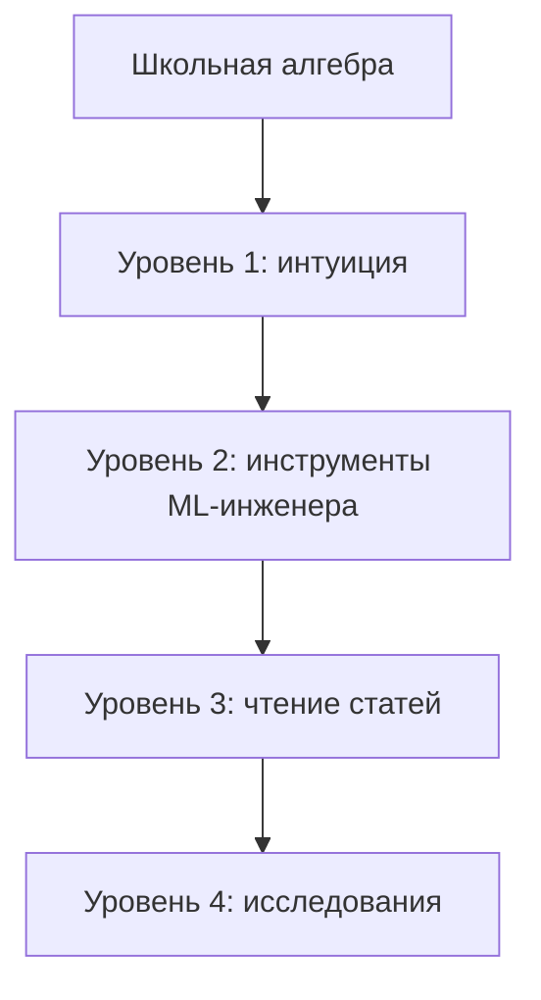

## Уровень 1 — интуиция (2–4 недели)
Цель: понимать, что происходит, на картинках.
- Модули 01, 02 (до SVD), 03, 06 этого курса.
- **3Blue1Brown** — «Essence of Linear Algebra», «Essence of Calculus», серия «Neural Networks» (backprop и трансформеры с анимацией). Лучшее, что есть для интуиции.
- **StatQuest (Josh Starmer)** — статистика и классический ML простыми словами.

## Уровень 2 — инструменты ML-инженера (1–2 месяца)
Цель: выводить градиенты, понимать оптимизаторы, лоссы и метрики, писать всё на NumPy.
- Модули 03–11 и весь [Практикум](#practice).
- **«Mathematics for Machine Learning»** — Deisenroth, Faisal, Ong (бесплатно на mml-book.github.io). Главный учебник именно под ML.
- **Andrej Karpathy — «Neural Networks: Zero to Hero»**: micrograd → makemore → GPT с нуля. Лучший практический курс по backprop и трансформерам.
- **«Dive into Deep Learning»** (d2l.ai) — теория + код, есть русский перевод.

## Уровень 3 — чтение статей (2–3 месяца)
Цель: свободно читать arXiv, понимать выводы.
- Модули 07, 08, 12, 13.
- **Gilbert Strang — MIT 18.06 Linear Algebra** и **18.065 Matrix Methods in Data Analysis and ML**.
- **«Deep Learning»** — Goodfellow, Bengio, Courville (главы 2–5 — математическая база).
- **«Probabilistic Machine Learning»** — Kevin Murphy (книги 1 и 2, бесплатно) — энциклопедия вероятностного ML, включая диффузию.
- **«Understanding Deep Learning»** — Simon Prince (2023, бесплатно) — современная, отличные иллюстрации.
- **The Annotated Transformer** (Harvard NLP), блог Lilian Weng — разборы диффузии, RLHF, attention.

## Уровень 4 — исследования
- **«Convex Optimization»** — Boyd & Vandenberghe (бесплатно) + курс Stanford EE364a.
- **«Pattern Recognition and Machine Learning»** — Bishop; **«The Elements of Statistical Learning»** — Hastie, Tibshirani, Friedman.
- **«Information Theory, Inference, and Learning Algorithms»** — David MacKay (бесплатно).
- Теория обучения: «Understanding Machine Learning» — Shalev-Shwartz & Ben-David.
- Курсы на русском: лекции ШАД (Яндекс) по ML и DL, курс К. В. Воронцова (MachineLearning.ru), Deep Learning School МФТИ.

## Как учить, чтобы осталось в голове
1. **Выводи руками.** Градиент, который ты вывел сам на бумаге, запоминается навсегда.
2. **Проверяй кодом.** Каждую формулу — численной проверкой в 5 строк.
3. **Рисуй.** Перерисуй картинки из [`scripts/make_figures.py`](scripts/make_figures.py), меняя параметры.
4. **Объясняй вслух.** Если не можешь объяснить формулу attention за 2 минуты — повтори модуль 11.
5. **Интервальное повторение:** шпаргалка и 100 вопросов — раз в неделю.

---

## 🤝 Как помочь проекту

- ⭐ Поставь звезду, если курс полезен.
- Нашёл ошибку в формуле или коде — открой Issue или Pull Request.
- Хочешь добавить модуль (RL, графовые сети, теория обучения) — пиши в Issues.

## 📄 Лицензия

MIT — используй, копируй, адаптируй со ссылкой на репозиторий.
