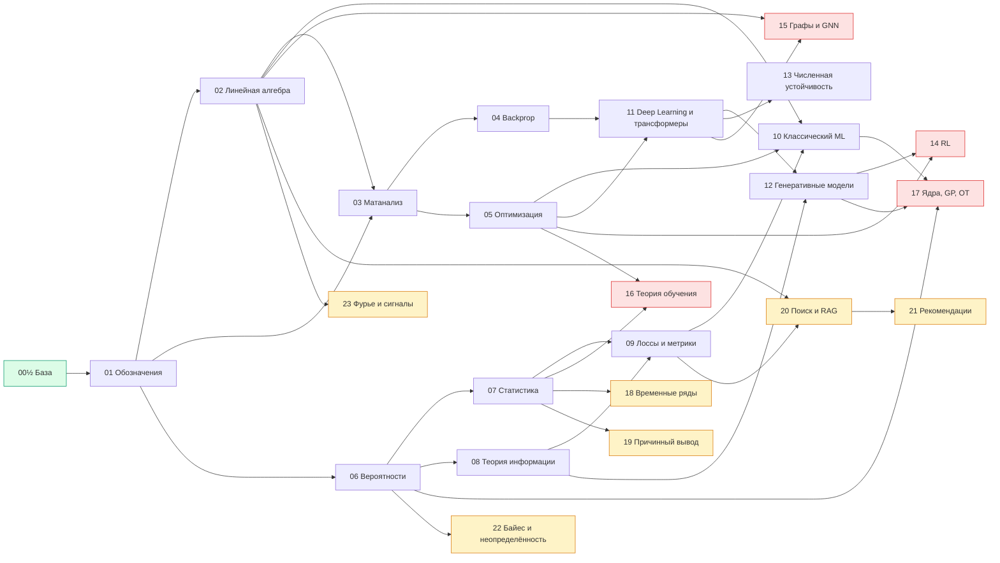
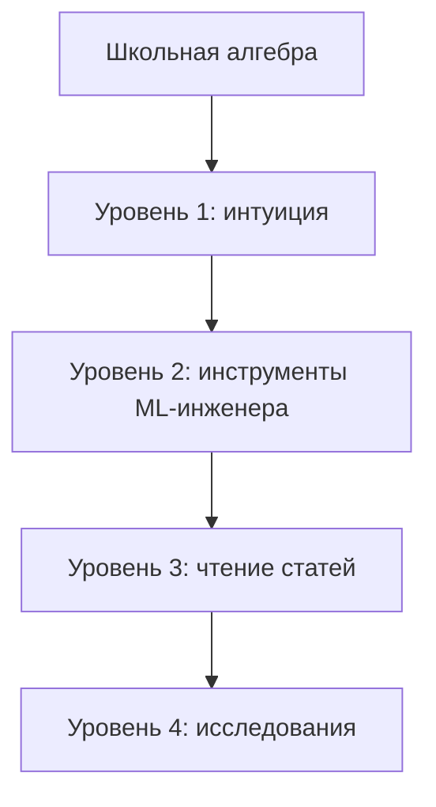

# 🧮 Математика для ИИ и ML 2026 — курс-шпаргалка

> Вся математика, которая реально нужна ML/AI-инженеру и Data Scientist'у, в одном репозитории:
> от школьной базы до продвинутых тем: линейная алгебра, анализ, оптимизация, вероятности, статистика, теория информации,
> математика трансформеров, диффузии и LLM, обучение с подкреплением, графы и GNN, теория обобщения, ядра и оптимальный транспорт,
> а также прикладные модули: временные ряды, причинный вывод, поиск и RAG, рекомендации, неопределённость, Фурье.
> Интуиция → формула → картинка → код на NumPy → задачи с собеседований.


[](https://github.com/justxor/math-for-ai-2026/actions/workflows/check.yml)


---

> 🎯 **Принцип курса:** никаких доказательств ради доказательств. Каждая тема отвечает на вопрос «где это в нейросети?» и проверяется кодом в 5–15 строк.
> Лучшие практики по работе [с ИИ структурировано и экспертно](https://t.me/+6PJjdym13jlmMzY6)
> 🏋️ В конце каждого модуля — блок **«Практика модуля»** с решениями под спойлером, в конце курса — [Практикум на 100 задач](PRACTICE.md#practice) и [рабочая тетрадь с автопроверкой](exercises/README.md) и [160 вопросов с собеседований](#questions).
> 📘 **Нет математической базы?** Начни с отдельного справочника [**BASICS.md — математика с нуля**](BASICS.md): 12 разделов от дробей и процентов до интегралов и матриц, 36 задач с ответами и входной тест.
> 🧭 Три уровня: 🟢 **база** (модуль 00½ и простые задачи), 🟡 **ядро** (модули 01–13), 🔴 **продвинутое** (модули 14–17 и задачи 51–60), 🧰 **прикладное** (модули 18–23). 30 иллюстраций и 25+ схем.

## 🚀 С чего начать

| Ваш уровень | Маршрут |
|-------------|---------|
| 🌱 Математику почти не помню | [BASICS.md](BASICS.md) → [00½](modules/00b_basics_short.md#m00b) → модули 01–06 → [задачи 41–50](PRACTICE.md#p-easy) |
| 🧑‍💻 Пишу код, готовлюсь к ML-собеседованию | [01–13](modules/01_notation.md#m01) по [плану на 3 недели](#m00) → [Практикум](PRACTICE.md#practice) → [160 вопросов](#questions) |
| 🧠 Работаю с LLM / DL | [02](modules/02_linear_algebra.md#m02), [03–05](modules/03_calculus.md#m03), [08](modules/08_information_theory.md#m08), [11–13](modules/11_deep_learning.md#m11) → [14 RL](modules/14_reinforcement_learning.md#m14), [20 RAG](modules/20_retrieval_rag.md#m20) |
| 📊 Data Scientist в продукте | [06–10](modules/06_probability.md#m06) → [18 ряды](modules/18_time_series.md#m18), [19 причинность](modules/19_causal_inference.md#m19), [22 неопределённость](modules/22_bayes_uncertainty.md#m22) |
| 🔬 Иду в research | всё по порядку + [14–17](modules/14_reinforcement_learning.md#m14) и [задачи 51–60](PRACTICE.md#p-adv) |

**Инструменты курса:**

| | Что | Зачем |
|---|-----|-------|
| 📓 | [26 Jupyter-ноутбуков](notebooks/README.md) с кнопкой «Open in Colab» | весь код курса и «лаборатории» с иллюстрациями — меняйте параметры и смотрите |
| ✍️ | [Рабочая тетрадь: 20 упражнений с автопроверкой](exercises/README.md) | пишете функцию — сразу видите ✅ или ❌ с подсказкой |
| 🏋️ | [Практикум: 100 задач](PRACTICE.md#practice) | разминка, продвинутые, «найди баг», оценки на салфетке, мини-проекты, собеседование |
| 📘 | [BASICS.md — математика с нуля](BASICS.md) | школьная база: 12 разделов, 36 задач |
| 📖 | [GLOSSARY.md — 162 термина RU ↔ EN](GLOSSARY.md) | читать статьи и документацию на английском |
| 🃏 | [Колода Anki: 160 вопросов + 45 формул](anki/README.md) | интервальное повторение, 15 минут в день |
| ✅ | [Автопроверка в GitHub Actions](.github/workflows/check.yml) | весь код курса запускается при каждом изменении |

## 📚 Оглавление

> Каждый модуль — отдельная страница в папке [`modules/`](modules/) со ссылками «← назад · оглавление · вперёд» сверху и снизу: так страницы быстро открываются и все формулы рендерятся на GitHub.

- [00. Как пользоваться курсом и что реально нужно знать](#m00)
- 📘 [**BASICS.md** — отдельный справочник «Математика с нуля» (12 разделов, 36 задач)](BASICS.md)
- 🟢 [00½. База для начинающих: школьная математика за вечер](modules/00b_basics_short.md#m00b)
- [01. Язык математики: обозначения, функции, логарифмы](modules/01_notation.md#m01)
- [02. Линейная алгебра](modules/02_linear_algebra.md#m02)
- [03. Матанализ: производные, градиенты, цепное правило](modules/03_calculus.md#m03)
- [04. Backpropagation и автодифференцирование](modules/04_backprop.md#m04)
- [05. Оптимизация: от градиентного спуска до AdamW](modules/05_optimization.md#m05)
- [06. Теория вероятностей](modules/06_probability.md#m06)
- [07. Статистика: оценки, MLE/MAP, A/B-тесты](modules/07_statistics.md#m07)
- [08. Теория информации: энтропия, кросс-энтропия, KL](modules/08_information_theory.md#m08)
- [09. Функции потерь и метрики](modules/09_losses_metrics.md#m09)
- [10. Математика классического ML](modules/10_classic_ml.md#m10)
- [11. Математика глубокого обучения и трансформеров](modules/11_deep_learning.md#m11)
- [12. Генеративные модели: VAE, GAN, диффузия, LLM](modules/12_generative.md#m12)
- [13. Численная устойчивость и форматы чисел](modules/13_numerics.md#m13)
- 🔴 [14. Математика обучения с подкреплением](modules/14_reinforcement_learning.md#m14)
- 🔴 [15. Графы, спектральная теория и GNN](modules/15_graphs_gnn.md#m15)
- 🔴 [16. Теория обучения и обобщение](modules/16_learning_theory.md#m16)
- 🔴 [17. Ядра, гауссовские процессы, оптимальный транспорт](modules/17_kernels_gp_ot.md#m17)
- 🧰 [18. Временные ряды и прогнозирование](modules/18_time_series.md#m18)
- 🧰 [19. Причинный вывод и эксперименты](modules/19_causal_inference.md#m19)
- 🧰 [20. Поиск, эмбеддинги и RAG](modules/20_retrieval_rag.md#m20)
- 🧰 [21. Рекомендательные системы](modules/21_recommender_systems.md#m21)
- 🧰 [22. Байесовские методы и неопределённость](modules/22_bayes_uncertainty.md#m22)
- 🧰 [23. Фурье, свёртки и обработка сигналов](modules/23_fourier_signals.md#m23)
- [🏋️ Практикум: 100 задач с решениями](PRACTICE.md#practice) · ✍️ [Рабочая тетрадь с автопроверкой](exercises/README.md)
- [⚡ Шпаргалка на одной странице](CHEATSHEET.md#cheatsheet)
- [❓ 160 вопросов с собеседований](#questions)
- [🗺️ Дорожная карта и лучшие источники](#roadmap)
- 📓 [Ноутбуки](notebooks/README.md) · 📖 [Глоссарий RU ↔ EN](GLOSSARY.md) · 🃏 [Колода Anki](anki/README.md)

## 🗺️ Карта курса



---

<a id="m00"></a>

# 00. Как пользоваться курсом и что реально нужно знать

## Сколько математики нужно — по ролям

| Роль | Минимум | Желательно | Можно пропустить |
|------|---------|-----------|------------------|
| ML-инженер (продакшн) | 01–05, 08, 09 | 06–07, 11, 13 | глубокую теорию 12 |
| Data Scientist / аналитик | 01, 02 (до PCA), 06–09 | 10, 05 | 11–12 |
| Deep Learning / LLM-инженер | 01–05, 08, 11, 13 | 06, 12 | A/B-тесты из 07 |
| RL / reasoning-модели | 01–06, 08, 11, 12, **14** | 07, 16 | 10 |
| Graph ML / рекомендации | 01–06, 10, **15** | 09, 17 | 12 |
| Новичок без математической базы | [**BASICS.md**](BASICS.md) → **00½** → 01–06 по порядку | простые задачи 41–50 | 14–17 до второго прохода |
| Data Scientist в продукте | 01, 06–10, **18, 19, 22** | 21 | 11–17 |
| Поиск / RAG / LLM-приложения | 01–02, 08–09, 11, **20** | 12, 22 | 14–16 |
| Рекомендации / e-commerce | 02, 05, 07–10, **20, 21, 19** | 14 (бандиты) | 12, 16 |
| Speech / сенсоры / IoT | 01–05, 11, **23, 18** | 22 | 10, 21 |
| Research Scientist | всё, включая **14–23** | + выпуклая оптимизация, теория меры | — |

> 💡 Правило 80/20: **матричное умножение, градиент + цепное правило, вероятность + логарифм** покрывают ~80% того, что происходит внутри любой нейросети.

## Как читать каждый модуль

1. **Интуиция** — одним абзацем, что это и зачем.
2. **Формула** — ровно в том виде, в каком она встречается в статьях.
3. **Картинка** — все иллюстрации генерируются скриптом [`scripts/make_figures.py`](scripts/make_figures.py), их можно перерисовать и покрутить параметры.
4. **Код** — NumPy/PyTorch, чтобы потрогать руками.
5. **🎯 На собеседовании** — как это спрашивают.
6. **🏋️ Практика модуля** — 2–3 задачи с решениями.

## План подготовки

### 🏃 3 недели (интенсив, ~2 часа в день)

| Дни | Модули |
|-----|--------|
| 1–2 | 01 Обозначения + 02 Линейная алгебра (векторы, матрицы) |
| 3–4 | 02: собственные числа, SVD, PCA |
| 5–6 | 03 Матанализ + 04 Backprop (руками!) |
| 7–8 | 05 Оптимизация |
| 9–10 | 06 Вероятности |
| 11–12 | 07 Статистика |
| 13 | 08 Теория информации |
| 14 | 09 Лоссы и метрики |
| 15–16 | 10 Классический ML |
| 17–18 | 11 Deep Learning и трансформеры |
| 19 | 12 Генеративные модели |
| 20 | 13 Численная устойчивость + шпаргалка |
| 21 | 160 вопросов вслух, мок-интервью |

### 🚶 8 недель (спокойно, с нуля)
Недели 0–2 — [BASICS.md](BASICS.md) (по разделу в день), затем модуль 00½ и задачи 41–50. Дальше тот же порядок, по 3–4 дня на модуль, плюс параллельно видео 3Blue1Brown (см. [дорожную карту](#roadmap)) и все задачи практикума.

### 🚀 +3 недели (продвинутый трек, после основного)

| Неделя | Модули | Практика |
|--------|--------|----------|
| 1 | 14 RL: Беллман, policy gradient, PPO/GRPO | задачи 55, 14.1–14.3 |
| 2 | 15 Графы и GNN + 16 Теория обучения | задачи 56–57, 15.x, 16.x |
| 3 | 17 Ядра, GP, OT + повтор 11–12 | задачи 51–54, 58–60 |

### 🧰 Прикладной трек (по одному модулю в 2–3 дня, в любом порядке)

| Если работа про… | Модули |
|------------------|--------|
| прогнозы спроса, нагрузки, финансы | 18 → 22 |
| продуктовую аналитику и эксперименты | 07 → 19 → 22 |
| RAG, поиск, LLM-приложения | 09 → 20 → 22 |
| рекомендации и маркетплейсы | 20 → 21 → 19 |
| речь, аудио, датчики | 23 → 18 |

## Установка окружения

```bash
python -m venv .venv && source .venv/bin/activate
pip install -r requirements.txt jupyter
python scripts/make_figures.py      # перерисовать все иллюстрации
```

## Чек-лист «я готов к ML-собеседованию по математике»

- [ ] Могу на бумаге перемножить матрицы и сказать размерности результата.
- [ ] Могу объяснить SVD и PCA на картинке.
- [ ] Могу вывести градиент логистической регрессии и softmax + cross-entropy.
- [ ] Могу посчитать backprop для двухслойной сети руками.
- [ ] Знаю, чем Adam отличается от SGD с momentum, и зачем AdamW.
- [ ] Могу применить формулу Байеса к задаче про тест на болезнь.
- [ ] Могу объяснить MLE и почему MSE = MLE при гауссовском шуме.
- [ ] Знаю, что такое KL-дивергенция и почему она несимметрична.
- [ ] Могу объяснить, зачем делить на √d в attention.
- [ ] Знаю, почему softmax считают через вычитание максимума.

## 📌 Лучшие ресурсы для подготовки

Telegram-каналы, которые удобно читать между модулями — коротко, по делу и с практикой:

| Канал | О чём |
|-------|-------|
| 🧠 [Machine Learning](https://t.me/+IikNImh3FuNmM2Ji) | Практическое применение AI: генерация кода и баз данных, всё, что нужно знать об ИИ |
| 🖥 [DevOps Academy](https://t.me/+7HWlD5t-Zqw2YjMy) | Сложные концепции DevOps на понятных схемах и в коротких видео — пригодится для MLOps |
| 🐳 [Docker](https://t.me/+WGQi6w2QiiE4MGMy) | Фишки и приёмы работы с контейнерами — упаковка моделей и окружений |
| ⚡️ [Kali Linux](https://t.me/+jnI7_NwRnd0zY2Yy) | Информационная безопасность и этичный хакинг с нуля |
| 🐹 [Golang](https://t.me/+mACTfs56f6g5YjBi) · [ещё о Go](https://t.me/+VBSfUDFUflE2M2E6) | Разработка на Go и высоконагруженные сервисы — инференс в продакшене |

> 🔥 Всё сразу — в [папке лучших ресурсов](https://t.me/addlist/VWTKxdkpYBcxYzNi): подпишись одним кликом и прокачай уровень до следующего грейда.

---

<a id="questions"></a>

# ❓ 160 вопросов с собеседований

> 🟢 Junior · 🟡 Middle · 🔴 Senior/Research. Сначала ответь вслух, потом раскрой ответ.

## 📐 Линейная алгебра (1–18)

<details><summary>1. 🟢 Что такое скалярное произведение и его геометрический смысл?</summary>Сумма покомпонентных произведений = |a|·|b|·cos θ. Показывает, насколько векторы сонаправлены; 0 — ортогональны.</details>
<details><summary>2. 🟢 Правило размерностей при умножении матриц?</summary>(m×k)·(k×n) → (m×n): внутренние размерности совпадают, внешние остаются.</details>
<details><summary>3. 🟢 Почему AB ≠ BA?</summary>Композиция преобразований зависит от порядка (сначала повернуть, потом растянуть ≠ наоборот). Размерности могут даже не позволить обратное произведение.</details>
<details><summary>4. 🟢 Что такое ранг матрицы?</summary>Число линейно независимых столбцов (строк) = размерность образа преобразования.</details>
<details><summary>5. 🟢 Что такое L1 и L2 нормы, где используются?</summary>L1 — сумма модулей (Lasso, разреженность), L2 — евклидова длина (Ridge, weight decay, расстояния).</details>
<details><summary>6. 🟡 Что такое собственные числа и векторы?</summary>Av = λv: направления, которые преобразование только растягивает (в λ раз), не поворачивая.</details>
<details><summary>7. 🟡 Чем SVD отличается от собственного разложения?</summary>SVD существует для любой (прямоугольной) матрицы, сингулярные числа ≥ 0, U и V разные ортогональные. Собственное — только для квадратных, может быть комплексным; для симметричной ПП-матрицы они совпадают.</details>
<details><summary>8. 🟡 Опиши алгоритм PCA.</summary>Центрировать (и обычно стандартизировать) → SVD или собственные векторы ковариации → взять k компонент с наибольшей дисперсией → спроецировать.</details>
<details><summary>9. 🟡 Как выбрать число компонент в PCA?</summary>По доле объяснённой дисперсии (например, 95%), по «локтю» на графике сингулярных чисел или по качеству downstream-задачи.</details>
<details><summary>10. 🟡 Что такое определитель и что значит det = 0?</summary>Коэффициент изменения объёма. det = 0 — пространство сплющивается в меньшую размерность, матрица необратима.</details>
<details><summary>11. 🟡 Почему не считают inv(A) @ b?</summary>Медленнее и численно хуже, чем решение системы (solve, LU/Cholesky/QR).</details>
<details><summary>12. 🟡 Что такое положительно определённая матрица и где встречается?</summary>xᵀAx > 0 для всех x ≠ 0; все собственные числа > 0. Ковариации, гессиан в строгом минимуме, ядра.</details>
<details><summary>13. 🟡 Что такое число обусловленности и как оно влияет на обучение?</summary>κ = σmax/σmin. Большое κ — вытянутые долины лосса, медленный GD, чувствительность к ошибкам округления.</details>
<details><summary>14. 🟡 Как работает LoRA с точки зрения линейной алгебры?</summary>Обновление весов параметризуется как произведение BA низкого ранга r; обучаются r(d+k) параметров. B инициализируется нулями.</details>
<details><summary>15. 🔴 Теорема Эккарта–Янга?</summary>Лучшее приближение матрицы рангом k по норме Фробениуса (и спектральной) — усечённое SVD с k крупнейшими сингулярными числами.</details>
<details><summary>16. 🔴 Что такое ортогональная матрица и почему её используют для инициализации?</summary>QᵀQ = I, сохраняет нормы → сигнал и градиенты не затухают/не взрываются в глубоких линейных цепочках и RNN.</details>
<details><summary>17. 🔴 Как быстро найти наибольшее собственное число огромной матрицы?</summary>Степенной метод / Ланцош: нужны только умножения на вектор. Так считают спектральную норму в spectral norm и наибольшее собственное число гессиана.</details>
<details><summary>18. 🔴 Что такое einsum и как записать batched attention scores?</summary>Нотация Эйнштейна для тензорных свёрток: einsum('bhtd,bhsd->bhts', Q, K).</details>

## 📈 Анализ и backprop (19–32)

<details><summary>19. 🟢 Что такое градиент?</summary>Вектор частных производных; указывает направление наискорейшего роста функции.</details>
<details><summary>20. 🟢 Производная сигмоиды?</summary>σ(x)(1 − σ(x)), максимум 0.25 в нуле.</details>
<details><summary>21. 🟢 Что такое цепное правило?</summary>(f∘g)′(x) = f′(g(x))·g′(x); для многомерных — произведение якобианов. Основа backprop.</details>
<details><summary>22. 🟡 Выведи градиент логистической регрессии.</summary>∂L/∂z = ŷ − y, ∇w = (ŷ − y)·x; для батча Xᵀ(σ(Xw) − y)/N.</details>
<details><summary>23. 🟡 Выведи градиент softmax + cross-entropy по логитам.</summary>p − y (one-hot). Вывод через якобиан softmax diag(p) − ppᵀ.</details>
<details><summary>24. 🟡 Что такое якобиан и гессиан?</summary>Якобиан — матрица первых производных векторной функции; гессиан — матрица вторых производных скалярной (кривизна).</details>
<details><summary>25. 🟡 Объясни backprop.</summary>Forward с сохранением промежуточных значений; backward от лосса: каждый узел умножает входящий градиент на локальную производную и передаёт входам; при ветвлении градиенты суммируются.</details>
<details><summary>26. 🟡 Почему reverse mode autodiff эффективнее forward для обучения?</summary>Один скалярный выход и миллионы параметров: reverse даёт все градиенты за один обратный проход.</details>
<details><summary>27. 🟡 Что такое затухание/взрыв градиентов и как бороться?</summary>Произведение многих якобианов → 0 или ∞. ReLU/GELU, правильная инициализация, нормализации, residual, clipping, LSTM/attention.</details>
<details><summary>28. 🟡 Как проверить правильность реализованного градиента?</summary>Численная центральная разность (f(x+h) − f(x−h))/2h, относительная ошибка < 1e-7 в float64.</details>
<details><summary>29. 🟡 Что такое седловая точка?</summary>Градиент 0, гессиан имеет собственные числа разных знаков. В высокой размерности их гораздо больше, чем локальных минимумов.</details>
<details><summary>30. 🔴 Почему не используют метод Ньютона в DL?</summary>O(n²) памяти и O(n³) на обращение гессиана; гессиан невыпуклой задачи не ПО и тянет к седловым. Используют диагональные/блочные приближения (Adam, Shampoo, K-FAC).</details>
<details><summary>31. 🔴 Что такое gradient checkpointing?</summary>Хранить активации только части слоёв, остальные пересчитывать на backward: память O(√L) вместо O(L) ценой ~+30% вычислений.</details>
<details><summary>32. 🔴 Как сделать backprop через дискретную операцию (argmax, сэмплирование)?</summary>Straight-through estimator, Gumbel-softmax, REINFORCE (score function estimator), репараметризация для непрерывных распределений.</details>

## ⛰️ Оптимизация (33–46)

<details><summary>33. 🟢 Формула градиентного спуска?</summary>θ ← θ − η∇L(θ).</details>
<details><summary>34. 🟢 Что будет при слишком большом/маленьком learning rate?</summary>Большой — осцилляции и расходимость (NaN). Маленький — медленно, застревание.</details>
<details><summary>35. 🟢 Чем SGD отличается от GD?</summary>Градиент по мини-батчу — несмещённая шумная оценка; гораздо больше шагов за эпоху, шум помогает обобщению.</details>
<details><summary>36. 🟡 Как работает momentum?</summary>Экспоненциальное среднее градиентов: ускорение вдоль устойчивого направления, гашение осцилляций поперёк.</details>
<details><summary>37. 🟡 Опиши Adam.</summary>EMA градиента (m) и квадрата (v), коррекция смещения, шаг η·m̂/(√v̂ + ε). Покоординатный адаптивный масштаб.</details>
<details><summary>38. 🟡 Adam vs AdamW?</summary>В AdamW weight decay применяется к весам напрямую, а не через градиент, который делится на √v. Регуляризация становится равномерной.</details>
<details><summary>39. 🟡 Зачем warmup?</summary>В начале оценки моментов Adam шумные, веса случайные, градиенты большие — маленький LR предотвращает расходимость.</details>
<details><summary>40. 🟡 Что такое выпуклая функция и почему это важно?</summary>Отрезок между точками графика не ниже графика; любой локальный минимум глобальный, GD гарантированно сходится.</details>
<details><summary>41. 🟡 L1 vs L2 регуляризация?</summary>L1 даёт разреженные веса (углы ромба), L2 — маленькие ненулевые. Байесовски: Лаплас vs Гаусс.</details>
<details><summary>42. 🟡 Как размер батча связан с learning rate?</summary>Линейное правило: батч ×k → LR ×k (для SGD), с warmup; для Adam ближе к √k. После критического батча выигрыш пропадает.</details>
<details><summary>43. 🔴 Почему нейросети обучаются, хотя лосс невыпуклый?</summary>Большинство критических точек — седловые; найденные SGD минимумы имеют близкий лосс; перепараметризация упрощает ландшафт; шум SGD предпочитает плоские минимумы.</details>
<details><summary>44. 🔴 Что такое множители Лагранжа и ККТ?</summary>Условия оптимума при ограничениях: ∇f = λ∇g; для неравенств — ККТ (дополняющая нежёсткость). Вывод SVM, PCA, max-entropy.</details>
<details><summary>45. 🔴 Острые vs плоские минимумы?</summary>Плоские устойчивее к сдвигу параметров и обычно лучше обобщают; малый батч и большой LR смещают к плоским; SAM явно ищет плоские.</details>
<details><summary>46. 🔴 Зачем сохранять состояние оптимизатора в чекпойнте?</summary>m и v Adam — часть траектории; рестарт без них даёт скачок лосса. Это 2× размер модели в FP32.</details>

## 🎲 Вероятности (47–60)

<details><summary>47. 🟢 Формула Байеса?</summary>P(A|B) = P(B|A)P(A)/P(B).</details>
<details><summary>48. 🟢 Тест 99% чувствительности, 5% ложных срабатываний, болезнь у 1%. P(болен | +)?</summary>0.0099/(0.0099 + 0.0495) ≈ 16.7%.</details>
<details><summary>49. 🟢 Матожидание и дисперсия?</summary>E[X] — среднее по распределению; Var = E[(X − EX)²] = E[X²] − (EX)².</details>
<details><summary>50. 🟢 Независимость vs некоррелированность?</summary>Независимость ⇒ ρ = 0, но не наоборот (Y = X² при симметричном X).</details>
<details><summary>51. 🟡 Какие распределения знаешь и где они в ML?</summary>Бернулли/категориальное — выходы классификаторов; нормальное — шум, VAE, диффузия; Пуассон — счётчики; Бета/Дирихле — априоры.</details>
<details><summary>52. 🟡 Что такое ЦПТ и где применяется?</summary>Среднее многих независимых величин ≈ нормальное с дисперсией σ²/n. Доверительные интервалы, A/B-тесты, шум градиента.</details>
<details><summary>53. 🟡 Что такое условная независимость и где она используется?</summary>p(x, y | z) = p(x|z)p(y|z). Наивный Байес, графические модели, марковское свойство.</details>
<details><summary>54. 🟡 Как выводится He-инициализация?</summary>Var[z] = n·Var[w]·E[x²]; ReLU обнуляет половину → Var[w] = 2/n сохраняет масштаб.</details>
<details><summary>55. 🟡 Что такое reparameterization trick?</summary>z = μ + σ·ε, ε ~ N(0,1): случайность не зависит от параметров, градиент проходит через μ и σ.</details>
<details><summary>56. 🟡 Как сэмплировать из категориального распределения?</summary>Обратная CDF (cumsum + бинарный поиск по u ~ U(0,1)) или Gumbel-max: argmax(log p + g).</details>
<details><summary>57. 🟡 Что такое importance sampling?</summary>E_p[f] = E_q[f·p/q]: оценка по сэмплам из другого распределения. PPO, off-policy RL, оценка правдоподобия.</details>
<details><summary>58. 🔴 Многомерное нормальное: связь ковариации с формой?</summary>Линии уровня — эллипсы с осями вдоль собственных векторов Σ и полуосями ∝ √λ.</details>
<details><summary>59. 🔴 Что такое MCMC и зачем?</summary>Цепь Маркова со стационарным распределением = целевому; сэмплирование из ненормированных плотностей (байесовский апостериор).</details>
<details><summary>60. 🔴 Ожидаемое число бросков до двух шестёрок подряд?</summary>42 (система уравнений на состояния).</details>

## 📊 Статистика (61–72)

<details><summary>61. 🟢 Что такое MLE?</summary>Параметры, максимизирующие вероятность наблюдённых данных; эквивалентно минимизации NLL.</details>
<details><summary>62. 🟢 Почему MSE соответствует гауссовскому шуму?</summary>NLL нормального распределения = сумма квадратов ошибок / 2σ² + константа.</details>
<details><summary>63. 🟡 MLE vs MAP?</summary>MAP добавляет log-априор; гауссовский априор = L2, лапласовский = L1.</details>
<details><summary>64. 🟡 Что такое bias–variance tradeoff?</summary>Ошибка = bias² + variance + шум. Простые модели — высокий bias, сложные — высокая variance.</details>
<details><summary>65. 🟡 Что такое p-value?</summary>Вероятность получить данные не менее экстремальные при верной H0. Не вероятность того, что H0 верна.</details>
<details><summary>66. 🟡 Ошибки I и II рода?</summary>I — ложное отвержение H0 (α); II — пропуск реального эффекта (β); мощность = 1 − β.</details>
<details><summary>67. 🟡 Как рассчитать размер выборки для A/B?</summary>n ≈ 2(z₁₋α/₂ + z₁₋β)²·p(1−p)/δ² ≈ 16p(1−p)/δ² на группу при α = 0.05, мощности 80%.</details>
<details><summary>68. 🟡 Что такое бутстрап?</summary>Пересэмплирование с возвращением для оценки распределения статистики и доверительных интервалов без формул.</details>
<details><summary>69. 🔴 Проблема подглядывания в A/B-тестах?</summary>Многократные проверки раздувают ошибку I рода (до ~20–30%). Фиксированный горизонт, последовательные тесты (SPRT, alpha spending), байесовский подход.</details>
<details><summary>70. 🔴 Как сравнить две модели на одном тест-сете?</summary>Парные тесты: Макнемар для accuracy, парный бутстрап для любых метрик.</details>
<details><summary>71. 🔴 Что такое double descent?</summary>Test-ошибка падает снова после порога интерполяции при дальнейшем росте числа параметров.</details>
<details><summary>72. 🔴 Множественные сравнения: Бонферрони vs BH?</summary>Бонферрони контролирует вероятность хотя бы одной ложной находки (консервативно); BH контролирует ожидаемую долю ложных среди найденных (FDR).</details>

## 🔤 Информация, лоссы и метрики (73–84)

<details><summary>73. 🟢 Что такое энтропия?</summary>Средняя неожиданность −Σp log p; мера неопределённости; максимальна у равномерного распределения.</details>
<details><summary>74. 🟢 Precision vs recall?</summary>Precision — доля правильных среди предсказанных позитивов; recall — доля найденных среди реальных позитивов.</details>
<details><summary>75. 🟢 Почему accuracy плоха при дисбалансе?</summary>Константный ответ «мажоритарный класс» даёт высокую accuracy при нулевой полезности.</details>
<details><summary>76. 🟡 Связь CE, KL и энтропии?</summary>H(P, Q) = H(P) + KL(P‖Q). Минимизация CE по модели = минимизация KL = MLE.</details>
<details><summary>77. 🟡 Почему KL несимметрична, и что из этого следует?</summary>Forward KL накрывает все моды (размазывает), reverse — выбирает одну (острее). Разное поведение в MLE и VI.</details>
<details><summary>78. 🟡 Что такое perplexity?</summary>exp(среднего CE) — эффективное число равновероятных вариантов следующего токена.</details>
<details><summary>79. 🟡 Что означает ROC-AUC?</summary>Вероятность того, что случайный позитив получит скор выше случайного негатива; не зависит от порога.</details>
<details><summary>80. 🟡 Почему CE, а не MSE для классификации?</summary>CE — NLL категориального распределения, градиент p − y не затухает при уверенной ошибке; MSE с сигмоидой насыщается.</details>
<details><summary>81. 🟡 MSE vs MAE vs Huber?</summary>Среднее vs медиана; MSE чувствителен к выбросам; Huber квадратичен у нуля и линеен на хвостах.</details>
<details><summary>82. 🔴 Что такое калибровка и как её улучшить?</summary>Совпадение предсказанных вероятностей с частотами. ECE, reliability diagram; temperature scaling, Platt, изотоническая регрессия.</details>
<details><summary>83. 🔴 Что такое InfoNCE и как он связан с взаимной информацией?</summary>CE по выбору правильной пары среди N кандидатов; log N − InfoNCE — нижняя оценка MI. CLIP, SimCLR, эмбеддинги.</details>
<details><summary>84. 🔴 Зачем label smoothing?</summary>Цель (1−ε)y + ε/K не даёт логитам уходить в бесконечность, снижает переуверенность, улучшает калибровку.</details>

## 🧠 Модели, DL и генеративные (85–100)

<details><summary>85. 🟢 Зачем нелинейные активации?</summary>Композиция линейных слоёв — линейна; нелинейность даёт выразительность.</details>
<details><summary>86. 🟢 Как посчитать выход свёртки?</summary>⌊(H + 2P − K)/S⌋ + 1.</details>
<details><summary>87. 🟡 Нормальное уравнение линейной регрессии?</summary>w = (XᵀX)⁻¹Xᵀy; на практике lstsq/QR; Ridge добавляет λI.</details>
<details><summary>88. 🟡 Что такое ядровой трюк?</summary>Замена скалярных произведений на ядро K(x, x′) = ⟨φ(x), φ(x′)⟩ без явного построения φ.</details>
<details><summary>89. 🟡 Bagging vs boosting?</summary>Bagging — параллельно на бутстрап-выборках, снижает variance; boosting — последовательно по антиградиенту лосса, снижает bias.</details>
<details><summary>90. 🟡 BatchNorm vs LayerNorm?</summary>BN нормирует по батчу для каждого канала (CNN, зависит от батча); LN — по признакам одного примера (трансформеры).</details>
<details><summary>91. 🟡 Формула attention и зачем √d?</summary>softmax(QKᵀ/√d)V; без деления дисперсия скоров = d, softmax насыщается, градиенты исчезают.</details>
<details><summary>92. 🟡 Сложность self-attention?</summary>O(T²d) по времени, O(T²) памяти на матрицу (FlashAttention убирает материализацию).</details>
<details><summary>93. 🟡 Что такое dropout и почему делят на 1 − p?</summary>Случайное зануление нейронов; деление сохраняет матожидание, чтобы на инференсе ничего не менять.</details>
<details><summary>94. 🔴 Как работает RoPE?</summary>Поворот пар координат q и k на угол, пропорциональный позиции; скалярное произведение зависит только от относительного сдвига.</details>
<details><summary>95. 🔴 Сколько параметров у трансформера и FLOPs на обучение?</summary>≈ 12Ld² + Vd; обучение ≈ 6·N·D FLOP.</details>
<details><summary>96. 🔴 Что такое ELBO?</summary>E_q[log p(x|z)] − KL(q(z|x)‖p(z)) ≤ log p(x); разрыв = KL до истинного апостериорного.</details>
<details><summary>97. 🔴 Что учит диффузионная модель?</summary>Предсказывает шум ε в зашумлённом xₜ (MSE); эквивалентно оценке score ∇log p(xₜ).</details>
<details><summary>98. 🔴 Classifier-free guidance?</summary>ε̃ = ε(x, ∅) + w(ε(x, c) − ε(x, ∅)): экстраполяция к условному предсказанию, w ≈ 3–8.</details>
<details><summary>99. 🔴 DPO vs RLHF?</summary>Та же KL-регуляризованная цель; DPO использует закрытое решение и оптимизирует логистический лосс на парах без reward model и RL.</details>
<details><summary>100. 🔴 Почему softmax считают через вычитание максимума, а лоссы — из логитов?</summary>Избежать переполнения exp и log(0); результат математически тот же, а log-softmax и BCEWithLogits объединяют операции стабильно.</details>

## 🟢 База для начинающих (101–110)

<details><summary>101. 🟢 Что такое функция в терминах ML?</summary>Правило «вход → выход». Модель — функция с параметрами: f(x; θ) → предсказание. Обучение подбирает θ.</details>
<details><summary>102. 🟢 Что показывает производная?</summary>Наклон касательной: насколько изменится выход при маленьком изменении входа. f′ = 0 — вершина или впадина.</details>
<details><summary>103. 🟢 Чем медиана лучше среднего?</summary>Устойчива к выбросам. Для задержек, зарплат и цен медиана и перцентили информативнее среднего.</details>
<details><summary>104. 🟢 Что такое логарифм и зачем он в лоссах?</summary>Показатель степени: log₂8 = 3. Превращает произведения в суммы и маленькие вероятности — в большие штрафы (−log p).</details>
<details><summary>105. 🟢 Что такое вектор признаков?</summary>Список чисел, описывающий объект: рост, вес, возраст или 4096 чисел эмбеддинга слова.</details>
<details><summary>106. 🟢 Зачем нормализовать признаки?</summary>Чтобы признаки с большими числами не доминировали в расстояниях и регуляризации и чтобы градиентный спуск сходился быстрее.</details>
<details><summary>107. 🟢 Что такое переобучение простыми словами?</summary>Модель запомнила обучающие примеры вместе с шумом и плохо работает на новых: ошибка на train низкая, на val — высокая.</details>
<details><summary>108. 🟢 Train / validation / test — зачем три выборки?</summary>Train — учить, validation — выбирать гиперпараметры и модель, test — один раз честно оценить итог.</details>
<details><summary>109. 🟢 Вероятность хотя бы одного успеха в n независимых попытках?</summary>1 − (1 − p)ⁿ.</details>
<details><summary>110. 🟢 Сколько памяти занимает модель на 7B параметров в FP16?</summary>7·10⁹ × 2 байта ≈ 14 ГБ (только веса, без KV-кэша и активаций).</details>

## 🚀 Продвинутые темы (111–130)

<details><summary>111. 🔴 Запиши уравнение Беллмана для V^π.</summary>V(s) = Σₐ π(a|s) Σₛ′ P(s′|s,a)[R(s,a) + γV(s′)]. Оператор — сжатие с коэффициентом γ, поэтому итерации сходятся.</details>
<details><summary>112. 🔴 Что такое advantage и зачем он?</summary>A(s,a) = Q(s,a) − V(s): насколько действие лучше среднего. Снижает дисперсию policy gradient; в GRPO — нормированная награда внутри группы ответов.</details>
<details><summary>113. 🔴 Выведи log-derivative trick.</summary>∇θ E_π[f] = Σ f ∇π = Σ f π ∇log π = E_π[f ∇log π].</details>
<details><summary>114. 🔴 On-policy vs off-policy?</summary>On-policy (PPO) учится на данных текущей политики; off-policy (Q-learning, DQN) — на любых, например из replay buffer.</details>
<details><summary>115. 🔴 Explore vs exploit: UCB и Thompson sampling?</summary>UCB — выбирать максимум «среднее + бонус за неопределённость»; Thompson — сэмплировать параметры из апостериорного и брать лучший. Оба дают логарифмический регрет.</details>
<details><summary>116. 🔴 Что такое лапласиан графа и его ключевые свойства?</summary>L = D − A, симметричный ПП; xᵀLx = Σ(xᵢ − xⱼ)² по рёбрам; число нулевых собственных чисел = числу компонент связности.</details>
<details><summary>117. 🔴 Что такое over-smoothing в GNN?</summary>С ростом числа слоёв признаки вершин усредняются и становятся одинаковыми; лечат residual, нормализациями, меньшей глубиной.</details>
<details><summary>118. 🔴 Как трансформер связан с GNN?</summary>Self-attention — message passing на полном графе токенов с обучаемыми весами рёбер (attention).</details>
<details><summary>119. 🔴 Что такое VC-размерность?</summary>Максимальное число точек, которые класс моделей может разметить всеми 2ⁿ способами. Для линейных классификаторов в ℝᵈ — d + 1.</details>
<details><summary>120. 🔴 Неравенство Хёфдинга — что даёт?</summary>P(|выборочное среднее − истинное| > ε) ≤ 2e^(−2nε²): сколько данных нужно для надёжной оценки метрики.</details>
<details><summary>121. 🔴 Почему GD из нуля находит решение минимальной нормы в линейной регрессии?</summary>Все обновления Xᵀ(·) лежат в пространстве строк X; единственное интерполирующее решение в нём — X⁺y.</details>
<details><summary>122. 🔴 Что говорят законы масштабирования?</summary>Лосс падает степенным образом от параметров, данных и вычислений; при фиксированном бюджете оптимально растить N и D примерно пропорционально (~20 токенов на параметр по Chinchilla).</details>
<details><summary>123. 🔴 Что такое μP?</summary>Параметризация, при которой оптимальные гиперпараметры (LR, init) переносятся с маленькой модели на широкую без перебора.</details>
<details><summary>124. 🔴 Условие Мерсера и теорема о представителе?</summary>Ядро ⇔ матрица Грама ПП; решение регуляризованной задачи в RKHS — линейная комбинация k(xᵢ, ·) по обучающим точкам.</details>
<details><summary>125. 🔴 Что такое гауссовский процесс и где он полезен?</summary>Распределение над функциями с ядерной ковариацией; даёт предсказание с неопределённостью — основа байесовской оптимизации гиперпараметров.</details>
<details><summary>126. 🔴 Что такое расстояние Вассерштейна и почему WGAN стабильнее?</summary>Минимальная «стоимость перевозки» массы P в Q; меняется плавно даже для непересекающихся распределений, где JS постоянна и градиента нет.</details>
<details><summary>127. 🔴 Что такое FID?</summary>W₂ между гауссианами, подогнанными к Inception-признакам реальных и сгенерированных изображений: ‖μ₁−μ₂‖² + tr(Σ₁ + Σ₂ − 2(Σ₁Σ₂)^½).</details>
<details><summary>128. 🔴 Почему FlashAttention быстрее при том же числе FLOP?</summary>Attention ограничен пропускной способностью памяти; блочный расчёт в SRAM с онлайн-softmax не записывает матрицу T×T в HBM.</details>
<details><summary>129. 🔴 Чем опасны выбросы при квантизации и как с ними борются?</summary>Один выброс растягивает масштаб и огрубляет сетку для всех значений; поканальная/групповая квантизация, AWQ, SmoothQuant, вращения (QuaRot).</details>
<details><summary>130. 🔴 Как оценить константу Липшица сети?</summary>Сверху произведением спектральных норм слоёв (активации 1-липшицевы); spectral normalization делает каждую норму ≤ 1.</details>

## 🧰 Прикладные темы (131–160)

<details><summary>131. 🟡 Почему для временных рядов нельзя случайный K-fold?</summary>Модель увидит будущее при обучении; нужна валидация по времени (expanding/rolling window).</details>
<details><summary>132. 🟡 Что такое стационарность и как её добиться?</summary>Среднее, дисперсия и автокорреляции не меняются во времени; разности, сезонные разности, логарифм.</details>
<details><summary>133. 🟡 Что показывает ACF?</summary>Корреляцию ряда с собой на лаге k: память ряда и сезонность (пики на лагах периода).</details>
<details><summary>134. 🟡 Какой бейзлайн для прогноза?</summary>Сезонный наивный: значение того же часа сутки/неделю назад. MASE < 1 — модель лучше него.</details>
<details><summary>135. 🟡 Чем плох MAPE и что вместо него?</summary>Взрывается при y ≈ 0 и асимметричен; WAPE, MASE, квантильные метрики.</details>
<details><summary>136. 🔴 Как прогнозировать тысячи рядов?</summary>Глобальная модель (бустинг или нейросеть) на лагах, окнах и календарных признаках по всем рядам; иерархическое согласование прогнозов.</details>
<details><summary>137. 🟡 Приведи пример корреляции без причинности.</summary>Мороженое и утопления (общая причина — жара); парадокс Симпсона; обратная причинность.</details>
<details><summary>138. 🟡 Конфаундер, медиатор, коллайдер — что контролировать?</summary>Конфаундер — да; медиатор — нет, если нужен полный эффект; коллайдер — нет (контроль создаёт ложную связь).</details>
<details><summary>139. 🟡 Что такое ATE и почему его нельзя посчитать напрямую?</summary>E[Y(1) − Y(0)]; у объекта наблюдается только один потенциальный исход.</details>
<details><summary>140. 🔴 Как оценить эффект без A/B-теста?</summary>DiD (параллельные тренды), propensity score/IPW (нет скрытых конфаундеров), RDD (порог), IV (валидный инструмент), synthetic control.</details>
<details><summary>141. 🔴 Чем uplift-модель отличается от модели отклика?</summary>Предсказывает разницу вероятностей с воздействием и без; цель — «убеждаемые», а не те, кто купит и так.</details>
<details><summary>142. 🟡 Как работает BM25?</summary>IDF × насыщающаяся частота термина с нормировкой на длину документа (k₁, b).</details>
<details><summary>143. 🟡 Плотный vs лексический поиск — когда что?</summary>Эмбеддинги ловят смысл и перефразы, BM25 — точные термины и коды; гибрид + RRF обычно лучше.</details>
<details><summary>144. 🔴 Как устроены IVF-PQ и HNSW?</summary>IVF — k-means на кластеры и поиск в ближайших; PQ — сжатие кусков вектора в коды центроидов; HNSW — многоуровневый граф с жадным спуском.</details>
<details><summary>145. 🟡 Зачем реранкер в RAG?</summary>Cross-encoder точнее bi-encoder, но дорог — применяют к топ-50–200 кандидатам.</details>
<details><summary>146. 🔴 Как оценить RAG-систему?</summary>Ретривер: recall@k, MRR, NDCG на размеченных парах; генерация: опора на контекст, фактологичность, полнота; плюс онлайн-метрики.</details>
<details><summary>147. 🟡 Что такое матричная факторизация в рекомендациях?</summary>R ≈ PQᵀ по наблюдаемым элементам с регуляризацией; ALS или SGD.</details>
<details><summary>148. 🟡 Explicit vs implicit feedback?</summary>Оценки vs клики и просмотры; отсутствие взаимодействия — не негатив, нужен вес доверия (iALS).</details>
<details><summary>149. 🔴 Two-tower: как обучать и в чём ограничение?</summary>Softmax/InfoNCE с negative sampling и logQ-коррекцией; взаимодействие признаков только через скалярное произведение.</details>
<details><summary>150. 🟡 Как посчитать NDCG@k?</summary>DCG = Σ(2^rel − 1)/log₂(i + 1), делённый на DCG идеального порядка.</details>
<details><summary>151. 🔴 Почему офлайн-метрики рекомендаций расходятся с онлайн?</summary>Смещение экспозиции: логи порождены старой системой; нужны IPS-коррекция, off-policy оценка и A/B.</details>
<details><summary>152. 🟡 Алеаторная vs эпистемическая неопределённость?</summary>Шум данных (не уменьшается) vs незнание модели (уменьшается с данными, растёт вне обучающего распределения).</details>
<details><summary>153. 🟡 Что такое сопряжённый априор?</summary>Апостериор из того же семейства: Beta + Бернулли → Beta с добавленными успехами и неудачами.</details>
<details><summary>154. 🔴 Как получить неопределённость от нейросети?</summary>Глубокие ансамбли, MC-dropout, предсказание σ(x) с гауссовским NLL, Laplace approximation; калибровка поверх.</details>
<details><summary>155. 🔴 Что гарантирует conformal prediction?</summary>Покрытие не ниже 1 − α для любой модели при обмениваемости данных; интервал из квантиля ошибок на калибровке.</details>
<details><summary>156. 🟡 Байесовский A/B-тест — что даёт?</summary>P(B лучше A) и распределение эффекта напрямую из апостериоров Beta.</details>
<details><summary>157. 🟡 Что делает FFT и какая сложность?</summary>Раскладывает сигнал на частоты; O(N log N) вместо O(N²).</details>
<details><summary>158. 🟡 Теорема о свёртке?</summary>Свёртка во времени = поэлементное умножение спектров; быстрая фильтрация и длинные свёртки.</details>
<details><summary>159. 🟡 Что такое частота Найквиста и алиасинг?</summary>Различимы частоты до f_s/2; выше — «отражаются» в низкие; перед даунсэмплингом нужен фильтр.</details>
<details><summary>160. 🟡 Как готовят аудио для Whisper и подобных моделей?</summary>STFT окнами по 25 мс с шагом 10 мс → мел-фильтры → логарифм → лог-мел-спектрограмма.</details>

---

<a id="roadmap"></a>

# 🗺️ Дорожная карта и лучшие источники



## Уровень 1 — интуиция (2–4 недели)
Цель: понимать, что происходит, на картинках.
- Модули 01, 02 (до SVD), 03, 06 этого курса.
- **3Blue1Brown** — «Essence of Linear Algebra», «Essence of Calculus», серия «Neural Networks» (backprop и трансформеры с анимацией). Лучшее, что есть для интуиции.
- **StatQuest (Josh Starmer)** — статистика и классический ML простыми словами.

## Уровень 2 — инструменты ML-инженера (1–2 месяца)
Цель: выводить градиенты, понимать оптимизаторы, лоссы и метрики, писать всё на NumPy.
- Модули 03–11 и весь [Практикум](PRACTICE.md#practice).
- **«Mathematics for Machine Learning»** — Deisenroth, Faisal, Ong (бесплатно на mml-book.github.io). Главный учебник именно под ML.
- **Andrej Karpathy — «Neural Networks: Zero to Hero»**: micrograd → makemore → GPT с нуля. Лучший практический курс по backprop и трансформерам.
- **«Dive into Deep Learning»** (d2l.ai) — теория + код, есть русский перевод.

## Уровень 3 — чтение статей (2–3 месяца)
Цель: свободно читать arXiv, понимать выводы.
- Модули 07, 08, 12, 13.
- **Gilbert Strang — MIT 18.06 Linear Algebra** и **18.065 Matrix Methods in Data Analysis and ML**.
- **«Deep Learning»** — Goodfellow, Bengio, Courville (главы 2–5 — математическая база).
- **«Probabilistic Machine Learning»** — Kevin Murphy (книги 1 и 2, бесплатно) — энциклопедия вероятностного ML, включая диффузию.
- **«Understanding Deep Learning»** — Simon Prince (2023, бесплатно) — современная, отличные иллюстрации.
- **The Annotated Transformer** (Harvard NLP), блог Lilian Weng — разборы диффузии, RLHF, attention.

## Уровень 4 — исследования
- **«Convex Optimization»** — Boyd & Vandenberghe (бесплатно) + курс Stanford EE364a.
- **«Pattern Recognition and Machine Learning»** — Bishop; **«The Elements of Statistical Learning»** — Hastie, Tibshirani, Friedman.
- **«Information Theory, Inference, and Learning Algorithms»** — David MacKay (бесплатно).
- Теория обучения: «Understanding Machine Learning» — Shalev-Shwartz & Ben-David.
- Курсы на русском: лекции ШАД (Яндекс) по ML и DL, курс К. В. Воронцова (MachineLearning.ru), Deep Learning School МФТИ.

## Продвинутые модули 14–17 — что читать
- **RL:** Sutton & Barto «Reinforcement Learning: An Introduction» (бесплатно); OpenAI Spinning Up; курс David Silver (UCL); статьи PPO, DPO, DeepSeekMath (GRPO).
- **Графы:** William Hamilton «Graph Representation Learning» (бесплатно); Stanford CS224W; туториал Ульрике фон Люксбург по спектральной кластеризации.
- **Теория обучения:** Shalev-Shwartz & Ben-David «Understanding Machine Learning»; статьи о double descent (Belkin et al., Nakkiran et al.) и законах масштабирования (Kaplan et al., Hoffmann et al. — Chinchilla).
- **Ядра, GP, OT:** Rasmussen & Williams «Gaussian Processes for Machine Learning» (бесплатно); Peyré & Cuturi «Computational Optimal Transport» (бесплатно); статья WGAN (Arjovsky et al.).

## Прикладные модули 18–23 — что читать
- **Временные ряды:** Hyndman & Athanasopoulos «Forecasting: Principles and Practice» (бесплатно онлайн).
- **Причинный вывод:** Hernán & Robins «Causal Inference: What If» (бесплатно); «Causal Inference for the Brave and True» (бесплатно, с кодом на Python); Kohavi et al. «Trustworthy Online Controlled Experiments».
- **Поиск и RAG:** Manning, Raghavan, Schütze «Introduction to Information Retrieval» (бесплатно); документация FAISS (IVF, PQ, HNSW).
- **Рекомендации:** «Recommender Systems Handbook»; статьи Koren et al. о матричной факторизации и Google о two-tower моделях и logQ-коррекции.
- **Неопределённость:** Angelopoulos & Bates «A Gentle Introduction to Conformal Prediction» (бесплатно); McElreath «Statistical Rethinking».
- **Фурье и сигналы:** 3Blue1Brown «But what is the Fourier Transform?»; Oppenheim & Willsky «Signals and Systems».

## Как учить, чтобы осталось в голове
1. **Выводи руками.** Градиент, который ты вывел сам на бумаге, запоминается навсегда.
2. **Проверяй кодом.** Каждую формулу — численной проверкой в 5 строк.
3. **Рисуй.** Перерисуй картинки из [`scripts/make_figures.py`](scripts/make_figures.py), меняя параметры.
4. **Объясняй вслух.** Если не можешь объяснить формулу attention за 2 минуты — повтори модуль 11.
5. **Интервальное повторение:** [колода Anki](anki/README.md) по 15 минут в день и шпаргалка раз в неделю.
6. **Английская терминология:** держите открытым [глоссарий](GLOSSARY.md), когда читаете статьи.

---

## 🤝 Как помочь проекту

- ⭐ Поставь звезду, если курс полезен.
- Нашёл ошибку в формуле или коде — открой Issue или Pull Request.
- Хочешь добавить модуль (causal inference, байесовские нейросети, теория игр) — пиши в Issues.

## 📄 Лицензия

MIT — используй, копируй, адаптируй со ссылкой на репозиторий.
