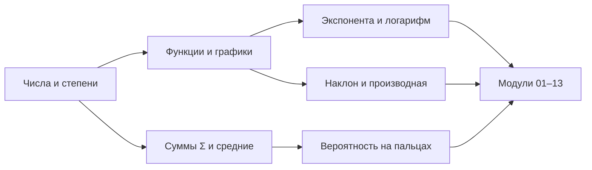
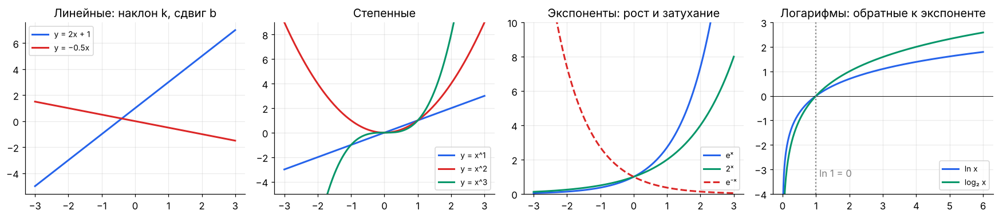
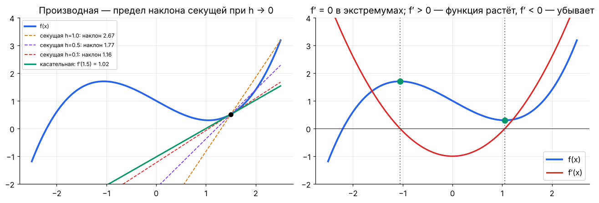

[🏠 Оглавление](../README.md#-оглавление) · [01. Язык математики: обозначения, функции, логарифмы →](01_notation.md)

<a id="m00b"></a>

# 00½. База для начинающих: школьная математика за один вечер

> 📓 [Ноутбук модуля](../notebooks/00b_basics_short.ipynb) · [](https://colab.research.google.com/github/justxor/math-for-ai-2026/blob/main/notebooks/00b_basics_short.ipynb)

> Если формулы в статьях пугают — начни отсюда. Этот модуль восстанавливает ровно ту школьную базу, на которой стоит весь курс: функции, степени, логарифмы, суммы, наклон, вероятность «на пальцах». Если всё знакомо — пройди только [практику](#m00b-practice) и иди дальше.
>
> 📘 Нужно подробнее и медленнее? Отдельный справочник [**BASICS.md**](../BASICS.md): дроби и проценты, уравнения, тригонометрия, пределы, интегралы, комбинаторика, статистика, матрицы, множества и логика — 12 разделов, 36 задач, входной и итоговый тест.



## Числа, степени, корни

```math
a^m \cdot a^n = a^{m+n}, \qquad \frac{a^m}{a^n} = a^{m-n}, \qquad (a^m)^n = a^{mn}, \qquad a^0 = 1, \qquad a^{-n} = \frac{1}{a^n}, \qquad a^{1/2} = \sqrt{a}
```

**Запись больших и маленьких чисел** — постоянно встречается в ML:

| Запись | Число | Где встретишь |
|--------|-------|---------------|
| $10^{9}$ | миллиард | параметры модели (7B = $7 \cdot 10^9$) |
| $10^{12}$ | триллион | токены в датасете LLM |
| $10^{-3}$ | 0.001 | learning rate 1e-3 |
| $10^{-8}$ | 0.00000001 | ε в Adam |
| $2^{10} = 1024$ | ≈ тысяча | КБ, размер словаря, ширина слоя |

> 💡 Привычка ML-инженера — считать **порядками**: «7B параметров × 2 байта = 14 ГБ» — без калькулятора.

## Функции и графики

Функция $y = f(x)$ — правило «вход → выход». В ML **модель — это функция**: картинка → вероятность «кот»; текст → следующий токен.



| Функция | Что важно запомнить |
|---------|---------------------|
| $y = kx + b$ | прямая; $k$ — наклон (на сколько растёт $y$ при росте $x$ на 1), $b$ — сдвиг. **Нейрон без активации — это она.** |
| $y = x^2$ | парабола, минимум в 0, симметрична. **Квадратичная ошибка.** |
| $y = e^x$ | растёт всё быстрее, всегда > 0, $e \approx 2.718$ |
| $y = \ln x$ | обратна к $e^x$: $\ln e^x = x$; определена только для $x > 0$; $\ln 1 = 0$; при $x \to 0$ уходит в $-\infty$ |
| $y = \lvert x\rvert$ | «галочка», минимум в 0 с изломом |

**Сдвиги и растяжения графиков:** $f(x - a)$ — сдвиг вправо на $a$; $f(x) + c$ — вверх на $c$; $f(kx)$ — сжатие по горизонтали в $k$ раз; $c \cdot f(x)$ — растяжение по вертикали. Поэтому сигмоида $\sigma(wx + b)$ с разными $w, b$ — это одна и та же «ступенька», сдвинутая и сделанная круче или положе.

## Логарифм без страха

$\log_a b = c$ означает $a^c = b$ — «в какую степень возвести $a$, чтобы получить $b$».

- $\log_2 8 = 3$, $\log_{10} 1000 = 3$, $\ln e = 1$.
- Свойства: $\log(xy) = \log x + \log y$, $\log(x/y) = \log x - \log y$, $\log x^k = k \log x$.
- **Интуиция:** логарифм считает «сколько раз умножили». Числа от 0.000001 до 1 000 000 превращаются в аккуратный отрезок от −6 до 6 (по основанию 10).
- **В ML:** логарифм превращает произведения вероятностей в суммы, а «−log вероятности правильного ответа» — это и есть лосс классификатора.

```python
import numpy as np
print(np.log(np.e), np.log2(8), np.log10(1000))   # 1.0 3.0 3.0
print(np.log(0.9), np.log(0.01))                  # -0.105  -4.605: чем меньше вероятность, тем больше штраф
```

## Знак суммы Σ и среднее

```math
\sum_{i=1}^{n} x_i = x_1 + x_2 + \dots + x_n, \qquad \bar{x} = \frac{1}{n}\sum_{i=1}^{n} x_i
```

Читается как цикл:

```python
x = [3, 1, 4, 1, 5]; n = len(x)
total = 0
for i in range(n):        # i от 1 до n в математике
    total += x[i]
mean = total / n          # то же самое, что np.mean(x)
```

Двойная сумма $\sum_i \sum_j a_{ij}$ — вложенный цикл. Произведение $\prod$ — то же самое, но с умножением.

**Средние и разброс:**
- **Среднее** чувствительно к выбросам; **медиана** — середина отсортированного списка — нет. Зарплаты: среднее «врёт», медиана честнее.
- **Дисперсия** — средний квадрат отклонения от среднего; **стандартное отклонение** $\sigma$ — корень из неё, в тех же единицах, что и данные.

## Наклон и производная — главная идея обучения



**Производная** $f'(x)$ — наклон касательной: на сколько изменится $f$, если чуть-чуть увеличить $x$.
- $f' > 0$ — функция растёт, $f' < 0$ — убывает, $f' = 0$ — вершина или впадина.
- **Обучение нейросети** = найти впадину функции ошибки. Алгоритм: посмотри на наклон и сделай шаг вниз — $x \leftarrow x - \eta f'(x)$. Это градиентный спуск (модули 03 и 05).

Пять производных, которых хватит на старте: $(c)' = 0$, $(x^n)' = nx^{n-1}$, $(e^x)' = e^x$, $(\ln x)' = 1/x$, $(f(g(x)))' = f'(g(x))\,g'(x)$.

## Векторы на пальцах

Вектор — список чисел: $\mathbf{x} = (\text{рост}, \text{вес}, \text{возраст}) = (180, 75, 30)$. Каждый объект в ML превращается в такой список (**признаки**), а слово в LLM — в список из тысяч чисел (**эмбеддинг**).

- Сложение и умножение на число — поэлементно.
- **Скалярное произведение** $\mathbf{a} \cdot \mathbf{b} = a_1b_1 + a_2b_2 + \dots$ — «насколько векторы похожи». Модуль 02 раскрывает это подробно.

## Вероятность на пальцах

- Вероятность — число от 0 до 1: доля благоприятных исходов при большом числе повторов.
- **Сложение** для взаимоисключающих событий: $P(A \text{ или } B) = P(A) + P(B)$.
- **Умножение** для независимых: $P(A \text{ и } B) = P(A) \cdot P(B)$. Три орла подряд — $0.5^3 = 0.125$.
- **Дополнение:** $P(\text{не } A) = 1 - P(A)$. «Хотя бы один орёл из трёх» $= 1 - 0.125 = 0.875$.
- **Условная вероятность** $P(A \mid B)$ — вероятность $A$, если известно, что произошло $B$. Классификатор выдаёт именно её: $P(\text{кот} \mid \text{картинка})$.

## 🏋️ Практика модуля
<a id="m00b-practice"></a>

**0.1.** Посчитайте без калькулятора: $2^{10}$, $2^{-3}$, $\log_2 1024$, $\ln 1$, $e^0$, $10^{-2} \cdot 10^{5}$.

<details><summary>▶️ Ответ</summary>

1024; 0.125; 10; 0; 1; $10^3 = 1000$.
</details>

**0.2.** Сколько памяти занимают веса модели на 70 млрд параметров в формате FP16 (2 байта на число)? А в 4 битах?

<details><summary>▶️ Решение</summary>

$70 \cdot 10^9 \cdot 2 = 140 \cdot 10^9$ байт ≈ 140 ГБ. В 4 битах (0.5 байта) — ≈ 35 ГБ. Поэтому большие модели квантуют, чтобы они влезли в одну-две видеокарты.
</details>

**0.3.** Найдите минимум $f(x) = (x - 3)^2 + 1$ двумя способами: через производную и градиентным спуском из $x = 0$ с шагом 0.1.

<details><summary>▶️ Решение</summary>

$f'(x) = 2(x - 3) = 0 \Rightarrow x = 3$, $f(3) = 1$.

```python
x = 0.0
for step in range(50):
    x -= 0.1 * 2 * (x - 3)
print(round(x, 4))   # 3.0 — за каждый шаг расстояние до минимума уменьшается в 0.8 раза
```
</details>

**0.4.** Модель предсказала правильному классу вероятности 0.9, 0.6 и 0.99 на трёх примерах. Средний лосс $-\frac{1}{3}\sum \ln p$?

<details><summary>▶️ Решение</summary>

$-(\ln 0.9 + \ln 0.6 + \ln 0.99)/3 = (0.105 + 0.511 + 0.010)/3 \approx 0.209$. Самый большой вклад — у примера, где модель была менее всего уверена в правильном ответе.
</details>

**0.5.** Монету бросают 4 раза. Вероятность хотя бы одной решки? Ровно двух орлов?

<details><summary>▶️ Решение</summary>

Хотя бы одна решка: $1 - 0.5^4 = 0.9375$. Ровно два орла: число способов выбрать 2 броска из 4 — $\binom{4}{2} = 6$, каждый с вероятностью $0.5^4$: $6/16 = 0.375$.
</details>

---

[🏠 Оглавление](../README.md#-оглавление) · [01. Язык математики: обозначения, функции, логарифмы →](01_notation.md)
