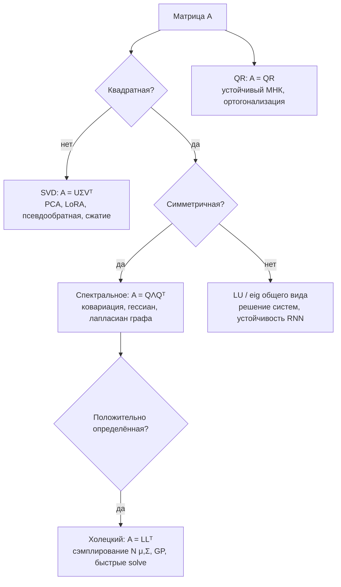

[← 01. Язык математики: обозначения, функции, логарифмы](01_notation.md) · [🏠 Оглавление](../README.md#-оглавление) · [03. Матанализ: производные, градиенты, цепное правило →](03_calculus.md)

<a id="m02"></a>

# 02. Линейная алгебра

> 📓 [Ноутбук модуля](../notebooks/02_linear_algebra.ipynb) · [](https://colab.research.google.com/github/justxor/math-for-ai-2026/blob/main/notebooks/02_linear_algebra.ipynb)

> Нейросеть — это в основном матричные умножения, перемежающиеся нелинейностями. Эмбеддинг — вектор. Батч — матрица. Изображение — тензор. Attention — три матричных умножения и softmax.

## Векторы

Вектор — это одновременно **точка в пространстве**, **стрелка** (направление + длина) и **список признаков** (эмбеддинг слова в $\mathbb{R}^{4096}$).

**Операции:** сложение покомпонентно, умножение на число растягивает. Линейная комбинация $a\mathbf{u} + b\mathbf{v}$ — основа всего.

### Нормы — «длина» вектора

```math
\lVert \mathbf{x} \rVert_1 = \sum_i |x_i|, \qquad \lVert \mathbf{x} \rVert_2 = \sqrt{\sum_i x_i^2}, \qquad \lVert \mathbf{x} \rVert_\infty = \max_i |x_i|
```

- $L_2$ — евклидова длина, в L2-регуляризации (weight decay).
- $L_1$ — «манхэттенская», даёт разреженность в Lasso.
- $L_\infty$ — в adversarial-атаках («изменить каждый пиксель не более чем на ε»).

### Скалярное произведение — главная операция ML

```math
\mathbf{a} \cdot \mathbf{b} = \mathbf{a}^\top \mathbf{b} = \sum_i a_i b_i = \lVert \mathbf{a} \rVert \, \lVert \mathbf{b} \rVert \cos\theta
```


**Смысл:** насколько векторы смотрят в одну сторону. Нейрон $\mathbf{w}^\top\mathbf{x} + b$ — это скалярное произведение входа с «шаблоном» $\mathbf{w}$. Attention score $\mathbf{q}^\top\mathbf{k}$ — насколько запрос похож на ключ.

**Косинусное сходство** — скалярное произведение нормированных векторов, от −1 до 1. Стандарт для поиска по эмбеддингам (RAG, рекомендации):

```math
\cos(\mathbf{a}, \mathbf{b}) = \frac{\mathbf{a}^\top \mathbf{b}}{\lVert \mathbf{a} \rVert \, \lVert \mathbf{b} \rVert}
```

**Проекция** $\mathbf{a}$ на $\mathbf{b}$: $\mathrm{proj}_{\mathbf{b}}\mathbf{a} = \dfrac{\mathbf{a}^\top\mathbf{b}}{\mathbf{b}^\top\mathbf{b}}\,\mathbf{b}$ — основа PCA и метода наименьших квадратов.

```python
import numpy as np
a, b = np.array([1., 2, 3]), np.array([2., 0, 1])
cos = a @ b / (np.linalg.norm(a) * np.linalg.norm(b))   # 0.598
# Поиск ближайших эмбеддингов: нормируем один раз, дальше — одно матричное умножение
E = np.random.randn(10_000, 768); E /= np.linalg.norm(E, axis=1, keepdims=True)
q = E[42] + 0.1 * np.random.randn(768); q /= np.linalg.norm(q)
top5 = np.argsort(-(E @ q))[:5]    # 42 будет первым
```

## Матрицы

### Три взгляда на матрицу

1. **Таблица чисел** (датасет: строки — объекты, столбцы — признаки).
2. **Линейное преобразование** $\mathbf{x} \mapsto A\mathbf{x}$: поворот, растяжение, сдвиг, проекция. **Столбцы $A$ — это то, куда переходят базисные векторы.**
3. **Слой нейросети**: $\mathbf{h} = W\mathbf{x} + \mathbf{b}$.


### Умножение матриц

```math
(AB)_{ij} = \sum_k A_{ik} B_{kj}, \qquad A \in \mathbb{R}^{m \times k},\ B \in \mathbb{R}^{k \times n} \Rightarrow AB \in \mathbb{R}^{m \times n}
```

**Правило размерностей:** внутренние совпадают, внешние остаются: `(m×k)·(k×n) → (m×n)`. Если на собеседовании не уверен — пиши размерности под каждой матрицей.

Свойства:
- $AB \ne BA$ в общем случае (порядок преобразований важен).
- $(AB)C = A(BC)$ — ассоциативность; порядок скобок меняет **стоимость** вычисления, а не результат.
- $(AB)^\top = B^\top A^\top$.
- Композиция слоёв без нелинейности $W_2(W_1\mathbf{x}) = (W_2W_1)\mathbf{x}$ — **один** линейный слой. Поэтому нужны активации.

**Стоимость:** $(m \times k)\cdot(k \times n)$ — это $m \cdot k \cdot n$ умножений-сложений, ≈ $2mkn$ FLOP. Отсюда правило для трансформеров: прямой проход ≈ $2 \times$ (число параметров) FLOP на токен, обучение ≈ $6 \times$.

### Особые матрицы

| Матрица | Определение | Где встречается |
|---------|-------------|-----------------|
| Единичная $I$ | $I\mathbf{x} = \mathbf{x}$ | residual connections: $\mathbf{x} + f(\mathbf{x})$ |
| Диагональная | ненулевая только диагональ | масштабирование признаков, LayerNorm γ |
| Симметричная | $A = A^\top$ | ковариация, гессиан, ядра |
| Ортогональная | $Q^\top Q = I$ | повороты; сохраняет длины; ортогональная инициализация |
| Положительно определённая | $\mathbf{x}^\top A \mathbf{x} > 0$ для всех $\mathbf{x} \neq 0$ | ковариация, гессиан в минимуме |
| Низкоранговая | $A = UV^\top$, $U \in \mathbb{R}^{m \times r}$, $r \ll m$ | LoRA, сжатие моделей |

### Ранг, обратная матрица, определитель

- **Ранг** — число линейно независимых столбцов = размерность образа. Матрица $UV^\top$ с $U, V \in \mathbb{R}^{d \times r}$ имеет ранг ≤ r: вместо $d^2$ параметров — $2dr$. **Это LoRA.**
- **Определитель** $\det A$ — во сколько раз преобразование меняет объём (и меняет ли ориентацию). $\det A = 0$ ⇔ пространство «сплющивается» ⇔ необратима. Встречается в нормализующих потоках (normalizing flows) и формуле плотности многомерного нормального.
- **Обратная** $A^{-1}$: $AA^{-1} = I$. На практике **никогда не считают** `inv(A) @ b` — решают систему `np.linalg.solve(A, b)` (быстрее и точнее).
- **Число обусловленности** $\kappa(A) = \sigma_{\max}/\sigma_{\min}$ — насколько ошибки во входе усиливаются. Большое κ → вытянутые «долины» лосса → медленный градиентный спуск (модуль 05).

## Собственные числа и векторы

```math
A\mathbf{v} = \lambda \mathbf{v}
```

Собственный вектор не меняет направления под действием $A$, только растягивается в $\lambda$ раз.


**Спектральная теорема:** симметричная матрица раскладывается как

```math
A = Q \Lambda Q^\top, \qquad Q^\top Q = I,\ \Lambda = \mathrm{diag}(\lambda_1, \dots, \lambda_n)
```

То есть любое симметричное преобразование = поворот → растяжение вдоль осей → поворот обратно.

**Где в ML:**
- **PCA** — собственные векторы матрицы ковариации.
- **Гессиан** в точке: все $\lambda > 0$ — минимум, разных знаков — седловая точка (в нейросетях их подавляющее большинство).
- **Устойчивость RNN**: $\lvert\lambda_{\max}(W)\rvert > 1$ — градиенты взрываются, $< 1$ — затухают.
- **PageRank, спектральная кластеризация** — собственные векторы графовых матриц.

Полезные факты: $\mathrm{tr} A = \sum \lambda_i$, $\det A = \prod \lambda_i$, $A^k = Q\Lambda^kQ^\top$.

### 🗺️ Схема: какое разложение когда



## SVD — самое полезное разложение

Любая матрица (даже прямоугольная):

```math
A = U \Sigma V^\top, \qquad A \in \mathbb{R}^{m\times n},\ U \in \mathbb{R}^{m\times m},\ \Sigma \in \mathbb{R}^{m\times n},\ V \in \mathbb{R}^{n\times n}
```

$U, V$ ортогональные, $\Sigma$ — диагональ из **сингулярных чисел** $\sigma_1 \ge \sigma_2 \ge \dots \ge 0$.

**Геометрия:** поворот ($V^\top$) → растяжение по осям ($\Sigma$) → поворот ($U$).

**Теорема Эккарта–Янга:** лучшее приближение ранга k (по норме Фробениуса) — оставить k крупнейших сингулярных чисел:

```math
A_k = \sum_{i=1}^{k} \sigma_i \mathbf{u}_i \mathbf{v}_i^\top
```

Где применяется: PCA, сжатие изображений и весов, рекомендательные системы (matrix factorization), псевдообратная матрица, LSA, анализ рангов весов LLM (почему LoRA работает: обновления весов при дообучении имеют низкий «эффективный ранг»).

```python
U0, _ = np.linalg.qr(np.random.randn(512, 256)); V0, _ = np.linalg.qr(np.random.randn(256, 256))
A = U0 @ np.diag(np.exp(-np.arange(256) / 5)) @ V0.T     # матрица с быстро убывающим спектром, как у реальных данных
U, S, Vt = np.linalg.svd(A, full_matrices=False)
k = 20
A_k = U[:, :k] * S[:k] @ Vt[:k]
print(np.linalg.norm(A - A_k) / np.linalg.norm(A))   # ≈ 0.018: ошибка ~2% при 20 компонентах из 256
print((512 * 256), k * (512 + 256 + 1))             # 131072 → 15380 чисел
```

## PCA — метод главных компонент

**Задача:** найти направления, вдоль которых данные изменяются сильнее всего, и спроецировать на первые k из них.

**Алгоритм:**
1. Центрировать: $X_c = X - \bar{\mathbf{x}}$ (обязательно!), часто ещё и стандартизировать.
2. SVD: $X_c = U\Sigma V^\top$. Главные компоненты — строки $V^\top$.
3. Проекция: $Z = X_c V_k$.
4. Доля объяснённой дисперсии компоненты i: $\sigma_i^2 / \sum_j \sigma_j^2$.

Эквивалентно: собственные векторы ковариации $C = \frac{1}{N-1}X_c^\top X_c$, собственные числа $\lambda_i = \sigma_i^2/(N-1)$.


```python
from sklearn.decomposition import PCA
X = np.random.randn(1000, 300)
Z = PCA(n_components=50).fit_transform(X)       # (1000, 50) — то же самое, что SVD выше
```

**Ограничения:** только линейные структуры (для нелинейных — t-SNE, UMAP, автоэнкодеры), чувствителен к масштабу признаков и выбросам.

## Тензоры и broadcasting

Тензор — многомерный массив. Типичные формы:

| Данные | Форма | Пример |
|--------|-------|--------|
| Батч векторов | `(B, D)` | эмбеддинги |
| Батч изображений | `(B, C, H, W)` | PyTorch, `(32, 3, 224, 224)` |
| Батч последовательностей | `(B, T, D)` | токены в трансформере |
| Attention-веса | `(B, heads, T, T)` | |

**Broadcasting:** размерности сравниваются справа налево; совпадают или одна из них = 1.

```python
X = np.random.randn(32, 10)     # батч
mu = X.mean(axis=0)              # (10,)
Xc = X - mu                      # (32,10) - (10,) → работает
# Попарные расстояния без циклов: (N,1,D) - (1,M,D) → (N,M,D)
A, B = np.random.randn(5, 3), np.random.randn(4, 3)
D = np.sqrt(((A[:, None, :] - B[None, :, :])**2).sum(-1))
```

**einsum** — универсальная запись тензорных операций, обязательна для чтения кода трансформеров:

```python
A, B = np.random.randn(3, 4), np.random.randn(4, 5)
Q = K = np.random.randn(2, 8, 16, 64)   # (batch, heads, T, d)
np.einsum('ij,jk->ik', A, B)            # матричное умножение
np.einsum('bhtd,bhsd->bhts', Q, K)      # attention scores по батчу и головам
np.einsum('ii->', A @ A.T)              # след
```

## 🎯 На собеседовании

1. **Что такое ранг и как он связан с LoRA?** — Обновление весов $\Delta W = BA$ с $B \in \mathbb{R}^{d\times r}, A \in \mathbb{R}^{r\times k}$ имеет ранг ≤ r: обучаем $r(d+k)$ параметров вместо $dk$.
2. **SVD vs собственное разложение?** — Собственное — только для квадратных (и устойчиво хорошее — для симметричных); SVD — для любых, сингулярные числа ≥ 0. Для симметричной положительно полуопределённой они совпадают.
3. **Зачем центрировать данные перед PCA?** — Иначе первая компонента указывает на среднее, а не на направление разброса.
4. **Почему без нелинейностей глубокая сеть = линейная модель?** — Произведение матриц — матрица.
5. **Сложность умножения $(n\times n)\cdot(n\times n)$?** — $O(n^3)$ наивно; на GPU упирается в пропускную способность памяти для малых матриц и в FLOPs — для больших.

## 🏋️ Практика модуля

**2.1.** Матрица поворота на угол θ:

```math
R = \begin{pmatrix}\cos\theta & -\sin\theta \\ \sin\theta & \cos\theta\end{pmatrix}
```

Докажите, что она ортогональна и сохраняет длины. Какой у неё определитель?

<details><summary>▶️ Решение</summary>

```math
R^\top R = \begin{pmatrix}\cos^2\theta+\sin^2\theta & 0 \\ 0 & \sin^2\theta+\cos^2\theta\end{pmatrix} = I
```

Тогда $\lVert R\mathbf{x}\rVert^2 = \mathbf{x}^\top R^\top R\mathbf{x} = \lVert\mathbf{x}\rVert^2$. $\det R = \cos^2\theta + \sin^2\theta = 1$ — объём и ориентация сохраняются.

Связь с ML: **RoPE** (позиционное кодирование в LLaMA и почти всех современных LLM) поворачивает пары координат q и k на угол, пропорциональный позиции, — поэтому $\mathbf{q}_m^\top\mathbf{k}_n$ зависит только от разности $m - n$.
</details>

**2.2.** Слой `nn.Linear(4096, 4096)` дообучают через LoRA с r = 16. Во сколько раз меньше обучаемых параметров?

<details><summary>▶️ Решение</summary>

Полный: $4096^2 \approx 16.8$ млн. LoRA: $16 \cdot (4096 + 4096) = 131\,072$. В **128 раз** меньше. В общем случае отношение $\frac{dk}{r(d+k)} = \frac{d}{2r}$ для квадратной матрицы.
</details>

**2.3.** Реализуйте PCA через SVD и сравните со sklearn.

<details><summary>▶️ Решение</summary>

```python
import numpy as np
from sklearn.decomposition import PCA
X = np.random.randn(500, 10) @ np.random.randn(10, 10)
Xc = X - X.mean(0)
U, S, Vt = np.linalg.svd(Xc, full_matrices=False)
Z = Xc @ Vt[:3].T
ratio = S**2 / (S**2).sum()
sk = PCA(3).fit(X)
print(np.allclose(np.abs(Z), np.abs(sk.transform(X))))      # True (знак компоненты произволен!)
print(np.allclose(ratio[:3], sk.explained_variance_ratio_))  # True
```
**Ловушка:** знак собственного/сингулярного вектора не определён — сравнивать по модулю.
</details>

---

[← 01. Язык математики: обозначения, функции, логарифмы](01_notation.md) · [🏠 Оглавление](../README.md#-оглавление) · [03. Матанализ: производные, градиенты, цепное правило →](03_calculus.md)
