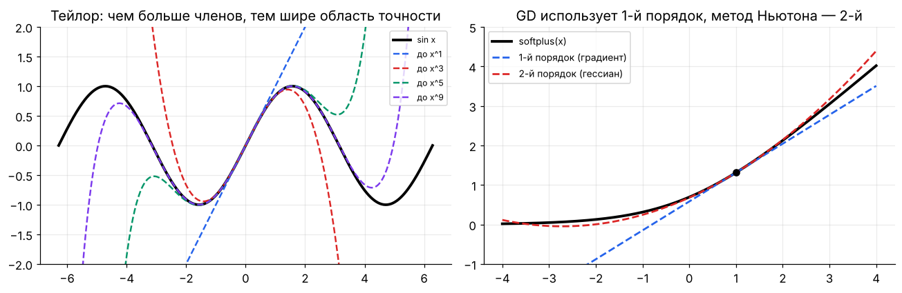
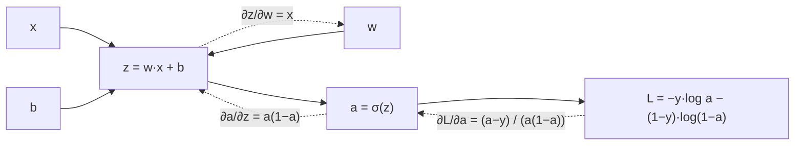

[← 02. Линейная алгебра](02_linear_algebra.md) · [🏠 Оглавление](../README.md#-оглавление) · [04. Backpropagation и автодифференцирование →](04_backprop.md)

<a id="m03"></a>

# 03. Матанализ: производные, градиенты, цепное правило

> 📓 [Ноутбук модуля](../notebooks/03_calculus.ipynb) · [](https://colab.research.google.com/github/justxor/math-for-ai-2026/blob/main/notebooks/03_calculus.ipynb)

> Обучение нейросети = «подвинуть веса туда, где лосс меньше». Куда двигать, говорит градиент. Как его посчитать через 100 слоёв — говорит цепное правило.

## Производная

```math
f'(x) = \lim_{h \to 0} \frac{f(x+h) - f(x)}{h}
```

**Смысл:** насколько изменится выход при маленьком изменении входа: $f(x + \Delta) \approx f(x) + f'(x)\,\Delta$. Это **линейная аппроксимация** — фундамент градиентного спуска.

### Таблица, которую надо знать наизусть

| $f(x)$ | $f'(x)$ | Где в ML |
|--------|---------|----------|
| $x^n$ | $n x^{n-1}$ | MSE |
| $e^x$ | $e^x$ | softmax |
| $\log x$ | $1/x$ | log-likelihood |
| $\sigma(x)$ | $\sigma(x)(1-\sigma(x))$ | логистическая регрессия |
| $\tanh x$ | $1 - \tanh^2 x$ | RNN, LSTM |
| $\mathrm{ReLU}(x)$ | $\mathbb{1}[x > 0]$ | почти все сети |
| $\lvert x\rvert$ | $\mathrm{sign}(x)$ | MAE, L1 (субградиент в 0) |
| $\log(1+e^x)$ | $\sigma(x)$ | softplus |

### Правила

```math
(f + g)' = f' + g', \qquad (fg)' = f'g + fg', \qquad \left(\frac{f}{g}\right)' = \frac{f'g - fg'}{g^2}, \qquad \bigl(f(g(x))\bigr)' = f'(g(x))\,g'(x)
```

Последнее — **цепное правило**, на нём держится всё глубокое обучение.

## Частные производные и градиент

Для функции многих переменных $f(\mathbf{x})$, $\mathbf{x} \in \mathbb{R}^n$:

```math
\nabla f(\mathbf{x}) = \left( \frac{\partial f}{\partial x_1}, \dots, \frac{\partial f}{\partial x_n} \right)^\top
```

**Три ключевых свойства градиента:**
1. Указывает направление **наискорейшего роста** функции. Значит, $-\nabla f$ — наискорейшего убывания.
2. **Перпендикулярен линиям уровня** (контурам) — см. картинки в модуле 05.
3. В точке минимума (гладкой функции) $\nabla f = \mathbf{0}$.

**Производная по направлению:** $D_{\mathbf{u}} f = \nabla f^\top \mathbf{u}$ — максимальна при $\mathbf{u} \parallel \nabla f$ (неравенство Коши–Буняковского).

## Якобиан и гессиан

| Объект | Для функции | Форма | Смысл |
|--------|-------------|-------|-------|
| Градиент $\nabla f$ | $\mathbb{R}^n \to \mathbb{R}$ | $n$ | наклон |
| Якобиан $J$ | $\mathbb{R}^n \to \mathbb{R}^m$ | $m \times n$, $J_{ij} = \partial f_i / \partial x_j$ | линейное приближение векторной функции |
| Гессиан $H$ | $\mathbb{R}^n \to \mathbb{R}$ | $n \times n$, $H_{ij} = \partial^2 f / \partial x_i \partial x_j$ | кривизна |

**Ряд Тейлора** второго порядка — как выглядит лосс вблизи точки:

```math
f(\mathbf{x} + \boldsymbol{\delta}) \approx f(\mathbf{x}) + \nabla f(\mathbf{x})^\top \boldsymbol{\delta} + \tfrac{1}{2}\, \boldsymbol{\delta}^\top H(\mathbf{x})\, \boldsymbol{\delta}
```

- Собственные числа гессиана — кривизна по главным направлениям. Отношение $\lambda_{\max}/\lambda_{\min}$ (обусловленность) определяет, насколько трудно оптимизировать.
- Метод Ньютона: $\boldsymbol{\delta} = -H^{-1}\nabla f$. Для сети с $10^9$ параметров гессиан — $10^{18}$ чисел, поэтому в DL используют **первый порядок** (SGD, Adam) или дешёвые приближения кривизны (Adam — диагональ, Shampoo/SOAP — блочные).

### Ряд Тейлора — картинкой



Слева — чем больше членов, тем дальше от точки разложения работает приближение. Справа — что «видят» оптимизаторы: градиентный спуск строит касательную прямую (1-й порядок), метод Ньютона — касательную параболу (2-й порядок) и прыгает в её минимум.

## Матричное дифференцирование — шпаргалка

Для скалярной функции от вектора/матрицы (раскладка «по знаменателю»: градиент той же формы, что и переменная):

| $f$ | $\nabla f$ |
|-----|------------|
| $\mathbf{a}^\top\mathbf{x}$ | $\mathbf{a}$ |
| $\mathbf{x}^\top\mathbf{x} = \lVert\mathbf{x}\rVert^2$ | $2\mathbf{x}$ |
| $\mathbf{x}^\top A\mathbf{x}$ | $(A + A^\top)\mathbf{x}$, для симметричной $2A\mathbf{x}$ |
| $\lVert A\mathbf{x} - \mathbf{b}\rVert^2$ | $2A^\top(A\mathbf{x} - \mathbf{b})$ |
| $\mathrm{tr}(AX)$ по $X$ | $A^\top$ |
| $\mathbf{a}^\top X \mathbf{b}$ по $X$ | $\mathbf{a}\mathbf{b}^\top$ |

**Главное правило линейного слоя.** Для $Y = XW$ ($X$: N×d, $W$: d×k), если известен $G = \partial L/\partial Y$ (N×k):

```math
\frac{\partial L}{\partial W} = X^\top G \quad (d \times k), \qquad \frac{\partial L}{\partial X} = G\,W^\top \quad (N \times d)
```

> 💡 **Трюк размерностей:** не помнишь формулу — составь произведение из $X$, $W$, $G$ и транспонирований так, чтобы размерности сошлись с формой переменной. Почти всегда это единственный вариант.

### 🗺️ Схема: цепное правило для одного нейрона



Перемножаем стрелки обратного хода: $\frac{\partial L}{\partial w} = \frac{a - y}{a(1-a)} \cdot a(1-a) \cdot x = (a - y)\,x$ — множители $a(1-a)$ сокращаются, поэтому градиент не затухает даже при насыщенной сигмоиде.

## Два вывода, которые спрашивают на каждом собеседовании

### 1. Градиент логистической регрессии

$\hat{y} = \sigma(\mathbf{w}^\top\mathbf{x})$, $L = -[y\log\hat{y} + (1-y)\log(1-\hat{y})]$. По цепному правилу с $z = \mathbf{w}^\top\mathbf{x}$:

```math
\frac{\partial L}{\partial \hat{y}} = -\frac{y}{\hat{y}} + \frac{1-y}{1-\hat{y}}, \quad \frac{\partial \hat{y}}{\partial z} = \hat{y}(1-\hat{y}) \quad\Rightarrow\quad \frac{\partial L}{\partial z} = \hat{y} - y, \qquad \nabla_{\mathbf{w}} L = (\hat{y} - y)\,\mathbf{x}
```

### 2. Softmax + cross-entropy

$\mathbf{p} = \mathrm{softmax}(\mathbf{z})$, $L = -\sum_k y_k \log p_k$ ($\mathbf{y}$ — one-hot). Якобиан softmax: $\partial p_i/\partial z_j = p_i(\delta_{ij} - p_j)$. Перемножаем:

```math
\frac{\partial L}{\partial z_j} = -\sum_i \frac{y_i}{p_i}\, p_i(\delta_{ij} - p_j) = -y_j + p_j \sum_i y_i = p_j - y_j
\qquad\Longrightarrow\qquad \nabla_{\mathbf{z}} L = \mathbf{p} - \mathbf{y}
```

**«Предсказание минус правда».** Тот же ответ, что у MSE с линейным выходом и у логистической регрессии — не совпадение: все три — обобщённые линейные модели с каноническими функциями связи.

Именно поэтому в PyTorch `CrossEntropyLoss` принимает **логиты**, а не вероятности: softmax и логарифм объединены и в прямом проходе (стабильность), и в обратном (простой градиент).

## Численная проверка градиента

```python
import numpy as np

def grad_check(f, x, analytic, eps=1e-5):
    num = np.zeros_like(x)
    for i in range(x.size):
        e = np.zeros_like(x); e.flat[i] = eps
        num.flat[i] = (f(x + e) - f(x - e)) / (2 * eps)   # центральная разность, ошибка O(eps²)
    rel = np.linalg.norm(num - analytic) / (np.linalg.norm(num) + np.linalg.norm(analytic))
    return rel   # < 1e-7 — отлично, > 1e-4 — ищи баг

z = np.random.randn(5); y = np.eye(5)[2]
softmax = lambda z: np.exp(z - z.max()) / np.exp(z - z.max()).sum()
loss = lambda z: -np.log(softmax(z)[2])
print(grad_check(loss, z, softmax(z) - y))   # ~1e-10
```

## 🎯 На собеседовании

1. **Что показывает градиент?** — Направление наискорейшего роста; его норма — скорость роста.
2. **Выведи градиент softmax + CE.** — $\mathbf{p} - \mathbf{y}$ (вывод выше).
3. **Почему не используют метод Ньютона в DL?** — Гессиан $O(n^2)$ памяти и $O(n^3)$ на обращение, плюс в невыпуклых задачах он не положительно определён (тянет в седловые точки).
4. **Что такое седловая точка?** — Градиент 0, но по одним направлениям минимум, по другим максимум (гессиан со знакопеременными собственными числами).

## 🏋️ Практика модуля

**3.1.** Найдите градиент MSE линейной регрессии $L(\mathbf{w}) = \frac{1}{N}\lVert X\mathbf{w} - \mathbf{y}\rVert^2$ и выведите нормальное уравнение.

<details><summary>▶️ Решение</summary>

```math
\nabla_{\mathbf{w}} L = \frac{2}{N} X^\top (X\mathbf{w} - \mathbf{y}) = 0 \quad\Rightarrow\quad X^\top X \mathbf{w} = X^\top \mathbf{y} \quad\Rightarrow\quad \mathbf{w}^* = (X^\top X)^{-1} X^\top \mathbf{y}
```
Геометрически: остаток $X\mathbf{w}^* - \mathbf{y}$ ортогонален всем столбцам $X$ — $X\mathbf{w}^*$ это проекция $\mathbf{y}$ на пространство столбцов.
</details>

**3.2.** Для $f(x, y) = x^2 + 3xy + y^3$ найдите градиент и гессиан в точке (1, 2). Это минимум?

<details><summary>▶️ Решение</summary>

$\nabla f = (2x + 3y,\; 3x + 3y^2) = (8,\, 15)$ — не ноль, значит, не стационарная точка, а тем более не минимум.

```math
H = \begin{pmatrix} 2 & 3 \\ 3 & 6y \end{pmatrix} = \begin{pmatrix} 2 & 3 \\ 3 & 12 \end{pmatrix}, \quad \det H = 15 > 0,\ H_{11} > 0
```
Гессиан положительно определён — функция локально выпукла в этой точке, но до минимума нужно ещё «спуститься».
</details>

**3.3.** Проверьте численно формулу $\partial L/\partial W = X^\top G$ для $L = \mathrm{sum}(XW)^2$.

<details><summary>▶️ Решение</summary>

```python
X = np.random.randn(4, 3); W = np.random.randn(3, 2)
f = lambda W: ((X @ W) ** 2).sum()
G = 2 * (X @ W)            # dL/dY
print(grad_check(f, W, X.T @ G))   # ~1e-10
```
</details>

---

[← 02. Линейная алгебра](02_linear_algebra.md) · [🏠 Оглавление](../README.md#-оглавление) · [04. Backpropagation и автодифференцирование →](04_backprop.md)
