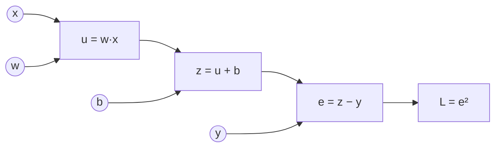

[← 03. Матанализ: производные, градиенты, цепное правило](03_calculus.md) · [🏠 Оглавление](../README.md#-оглавление) · [05. Оптимизация: от градиентного спуска до AdamW →](05_optimization.md)

<a id="m04"></a>

# 04. Backpropagation и автодифференцирование

> 📓 [Ноутбук модуля](../notebooks/04_backprop.ipynb) · [](https://colab.research.google.com/github/justxor/math-for-ai-2026/blob/main/notebooks/04_backprop.ipynb)

> Backprop — это цепное правило, применённое к графу вычислений в правильном порядке, с переиспользованием промежуточных результатов. Ничего больше.

## Граф вычислений

Любое вычисление раскладывается на элементарные операции. Пример: $L = (wx + b - y)^2$.



**Прямой проход** (forward): идём слева направо, считаем и **запоминаем** промежуточные значения $u, z, e$.
**Обратный проход** (backward): идём справа налево, каждый узел получает «входящий градиент» $\partial L/\partial(\text{выход})$ и умножает на свою **локальную производную**:

```math
\frac{\partial L}{\partial e} = 2e, \quad \frac{\partial L}{\partial z} = \frac{\partial L}{\partial e}\cdot 1, \quad \frac{\partial L}{\partial b} = \frac{\partial L}{\partial z}\cdot 1, \quad \frac{\partial L}{\partial w} = \frac{\partial L}{\partial z}\cdot x
```

### Шаблоны узлов — запомнить

| Узел | Forward | Backward (что отдаёт входам) |
|------|---------|------------------------------|
| Сложение $z = a + b$ | — | **раздаёт** градиент без изменений обоим |
| Умножение $z = ab$ | — | **меняет местами**: $a$ получает $g \cdot b$, $b$ получает $g \cdot a$ |
| max / ReLU | — | **маршрутизатор**: градиент идёт только в победителя |
| Разветвление (переменная используется дважды) | — | градиенты **суммируются** |
| Матричное $Y = XW$ | — | $G W^\top$ к $X$, $X^\top G$ к $W$ |

## Почему reverse mode, а не forward mode

| Режим | Стоимость | Выгоден, когда |
|-------|-----------|----------------|
| Forward mode | 1 проход на **каждый вход** | входов мало, выходов много |
| Reverse mode (backprop) | 1 проход на **каждый выход** | выход один (лосс), входов миллиарды (веса) |

Обучение — ровно второй случай: **одним** обратным проходом получаем градиент по **всем** параметрам за ~2× стоимость прямого. Цена — память: надо хранить активации всех слоёв (отсюда **gradient checkpointing**: храним часть активаций, остальные пересчитываем, меняя ~30% вычислений на кратную экономию памяти).

## Двухслойная сеть руками (то, что просят написать на собеседовании)

```math
\mathbf{h} = \mathrm{ReLU}(X W_1 + \mathbf{b}_1), \qquad \mathbf{z} = \mathbf{h} W_2 + \mathbf{b}_2, \qquad L = \mathrm{CE}(\mathrm{softmax}(\mathbf{z}), \mathbf{y})
```

```python
import numpy as np
rng = np.random.default_rng(0)
N, D, H, K = 64, 2, 32, 3

# Данные: три спирали по 64 точки
r = np.linspace(0.2, 1.0, N)
X = np.concatenate([np.c_[r * np.sin(4 * r + 2.1 * k), r * np.cos(4 * r + 2.1 * k)] for k in range(K)])
X += 0.03 * rng.normal(size=X.shape); y = np.repeat(np.arange(K), N)

W1 = rng.normal(0, np.sqrt(2 / D), (D, H)); b1 = np.zeros(H)    # He-инициализация
W2 = rng.normal(0, np.sqrt(1 / H), (H, K)); b2 = np.zeros(K)

for step in range(3000):
    # forward
    a1 = X @ W1 + b1
    h = np.maximum(0, a1)
    z = h @ W2 + b2
    z -= z.max(1, keepdims=True)                      # стабильность
    p = np.exp(z); p /= p.sum(1, keepdims=True)
    loss = -np.log(p[np.arange(len(y)), y]).mean()

    # backward — каждая строка = локальная производная × входящий градиент
    dz = p.copy(); dz[np.arange(len(y)), y] -= 1; dz /= len(y)   # p − y
    dW2 = h.T @ dz;  db2 = dz.sum(0)
    dh = dz @ W2.T
    da1 = dh * (a1 > 0)                                # ReLU пропускает градиент там, где был активен
    dW1 = X.T @ da1; db1 = da1.sum(0)

    for P, G in [(W1, dW1), (b1, db1), (W2, dW2), (b2, db2)]:
        P -= 0.5 * G
    if step % 1000 == 0:
        print(step, round(loss, 3), (p.argmax(1) == y).mean())
```

Сверка с PyTorch: autograd должен дать те же градиенты, что и ручной backward.

```python
import torch
T = lambda a: torch.tensor(a, dtype=torch.float64, requires_grad=True)
W1t, b1t, W2t, b2t = T(W1), T(b1), T(W2), T(b2)
zt = torch.relu(torch.tensor(X) @ W1t + b1t) @ W2t + b2t
torch.nn.functional.cross_entropy(zt, torch.tensor(y)).backward()

# ручной backward в текущей точке
a1 = X @ W1 + b1; h = np.maximum(0, a1); z = h @ W2 + b2
p = np.exp(z - z.max(1, keepdims=True)); p /= p.sum(1, keepdims=True)
dz = p.copy(); dz[np.arange(len(y)), y] -= 1; dz /= len(y)
dW1 = X.T @ ((dz @ W2.T) * (a1 > 0))
print(np.abs(W1t.grad.numpy() - dW1).max())   # ~1e-17
```

## Затухающие и взрывающиеся градиенты

Градиент первого слоя — произведение якобианов всех последующих:

```math
\frac{\partial L}{\partial \mathbf{h}_1} = \frac{\partial L}{\partial \mathbf{h}_L} \prod_{l=2}^{L} \frac{\partial \mathbf{h}_l}{\partial \mathbf{h}_{l-1}}
```

Если «типичный масштаб» множителей < 1 — произведение → 0 (затухание), > 1 — → ∞ (взрыв). Как с этим живут:

| Проблема | Решение | Почему работает |
|----------|---------|-----------------|
| Насыщение сигмоиды/tanh | ReLU, GELU, SiLU | производная ≈ 1 на положительной части |
| Плохой масштаб весов | Xavier/He-инициализация | дисперсия активаций сохраняется слой к слою |
| Глубина 100+ слоёв | Residual connections $\mathbf{x} + f(\mathbf{x})$ | якобиан $I + \partial f/\partial\mathbf{x}$ — градиент идёт по «шоссе» через $I$ |
| Дрейф масштаба активаций | BatchNorm / LayerNorm / RMSNorm | нормирует активации на каждом слое |
| Взрыв в RNN/трансформерах | Gradient clipping по норме | ограничивает $\lVert\mathbf{g}\rVert \le c$ |
| Долгие зависимости в RNN | LSTM/GRU, затем attention | аддитивная «ячейка памяти», прямые связи между позициями |


## 🎯 На собеседовании

1. **Объясни backprop без формул.** — Считаем выход и запоминаем промежуточные значения, затем идём от лосса назад и каждый узел умножает пришедший градиент на свою локальную производную; где переменная использовалась несколько раз — градиенты суммируем.
2. **Почему reverse mode?** — Один скалярный выход, миллионы входов.
3. **Сколько памяти нужно на обучение по сравнению с инференсом?** — Плюс активации всех слоёв, градиенты (= размер весов) и состояние оптимизатора (Adam: ещё 2× веса). Для смешанной точности ≈ 16 байт на параметр без активаций.
4. **Почему residual connections помогают?** — Слагаемое $I$ в якобиане: градиент доходит до ранних слоёв, даже если $\partial f/\partial\mathbf{x}$ мал.

## 🏋️ Практика модуля

**4.1.** $f = (x + y) \cdot z$ при $x = -2, y = 5, z = -4$. Посчитайте все частные производные через граф.

<details><summary>▶️ Решение</summary>

Forward: $q = x + y = 3$, $f = qz = -12$.
Backward: $\partial f/\partial f = 1$; умножение меняет местами: $\partial f/\partial q = z = -4$, $\partial f/\partial z = q = 3$; сложение раздаёт: $\partial f/\partial x = \partial f/\partial y = -4$.
</details>

**4.2.** Выведите backward для LayerNorm без обучаемых параметров: $\hat{x}_i = (x_i - \mu)/\sigma$.

<details><summary>▶️ Решение</summary>

Обозначим $g_i = \partial L/\partial \hat{x}_i$, $d$ — размерность. С учётом того, что $\mu$ и $\sigma$ зависят от всех $x_i$:

```math
\frac{\partial L}{\partial x_i} = \frac{1}{\sigma}\left( g_i - \frac{1}{d}\sum_j g_j - \hat{x}_i \cdot \frac{1}{d}\sum_j g_j \hat{x}_j \right)
```
Интерпретация: из градиента вычитаются его среднее и компонента вдоль $\hat{\mathbf{x}}$ — нормализация «съедает» изменения сдвига и масштаба. Проверьте численно функцией `grad_check` из модуля 03.
</details>

**4.3.** Почему градиент ReLU в точке 0 не мешает обучению?

<details><summary>▶️ Решение</summary>

Вероятность попасть ровно в 0 для float-значения практически нулевая; фреймворки берут субградиент 0. Реальная проблема ReLU — «мёртвые нейроны»: если пре-активация отрицательна на всех примерах, градиент всегда 0 и нейрон не восстанавливается. Лечат LeakyReLU/GELU, аккуратной инициализацией и меньшим learning rate.
</details>

---

[← 03. Матанализ: производные, градиенты, цепное правило](03_calculus.md) · [🏠 Оглавление](../README.md#-оглавление) · [05. Оптимизация: от градиентного спуска до AdamW →](05_optimization.md)
