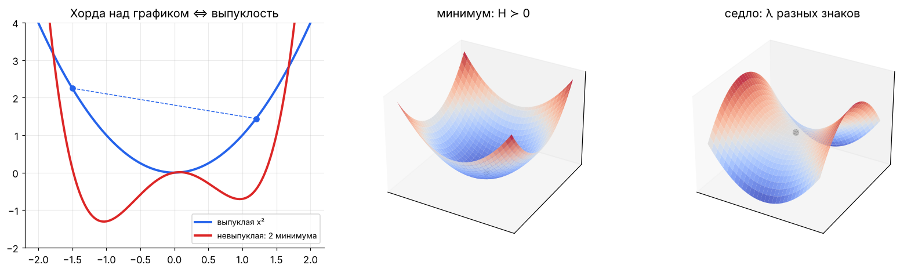
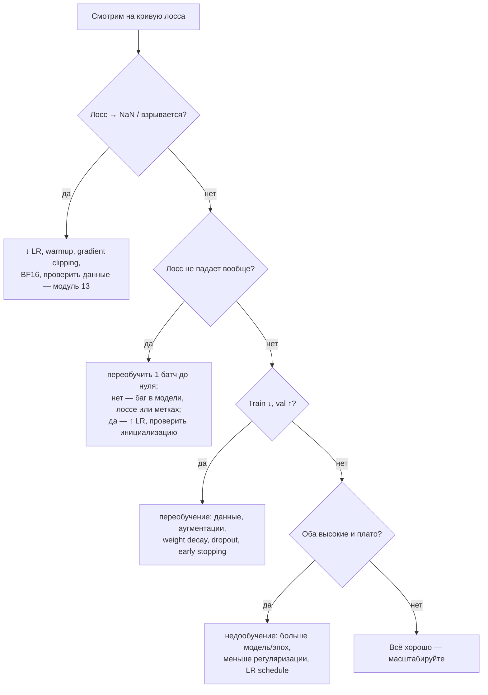

[← 04. Backpropagation и автодифференцирование](04_backprop.md) · [🏠 Оглавление](../README.md#-оглавление) · [06. Теория вероятностей →](06_probability.md)

<a id="m05"></a>

# 05. Оптимизация: от градиентного спуска до AdamW

> 📓 [Ноутбук модуля](../notebooks/05_optimization.ipynb) · [](https://colab.research.google.com/github/justxor/math-for-ai-2026/blob/main/notebooks/05_optimization.ipynb)

> Обучение = минимизация эмпирического риска $\min_\theta \frac{1}{N}\sum_i \ell(f_\theta(\mathbf{x}_i), y_i) + \lambda R(\theta)$. Этот модуль — о том, как делать шаги к минимуму быстро и устойчиво.

## Градиентный спуск

```math
\theta_{t+1} = \theta_t - \eta\, \nabla_\theta L(\theta_t)
```

$\eta$ — **learning rate**, самый важный гиперпараметр.


**Почему зигзаг.** У лосса $L = \frac{1}{2}(a x^2 + b y^2)$ кривизна по осям $a$ и $b$. Шаг устойчив только при $\eta < 2/\lambda_{\max}$, а скорость сходимости по пологому направлению — $(1 - \eta\lambda_{\min})$ за шаг. Итог: число шагов ∝ числу обусловленности $\kappa = \lambda_{\max}/\lambda_{\min}$. На картинке $\kappa = 8$: при $\eta = 0.24$ (почти $2/8 = 0.25$) — зигзаг поперёк, при малом η — ползём вдоль.

**Отсюда практические выводы:**
- Нормировать признаки (StandardScaler) — уменьшает κ для линейных моделей.
- BatchNorm/LayerNorm делают ландшафт «круглее».
- Адаптивные методы (Adam) масштабируют шаг по каждой координате.

## Стохастический градиентный спуск (SGD)

Полный градиент по миллиардам примеров — дорого. Берём мини-батч $B$:

```math
\mathbf{g}_t = \frac{1}{|B|}\sum_{i \in B} \nabla_\theta \ell_i(\theta_t), \qquad \mathbb{E}[\mathbf{g}_t] = \nabla L(\theta_t)
```

- Несмещённая оценка, дисперсия $\propto 1/|B|$.
- Шум **помогает**: выбивает из острых минимумов и седловых точек, острые минимумы обобщают хуже плоских.
- **Линейное правило масштабирования:** увеличил батч в k раз — увеличь η примерно в k раз (до некоторого предела; для Adam ближе к $\sqrt{k}$) — и добавь warmup.

## Momentum и Nesterov

```math
\mathbf{v}_{t+1} = \beta\,\mathbf{v}_t + \mathbf{g}_t, \qquad \theta_{t+1} = \theta_t - \eta\,\mathbf{v}_{t+1}
```

«Тяжёлый шарик»: накапливает скорость вдоль устойчивого направления, гасит колебания поперёк. β = 0.9 ≈ усреднение за последние 10 шагов. **Nesterov** считает градиент в «заглянутой вперёд» точке $\theta_t - \eta\beta\mathbf{v}_t$ — меньше проскакивает.

## Адаптивные методы

| Метод | Идея | Обновление |
|-------|------|------------|
| AdaGrad | делить на накопленную сумму квадратов градиентов | шаг только уменьшается — для разреженных признаков |
| RMSProp | то же, но EMA вместо суммы | $\mathbf{s} \leftarrow \beta\mathbf{s} + (1-\beta)\mathbf{g}^2$, шаг $\eta\,\mathbf{g}/\sqrt{\mathbf{s}}$ |
| **Adam** | momentum + RMSProp + коррекция смещения | ниже |
| **AdamW** | Adam + weight decay отдельно от градиента | стандарт для трансформеров |
| Lion, Sophia, Muon, Shampoo/SOAP | знак/ортогонализация/предобусловливание | экономнее по памяти или быстрее на LLM |

### Adam — выучить наизусть

```math
\begin{aligned}
\mathbf{m}_t &= \beta_1 \mathbf{m}_{t-1} + (1-\beta_1)\,\mathbf{g}_t && \text{(среднее — направление)}\\
\mathbf{v}_t &= \beta_2 \mathbf{v}_{t-1} + (1-\beta_2)\,\mathbf{g}_t^2 && \text{(средний квадрат — масштаб)}\\
\hat{\mathbf{m}}_t &= \frac{\mathbf{m}_t}{1-\beta_1^t}, \quad \hat{\mathbf{v}}_t = \frac{\mathbf{v}_t}{1-\beta_2^t} && \text{(коррекция: } \mathbf{m}_0 = \mathbf{v}_0 = 0\text{)}\\
\theta_t &= \theta_{t-1} - \eta\,\frac{\hat{\mathbf{m}}_t}{\sqrt{\hat{\mathbf{v}}_t} + \epsilon} - \eta\,\lambda\,\theta_{t-1} && \text{(последний член — только в AdamW)}
\end{aligned}
```

Типичные значения: $\beta_1 = 0.9$, $\beta_2 = 0.999$ (для LLM часто 0.95), $\epsilon = 10^{-8}$, $\lambda = 0.01\text{–}0.1$.


**Почему AdamW, а не Adam + L2.** В Adam L2-штраф $\lambda\theta$ попадает в градиент и затем делится на $\sqrt{\hat{\mathbf{v}}}$: у параметров с большими градиентами регуляризация слабее. AdamW вычитает $\eta\lambda\theta$ напрямую — затухание весов одинаковое для всех (Loshchilov & Hutter, 2019).

**Память:** Adam хранит $\mathbf{m}$ и $\mathbf{v}$ — ещё 2 копии размера модели. Для 7B-модели в fp32 это +56 ГБ — поэтому есть 8-битный Adam, Adafactor и шардирование оптимизатора (ZeRO).

## Learning rate schedule


- **Warmup** (первые 1–5% шагов): в начале $\hat{\mathbf{v}}$ оценена плохо, а веса случайны — большой шаг опасен.
- **Cosine decay** до ~10% от пика: большие шаги исследуют, маленькие — «доводят» в минимум.
- **WSD** (warmup–stable–decay): постоянный LR с быстрым спадом в конце — популярно для LLM, позволяет продолжать обучение с любого чекпойнта.
- **LR range test:** растить η экспоненциально и смотреть, где лосс начинает расти, — рабочий LR на порядок ниже.

## Выпуклость

Функция выпукла, если отрезок между любыми двумя точками графика лежит не ниже графика:

```math
f(\lambda \mathbf{x} + (1-\lambda)\mathbf{y}) \le \lambda f(\mathbf{x}) + (1-\lambda) f(\mathbf{y}), \quad \lambda \in [0, 1]
```

Для дважды дифференцируемой: гессиан положительно полуопределён везде. **У выпуклой функции любой локальный минимум — глобальный.**

| Выпуклые задачи | Невыпуклые |
|-----------------|------------|
| линейная/логистическая регрессия, SVM, Lasso, Ridge | нейросети, k-means, матричная факторизация |

Почему нейросети всё равно обучаются: в огромной размерности почти все критические точки — седловые, а локальные минимумы, которые находит SGD, имеют близкий лосс. Перепараметризованные сети часто могут достичь нулевой ошибки на обучении.



### 🗺️ Схема: лосс ведёт себя странно — что делать



## Регуляризация

```math
\min_\theta\ L(\theta) + \lambda \lVert\theta\rVert_2^2 \ \ (\text{Ridge}) \qquad\qquad \min_\theta\ L(\theta) + \lambda \lVert\theta\rVert_1 \ \ (\text{Lasso})
```


Эквивалентная форма — ограничение $\lVert\theta\rVert \le c$: минимум — точка касания линий уровня лосса с «шаром» нормы. У L1-шара (ромба) есть углы на осях → решения часто разреженные. Байесовски: L2 = гауссовский априор на веса, L1 = лапласовский (модуль 07).

Другие регуляризаторы в DL: dropout, early stopping, data augmentation, label smoothing, weight decay.

## Условная оптимизация: множители Лагранжа

Задача $\min f(\mathbf{x})$ при $g(\mathbf{x}) = 0$. В оптимуме градиенты параллельны:

```math
\nabla f = \lambda \nabla g \quad\Longleftrightarrow\quad \nabla_{\mathbf{x}, \lambda}\, \mathcal{L} = 0, \quad \mathcal{L}(\mathbf{x}, \lambda) = f(\mathbf{x}) - \lambda g(\mathbf{x})
```

Для неравенств — условия ККТ (Каруша–Куна–Таккера). Где в ML: вывод SVM и его двойственной задачи, максимальная энтропия, PCA как $\max \mathbf{w}^\top C\mathbf{w}$ при $\lVert\mathbf{w}\rVert = 1$ (ответ: собственный вектор $C$), ограничения в RLHF/PPO (KL-штраф как множитель Лагранжа).

## 🎯 На собеседовании

1. **Почему LR так важен и как его выбирать?** — Слишком большой: расходимость/осцилляции; маленький: медленно и застревание. LR range test, warmup, cosine/WSD.
2. **Adam vs SGD+momentum?** — Adam быстрее и устойчивее «из коробки», стандарт для трансформеров; SGD+momentum на CNN иногда обобщает лучше. Adam требует 2× памяти на состояние.
3. **Зачем коррекция смещения в Adam?** — $\mathbf{m}_0 = 0$, и первые оценки смещены к нулю в $(1 - \beta^t)$ раз.
4. **Как батч влияет на обучение?** — Больше батч → меньше шум, можно больший LR, но после «критического размера батча» выигрыш пропадает.
5. **Почему нейросеть с невыпуклым лоссом вообще сходится?** — Седловые точки, а не плохие минимумы; шум SGD; перепараметризация.

## 🏋️ Практика модуля

**5.1.** Для $L(x) = 3x^2$ найдите максимальный learning rate, при котором GD сходится, и оптимальный.

<details><summary>▶️ Решение</summary>

$L'(x) = 6x$, шаг: $x_{t+1} = x_t - 6\eta x_t = (1 - 6\eta)\,x_t$. Сходится при $\lvert 1 - 6\eta\rvert < 1 \Leftrightarrow 0 < \eta < 1/3$. Оптимум $\eta = 1/6$: за **один** шаг в минимум (это $\eta = 1/L''$ — шаг Ньютона).
</details>

**5.2.** Реализуйте Adam на NumPy и минимизируйте функцию Розенброка $f(x,y) = (1-x)^2 + 100(y-x^2)^2$ из точки (−1.5, 2).

<details><summary>▶️ Решение</summary>

```python
import numpy as np
f = lambda p: (1 - p[0])**2 + 100 * (p[1] - p[0]**2)**2
grad = lambda p: np.array([-2 * (1 - p[0]) - 400 * p[0] * (p[1] - p[0]**2), 200 * (p[1] - p[0]**2)])

p = np.array([-1.5, 2.0]); m = v = np.zeros(2)
lr, b1, b2, eps = 0.02, 0.9, 0.999, 1e-8
for t in range(1, 20001):
    g = grad(p)
    m = b1 * m + (1 - b1) * g
    v = b2 * v + (1 - b2) * g**2
    p = p - lr * (m / (1 - b1**t)) / (np.sqrt(v / (1 - b2**t)) + eps)
print(p, f(p))   # ≈ [1, 1], f ≈ 0
```
Попробуйте тот же старт с обычным GD: при lr > ~0.001 он расходится, а при меньшем ползёт по «банановой» долине десятки тысяч шагов.
</details>

**5.3.** Через сколько шагов коррекция смещения Adam становится несущественной (< 1%) для $\beta_2 = 0.999$?

<details><summary>▶️ Решение</summary>

$1 - \beta_2^t > 0.99 \Leftrightarrow 0.999^t < 0.01 \Leftrightarrow t > \ln 0.01 / \ln 0.999 \approx 4603$ шага. Для $\beta_1 = 0.9$ — всего ~44 шага.
</details>

---

[← 04. Backpropagation и автодифференцирование](04_backprop.md) · [🏠 Оглавление](../README.md#-оглавление) · [06. Теория вероятностей →](06_probability.md)
