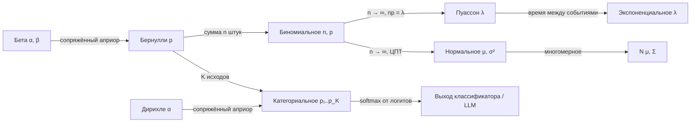

[← 05. Оптимизация: от градиентного спуска до AdamW](05_optimization.md) · [🏠 Оглавление](../README.md#-оглавление) · [07. Статистика: оценки, MLE/MAP, A/B-тесты →](07_statistics.md)

<a id="m06"></a>

# 06. Теория вероятностей

> 📓 [Ноутбук модуля](../notebooks/06_probability.ipynb) · [](https://colab.research.google.com/github/justxor/math-for-ai-2026/blob/main/notebooks/06_probability.ipynb)

> Классификатор выдаёт распределение $p(y \mid \mathbf{x})$, языковая модель — $p(\text{следующий токен} \mid \text{контекст})$, диффузия учит $p(\text{изображение})$. Вероятность — язык, на котором ML описывает неопределённость.

## Базовые правила

```math
\begin{aligned}
&\text{Сумма (маргинализация):} && p(x) = \sum_y p(x, y) \quad\text{или}\quad \int p(x, y)\,dy\\
&\text{Произведение:} && p(x, y) = p(x \mid y)\,p(y) = p(y \mid x)\,p(x)\\
&\text{Независимость:} && p(x, y) = p(x)\,p(y) \iff p(x \mid y) = p(x)\\
&\text{Цепное правило:} && p(x_1, \dots, x_n) = \prod_{t=1}^{n} p(x_t \mid x_1, \dots, x_{t-1})
\end{aligned}
```

**Последняя строка — это вся авторегрессионная языковая модель.** GPT моделирует каждый множитель $p(x_t \mid x_{\lt t})$ и генерирует токены по одному.

## Формула Байеса

```math
\underbrace{p(\theta \mid D)}_{\text{апостериорное}} = \frac{\overbrace{p(D \mid \theta)}^{\text{правдоподобие}}\ \overbrace{p(\theta)}^{\text{априорное}}}{\underbrace{p(D)}_{\text{evidence}}} \;\propto\; p(D \mid \theta)\, p(\theta)
```

### Классическая задача (спрашивают постоянно)

Болезнь у 1% людей. Тест находит её в 99% случаев (чувствительность) и даёт ложное срабатывание у 5% здоровых. Тест положительный — какова вероятность болезни?

```math
P(\text{б} \mid +) = \frac{0.99 \cdot 0.01}{0.99 \cdot 0.01 + 0.05 \cdot 0.99} = \frac{0.0099}{0.0099 + 0.0495} \approx 16.7\%
```

**Интуиция через 10 000 человек:** 100 больных → 99 положительных; 9 900 здоровых → 495 ложных положительных. Из 594 положительных больны 99 ≈ 1/6. Редкое событие + неидеальный тест = большинство тревог ложные. Это же явление — в precision при дисбалансе классов (модуль 09).

## Случайные величины, матожидание, дисперсия

```math
\mathbb{E}[X] = \sum_x x\,p(x), \qquad \mathrm{Var}[X] = \mathbb{E}\bigl[(X - \mathbb{E}X)^2\bigr] = \mathbb{E}[X^2] - (\mathbb{E}X)^2
```

**Свойства (часто нужны в выводах):**
- $\mathbb{E}[aX + bY] = a\mathbb{E}X + b\mathbb{E}Y$ — **всегда**, даже для зависимых.
- $\mathrm{Var}[aX] = a^2\mathrm{Var}X$.
- $\mathrm{Var}[X + Y] = \mathrm{Var}X + \mathrm{Var}Y + 2\mathrm{Cov}(X, Y)$; для независимых ковариация 0.
- Среднее $n$ независимых: $\mathrm{Var}[\bar{X}] = \sigma^2/n$, стандартная ошибка $\sigma/\sqrt{n}$.

**Применение — инициализация весов.** Нейрон $z = \sum_{i=1}^{n} w_i x_i$ с независимыми $w_i, x_i$ нулевого среднего: $\mathrm{Var}[z] = n\mathrm{Var}[w]\mathrm{Var}[x]$. Чтобы дисперсия не росла и не падала от слоя к слою, нужно $\mathrm{Var}[w] = 1/n$ — **Xavier/LeCun**. ReLU обнуляет половину — нужно $2/n$ — **He**-инициализация.

**Ковариация и корреляция:**

```math
\mathrm{Cov}(X, Y) = \mathbb{E}[(X - \mu_X)(Y - \mu_Y)], \qquad \rho = \frac{\mathrm{Cov}(X, Y)}{\sigma_X \sigma_Y} \in [-1, 1]
```

Корреляция ловит только **линейную** зависимость: $Y = X^2$ при симметричном $X$ даёт $\rho = 0$, хотя $Y$ полностью определяется $X$.

## Распределения — зоопарк, который нужно знать


| Распределение | Параметры | $\mathbb{E}$ | Var | Где в ML |
|---------------|-----------|-------------|-----|----------|
| Бернулли | $p$ | $p$ | $p(1-p)$ | бинарная классификация, dropout-маска |
| Категориальное | $\mathbf{p} \in \Delta^{K}$ | — | — | softmax-выход, следующий токен |
| Биномиальное | $n, p$ | $np$ | $np(1-p)$ | число успехов, A/B-тест |
| Пуассон | $\lambda$ | $\lambda$ | $\lambda$ | счётчики событий, редкие события |
| Равномерное | $a, b$ | $\frac{a+b}{2}$ | $\frac{(b-a)^2}{12}$ | инициализация, сэмплирование |
| Нормальное | $\mu, \sigma^2$ | $\mu$ | $\sigma^2$ | шум, VAE, диффузия, инициализация |
| Экспоненциальное | $\lambda$ | $1/\lambda$ | $1/\lambda^2$ | время между событиями |
| Бета | $\alpha, \beta$ | $\frac{\alpha}{\alpha+\beta}$ | — | априор для вероятности, Thompson sampling |
| Дирихле | $\mathbf{\alpha}$ | $\alpha_i / \sum\alpha$ | — | априор над категориальным, LDA |
| Лапласа | $\mu, b$ | $\mu$ | $2b^2$ | MAE ↔ L1 |

### 🗺️ Схема: как распределения связаны друг с другом



### Нормальное распределение

```math
\mathcal{N}(x \mid \mu, \sigma^2) = \frac{1}{\sqrt{2\pi\sigma^2}} \exp\left(-\frac{(x-\mu)^2}{2\sigma^2}\right)
```

Правило 68–95–99.7: в $\mu \pm \sigma, \pm 2\sigma, \pm 3\sigma$ лежит 68%, 95%, 99.7% массы.

### Многомерное нормальное

```math
\mathcal{N}(\mathbf{x} \mid \mathbf{\mu}, \Sigma) = \frac{1}{(2\pi)^{d/2} |\Sigma|^{1/2}} \exp\left(-\tfrac{1}{2} (\mathbf{x}-\mathbf{\mu})^\top \Sigma^{-1} (\mathbf{x}-\mathbf{\mu})\right)
```


- Линии уровня — эллипсы; оси эллипса — собственные векторы $\Sigma$, полуоси ∝ $\sqrt{\lambda_i}$ (связь с PCA).
- **Репараметризация:** $\mathbf{x} = \mathbf{\mu} + L\mathbf{\varepsilon}$, $\mathbf{\varepsilon} \sim \mathcal{N}(0, I)$, $LL^\top = \Sigma$ (Холецкий). Это «reparameterization trick» в VAE — случайность вынесена в $\mathbf{\varepsilon}$, и градиент проходит через $\mathbf{\mu}, L$.
- Сумма независимых нормальных — нормальная; маргинальные и условные распределения — нормальные (гауссовские процессы, фильтр Калмана).

## Закон больших чисел и ЦПТ

**ЗБЧ:** выборочное среднее сходится к матожиданию. Поэтому мини-батч оценивает градиент, Монте-Карло оценивает интегралы: $\mathbb{E}[f(X)] \approx \frac{1}{n}\sum f(x_i)$, ошибка $\sim 1/\sqrt{n}$ **независимо от размерности**.

**ЦПТ:** сумма/среднее многих независимых величин с конечной дисперсией ≈ нормальное:

```math
\sqrt{n}\,(\bar{X}_n - \mu) \xrightarrow{d} \mathcal{N}(0, \sigma^2)
```


Отсюда доверительные интервалы и z-тесты в A/B (модуль 07).

## Сэмплирование

| Метод | Идея | Где |
|-------|------|-----|
| Обратная функция распределения | $x = F^{-1}(u)$, $u \sim U(0,1)$ | генераторы случайных чисел |
| Gumbel-max | $\arg\max_i (z_i + g_i)$, $g_i \sim \text{Gumbel}$ ~ категориальное(softmax z) | Gumbel-softmax, дифференцируемый дискретный выбор |
| Importance sampling | $\mathbb{E}_p[f] = \mathbb{E}_q[f\,p/q]$ | off-policy RL, PPO-отношение $\pi/\pi_{\text{old}}$ |
| MCMC (Metropolis, HMC) | цепь Маркова со стационарным $p$ | байесовский вывод |
| Langevin dynamics | $\mathbf{x} \leftarrow \mathbf{x} + \frac{\eta}{2}\nabla\log p(\mathbf{x}) + \sqrt{\eta}\,\mathbf{\varepsilon}$ | score-based диффузия |

## 🎯 На собеседовании

1. **Задача про тест на болезнь** (см. выше) — в разных вариациях.
2. **Независимость vs некоррелированность?** — Независимость ⇒ некоррелированность, обратное неверно (кроме совместно нормальных).
3. **Зачем He-инициализация?** — Сохранить дисперсию активаций при ReLU: $\mathrm{Var}[w] = 2/n_{\text{in}}$.
4. **Что такое reparameterization trick?** — $z = \mu + \sigma\varepsilon$ вместо $z \sim \mathcal{N}(\mu, \sigma^2)$: случайность не зависит от параметров, поэтому градиент проходит.
5. **Монетка: сколько бросков до первого орла в среднем?** — Геометрическое распределение, $1/p = 2$.

## 🏋️ Практика модуля

**6.1.** Две монеты: честная и с двумя орлами. Взяли случайную, бросили 3 раза — 3 орла. Вероятность, что монета нечестная?

<details><summary>▶️ Решение</summary>

```math
P(\text{нечестн.} \mid HHH) = \frac{1 \cdot \tfrac{1}{2}}{1 \cdot \tfrac{1}{2} + \tfrac{1}{8} \cdot \tfrac{1}{2}} = \frac{8}{9} \approx 0.89
```
</details>

**6.2.** Проверьте моделированием: при какой дисперсии весов сигнал не затухает через 50 слоёв ReLU (ширина 512)?

<details><summary>▶️ Решение</summary>

```python
import numpy as np
x0 = np.random.randn(1000, 512)
for name, std in [("0.01", 0.01), ("Xavier 1/n", np.sqrt(1/512)), ("He 2/n", np.sqrt(2/512))]:
    x = x0
    for _ in range(50):
        x = np.maximum(0, x @ (np.random.randn(512, 512) * std))
    print(f"{name:12s} std активаций после 50 слоёв: {x.std():.2e}")
# 0.01 → ~0, Xavier → затухает в ~2^25 раз, He → порядка 1
```
</details>

**6.3.** Оцените π методом Монте-Карло и найдите, сколько точек нужно для точности 0.001.

<details><summary>▶️ Решение</summary>

```python
u = np.random.rand(1_000_000, 2)
pi_hat = 4 * ((u**2).sum(1) < 1).mean()
```
Индикатор попадания — Бернулли с $p = \pi/4$; стандартная ошибка оценки $4\sqrt{p(1-p)/n} \approx 1.64/\sqrt{n}$. Для 0.001 (одна σ) нужно $n \approx 2.7$ млн точек; каждая лишняя цифра точности — в 100 раз больше точек.
</details>

---

[← 05. Оптимизация: от градиентного спуска до AdamW](05_optimization.md) · [🏠 Оглавление](../README.md#-оглавление) · [07. Статистика: оценки, MLE/MAP, A/B-тесты →](07_statistics.md)
