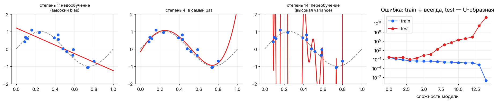
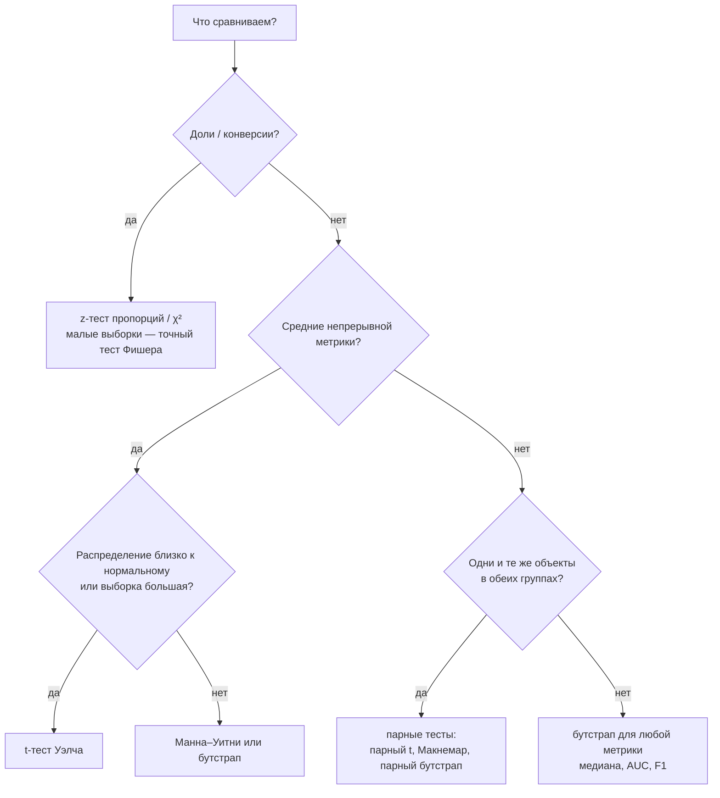

[← 06. Теория вероятностей](06_probability.md) · [🏠 Оглавление](../README.md#-оглавление) · [08. Теория информации: энтропия, кросс-энтропия, KL →](08_information_theory.md)

<a id="m07"></a>

# 07. Статистика: оценки, MLE/MAP, A/B-тесты

> 📓 [Ноутбук модуля](../notebooks/07_statistics.ipynb) · [](https://colab.research.google.com/github/justxor/math-for-ai-2026/blob/main/notebooks/07_statistics.ipynb)

> Вероятность: «знаем модель — какие будут данные?». Статистика: «видим данные — какая модель?». Обучение модели — статистическое оценивание параметров.

## Метод максимального правдоподобия (MLE)

```math
\hat{\theta}_{\text{MLE}} = \arg\max_\theta \prod_{i=1}^{N} p(y_i \mid \mathbf{x}_i, \theta) = \arg\min_\theta \underbrace{-\sum_{i=1}^{N} \log p(y_i \mid \mathbf{x}_i, \theta)}_{\text{NLL — negative log-likelihood}}
```

**Главная идея курса: почти каждый лосс — это NLL какого-то распределения.**

| Предположение о шуме $p(y \mid \mathbf{x})$ | NLL превращается в | Модель |
|---------------------------------------------|--------------------|--------|
| $\mathcal{N}(f(\mathbf{x}), \sigma^2)$ | **MSE** | линейная регрессия |
| Laplace$(f(\mathbf{x}), b)$ | **MAE** | робастная регрессия |
| Bernoulli$(\sigma(f(\mathbf{x})))$ | **binary cross-entropy** | логистическая регрессия |
| Categorical$(\mathrm{softmax}(f(\mathbf{x})))$ | **cross-entropy** | классификаторы, LLM |
| Poisson$(e^{f(\mathbf{x})})$ | Poisson loss | прогноз счётчиков |

**Вывод для гауссовского шума:**

```math
-\log \prod_i \frac{1}{\sqrt{2\pi\sigma^2}} e^{-\frac{(y_i - f(\mathbf{x}_i))^2}{2\sigma^2}} = \frac{1}{2\sigma^2}\sum_i (y_i - f(\mathbf{x}_i))^2 + \text{const}
```

### Простые MLE, которые просят вывести

- Монета, $k$ орлов из $n$: $\hat{p} = k/n$.
- Нормальное: $\hat{\mu} = \bar{x}$, $\hat{\sigma}^2 = \frac{1}{n}\sum(x_i - \bar{x})^2$ — **смещённая** (несмещённая — делить на $n-1$, поправка Бесселя).
- Пуассон: $\hat{\lambda} = \bar{x}$.

## MAP и регуляризация

Добавим априорное распределение на параметры:

```math
\hat{\theta}_{\text{MAP}} = \arg\max_\theta\ p(\theta \mid D) = \arg\min_\theta \Bigl[ -\log p(D \mid \theta) - \log p(\theta) \Bigr]
```

| Априор $p(\theta)$ | $-\log p(\theta)$ | Регуляризация |
|--------------------|-------------------|---------------|
| $\mathcal{N}(0, \tau^2 I)$ | $\frac{1}{2\tau^2}\lVert\theta\rVert_2^2$ | **L2 / Ridge / weight decay** |
| Laplace$(0, b)$ | $\frac{1}{b}\lVert\theta\rVert_1$ | **L1 / Lasso** |

Сила регуляризации $\lambda$ = отношение дисперсии шума к дисперсии априора: чем меньше данных или чем «уже» априор, тем сильнее тянем веса к нулю.

**Пример: сглаживание Лапласа.** MLE монеты после 3 орлов из 3 — $\hat{p} = 1$, т.е. «решка невозможна». С априором Beta(2, 2) апостериорное — Beta(5, 2), MAP: $\hat{p} = 4/5$. В NLP это add-one smoothing для частот n-грамм.

## Байесовский подход целиком

Вместо точки — всё распределение $p(\theta \mid D)$. Предсказание усредняет по моделям:

```math
p(y \mid \mathbf{x}, D) = \int p(y \mid \mathbf{x}, \theta)\, p(\theta \mid D)\, d\theta
```

Даёт оценку неопределённости. На практике в DL приближают: ансамбли, MC-dropout, Laplace approximation, вариационный вывод (модуль 12).

## Смещение и разброс (bias–variance)

Для квадратичной ошибки ожидаемая ошибка на новой точке раскладывается:

```math
\mathbb{E}\bigl[(y - \hat{f}(\mathbf{x}))^2\bigr] = \underbrace{\bigl(f(\mathbf{x}) - \mathbb{E}\hat{f}(\mathbf{x})\bigr)^2}_{\text{bias}^2} + \underbrace{\mathrm{Var}\bigl[\hat{f}(\mathbf{x})\bigr]}_{\text{variance}} + \underbrace{\sigma^2}_{\text{неустранимый шум}}
```



- **Высокий bias** (недообучение): train и test ошибки обе высокие → сложнее модель, больше признаков, меньше регуляризации.
- **Высокая variance** (переобучение): train низкая, test высокая → больше данных, регуляризация, проще модель, ансамбли (бэггинг снижает variance).
- **Double descent:** у сильно перепараметризованных моделей (нейросети) после пика на «пороге интерполяции» test-ошибка снова падает — классическая U-кривая не вся история.

> 🔴 **Глубже:** у сильно перепараметризованных моделей картинка сложнее — см. [double descent в модуле 16](16_learning_theory.md#m16).

## Доверительные интервалы и проверка гипотез

**95% доверительный интервал для среднего** (большая выборка, по ЦПТ):

```math
\bar{x} \pm 1.96 \cdot \frac{s}{\sqrt{n}}
```

Интерпретация: если повторять эксперимент много раз, 95% таких интервалов накроют истинное значение (а **не** «истинное значение лежит в интервале с вероятностью 95%»).

**Проверка гипотез:**
1. $H_0$ — «эффекта нет» (конверсии A и B равны).
2. Статистика — насколько данные далеки от $H_0$.
3. **p-value** — вероятность получить такое же или более экстремальное значение статистики, **если $H_0$ верна**. Это **не** вероятность того, что $H_0$ верна.
4. Если p < α (обычно 0.05) — отвергаем $H_0$.

| | $H_0$ верна | $H_0$ неверна |
|---|---|---|
| Отвергли $H_0$ | ошибка I рода (α) — ложная тревога | ✅ мощность $1-\beta$ |
| Не отвергли | ✅ | ошибка II рода (β) — пропуск эффекта |

### 🗺️ Схема: какой статистический тест выбрать



## A/B-тест на конверсию

```math
z = \frac{\hat{p}_B - \hat{p}_A}{\sqrt{\hat{p}(1-\hat{p})\left(\frac{1}{n_A} + \frac{1}{n_B}\right)}}, \qquad \hat{p} = \frac{x_A + x_B}{n_A + n_B}
```

**Размер выборки** на группу для детекции абсолютного эффекта $\delta$ при α = 0.05 и мощности 80%:

```math
n \approx \frac{2\,(z_{1-\alpha/2} + z_{1-\beta})^2\, p(1-p)}{\delta^2} \approx \frac{16\, p(1-p)}{\delta^2}
```

Пример: базовая конверсия 5%, хотим заметить рост до 5.5% (δ = 0.005): $n \approx 16 \cdot 0.0475 / 0.000025 \approx 30\,400$ на группу.

**Ловушки A/B (любимая тема интервьюеров):**
- **Подглядывание (peeking):** смотреть p-value каждый день и остановиться при p < 0.05 — ложных открытий намного больше 5%. Решения: фиксированный горизонт, последовательные тесты, байесовский подход.
- **Множественные сравнения:** 20 метрик → одна «значимая» случайно. Поправки Бонферрони ($\alpha/m$), Холма, контроль FDR (Бенджамини–Хохберг).
- **SRM (sample ratio mismatch):** группы 50/50 по дизайну, а получилось 48/52 — баг в раздаче, результатам верить нельзя.
- **Сетевые эффекты, новизна, сезонность.**
- **CUPED** — снижение дисперсии через ковариату до эксперимента (типично −30–50% к нужной выборке).

## Бутстрап

Нет формулы для доверительного интервала (медиана, AUC, F1)? Пересэмплируй данные с возвращением:

```python
import numpy as np
def bootstrap_ci(x, stat=np.median, B=10_000, alpha=0.05):
    rng = np.random.default_rng(0)
    stats = [stat(rng.choice(x, size=len(x), replace=True)) for _ in range(B)]
    return np.quantile(stats, [alpha / 2, 1 - alpha / 2])

latency = np.random.lognormal(3, 0.8, 500)
print(bootstrap_ci(latency))                    # 95% ДИ медианной задержки
```

Для сравнения двух моделей на одном тест-сете — **парный** бутстрап: сэмплируем индексы примеров и считаем разницу метрик на одних и тех же индексах.

## 🎯 На собеседовании

1. **MLE vs MAP?** — MAP = MLE + log-априор; априор = регуляризация.
2. **Почему MSE для регрессии, CE для классификации?** — Это NLL гауссовской и категориальной моделей шума.
3. **Что такое p-value?** — Вероятность данных не менее экстремальных при верной $H_0$. Не вероятность $H_0$.
4. **Как понять, переобучилась ли модель?** — Сравнить train/val кривые; разрыв растёт — variance.
5. **A/B-тест показал p = 0.04 на 7-й день, планировали 14. Катим?** — Нет: подглядывание завышает ошибку I рода; дождаться плана или использовать последовательный тест.

## 🏋️ Практика модуля

**7.1.** Выведите MLE параметра $p$ Бернулли по $n$ наблюдениям с $k$ единицами.

<details><summary>▶️ Решение</summary>

```math
\ell(p) = k \log p + (n - k)\log(1 - p), \qquad \ell'(p) = \frac{k}{p} - \frac{n-k}{1-p} = 0 \;\Rightarrow\; \hat{p} = \frac{k}{n}
```
</details>

**7.2.** A: 200 конверсий из 4000, B: 250 из 4000. Значима ли разница на уровне 0.05?

<details><summary>▶️ Решение</summary>

```python
import numpy as np
from scipy import stats
xa, na, xb, nb = 200, 4000, 250, 4000
p = (xa + xb) / (na + nb)
z = (xb / nb - xa / na) / np.sqrt(p * (1 - p) * (1 / na + 1 / nb))
print(z, 2 * (1 - stats.norm.cdf(abs(z))))   # z ≈ 2.43, p ≈ 0.015 → значимо
```
Ещё проверить: SRM, что тест не останавливали раньше, и практическую значимость: +1.25 п.п. (рост на 25%) стоит ли затрат на внедрение.
</details>

**7.3.** Покажите моделированием, что подглядывание раздувает ошибку I рода.

<details><summary>▶️ Решение</summary>

```python
rng = np.random.default_rng(0); false_pos = 0
for _ in range(2000):                          # 2000 A/A-тестов (эффекта нет)
    a = rng.random(14 * 1000) < 0.05; b = rng.random(14 * 1000) < 0.05
    for day in range(1, 15):                   # смотрим каждый день
        n = day * 1000; pa, pb = a[:n].mean(), b[:n].mean(); pp = (pa + pb) / 2
        z = (pb - pa) / np.sqrt(pp * (1 - pp) * 2 / n)
        if abs(z) > 1.96:
            false_pos += 1; break
print(false_pos / 2000)   # ≈ 0.2 вместо 0.05
```
</details>

---

[← 06. Теория вероятностей](06_probability.md) · [🏠 Оглавление](../README.md#-оглавление) · [08. Теория информации: энтропия, кросс-энтропия, KL →](08_information_theory.md)
