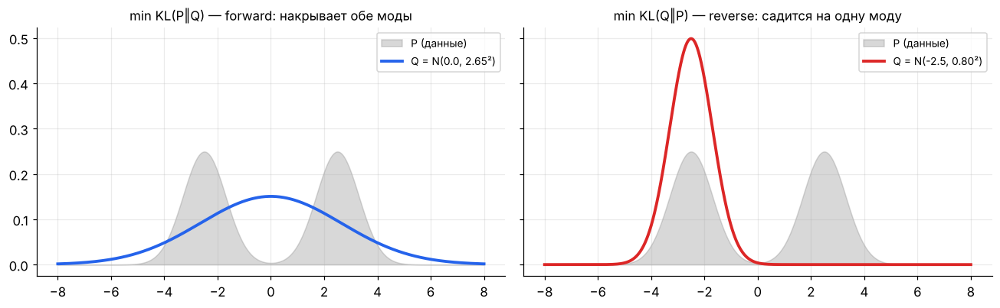
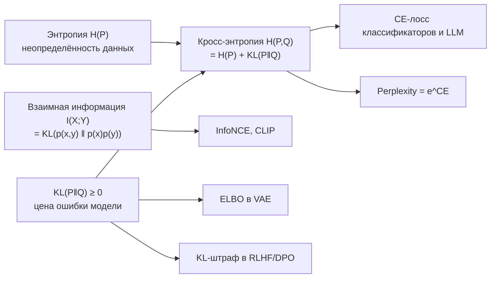

[← 07. Статистика: оценки, MLE/MAP, A/B-тесты](07_statistics.md) · [🏠 Оглавление](../README.md#-оглавление) · [09. Функции потерь и метрики →](09_losses_metrics.md)

<a id="m08"></a>

# 08. Теория информации: энтропия, кросс-энтропия, KL

> 📓 [Ноутбук модуля](../notebooks/08_information_theory.ipynb) · [](https://colab.research.google.com/github/justxor/math-for-ai-2026/blob/main/notebooks/08_information_theory.ipynb)

> Почему классификаторы и LLM обучают на cross-entropy? Что такое perplexity? Откуда KL-штраф в RLHF и VAE? Всё это — один модуль.

## Информация и энтропия

**Неожиданность** события с вероятностью $p$: $I(x) = -\log p(x)$. Редкое событие несёт больше информации; достоверное ($p = 1$) — ноль.

**Энтропия** — средняя неожиданность, мера неопределённости распределения:

```math
H(P) = -\sum_x p(x) \log p(x) = \mathbb{E}_{x \sim P}\bigl[-\log p(x)\bigr]
```

- Основание 2 — биты, $e$ — наты (в PyTorch по умолчанию наты).
- $0 \le H \le \log K$ для $K$ исходов; максимум у равномерного, минимум (0) у вырожденного.
- Смысл по Шеннону: минимальная средняя длина кода (в битах) для сообщений из $P$.


## Кросс-энтропия

Средняя длина кода, если данные из $P$, а код оптимален для $Q$:

```math
H(P, Q) = -\sum_x p(x) \log q(x) \;\ge\; H(P)
```

В классификации $P$ — one-hot правильный ответ, $Q$ — выход модели, и сумма схлопывается в один член: $H(P, Q) = -\log q(y_{\text{true}})$. **Это и есть CE-лосс**, он же NLL категориального распределения (модуль 07).

## KL-дивергенция

«Лишние биты» из-за использования $Q$ вместо $P$:

```math
D_{\mathrm{KL}}(P \,\parallel \, Q) = \sum_x p(x) \log \frac{p(x)}{q(x)} = H(P, Q) - H(P) \;\ge 0
```

Свойства:
- $D_{\mathrm{KL}} = 0 \iff P = Q$.
- **Несимметрична:** $D_{\mathrm{KL}}(P\parallel Q) \ne D_{\mathrm{KL}}(Q\parallel P)$ — это не расстояние.
- Поскольку $H(P)$ данных от модели не зависит, **минимизировать CE ⇔ минимизировать KL(данные ‖ модель) ⇔ MLE**.

### Прямая vs обратная KL — важно для генеративных моделей

| | Forward KL: $D(P_{\text{data}} \,\parallel \, Q_\theta)$ | Reverse KL: $D(Q_\theta \,\parallel \, P)$ |
|---|---|---|
| Штрафует | $q \approx 0$ там, где $p > 0$ | $q > 0$ там, где $p \approx 0$ |
| Поведение | **mass-covering**: накрывает все моды, «размазывает» | **mode-seeking**: садится на одну моду, острее |
| Где | MLE, обучение LLM | вариационный вывод (VAE), RLHF-штраф к референсной модели |

На правой картинке выше: унимодальная Q не может описать бимодальную P; forward KL растягивает Q на обе моды.



Это не рисунок от руки: обе гауссианы найдены перебором параметров, минимизирующих соответствующую KL. Forward KL «боится» пропустить массу P и растягивается на обе моды; reverse KL «боится» положить массу туда, где P ≈ 0, и выбирает одну моду.

### KL между нормальными — формула для VAE

```math
D_{\mathrm{KL}}\bigl(\mathcal{N}(\mu, \sigma^2) \,\parallel \, \mathcal{N}(0, 1)\bigr) = \tfrac{1}{2}\bigl(\mu^2 + \sigma^2 - 1 - \log \sigma^2\bigr)
```

## Взаимная информация

Сколько знание $Y$ уменьшает неопределённость $X$:

```math
I(X; Y) = H(X) - H(X \mid Y) = D_{\mathrm{KL}}\bigl(p(x, y) \,\parallel \, p(x)p(y)\bigr)
```

$I = 0 \iff X, Y$ независимы (ловит и нелинейные зависимости, в отличие от корреляции). Где: отбор признаков, information gain в деревьях решений (модуль 10), контрастное обучение — **InfoNCE** является нижней оценкой взаимной информации между двумя «видами» данных (CLIP, SimCLR).

### 🗺️ Схема: как связаны величины



## Perplexity — метрика языковых моделей

```math
\mathrm{PPL} = \exp\left( -\frac{1}{T} \sum_{t=1}^{T} \log p(x_t \mid x_{<t}) \right) = e^{\text{средний CE-лосс в натах}}
```

Интерпретация: модель в среднем «колеблется» между PPL равновероятными вариантами. Случайная модель со словарём 50 000 — PPL = 50 000; хорошая LLM на обычном тексте — единицы. Лосс 2.0 нат ⇒ PPL ≈ 7.4.

**Bits per byte / per character** — та же CE, нормированная на байты: позволяет сравнивать модели с разными токенизаторами.

## Связь со сжатием

Модель, предсказывающая следующий символ с CE = $H$ бит, позволяет (через арифметическое кодирование) сжать текст до ~$H$ бит на символ. **Хорошее предсказание = хорошее сжатие** — один из взглядов на то, почему языковое моделирование учит «понимать» данные.

## 🎯 На собеседовании

1. **Почему CE, а не MSE для классификации?** — CE = NLL категориальной модели (принципиально), выпуклая по логитам у логистической регрессии, градиент $\mathbf{p} - \mathbf{y}$ не затухает при уверенной ошибке; MSE с сигмоидой даёт градиент с множителем $\sigma'$, который ≈ 0 при насыщении.
2. **KL симметрична?** — Нет; объясни mode-covering vs mode-seeking.
3. **Как связаны CE, KL и энтропия?** — $H(P, Q) = H(P) + D_{\mathrm{KL}}(P\parallel Q)$.
4. **Что такое perplexity?** — $e^{\text{CE}}$, «эффективное число вариантов».
5. **Зачем KL-штраф в RLHF?** — Не дать политике уйти далеко от SFT-модели и «взломать» reward model.

## 🏋️ Практика модуля

**8.1.** Энтропия честного кубика? Распределения [0.5, 0.25, 0.125, 0.125]?

<details><summary>▶️ Решение</summary>

Кубик: $\log_2 6 \approx 2.585$ бит. Второе: $0.5 \cdot 1 + 0.25 \cdot 2 + 2 \cdot 0.125 \cdot 3 = 1.75$ бит — и оптимальный префиксный код с длинами 1, 2, 3, 3 (Хаффман) достигает ровно этого.
</details>

**8.2.** Модель для правильного класса выдаёт 0.9, 0.5 и 0.01. Какой CE-лосс в каждом случае?

<details><summary>▶️ Решение</summary>

$-\ln 0.9 = 0.105$, $-\ln 0.5 = 0.693$, $-\ln 0.01 = 4.6$. Уверенная ошибка штрафуется в ~44 раза сильнее мягкой уверенности 0.9 — поэтому модели с CE склонны к переуверенности на шумных метках, и применяют label smoothing.
</details>

**8.3.** Посчитайте KL в обе стороны для P = [0.9, 0.1], Q = [0.5, 0.5].

<details><summary>▶️ Решение</summary>

```python
import numpy as np
P, Q = np.array([0.9, 0.1]), np.array([0.5, 0.5])
kl = lambda a, b: np.sum(a * np.log(a / b))
print(kl(P, Q), kl(Q, P))   # 0.368, 0.511 — разные
```
</details>

---

[← 07. Статистика: оценки, MLE/MAP, A/B-тесты](07_statistics.md) · [🏠 Оглавление](../README.md#-оглавление) · [09. Функции потерь и метрики →](09_losses_metrics.md)
