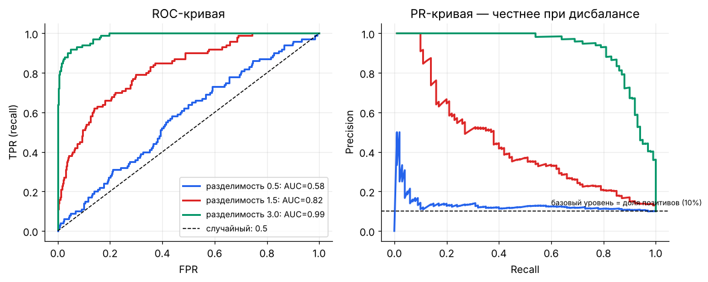
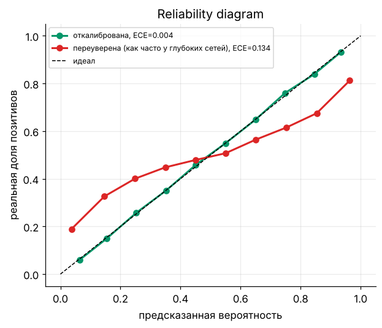
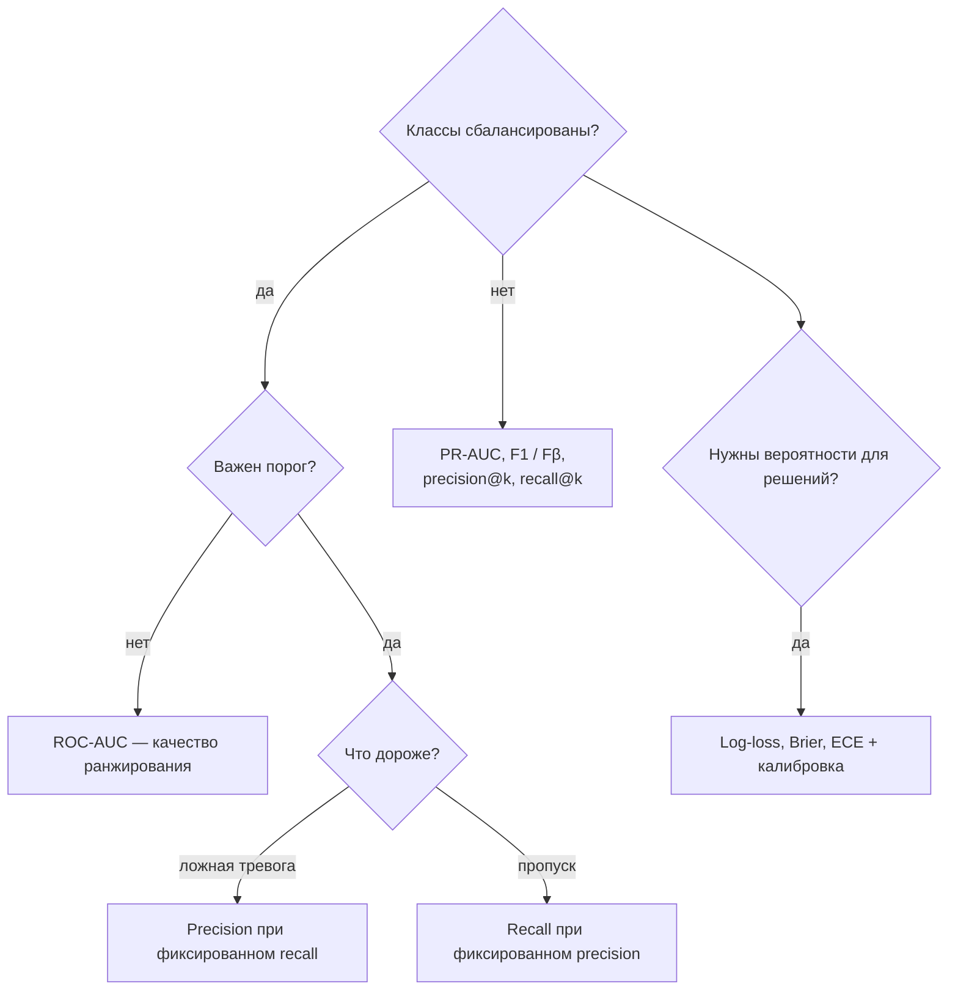

[← 08. Теория информации: энтропия, кросс-энтропия, KL](08_information_theory.md) · [🏠 Оглавление](../README.md#-оглавление) · [10. Математика классического ML →](10_classic_ml.md)

<a id="m09"></a>

# 09. Функции потерь и метрики

> 📓 [Ноутбук модуля](../notebooks/09_losses_metrics.ipynb) · [](https://colab.research.google.com/github/justxor/math-for-ai-2026/blob/main/notebooks/09_losses_metrics.ipynb)

> Лосс — то, что оптимизирует модель (должен быть дифференцируемым). Метрика — то, что важно бизнесу (может быть любой). Путать их — частая ошибка.

## Регрессия

| Лосс | Формула | Градиент по $\hat{y}$ | Свойства |
|------|---------|----------------------|----------|
| MSE | $(y - \hat{y})^2$ | $2(\hat{y} - y)$ | предсказывает **среднее**; чувствителен к выбросам |
| MAE | $\lvert y - \hat{y}\rvert$ | $\mathrm{sign}(\hat{y} - y)$ | предсказывает **медиану**; робастный; градиент не уменьшается у минимума |
| Huber | квадратичный при ошибке < δ, линейный дальше | ограничен | компромисс; Smooth L1 в детекции |
| Quantile (pinball) | $\max(\tau e, (\tau - 1)e)$, $e = y - \hat{y}$ | — | предсказывает **τ-квантиль**: интервалы прогноза |
| Log-cosh | $\log\cosh(\hat{y} - y)$ | $\tanh(\hat{y} - y)$ | гладкий Huber |

**Почему MSE → среднее, MAE → медиана:** минимизируем $\sum (y_i - c)^2$ по константе $c$: производная $-2\sum(y_i - c) = 0 \Rightarrow c = \bar{y}$. Для $\sum \lvert y_i - c\rvert$ производная — (число точек ниже $c$) − (число выше) = 0 ⇒ $c$ — медиана.

## Классификация

```math
\text{BCE} = -\bigl[y \log \sigma(z) + (1-y)\log(1 - \sigma(z))\bigr] = \log(1 + e^{z}) - yz \qquad \text{(стабильная форма по логиту } z)
```

```math
\text{CE} = -\log \mathrm{softmax}(\mathbf{z})_y = -z_y + \log\sum_j e^{z_j}
```

| Лосс | Идея | Где |
|------|------|-----|
| **Focal loss** | $-(1 - p_t)^\gamma \log p_t$ — уменьшает вес лёгких примеров | детекция, сильный дисбаланс |
| **Label smoothing** | цель $(1-\varepsilon)\,\mathbf{y} + \varepsilon/K$ | борьба с переуверенностью, трансформеры |
| **Взвешенная CE** | вес класса ∝ 1/частота | дисбаланс |
| **Hinge** | $\max(0, 1 - y z)$, $y \in \lbrace -1, +1 \rbrace$ | SVM; нужен **запас** (margin), а не только правильный знак |
| **Dice / IoU loss** | $1 - \frac{2\lvert A \cap B\rvert}{\lvert A\rvert + \lvert B\rvert}$ | сегментация |

## Метрическое и контрастное обучение

**Triplet loss:** якорь ближе к позитиву, чем к негативу, на запас $m$:

```math
\max\bigl(0,\ d(\mathbf{a}, \mathbf{p}) - d(\mathbf{a}, \mathbf{n}) + m\bigr)
```

**InfoNCE** (CLIP, SimCLR, эмбеддинги для RAG) — это просто CE, где «класс» — правильная пара среди батча:

```math
\mathcal{L} = -\log \frac{\exp(\mathbf{q}^\top \mathbf{k}^+ / \tau)}{\sum_{j=0}^{N} \exp(\mathbf{q}^\top \mathbf{k}_j / \tau)}
```

```python
import torch, torch.nn.functional as F
def clip_loss(img_emb, txt_emb, tau=0.07):
    img, txt = F.normalize(img_emb, dim=-1), F.normalize(txt_emb, dim=-1)
    logits = img @ txt.T / tau                     # (B, B): диагональ — правильные пары
    labels = torch.arange(len(img))
    return (F.cross_entropy(logits, labels) + F.cross_entropy(logits.T, labels)) / 2
```

## Метрики классификации

|  | Предсказано + | Предсказано − |
|---|---|---|
| **Реально +** | TP | FN |
| **Реально −** | FP | TN |

```math
\text{Precision} = \frac{TP}{TP + FP}, \quad \text{Recall} = \frac{TP}{TP + FN}, \quad F_1 = \frac{2PR}{P + R}, \quad F_\beta = \frac{(1+\beta^2)PR}{\beta^2 P + R}
```

- **Precision** — «из того, что мы назвали спамом, сколько спам». Важен, когда ложная тревога дорогая.
- **Recall** — «какую долю всего спама поймали». Важен, когда пропуск дорогой (болезнь, фрод).
- **Accuracy** врёт при дисбалансе: 99% — у константы «здоров», если болеют 1%.
- $F_1$ — гармоническое среднее: низкое, если хотя бы одна из метрик низкая.

### ROC-AUC и PR-AUC



- **ROC:** TPR против FPR при всех порогах. **AUC = вероятность того, что случайный позитив получит скор выше случайного негатива.** Не зависит от порога и от монотонных преобразований скоров.
- **PR-кривая** показывает precision против recall; при сильном дисбалансе честнее ROC (ROC-AUC может быть 0.95 при никуда не годной precision).
- Порог выбирают отдельно, по бизнес-стоимости ошибок, а не по умолчанию 0.5.

### Калибровка

Модель **откалибрована**, если среди примеров с предсказанием 0.8 доля позитивов ≈ 80%. Метрики: ECE (expected calibration error), Brier score $\frac{1}{N}\sum(p_i - y_i)^2$, reliability diagram. Исправление: temperature scaling (одна T на валидации), Platt scaling, изотоническая регрессия. Современные глубокие сети часто **переуверены**.



### 🗺️ Схема: какую метрику классификации выбрать



## Метрики регрессии и ранжирования

| Метрика | Формула / смысл |
|---------|----------------|
| RMSE | $\sqrt{\text{MSE}}$, в единицах целевой переменной |
| MAPE | средняя относительная ошибка; ломается при $y \approx 0$ |
| $R^2$ | $1 - \frac{\sum(y - \hat{y})^2}{\sum(y - \bar{y})^2}$ — доля объяснённой дисперсии; может быть < 0 |
| NDCG@k | качество ранжирования с дисконтом $1/\log_2(\text{позиция} + 1)$ |
| MRR | $\frac{1}{N}\sum 1/\text{ранг первого релевантного}$ |
| Recall@k | доля релевантных в топ-k — основная метрика ретривера в RAG |

## 🎯 На собеседовании

1. **Precision vs recall — пример, где важнее каждая?** — Спам-фильтр (precision: не потерять важное письмо) vs скрининг рака (recall).
2. **Что значит ROC-AUC = 0.8?** — В 80% случаев случайный позитив получает скор выше случайного негатива.
3. **Почему не accuracy при дисбалансе?** — Константный классификатор выигрывает.
4. **MSE vs MAE?** — Среднее vs медиана; выбросы; гладкость градиента.
5. **Как InfoNCE связан с CE?** — Это CE по «классам» = кандидатам в батче; τ — температура.

## 🏋️ Практика модуля

**9.1.** 1000 писем, из них 50 спама. Модель пометила 60 писем как спам, из них 40 действительно спам. Посчитайте accuracy, precision, recall, F1.

<details><summary>▶️ Решение</summary>

TP = 40, FP = 20, FN = 10, TN = 930. Accuracy = 970/1000 = 0.97. Precision = 40/60 = 0.667. Recall = 40/50 = 0.8. F1 = 2·0.667·0.8/1.467 ≈ 0.727.
</details>

**9.2.** Реализуйте ROC-AUC через вероятностное определение и сравните со sklearn.

<details><summary>▶️ Решение</summary>

```python
import numpy as np
from sklearn.metrics import roc_auc_score
y = np.random.rand(2000) < 0.1
s = np.random.randn(2000) + 1.2 * y
pos, neg = s[y], s[~y]
auc = ((pos[:, None] > neg[None, :]).mean() + 0.5 * (pos[:, None] == neg[None, :]).mean())
print(auc, roc_auc_score(y, s))   # совпадают
```
Сложность $O(n_+ n_-)$; через сортировку и ранги (статистика Манна–Уитни) — $O(n\log n)$.
</details>

**9.3.** Покажите, что BCE через логиты $\log(1 + e^z) - yz$ совпадает с обычной формулой и не ломается при $z = 1000$.

<details><summary>▶️ Решение</summary>

$-\log\sigma(z) = \log(1 + e^{-z})$, $-\log(1 - \sigma(z)) = \log(1 + e^{z})$. Подставляем: $y\log(1+e^{-z}) + (1-y)\log(1+e^z) = \log(1+e^z) - yz$ (т.к. $\log(1+e^{-z}) = \log(1+e^z) - z$). В коде: `np.logaddexp(0, z) - y * z` — при $z = 1000$ даёт 1000·(1−y), а наивный `np.log(1 - sigmoid(z))` даёт `-inf`.
</details>

---

[← 08. Теория информации: энтропия, кросс-энтропия, KL](08_information_theory.md) · [🏠 Оглавление](../README.md#-оглавление) · [10. Математика классического ML →](10_classic_ml.md)
