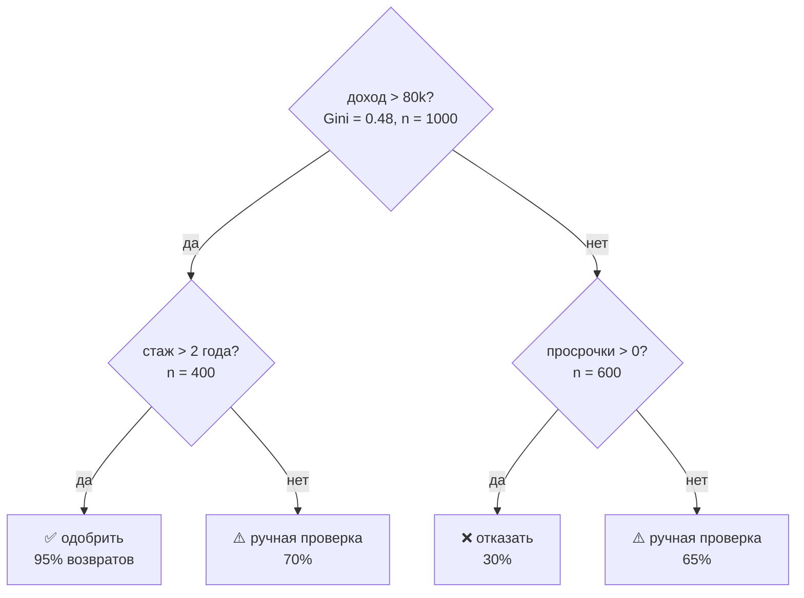
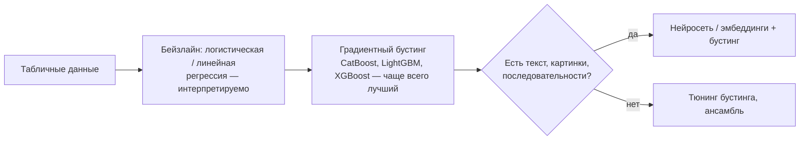

[← 09. Функции потерь и метрики](09_losses_metrics.md) · [🏠 Оглавление](../README.md#-оглавление) · [11. Математика глубокого обучения и трансформеров →](11_deep_learning.md)

<a id="m10"></a>

# 10. Математика классического ML

> 📓 [Ноутбук модуля](../notebooks/10_classic_ml.ipynb) · [](https://colab.research.google.com/github/justxor/math-for-ai-2026/blob/main/notebooks/10_classic_ml.ipynb)

> Классические модели — лучший полигон для математики: всё выводится на одном листе. И их до сих пор спрашивают на каждом собеседовании.

## Линейная регрессия

```math
\hat{\mathbf{y}} = X\mathbf{w}, \qquad \min_{\mathbf{w}} \lVert X\mathbf{w} - \mathbf{y}\rVert^2 \;\Rightarrow\; \mathbf{w}^* = (X^\top X)^{-1} X^\top \mathbf{y}
```

- Геометрия: $X\mathbf{w}^*$ — ортогональная проекция $\mathbf{y}$ на пространство столбцов $X$ (модуль 03, задача 3.1).
- **Ridge:** $\mathbf{w}^* = (X^\top X + \lambda I)^{-1}X^\top\mathbf{y}$ — всегда обратима, лечит мультиколлинеарность: вклад направления с сингулярным числом $\sigma_i$ умножается на $\sigma_i^2/(\sigma_i^2 + \lambda)$ — слабые направления подавляются сильнее.
- Сложность закрытой формы $O(nd^2 + d^3)$ — для больших $d$ используют SGD или сопряжённые градиенты.
- Интерпретация коэффициента: изменение $\hat{y}$ при росте признака на 1 **при прочих равных** — верно, только если признаки не коррелируют сильно.

## Логистическая регрессия

```math
p(y = 1 \mid \mathbf{x}) = \sigma(\mathbf{w}^\top\mathbf{x} + b), \qquad \log\frac{p}{1-p} = \mathbf{w}^\top\mathbf{x} + b
```

- Линейна в пространстве **логарифма шансов** (log-odds); граница решений — гиперплоскость.
- Лосс — BCE (NLL Бернулли), выпуклый ⇒ единственный минимум. Градиент: $X^\top(\mathbf{\sigma} - \mathbf{y})$.
- Коэффициент $w_j$: рост признака на 1 умножает **шансы** на $e^{w_j}$.
- Закрытой формы нет — Newton/IRLS, L-BFGS или SGD.
- **Softmax-регрессия** — обобщение на K классов; последний слой любого нейросетевого классификатора — это она.

## SVM

Ищем разделяющую гиперплоскость с **максимальным зазором** (margin) $2/\lVert\mathbf{w}\rVert$:

```math
\min_{\mathbf{w}, b}\ \tfrac{1}{2}\lVert\mathbf{w}\rVert^2 + C\sum_i \xi_i \quad \text{при}\quad y_i(\mathbf{w}^\top\mathbf{x}_i + b) \ge 1 - \xi_i,\ \xi_i \ge 0
```

Эквивалентно: hinge loss + L2-регуляризация. Двойственная задача (через множители Лагранжа) зависит от данных только через скалярные произведения $\mathbf{x}_i^\top\mathbf{x}_j$ ⇒ **ядровой трюк**: заменить их на $K(\mathbf{x}_i, \mathbf{x}_j)$, например RBF $\exp(-\gamma\lVert\mathbf{x}_i - \mathbf{x}_j\rVert^2)$, — это скалярное произведение в бесконечномерном пространстве признаков, которое никогда не строится явно. Решение определяется только **опорными векторами** (точки на границе зазора или внутри).

## k ближайших соседей и проклятие размерности

kNN предсказывает по большинству/среднему k ближайших точек. Проблема в высокой размерности:
- Объём шара в $d$ измерениях сосредоточен у поверхности; в кубе $[0,1]^d$ доля объёма внутреннего куба со стороной 0.9 — $0.9^d$ → 0 (при $d = 100$ — 0.003%).
- Расстояния концентрируются: $\frac{d_{\max} - d_{\min}}{d_{\min}} \to 0$ — «ближайший» почти так же далёк, как «дальний».

Почему эмбеддинги всё же работают: реальные данные лежат около многообразия низкой размерности (manifold hypothesis), а поиск — по косинусу, а не по евклиду в сырых признаках. Быстрый поиск — приближённые индексы (HNSW, IVF-PQ).

## Наивный Байес

```math
p(y \mid x_1, \dots, x_d) \propto p(y) \prod_{j=1}^{d} p(x_j \mid y)
```

«Наивное» предположение — признаки условно независимы при известном классе. Неверно почти всегда, но классификация часто работает (важен только argmax). Обучение — подсчёт частот, классика для текстов (спам).

## Деревья решений и ансамбли

**Критерий разбиения** — максимальное уменьшение «нечистоты»:

```math
\text{Gini} = 1 - \sum_k p_k^2, \qquad \text{Entropy} = -\sum_k p_k \log_2 p_k, \qquad \text{IG} = H(\text{родитель}) - \sum_{c} \frac{n_c}{n} H(c)
```

Для регрессии — уменьшение дисперсии (MSE).

| Ансамбль | Как | Что снижает |
|----------|-----|-------------|
| **Bagging / Random Forest** | деревья на бутстрап-выборках + случайные подмножества признаков, усреднение | **variance**: $\mathrm{Var}(\bar{f}) = \rho\sigma^2 + \frac{1-\rho}{B}\sigma^2$ — нужна низкая корреляция $\rho$ между деревьями |
| **Gradient Boosting** (XGBoost, LightGBM, CatBoost) | каждое новое дерево подгоняется под **антиградиент лосса** (для MSE — под остатки) | **bias** |

Градиентный бустинг — это градиентный спуск в **пространстве функций**: $F_{m} = F_{m-1} - \eta\, h_m$, где $h_m \approx \nabla_F L$. XGBoost использует ещё и вторую производную (Ньютоновский шаг) и регуляризацию листьев. Для табличных данных бустинг в 2026 году — по-прежнему сильнейший бейзлайн.

### 🗺️ Схема: дерево решений на примере



Каждый узел выбирает признак и порог, максимально уменьшающие нечистоту (Gini/энтропию) потомков. Лес и бустинг — сотни таких деревьев.

### 🗺️ Схема: какую модель брать для табличных данных



## Кластеризация

**k-means** минимизирует внутрикластерную дисперсию $\sum_k \sum_{i \in C_k} \lVert\mathbf{x}_i - \mathbf{\mu}_k\rVert^2$ чередованием:
1. Назначить точки ближайшему центру.
2. Пересчитать центры как средние.

Каждый шаг не увеличивает функционал ⇒ сходится, но к **локальному** минимуму (k-means++ для инициализации, несколько запусков). Предполагает «круглые» кластеры одного размера.

**GMM + EM-алгоритм** — мягкая версия: смесь гауссиан, E-шаг считает вероятности принадлежности, M-шаг — взвешенные MLE параметров. k-means — предельный случай GMM с одинаковыми сферическими ковариациями $\sigma \to 0$.

## 🎯 На собеседовании

1. **Выведи нормальное уравнение.** — Модуль 03, задача 3.1.
2. **Почему логистическая регрессия — линейный классификатор, если в ней сигмоида?** — Граница $\sigma(\mathbf{w}^\top\mathbf{x}) = 0.5 \iff \mathbf{w}^\top\mathbf{x} = 0$ — гиперплоскость.
3. **Что такое ядровой трюк?** — Алгоритм использует только скалярные произведения; подменяем их ядром = скалярным произведением в пространстве признаков высокой размерности.
4. **Bagging vs boosting?** — Параллельно и снижает variance vs последовательно и снижает bias.
5. **Проклятие размерности?** — Объём растёт экспоненциально, данные разреженные, расстояния теряют контраст.

## 🏋️ Практика модуля

**10.1.** Реализуйте линейную регрессию тремя способами (формула, `lstsq`, градиентный спуск) и сравните.

<details><summary>▶️ Решение</summary>

```python
import numpy as np
rng = np.random.default_rng(0)
X = np.c_[np.ones(200), rng.normal(size=(200, 3))]
w_true = np.array([1.0, 2.0, -3.0, 0.5]); y = X @ w_true + 0.1 * rng.normal(size=200)

w1 = np.linalg.solve(X.T @ X, X.T @ y)            # нормальное уравнение (solve, не inv!)
w2 = np.linalg.lstsq(X, y, rcond=None)[0]         # через QR/SVD — устойчивее
w3 = np.zeros(4)
for _ in range(2000):
    w3 -= 0.1 * 2 / len(y) * X.T @ (X @ w3 - y)
print(np.round([w1, w2, w3], 3))                  # все ≈ [1, 2, -3, 0.5]
```
</details>

**10.2.** Посчитайте Gini и энтропию для узла с классами [8, 2] и information gain разбиения на [6, 0] и [2, 2].

<details><summary>▶️ Решение</summary>

Родитель: p = [0.8, 0.2]. Gini = 1 − 0.64 − 0.04 = 0.32. H = −0.8·log₂0.8 − 0.2·log₂0.2 ≈ 0.722.
Дети: [6, 0] → H = 0; [2, 2] → H = 1. Взвешенно: 0.6·0 + 0.4·1 = 0.4. **IG ≈ 0.722 − 0.4 = 0.322** бит.
</details>

**10.3.** Напишите k-means на NumPy за 10 строк.

<details><summary>▶️ Решение</summary>

```python
def kmeans(X, k, iters=50, seed=0):
    rng = np.random.default_rng(seed)
    C = X[rng.choice(len(X), k, replace=False)]
    for _ in range(iters):
        labels = ((X[:, None, :] - C[None]) ** 2).sum(-1).argmin(1)
        newC = np.array([X[labels == j].mean(0) if (labels == j).any() else C[j] for j in range(k)])
        if np.allclose(newC, C):
            break
        C = newC
    return C, labels
```
</details>

---

[← 09. Функции потерь и метрики](09_losses_metrics.md) · [🏠 Оглавление](../README.md#-оглавление) · [11. Математика глубокого обучения и трансформеров →](11_deep_learning.md)
