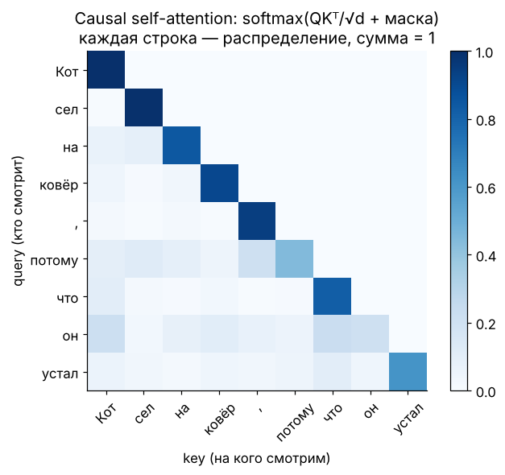
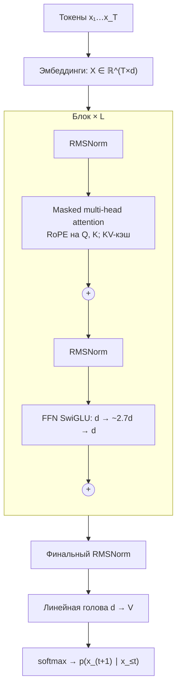
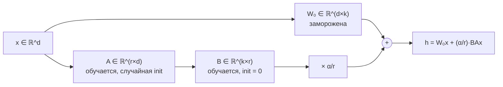

[← 10. Математика классического ML](10_classic_ml.md) · [🏠 Оглавление](../README.md#-оглавление) · [12. Генеративные модели: VAE, GAN, диффузия, LLM →](12_generative.md)

<a id="m11"></a>

# 11. Математика глубокого обучения и трансформеров

> 📓 [Ноутбук модуля](../notebooks/11_deep_learning.ipynb) · [](https://colab.research.google.com/github/justxor/math-for-ai-2026/blob/main/notebooks/11_deep_learning.ipynb)

> Нейросеть — композиция простых дифференцируемых функций. Трансформер — несколько матричных умножений, softmax, нормализация и residual-связи. Здесь — каждая формула, которую спрашивают.

## Нейрон, слой, MLP

```math
\mathbf{h}^{(l)} = \phi\bigl(W^{(l)}\mathbf{h}^{(l-1)} + \mathbf{b}^{(l)}\bigr)
```

**Теорема об универсальной аппроксимации:** MLP с одним скрытым слоем достаточной ширины и нелинейной активацией приближает любую непрерывную функцию на компакте сколь угодно точно. Это теорема о **существовании** — она ничего не говорит о том, сколько нужно нейронов и найдёт ли их SGD. Глубина на практике экспоненциально эффективнее ширины для многих функций.

### Активации

| Активация | Формула | Плюсы / минусы |
|-----------|---------|----------------|
| Sigmoid | $1/(1+e^{-x})$ | выход (0, 1); насыщается, не центрирована |
| Tanh | $\tanh x$ | центрирована; насыщается |
| ReLU | $\max(0, x)$ | дёшево, не насыщается при $x > 0$; «мёртвые» нейроны |
| GELU | $x\,\Phi(x)$ | гладкая; BERT, GPT |
| SiLU / Swish | $x\,\sigma(x)$ | гладкая; LLaMA, современные CNN |
| SwiGLU | $(\mathrm{SiLU}(xW) \odot xV)\,W_2$ | гейтированный FFN в LLaMA, Mistral, Qwen |

См. картинку активаций и их производных в [модуле 04](04_backprop.md#m04).

## Инициализация

| Схема | $\mathrm{Var}[W]$ | Для |
|-------|-------------------------|-----|
| Xavier/Glorot | $\frac{2}{n_{\text{in}} + n_{\text{out}}}$ | tanh, sigmoid |
| He/Kaiming | $\frac{2}{n_{\text{in}}}$ | ReLU-семейство |
| Трансформеры | $\mathcal{N}(0, 0.02^2)$, выходные проекции слоёв масштабируются на $1/\sqrt{2L}$ | GPT-2 и потомки |

Вывод — в [модуле 06](06_probability.md#m06): сохраняем дисперсию сигнала (forward) и градиента (backward).

## Нормализации

```math
\text{BatchNorm:}\ \ \hat{x} = \frac{x - \mu_{\text{batch}}}{\sqrt{\sigma^2_{\text{batch}} + \epsilon}}, \qquad
\text{LayerNorm:}\ \ \hat{\mathbf{x}} = \frac{\mathbf{x} - \mu(\mathbf{x})}{\sqrt{\sigma^2(\mathbf{x}) + \epsilon}}, \qquad
\text{RMSNorm:}\ \ \hat{\mathbf{x}} = \frac{\mathbf{x}}{\sqrt{\frac{1}{d}\sum_i x_i^2 + \epsilon}}
```

затем $\mathbf{\gamma} \odot \hat{\mathbf{x}} + \mathbf{\beta}$ (обучаемые масштаб и сдвиг).

| | BatchNorm | LayerNorm / RMSNorm |
|---|---|---|
| Статистики по | батчу (для каждого канала) | признакам одного примера |
| Зависит от размера батча | да; на инференсе — бегущие средние | нет |
| Где | CNN | трансформеры, RNN; RMSNorm — в большинстве LLM (дешевле, без центрирования) |

**Pre-LN** ($\mathbf{x} + f(\mathrm{LN}(\mathbf{x}))$) стабильнее Post-LN в глубоких трансформерах — градиент идёт по «чистому» residual-пути.

## Dropout

На обучении зануляем каждый нейрон с вероятностью $p$ и делим оставшиеся на $1-p$ (inverted dropout), чтобы матожидание не изменилось: $\mathbb{E}[\tilde{h}] = (1-p)\cdot\frac{h}{1-p} = h$. На инференсе — ничего не делаем. Интерпретация: обучение ансамбля из $2^n$ подсетей с общими весами. В больших LLM при предобучении часто dropout = 0 (данных достаточно, переобучения нет).

## Свёртки (CNN)

```math
(I * K)_{ij} = \sum_{m}\sum_{n} I_{i+m,\, j+n}\, K_{mn}
```

(технически это кросс-корреляция, но в DL называют свёрткой).

**Размер выхода** — считают на каждом собеседовании:

```math
H_{\text{out}} = \left\lfloor \frac{H_{\text{in}} + 2P - D\,(K - 1) - 1}{S} \right\rfloor + 1
```

$K$ — ядро, $P$ — паддинг, $S$ — шаг (stride), $D$ — dilation. Частные случаи: $K = 3, P = 1, S = 1$ сохраняет размер; $S = 2$ — уменьшает вдвое.

**Параметры свёрточного слоя:** $C_{\text{out}} \cdot (C_{\text{in}} \cdot K^2 + 1)$ — не зависят от размера изображения (**разделение весов**). Свёртка = эквивариантность к сдвигам + локальность.

**Рецептивное поле** растёт с глубиной: $L$ слоёв 3×3 со stride 1 видят $(2L+1)\times(2L+1)$ пикселей.

## Рекуррентные сети

```math
\mathbf{h}_t = \tanh(W_h \mathbf{h}_{t-1} + W_x \mathbf{x}_t + \mathbf{b})
```

Градиент через $T$ шагов содержит $\prod_t \mathrm{diag}(\tanh')\,W_h$ — затухает или взрывается в зависимости от спектрального радиуса $W_h$. **LSTM** добавляет ячейку $\mathbf{c}_t = \mathbf{f}_t \odot \mathbf{c}_{t-1} + \mathbf{i}_t \odot \tilde{\mathbf{c}}_t$ — аддитивное обновление, по которому градиент проходит без многократного умножения на матрицу. Современные **SSM** (Mamba) — линейные рекуррентности с селективными параметрами: обучаются параллельно, инференс за $O(1)$ на токен.

## Attention — главная формула 2020-х

```math
\mathrm{Attention}(Q, K, V) = \mathrm{softmax}\!\left( \frac{Q K^\top}{\sqrt{d_k}} + M \right) V
```

- $Q = XW_Q$, $K = XW_K$, $V = XW_V$; $X \in \mathbb{R}^{T \times d}$.
- $QK^\top \in \mathbb{R}^{T \times T}$ — сходство каждого токена с каждым.
- $M$ — маска: $-\infty$ выше диагонали для causal (GPT), 0 иначе.
- Каждая строка softmax — распределение «на кого смотреть»; выход — взвешенное среднее строк $V$.



### Почему делить на $\sqrt{d_k}$

Если компоненты $\mathbf{q}$ и $\mathbf{k}$ независимы с нулевым средним и единичной дисперсией, то $\mathrm{Var}[\mathbf{q}^\top\mathbf{k}] = \sum_{i=1}^{d_k}\mathrm{Var}[q_i k_i] = d_k$. При $d_k = 128$ логиты порядка ±11 — softmax становится почти one-hot, градиенты через него ≈ 0. Деление на $\sqrt{d_k}$ возвращает дисперсию к 1.

### Multi-head attention

$h$ голов по $d_k = d/h$, каждая со своими проекциями, выходы конкатенируются и проецируются $W_O$. Разные головы учатся разным «отношениям» (синтаксис, кореференция, позиция). Число параметров то же, что у одной головы размерности $d$: $4d^2$.

**GQA / MQA** — несколько голов запросов делят одни $K, V$: KV-кэш меньше в $h/g$ раз, инференс быстрее (LLaMA-2/3, Mistral).

### Сложность и память

| | Время | Память |
|---|---|---|
| Self-attention | $O(T^2 d)$ | $O(T^2)$ на матрицу весов (FlashAttention убирает: считает блоками, не материализуя $T\times T$) |
| FFN | $O(T d^2)$ | — |
| KV-кэш на инференсе | — | $2 \cdot L \cdot T \cdot n_{kv} \cdot d_{\text{head}} \cdot$ байт на число |

Пример KV-кэша: 32 слоя, 8 KV-голов по 128, контекст 32k, bf16: $2 \cdot 32 \cdot 32768 \cdot 8 \cdot 128 \cdot 2 \approx 4.3$ ГБ на одну последовательность.

### Позиционное кодирование

Attention инвариантен к перестановке токенов — порядок нужно добавить явно.
- **Синусоидальное** (оригинальный Transformer): $PE_{(p, 2i)} = \sin(p / 10000^{2i/d})$, $PE_{(p, 2i+1)} = \cos(\cdot)$.
- **RoPE** (стандарт LLM): поворачивает пары координат $\mathbf{q}$ и $\mathbf{k}$ на угол $p\,\theta_i$. Так как повороты ортогональны, $\langle R_m\mathbf{q}, R_n\mathbf{k}\rangle = \langle\mathbf{q}, R_{n-m}\mathbf{k}\rangle$ — скор зависит только от **относительной** позиции. Расширение контекста (NTK-scaling, YaRN) — изменение частот $\theta_i$.
- **ALiBi** — линейный штраф $-m\lvert i - j\rvert$ к логитам.

### Блок трансформера (pre-norm, как в LLaMA)

```math
\mathbf{x} \leftarrow \mathbf{x} + \mathrm{Attn}(\mathrm{RMSNorm}(\mathbf{x})), \qquad \mathbf{x} \leftarrow \mathbf{x} + \mathrm{FFN}_{\text{SwiGLU}}(\mathrm{RMSNorm}(\mathbf{x}))
```

```python
import torch, torch.nn.functional as F

def causal_self_attention(x, Wq, Wk, Wv, Wo, n_heads):
    B, T, D = x.shape; hd = D // n_heads
    q, k, v = (t.view(B, T, n_heads, hd).transpose(1, 2) for t in (x @ Wq, x @ Wk, x @ Wv))
    att = q @ k.transpose(-2, -1) / hd ** 0.5                           # (B, h, T, T)
    att = att.masked_fill(torch.triu(torch.ones(T, T, dtype=torch.bool), 1), float("-inf"))
    y = F.softmax(att, dim=-1) @ v                                      # (B, h, T, hd)
    return y.transpose(1, 2).reshape(B, T, D) @ Wo
```

### 🗺️ Схема: decoder-only трансформер (GPT / LLaMA)



Residual-пути («+») идут мимо каждого подблока — по ним градиент проходит через все L слоёв (модуль 04).

## Подсчёт параметров и FLOPs трансформера

Для модели с $L$ слоями, шириной $d$, FFN $4d$ (без SwiGLU), словарём $V$:

```math
N \approx 12\,L\,d^2 + V d \qquad\quad \text{FLOPs на обучение} \approx 6\,N\,D_{\text{tokens}}
```

($4d^2$ — attention, $8d^2$ — FFN.) Пример: GPT-2 small $L = 12$, $d = 768$: $12 \cdot 12 \cdot 768^2 \approx 85$M + эмбеддинги 38M ≈ 124M ✓.

**Законы масштабирования (Chinchilla):** при фиксированном бюджете вычислений $C \approx 6ND$ оптимально растить параметры и токены примерно пропорционально, $D \approx 20N$. Сегодня модели обучают далеко за этой точкой (×100–1000 токенов), потому что дешевле в инференсе маленькая, но «перекормленная» модель.

## Эффективное дообучение и сжатие

- **LoRA:** $W = W_0 + \frac{\alpha}{r}BA$, $B \in \mathbb{R}^{d\times r}$ инициализирована нулями (в начале $\Delta W = 0$), $A$ — случайно. Работает, потому что нужные изменения весов при дообучении низкоранговые (модуль 02).
- **Квантизация:** $x_q = \mathrm{round}(x / s) + z$, $s = \frac{\max - \min}{2^b - 1}$. Ошибка ≈ равномерная с дисперсией $s^2/12$. Проблема — **выбросы** в активациях LLM: решают поканальным/групповым масштабом (GPTQ, AWQ), вращениями (QuaRot, SpinQuant), смешанной точностью.
- **Дистилляция:** ученик минимизирует $\mathrm{KL}(\mathrm{softmax}(\mathbf{z}_T/\tau) \,\parallel \, \mathrm{softmax}(\mathbf{z}_S/\tau))\cdot\tau^2$ — «тёмное знание» о похожих классах.
- **Mixture of Experts:** роутер $\mathbf{g} = \mathrm{softmax}(\mathrm{TopK}(W_r\mathbf{x}))$ выбирает k из E экспертов-FFN — параметров много, активных на токен мало; нужен вспомогательный лосс балансировки нагрузки.

### 🗺️ Схема: LoRA



После обучения $BA$ можно **влить** в $W_0$ — на инференсе никаких лишних вычислений.

## 🎯 На собеседовании

1. **Напиши формулу attention и объясни $\sqrt{d_k}$.** — Выше.
2. **Сложность self-attention по длине?** — $O(T^2)$ по времени и (без FlashAttention) по памяти.
3. **BatchNorm vs LayerNorm?** — По батчу vs по признакам; почему в трансформерах LN.
4. **Посчитай выход свёртки 224×224, K=7, S=2, P=3.** — $\lfloor(224 + 6 - 7)/2\rfloor + 1 = 112$.
5. **Зачем позиционные кодировки и как работает RoPE?** — Attention инвариантен к перестановкам; RoPE — поворот, скор зависит от $m - n$.
6. **Почему LoRA инициализирует B нулями?** — Чтобы в начале модель совпадала с базовой.
7. **Сколько памяти нужно для KV-кэша?** — Формула выше.

## 🏋️ Практика модуля

**11.1.** Проверьте, что ваша реализация attention совпадает с `F.scaled_dot_product_attention`.

<details><summary>▶️ Решение</summary>

```python
B, T, D, h = 2, 5, 64, 4
x = torch.randn(B, T, D); Wq, Wk, Wv, Wo = [torch.randn(D, D) / 8 for _ in range(4)]
mine = causal_self_attention(x, Wq, Wk, Wv, Wo, h)
q, k, v = ((x @ W).view(B, T, h, D // h).transpose(1, 2) for W in (Wq, Wk, Wv))
ref = F.scaled_dot_product_attention(q, k, v, is_causal=True).transpose(1, 2).reshape(B, T, D) @ Wo
print(torch.allclose(mine, ref, atol=1e-5))   # True
```
</details>

**11.2.** Сколько параметров у `Conv2d(64, 128, kernel_size=3)` и у `Linear`, который принимает развёрнутую карту 64×32×32 и выдаёт 128×32×32?

<details><summary>▶️ Решение</summary>

Conv: $128 \cdot (64 \cdot 9 + 1) = 73\,856$. Linear: $65\,536 \cdot 131\,072 \approx 8.6 \cdot 10^9$. Разница в ~117 000 раз — цена отказа от локальности и разделения весов.
</details>

**11.3.** Оцените число параметров LLaMA-подобной модели: $L = 32$, $d = 4096$, FFN SwiGLU с размером 11008, словарь 32000, эмбеддинги не связаны с выходом.

<details><summary>▶️ Решение</summary>

Attention: $4d^2 = 67.1$M на слой. SwiGLU FFN: 3 матрицы $d \times 11008$ = 135.3M на слой. Итого на слой ≈ 202.4M, × 32 = **6.48B**. Эмбеддинги + выходная голова: $2 \cdot 32000 \cdot 4096 = 262$M. Всего ≈ **6.74B** — это LLaMA-7B.
</details>

---

[← 10. Математика классического ML](10_classic_ml.md) · [🏠 Оглавление](../README.md#-оглавление) · [12. Генеративные модели: VAE, GAN, диффузия, LLM →](12_generative.md)
