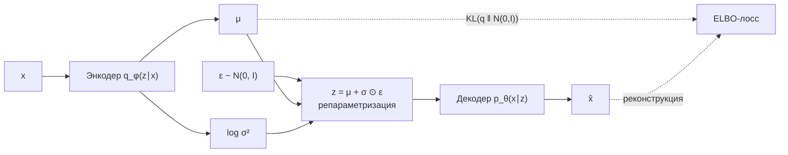
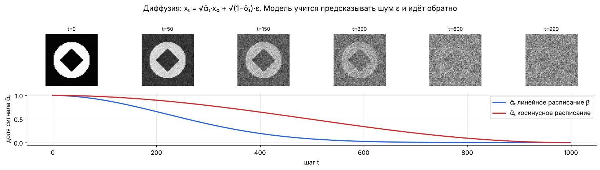
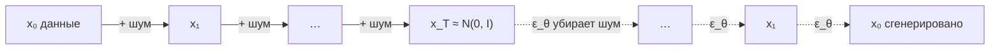
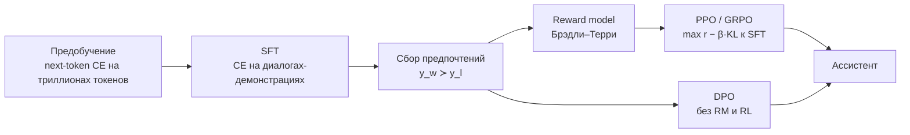

[← 11. Математика глубокого обучения и трансформеров](11_deep_learning.md) · [🏠 Оглавление](../README.md#-оглавление) · [13. Численная устойчивость и форматы чисел →](13_numerics.md)

<a id="m12"></a>

# 12. Генеративные модели: VAE, GAN, диффузия, LLM

> 📓 [Ноутбук модуля](../notebooks/12_generative.ipynb) · [](https://colab.research.google.com/github/justxor/math-for-ai-2026/blob/main/notebooks/12_generative.ipynb)

> Все генеративные модели решают одну задачу — научиться $p_\theta(\mathbf{x}) \approx p_{\text{data}}(\mathbf{x})$ и уметь из неё сэмплировать. Различаются тем, как обходят невычислимый интеграл нормировки.

| Семейство | Правдоподобие | Сэмплирование | Идея |
|-----------|---------------|---------------|------|
| Авторегрессия (GPT) | точное | последовательно, $T$ шагов | цепное правило вероятностей |
| VAE | нижняя оценка (ELBO) | быстро, один проход | латентная переменная + вариационный вывод |
| GAN | нет | быстро | игра генератора и дискриминатора |
| Normalizing flows | точное | быстро | обратимое преобразование + якобиан |
| Диффузия / flow matching | оценка | 1–1000 шагов | учимся убирать шум |

## Авторегрессионные модели и сэмплирование из LLM

```math
p_\theta(x_1, \dots, x_T) = \prod_{t=1}^{T} p_\theta(x_t \mid x_{<t}), \qquad \mathcal{L} = -\sum_t \log p_\theta(x_t \mid x_{<t})
```

Обучение — CE на следующем токене (teacher forcing, все позиции параллельно благодаря causal-маске). Генерация — по одному токену.

**Стратегии декодирования:**

| Метод | Что делает |
|-------|-----------|
| Greedy | $\arg\max$ — детерминированно, склонен к повторам |
| Temperature $T$ | $\mathrm{softmax}(\mathbf{z}/T)$ — см. [модуль 01](01_notation.md#m01) |
| Top-k | оставить k самых вероятных, перенормировать |
| Top-p (nucleus) | оставить минимальный набор с суммарной вероятностью ≥ p |
| Min-p | отсечь токены с вероятностью < $p_{\min} \cdot p_{\max}$ |
| Beam search | держать k лучших последовательностей по $\sum\log p$ — для перевода, не для диалога |
| Speculative decoding | маленькая модель предлагает k токенов, большая проверяет их **за один проход**; принятие с вероятностью $\min(1, p/q)$ сохраняет распределение большой модели |

## VAE и ELBO

Модель с латентной переменной: $p_\theta(\mathbf{x}) = \int p_\theta(\mathbf{x} \mid \mathbf{z})\,p(\mathbf{z})\,d\mathbf{z}$ — интеграл не считается. Вводим энкодер $q_\phi(\mathbf{z} \mid \mathbf{x})$ и получаем нижнюю оценку:

```math
\log p_\theta(\mathbf{x}) \;\ge\; \underbrace{\mathbb{E}_{q_\phi(\mathbf{z}\mid\mathbf{x})}\bigl[\log p_\theta(\mathbf{x} \mid \mathbf{z})\bigr]}_{\text{реконструкция}} \;-\; \underbrace{D_{\mathrm{KL}}\bigl(q_\phi(\mathbf{z} \mid \mathbf{x}) \,\parallel \, p(\mathbf{z})\bigr)}_{\text{регуляризация латентов}} \;=\; \text{ELBO}
```

Разрыв неравенства равен $D_{\mathrm{KL}}(q_\phi(\mathbf{z}\mid\mathbf{x}) \,\parallel \, p_\theta(\mathbf{z}\mid\mathbf{x}))$ — чем лучше энкодер приближает истинное апостериорное, тем точнее оценка.

```python
def vae_loss(x, x_rec, mu, logvar):
    rec = F.mse_loss(x_rec, x, reduction="sum")                        # −log p(x|z) для гауссова декодера
    kl = -0.5 * torch.sum(1 + logvar - mu.pow(2) - logvar.exp())      # формула из модуля 08
    return rec + kl
# сэмплирование z с репараметризацией: z = mu + exp(0.5*logvar) * randn
```

VAE — основа латентных диффузионных моделей: Stable Diffusion и аналоги генерируют в сжатом латентном пространстве автоэнкодера, а не в пикселях.

### 🗺️ Схема: VAE



## GAN

```math
\min_G \max_D\ \mathbb{E}_{\mathbf{x} \sim p_{\text{data}}}\bigl[\log D(\mathbf{x})\bigr] + \mathbb{E}_{\mathbf{z} \sim p(\mathbf{z})}\bigl[\log(1 - D(G(\mathbf{z})))\bigr]
```

- При оптимальном $D$ задача генератора — минимизация **дивергенции Йенсена–Шеннона** между $p_{\text{data}}$ и $p_G$.
- Проблемы: нестабильность (седловая точка, а не минимум), **mode collapse**, исчезающий градиент при «слишком хорошем» D (на практике $G$ максимизирует $\log D(G(\mathbf{z}))$ — non-saturating loss).
- WGAN: расстояние Вассерштейна, критик с ограничением Липшица (gradient penalty).
- В 2026 году GAN почти вытеснены диффузией, но живут в задачах с жёсткими требованиями к скорости и как адверсариальный лосс в дистилляции диффузии.

## Диффузионные модели

**Прямой процесс** — постепенно добавляем гауссовский шум, в закрытой форме для любого $t$:

```math
q(\mathbf{x}_t \mid \mathbf{x}_0) = \mathcal{N}\bigl(\sqrt{\bar\alpha_t}\,\mathbf{x}_0,\ (1 - \bar\alpha_t) I\bigr) \quad\Longleftrightarrow\quad \mathbf{x}_t = \sqrt{\bar\alpha_t}\,\mathbf{x}_0 + \sqrt{1 - \bar\alpha_t}\,\mathbf{\varepsilon}, \qquad \bar\alpha_t = \prod_{s=1}^{t}(1 - \beta_s)
```





Сверху — фиксированный прямой процесс (обучать не нужно), снизу — обученный обратный.

**Обучение (DDPM)** — сеть угадывает шум, лосс — обычный MSE:

```math
\mathcal{L} = \mathbb{E}_{t,\, \mathbf{x}_0,\, \mathbf{\varepsilon}}\bigl\lVert \mathbf{\varepsilon} - \mathbf{\varepsilon}_\theta(\mathbf{x}_t, t) \bigr\rVert^2
```

**Связь со score:** предсказанный шум пропорционален градиенту лог-плотности — $\nabla_{\mathbf{x}_t}\log q(\mathbf{x}_t) \approx -\mathbf{\varepsilon}_\theta(\mathbf{x}_t, t)/\sqrt{1 - \bar\alpha_t}$. Генерация — это спуск по «оценке градиента плотности» с шумом (Langevin dynamics / обратное СДУ).

**Ключевые улучшения:**
- **DDIM** — детерминированное сэмплирование за 20–50 шагов вместо 1000.
- **Classifier-free guidance:** $\tilde{\mathbf{\varepsilon}} = \mathbf{\varepsilon}_\theta(\mathbf{x}_t, \varnothing) + w\,\bigl(\mathbf{\varepsilon}_\theta(\mathbf{x}_t, c) - \mathbf{\varepsilon}_\theta(\mathbf{x}_t, \varnothing)\bigr)$, $w$ ≈ 3–8: сильнее следует промпту, ценой разнообразия.
- **Flow matching / rectified flow** (Stable Diffusion 3, FLUX): учим скоростное поле $\mathbf{v}_\theta$ по прямой между шумом и данными, $\mathbf{x}_t = (1-t)\mathbf{x}_0 + t\mathbf{\varepsilon}$, лосс $\lVert \mathbf{v}_\theta(\mathbf{x}_t, t) - (\mathbf{\varepsilon} - \mathbf{x}_0)\rVert^2$. Прямые траектории → меньше шагов.
- **Дистилляция** (consistency models, adversarial distillation) — генерация за 1–4 шага.

## Выравнивание LLM: RLHF и DPO



**Reward model** по парам ответов (модель Брэдли–Терри):

```math
p(y_w \succ y_l \mid x) = \sigma\bigl(r(x, y_w) - r(x, y_l)\bigr), \qquad \mathcal{L}_{RM} = -\log\sigma\bigl(r(x, y_w) - r(x, y_l)\bigr)
```

**RLHF-цель** — максимум награды с KL-штрафом к исходной (SFT) модели:

```math
\max_{\pi_\theta}\ \mathbb{E}_{x,\, y \sim \pi_\theta}\bigl[r(x, y)\bigr] - \beta\, D_{\mathrm{KL}}\bigl(\pi_\theta(\cdot \mid x) \,\parallel \, \pi_{\text{ref}}(\cdot \mid x)\bigr)
```

Оптимизируется PPO: clipped-отношение $\frac{\pi_\theta}{\pi_{\text{old}}}$ (importance sampling, модуль 06) с ограничением $[1-\epsilon, 1+\epsilon]$ и advantage $A_t$.

**DPO** — у этой цели есть закрытое решение $\pi^*(y \mid x) \propto \pi_{\text{ref}}(y \mid x)\, e^{r(x,y)/\beta}$. Выражая $r$ через $\pi$ и подставляя в Брэдли–Терри, получаем обучение **без reward model и без RL** — обычная классификация пар:

```math
\mathcal{L}_{\text{DPO}} = -\log\sigma\left( \beta\log\frac{\pi_\theta(y_w \mid x)}{\pi_{\text{ref}}(y_w \mid x)} - \beta\log\frac{\pi_\theta(y_l \mid x)}{\pi_{\text{ref}}(y_l \mid x)} \right)
```

**GRPO** (DeepSeek-R1 и reasoning-модели): вместо value-сети advantage считается относительно группы ответов на один промпт — $A_i = (r_i - \mathrm{mean}(\mathbf{r}))/\mathrm{std}(\mathbf{r})$; награды часто проверяемые (правильный ответ в математике, прошедшие тесты в коде).

## 🎯 На собеседовании

1. **Что такое ELBO и почему это нижняя оценка?** — Неравенство Йенсена / разрыв равен KL до истинного апостериорного.
2. **Зачем reparameterization trick?** — Чтобы градиент проходил через сэмплирование.
3. **Диффузия: что предсказывает сеть и какой лосс?** — Шум ε, MSE.
4. **Что делает classifier-free guidance?** — Экстраполирует от безусловного предсказания к условному.
5. **Top-k vs top-p?** — Фиксированное число кандидатов vs адаптивное по массе вероятности.
6. **DPO vs RLHF (PPO)?** — DPO выводится из той же KL-регуляризованной цели, но оптимизируется как классификация пар, без reward model и сэмплирования в цикле.

## 🏋️ Практика модуля

**12.1.** Реализуйте top-p сэмплирование.

<details><summary>▶️ Решение</summary>

```python
import numpy as np
def top_p_sample(logits, p=0.9, T=1.0, rng=np.random.default_rng()):
    z = logits / T
    probs = np.exp(z - z.max()); probs /= probs.sum()
    order = np.argsort(-probs)
    cum = np.cumsum(probs[order])
    keep = order[: np.searchsorted(cum, p) + 1]          # минимальный набор с массой ≥ p
    q = probs[keep] / probs[keep].sum()
    return rng.choice(keep, p=q)
```
</details>

**12.2.** Для линейного расписания $\beta_t$ от $10^{-4}$ до $0.02$, $T = 1000$ найдите долю сигнала $\sqrt{\bar\alpha_t}$ при $t = 500$ и $t = 1000$.

<details><summary>▶️ Решение</summary>

```python
betas = np.linspace(1e-4, 0.02, 1000); abar = np.cumprod(1 - betas)
print(np.sqrt(abar[499]), np.sqrt(abar[-1]))   # ≈ 0.28 и ≈ 0.006
```
К последнему шагу сигнала практически нет — $\mathbf{x}_T \approx \mathcal{N}(0, I)$, поэтому генерацию можно начинать с чистого шума. Косинусное расписание (картинка выше) теряет сигнал равномернее.
</details>

**12.3.** Покажите, что градиент DPO увеличивает вероятность предпочтительного ответа сильнее, когда модель «ошибается».

<details><summary>▶️ Решение</summary>

Обозначим $\hat{r}(y) = \beta\log\frac{\pi_\theta(y)}{\pi_{\text{ref}}(y)}$. Тогда

```math
\nabla_\theta\mathcal{L}_{\text{DPO}} = -\beta\,\sigma\bigl(\hat{r}(y_l) - \hat{r}(y_w)\bigr)\bigl[\nabla_\theta\log\pi_\theta(y_w) - \nabla_\theta\log\pi_\theta(y_l)\bigr]
```
Вес $\sigma(\hat{r}(y_l) - \hat{r}(y_w))$ близок к 1, когда неявная награда отвергнутого ответа выше, — то есть когда модель ранжирует пару неправильно; для уже выученных пар вес → 0.
</details>

---

[← 11. Математика глубокого обучения и трансформеров](11_deep_learning.md) · [🏠 Оглавление](../README.md#-оглавление) · [13. Численная устойчивость и форматы чисел →](13_numerics.md)
