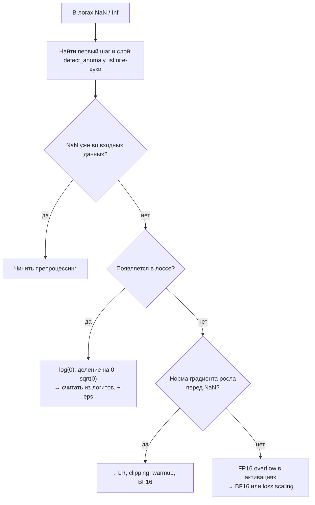

[← 12. Генеративные модели: VAE, GAN, диффузия, LLM](12_generative.md) · [🏠 Оглавление](../README.md#-оглавление) · [14. 🚀 Продвинутое: математика обучения с подкреплением →](14_reinforcement_learning.md)

<a id="m13"></a>

# 13. Численная устойчивость и форматы чисел

> 📓 [Ноутбук модуля](../notebooks/13_numerics.ipynb) · [](https://colab.research.google.com/github/justxor/math-for-ai-2026/blob/main/notebooks/13_numerics.ipynb)

> Формула верна на бумаге и даёт `NaN` на GPU. Этот модуль — о том, почему так бывает и как этого избежать.

## Форматы чисел с плавающей точкой

| Формат | Биты (знак / экспонента / мантисса) | Диапазон (≈ max) | Точность (знаков) | Где |
|--------|-------------------------------------|------------------|-------------------|-----|
| FP32 | 1 / 8 / 23 | $3.4 \cdot 10^{38}$ | ~7 | мастер-веса, состояние оптимизатора |
| FP16 | 1 / 5 / 10 | 65 504 | ~3 | инференс; при обучении нужен loss scaling |
| **BF16** | 1 / 8 / 7 | $3.4 \cdot 10^{38}$ | ~2–3 | стандарт обучения: диапазон FP32, переполнений нет |
| FP8 (E4M3 / E5M2) | 1 / 4 / 3 и 1 / 5 / 2 | 448 / 57 344 | ~1 | обучение и инференс на H100+, нужен масштаб на тензор/блок |
| INT8 / INT4 | целые | — | — | квантизованный инференс |

Машинный эпсилон FP32 ≈ $1.2 \cdot 10^{-7}$: `1.0 + 1e-8 == 1.0`. Следствия:
- Сумма миллиона малых чисел к большому теряет точность — накопление ведут в FP32 даже при BF16-вычислениях.
- **Mixed precision:** вычисления в BF16/FP16, мастер-копия весов и обновления — в FP32 (иначе маленький шаг $\eta g$ «исчезает» при прибавлении к весу).
- **Loss scaling** для FP16: умножить лосс на $2^{k}$, чтобы маленькие градиенты не обнулились (underflow), затем разделить.

## Стабильный softmax и log-sum-exp

$e^{1000}$ = `inf` в любом формате. Решение — сдвиг (softmax от него не зависит, модуль 01):

```math
\mathrm{softmax}(\mathbf{z})_i = \frac{e^{z_i - m}}{\sum_j e^{z_j - m}}, \qquad \log\sum_j e^{z_j} = m + \log\sum_j e^{z_j - m}, \qquad m = \max_j z_j
```

```python
import numpy as np
z = np.array([1000., 1001., 1002.])
naive = np.exp(z) / np.exp(z).sum()                 # [nan nan nan] + RuntimeWarning
def softmax(z):
    e = np.exp(z - z.max()); return e / e.sum()
def log_softmax(z):
    m = z.max(); return z - m - np.log(np.exp(z - m).sum())
print(softmax(z), log_softmax(z))                   # [0.09 0.245 0.665]  [-2.41 -1.41 -0.41]
```

**FlashAttention** использует ту же идею «онлайн»: идёт по блокам ключей, поддерживает текущий максимум и сумму и пересчитывает накопленный результат при обновлении максимума — поэтому никогда не хранит всю матрицу $T \times T$.

## Типовые ловушки и их лечение

| Проблема | Где появляется | Решение |
|----------|----------------|---------|
| `log(0) = -inf` | CE, энтропия, KL | считать из логитов (`log_softmax`, `BCEWithLogits`), `log(p + eps)` |
| `exp` переполняется | softmax, сигмоида | сдвиг на максимум, `np.logaddexp`, `torch.nn.functional.softplus` |
| Деление на ~0 | нормализации, Adam, косинус | `+ eps` в знаменателе (1e-5 для LN, 1e-8 для Adam) |
| `sqrt` от отрицательного | дисперсия через $\mathbb{E}[x^2] - \mathbb{E}[x]^2$ | алгоритм Уэлфорда / двухпроходный расчёт |
| Потеря значимости при вычитании | $1 - \cos x$ при малом $x$, $\log(1+x)$ | `np.log1p`, `np.expm1`, тригонометрические тождества |
| Взрыв градиентов | глубокие сети, RNN | gradient clipping, нормализации, меньше LR, warmup |
| Плохая обусловленность | `inv(X.T @ X)` | `solve`, `lstsq`, QR, Ridge |
| Недетерминизм | атомарные сложения на GPU | `torch.use_deterministic_algorithms(True)`, фиксированные seed |

## Отладка NaN — порядок действий

1. Найти **первый** шаг, где появился NaN/Inf: `torch.autograd.set_detect_anomaly(True)` или проверка `torch.isfinite` после каждого слоя (forward hooks).
2. Проверить данные: NaN во входах, деление на ноль в препроцессинге, пустые батчи.
3. Проверить лосс: `log` от вероятностей вместо логитов, `sqrt(0)` в градиенте (его производная бесконечна в 0).
4. Проверить масштаб: норма градиентов перед NaN (логировать её всегда), LR, FP16 без loss scaling.
5. Перейти на BF16, включить clipping, уменьшить LR, добавить warmup.



## 🎯 На собеседовании

1. **Почему softmax считают через вычитание максимума?** — Без этого `exp` переполняется; результат математически тот же.
2. **BF16 vs FP16?** — Одинаковая разрядность, но BF16 имеет диапазон FP32 (8 бит экспоненты) и меньшую точность; FP16 требует loss scaling.
3. **Зачем ε в Adam и LayerNorm?** — Не делить на ноль, ограничить максимальный шаг.
4. **Модель внезапно выдала NaN на 10 000-м шаге — что делаешь?** — Порядок выше.

## 🏋️ Практика модуля

**13.1.** Покажите, что формула дисперсии $\mathbb{E}[x^2] - \mathbb{E}[x]^2$ ломается в FP32 для данных вокруг $10^4$ с малым разбросом.

<details><summary>▶️ Решение</summary>

```python
x = (1e4 + np.random.randn(100_000) * 0.01).astype(np.float32)
naive = (x**2).mean() - x.mean()**2
print(naive, x.var(), np.var(x.astype(np.float64)))
# naive может быть даже отрицательным; x.var() вычитает среднее заранее и даёт ~1e-4
```
Причина: $\mathbb{E}[x^2] \approx 10^8$, а нужная разница ~$10^{-4}$ — 12 порядков, у FP32 только 7 значащих цифр.
</details>

**13.2.** Напишите стабильную сигмоиду, корректную для $z = \pm 1000$.

<details><summary>▶️ Решение</summary>

```python
def sigmoid(z):
    z = np.asarray(z, dtype=float)
    out = np.empty_like(z)
    pos = z >= 0
    out[pos] = 1 / (1 + np.exp(-z[pos]))
    ez = np.exp(z[~pos]); out[~pos] = ez / (1 + ez)     # exp от отрицательного — не переполняется
    return out
print(sigmoid([-1000, 0, 1000]))   # [0. 0.5 1.]
```
</details>

**13.3.** Почему в BF16 нельзя хранить веса при обучении с маленьким learning rate?

<details><summary>▶️ Решение</summary>

У BF16 7 бит мантиссы: относительная точность $2^{-8} \approx 0.004$. Если вес = 1.0, а обновление $\eta g = 10^{-4}$, то `1.0 + 1e-4` в BF16 округляется обратно к 1.0 — обучение «стоит». Поэтому мастер-веса держат в FP32 (или используют стохастическое округление / Kahan-суммирование).
</details>

---

[← 12. Генеративные модели: VAE, GAN, диффузия, LLM](12_generative.md) · [🏠 Оглавление](../README.md#-оглавление) · [14. 🚀 Продвинутое: математика обучения с подкреплением →](14_reinforcement_learning.md)
