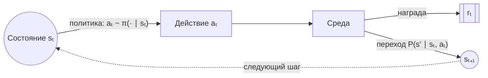
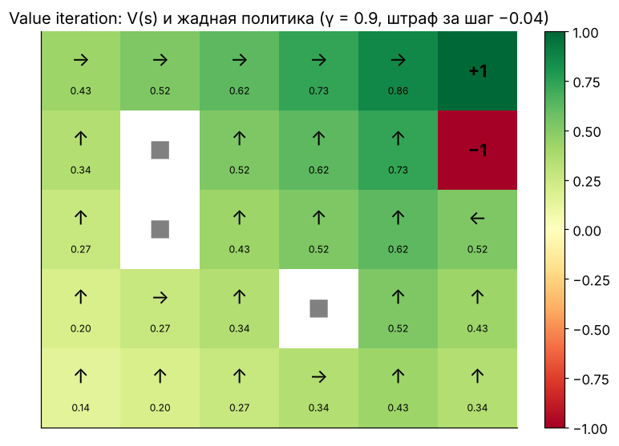
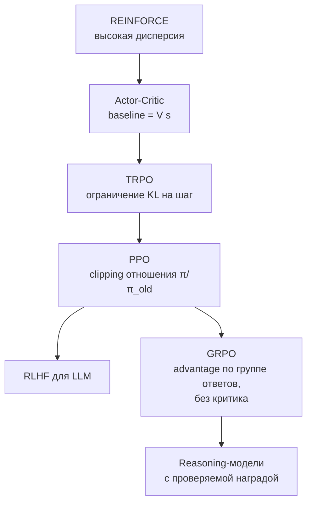

[← 13. Численная устойчивость и форматы чисел](13_numerics.md) · [🏠 Оглавление](../README.md#-оглавление) · [15. 🚀 Продвинутое: графы, спектральная теория и GNN →](15_graphs_gnn.md)

<a id="m14"></a>

# 14. 🚀 Продвинутое: математика обучения с подкреплением

> 📓 [Ноутбук модуля](../notebooks/14_reinforcement_learning.ipynb) · [](https://colab.research.google.com/github/justxor/math-for-ai-2026/blob/main/notebooks/14_reinforcement_learning.ipynb)

> RL — это то, как учат reasoning-модели (o1, DeepSeek-R1), выравнивают LLM (RLHF) и обучают роботов и игровых агентов. Математика: марковские процессы, уравнения Беллмана и градиент политики.

## Марковский процесс принятия решений (MDP)



MDP — это кортеж $(\mathcal{S}, \mathcal{A}, P, R, \gamma)$:
- $P(s' \mid s, a)$ — динамика среды; **марковость**: будущее зависит только от текущего состояния, не от истории.
- $R(s, a)$ — награда; $\gamma \in [0, 1)$ — дисконт.
- **Политика** $\pi(a \mid s)$ — распределение над действиями. У LLM состояние — промпт + сгенерированный текст, действие — следующий токен, политика — сама модель.

**Цель** — максимизировать ожидаемую дисконтированную награду (return):

```math
G_t = \sum_{k=0}^{\infty} \gamma^k r_{t+k}, \qquad J(\pi) = \mathbb{E}_{\tau \sim \pi}\bigl[G_0\bigr]
```

$\gamma$ — горизонт планирования: эффективная длина $\approx 1/(1-\gamma)$ шагов (как окно EMA в модуле 01).

## Функции ценности и уравнения Беллмана

```math
V^\pi(s) = \mathbb{E}_\pi\bigl[G_t \mid s_t = s\bigr], \qquad Q^\pi(s, a) = \mathbb{E}_\pi\bigl[G_t \mid s_t = s, a_t = a\bigr], \qquad A^\pi(s, a) = Q^\pi(s, a) - V^\pi(s)
```

**Advantage** $A$ — насколько действие лучше среднего в этом состоянии. Ключевая величина для policy gradient, PPO и GRPO.

**Уравнение Беллмана** — рекурсия «награда сейчас + дисконтированная ценность следующего состояния»:

```math
V^\pi(s) = \sum_a \pi(a \mid s) \sum_{s'} P(s' \mid s, a)\bigl[R(s, a) + \gamma V^\pi(s')\bigr]
```

**Уравнение оптимальности Беллмана:**

```math
V^*(s) = \max_a \sum_{s'} P(s' \mid s, a)\bigl[R(s, a) + \gamma V^*(s')\bigr], \qquad Q^*(s, a) = \mathbb{E}\bigl[r + \gamma \max_{a'} Q^*(s', a')\bigr]
```

Оператор Беллмана — **сжимающее отображение** с коэффициентом $\gamma$: каждое применение уменьшает ошибку минимум в $\gamma$ раз, поэтому итерации сходятся к единственной неподвижной точке.

## Value iteration



```python
import numpy as np
def value_iteration(P, R, gamma=0.9, tol=1e-8):
    """P: (S, A, S) вероятности переходов, R: (S, A) награды."""
    V = np.zeros(P.shape[0])
    while True:
        Q = R + gamma * P @ V                 # (S, A): Беллман для всех пар сразу
        V_new = Q.max(axis=1)
        if np.abs(V_new - V).max() < tol:
            return V_new, Q.argmax(axis=1)    # ценности и жадная политика
        V = V_new
```

## Q-learning и DQN — когда модели среды нет

Обновление по одному переходу $(s, a, r, s')$ — **TD-обучение** (temporal difference):

```math
Q(s, a) \leftarrow Q(s, a) + \alpha\bigl[\underbrace{r + \gamma \max_{a'} Q(s', a')}_{\text{TD-цель}} - Q(s, a)\bigr]
```

**DQN** аппроксимирует $Q$ нейросетью и минимизирует MSE до TD-цели. Две стабилизирующие хитрости: **replay buffer** (декоррелирует данные) и **target network** (цель считается замороженной копией сети).

## Policy gradient — оптимизируем политику напрямую

**Теорема о градиенте политики (REINFORCE):**

```math
\nabla_\theta J(\theta) = \mathbb{E}_{\tau \sim \pi_\theta}\left[\sum_t \nabla_\theta \log \pi_\theta(a_t \mid s_t)\, \bigl(G_t - b(s_t)\bigr)\right]
```

Вывод — **log-derivative trick**: $\nabla_\theta \pi = \pi \nabla_\theta \log\pi$, поэтому $\nabla_\theta \mathbb{E}_\pi[f] = \mathbb{E}_\pi[f \nabla_\theta \log\pi]$ — градиент ожидания превращается в ожидание, которое оцениваем сэмплами.

- **Базовая линия** $b(s)$ не меняет матожидание ($\mathbb{E}[\nabla\log\pi] = 0$), но сильно снижает дисперсию. Лучший выбор ≈ $V(s)$ → получаем advantage.
- Интуиция: увеличивай вероятность действий, которые оказались лучше ожидаемого, уменьшай — хуже.



## PPO

```math
L^{\text{CLIP}}(\theta) = \mathbb{E}_t\Bigl[\min\bigl(\rho_t A_t,\ \mathrm{clip}(\rho_t, 1-\epsilon, 1+\epsilon)\, A_t\bigr)\Bigr], \qquad \rho_t = \frac{\pi_\theta(a_t \mid s_t)}{\pi_{\theta_{\text{old}}}(a_t \mid s_t)}
```

- $\rho_t$ — importance sampling: данные собраны старой политикой, а оптимизируем новую (модуль 06).
- Clipping не даёт за один шаг сильно изменить вероятность действия ($\epsilon \approx 0.2$) — «доверительная область» без дорогой KL-оптимизации TRPO.
- **GAE** — сглаженная оценка advantage: $\hat{A}_t = \sum_l (\gamma\lambda)^l \delta_{t+l}$, $\delta_t = r_t + \gamma V(s_{t+1}) - V(s_t)$; λ регулирует компромисс смещение/дисперсия.

**GRPO** (DeepSeekMath, R1): для промпта генерируем группу из G ответов, нормируем награды внутри группы — $\hat{A}_i = (r_i - \bar{r})/\sigma_r$ — и применяем PPO-лосс + KL к референсной модели. Критик (value-сеть размером с LLM) не нужен — экономия памяти вдвое.

## Bandits — RL без состояний

Многорукий бандит — выбор из K вариантов с неизвестной наградой: A/B-тесты с адаптивной раздачей, рекомендации, выбор промпта.

| Стратегия | Правило | Регрет |
|-----------|---------|--------|
| ε-greedy | случайно с вероятностью ε, иначе лучший | линейный при постоянном ε |
| UCB | $\arg\max_a\ \bar{r}_a + c\sqrt{\ln t / n_a}$ — «оптимизм при неопределённости» | $O(\log T)$ |
| Thompson sampling | сэмплируем $\theta_a$ из апостериорного Beta, берём argmax | $O(\log T)$, хорошо на практике |

## 🎯 На собеседовании

1. **V vs Q vs A?** — Ценность состояния, пары состояние–действие и их разность.
2. **Запиши уравнение Беллмана.** — Выше; почему итерации сходятся — сжатие с коэффициентом γ.
3. **On-policy vs off-policy?** — Учимся на данных текущей политики (PPO) или любой (Q-learning, DQN с replay).
4. **Зачем baseline в REINFORCE?** — Снижает дисперсию, не смещая оценку градиента.
5. **Что делает clipping в PPO?** — Ограничивает изменение политики за шаг.
6. **Чем GRPO отличается от PPO?** — Нет critic-сети; advantage — нормированная награда внутри группы ответов.
7. **Explore vs exploit?** — Компромисс между проверкой новых действий и использованием известных лучших; ε-greedy, UCB, Thompson.

## 🏋️ Практика модуля

**14.1.** Агент получает награду 1 на каждом шаге бесконечно. Чему равен return при γ = 0.9 и γ = 0.99?

<details><summary>▶️ Решение</summary>

$\sum_k \gamma^k = 1/(1 - \gamma)$: 10 и 100. Отсюда «эффективный горизонт» $1/(1-\gamma)$.
</details>

**14.2.** Реализуйте Thompson sampling для трёх вариантов с конверсиями 4%, 5%, 6% и посмотрите, куда уходит трафик.

<details><summary>▶️ Решение</summary>

```python
rng = np.random.default_rng(0)
p_true = np.array([0.04, 0.05, 0.06])
a, b = np.ones(3), np.ones(3)                 # априор Beta(1, 1)
pulls = np.zeros(3, int)
for t in range(20_000):
    k = np.argmax(rng.beta(a, b))             # сэмпл из апостериорного для каждого варианта
    r = rng.random() < p_true[k]
    a[k] += r; b[k] += 1 - r; pulls[k] += 1
print(pulls / pulls.sum())                    # большая часть трафика уходит на 6%
```
В отличие от классического A/B, бандит теряет меньше конверсий во время эксперимента, но даёт менее точную оценку худших вариантов.
</details>

**14.3.** Покажите, что базовая линия не смещает градиент политики: $\mathbb{E}_{a \sim \pi}[\nabla_\theta \log \pi_\theta(a)\, b] = 0$.

<details><summary>▶️ Решение</summary>

```math
\mathbb{E}_{a\sim\pi}\bigl[\nabla_\theta \log\pi_\theta(a)\bigr]\, b = b \sum_a \pi_\theta(a)\frac{\nabla_\theta \pi_\theta(a)}{\pi_\theta(a)} = b\, \nabla_\theta \sum_a \pi_\theta(a) = b\, \nabla_\theta 1 = 0
```
</details>

---

[← 13. Численная устойчивость и форматы чисел](13_numerics.md) · [🏠 Оглавление](../README.md#-оглавление) · [15. 🚀 Продвинутое: графы, спектральная теория и GNN →](15_graphs_gnn.md)
