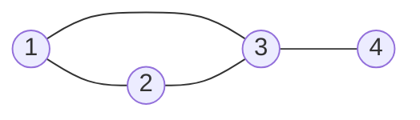
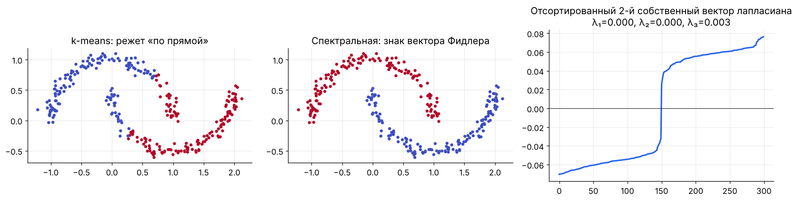
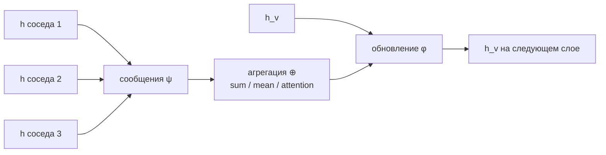

[← 14. 🚀 Продвинутое: математика обучения с подкреплением](14_reinforcement_learning.md) · [🏠 Оглавление](../README.md#-оглавление) · [16. 🚀 Продвинутое: теория обучения и обобщение →](16_learning_theory.md)

<a id="m15"></a>

# 15. 🚀 Продвинутое: графы, спектральная теория и GNN

> 📓 [Ноутбук модуля](../notebooks/15_graphs_gnn.ipynb) · [](https://colab.research.google.com/github/justxor/math-for-ai-2026/blob/main/notebooks/15_graphs_gnn.ipynb)

> Социальные сети, молекулы, рекомендации, дорожные карты, знания для RAG — всё это графы. Математика графов — это линейная алгебра матриц смежности и лапласиана.

## Граф как матрица



Для графа выше:

```math
A = \begin{pmatrix} 0 & 1 & 1 & 0 \\ 1 & 0 & 1 & 0 \\ 1 & 1 & 0 & 1 \\ 0 & 0 & 1 & 0 \end{pmatrix}, \quad
D = \mathrm{diag}(2, 2, 3, 1), \quad
L = D - A
```

- **Матрица смежности** $A$: $A_{ij} = 1$, если есть ребро (или вес ребра).
- **Степень** вершины — сумма строки; $D$ — диагональ степеней.
- $(A^k)_{ij}$ = число путей длины $k$ из $i$ в $j$ — поэтому $k$ слоёв GNN «видят» $k$-окрестность.
- **Лапласиан** $L = D - A$, нормированный $L_{\text{sym}} = I - D^{-1/2}AD^{-1/2}$.

## Лапласиан — главная матрица графа

```math
\mathbf{x}^\top L\, \mathbf{x} = \sum_{(i,j) \in E} w_{ij}\,(x_i - x_j)^2 \;\ge 0
```

Квадратичная форма измеряет **негладкость** сигнала на графе: она мала, если соседние вершины имеют близкие значения.

- $L$ симметричен и положительно полуопределён, собственные числа $0 = \lambda_1 \le \lambda_2 \le \dots$
- **Число нулевых собственных чисел = число компонент связности.**
- $\lambda_2$ (алгебраическая связность, число Фидлера) — насколько трудно разрезать граф; его собственный вектор (**вектор Фидлера**) задаёт лучший разрез на две части.
- Собственные векторы $L$ — «частоты» на графе (аналог Фурье): маленькие $\lambda$ — гладкие сигналы, большие — осциллирующие.

## Спектральная кластеризация

1. Построить граф сходства: $W_{ij} = \exp(-\lVert\mathbf{x}_i - \mathbf{x}_j\rVert^2 / 2\sigma^2)$ (или kNN-граф).
2. Нормированный лапласиан, $k$ собственных векторов с наименьшими собственными числами.
3. k-means в этом $k$-мерном пространстве.



Почему работает: минимизация $\mathbf{x}^\top L\mathbf{x}$ при ограничениях — непрерывная релаксация задачи о минимальном нормированном разрезе (NCut). k-means ищет выпуклые «облака», спектральный метод — **связные** области.

## PageRank

Случайный блуждатель с вероятностью $d \approx 0.85$ идёт по случайной ссылке, иначе прыгает на случайную страницу:

```math
\mathbf{r} = d\, P^\top \mathbf{r} + \frac{1 - d}{n}\mathbf{1}, \qquad P = D^{-1}A
```

$\mathbf{r}$ — стационарное распределение цепи Маркова = главный собственный вектор «матрицы Google». Считается степенным методом (модуль 02, задача 3 практикума).

## Graph Neural Networks

**Message passing** — каждый слой обновляет вершину по агрегату соседей:

```math
\mathbf{h}_v^{(l+1)} = \phi\Bigl(\mathbf{h}_v^{(l)},\ \bigoplus_{u \in \mathcal{N}(v)} \psi\bigl(\mathbf{h}_v^{(l)}, \mathbf{h}_u^{(l)}, \mathbf{e}_{uv}\bigr)\Bigr)
```

$\bigoplus$ — инвариантная к перестановке агрегация (сумма, среднее, максимум, attention).



| Модель | Слой | Идея |
|--------|------|------|
| **GCN** | $H' = \sigma(\tilde{D}^{-1/2}\tilde{A}\tilde{D}^{-1/2} H W)$, $\tilde{A} = A + I$ | сглаживание сигнала по графу (низкочастотный фильтр лапласиана) |
| **GraphSAGE** | $\mathbf{h}' = \sigma(W[\mathbf{h}_v, \mathrm{mean}_{u}\mathbf{h}_u])$ | сэмплирование соседей — масштабируется на огромные графы |
| **GAT** | веса соседей через attention | разная важность соседей |
| **GIN** | $\mathbf{h}' = \mathrm{MLP}((1+\epsilon)\mathbf{h}_v + \sum_u \mathbf{h}_u)$ | максимально выразительна среди MPNN (= тест Вейсфейлера–Лемана) |

**Проблемы:**
- **Over-smoothing:** много слоёв GCN = многократное усреднение → все вершины становятся одинаковыми (сходимость к главному собственному вектору). Решения — residual, нормализации, меньше слоёв.
- **Over-squashing:** информация от экспоненциально растущей окрестности сжимается в вектор фиксированного размера.
- **Трансформер = GNN на полном графе** с attention-агрегацией и позиционными кодировками вместо структуры.

```python
import numpy as np
def gcn_layer(A, H, W):
    A_hat = A + np.eye(len(A))                                   # петли: вершина видит себя
    d = A_hat.sum(1); D_inv_sqrt = np.diag(d ** -0.5)
    return np.maximum(0, D_inv_sqrt @ A_hat @ D_inv_sqrt @ H @ W)

A = np.array([[0, 1, 1, 0], [1, 0, 1, 0], [1, 1, 0, 1], [0, 0, 1, 0]], float)
H = np.eye(4)                                                    # признаки = one-hot вершины
print(gcn_layer(A, H, np.random.randn(4, 2)).round(2))
```

## 🎯 На собеседовании

1. **Что показывает число нулевых собственных чисел лапласиана?** — Число компонент связности.
2. **Почему GCN — это сглаживание?** — Нормированная смежность усредняет соседей = низкочастотный фильтр в спектре лапласиана.
3. **Over-smoothing — что это и как бороться?** — Признаки вершин сливаются с ростом глубины; residual/skip, нормализации, DropEdge, меньше слоёв.
4. **Как связаны трансформеры и GNN?** — Self-attention — message passing на полном графе с обучаемыми весами рёбер.
5. **PageRank через линейную алгебру?** — Стационарное распределение = собственный вектор с собственным числом 1.

## 🏋️ Практика модуля

**15.1.** Для графа из начала модуля найдите собственные числа $L$ и проверьте: сколько нулей и что говорит вектор Фидлера.

<details><summary>▶️ Решение</summary>

```python
A = np.array([[0, 1, 1, 0], [1, 0, 1, 0], [1, 1, 0, 1], [0, 0, 1, 0]], float)
L = np.diag(A.sum(1)) - A
w, V = np.linalg.eigh(L)
print(w.round(3))          # [0. 1. 3. 4.] — один ноль: граф связный
print(V[:, 1].round(2))    # знаки разделяют {1, 2} и {4}, вершина 3 — «мост» с промежуточным значением
```
</details>

**15.2.** Посчитайте PageRank для того же графа степенным методом.

<details><summary>▶️ Решение</summary>

```python
P = A / A.sum(1, keepdims=True)
r = np.full(4, 0.25)
for _ in range(100):
    r = 0.85 * P.T @ r + 0.15 / 4
print(r.round(3))          # у вершины 3 (степень 3) наибольший ранг
```
</details>

**15.3.** Покажите численно over-smoothing: примените 50 раз нормированную смежность (без весов и активаций) к случайным признакам.

<details><summary>▶️ Решение</summary>

```python
A_hat = A + np.eye(4); d = A_hat.sum(1)
S = np.diag(d ** -0.5) @ A_hat @ np.diag(d ** -0.5)
H = np.random.randn(4, 3)
for k in [1, 5, 50]:
    Hk = np.linalg.matrix_power(S, k) @ H
    Hn = Hk / np.linalg.norm(Hk, axis=1, keepdims=True)
    print(k, np.round(Hn @ Hn.T, 2).min())   # косинусная близость между вершинами → 1
```
</details>

---

[← 14. 🚀 Продвинутое: математика обучения с подкреплением](14_reinforcement_learning.md) · [🏠 Оглавление](../README.md#-оглавление) · [16. 🚀 Продвинутое: теория обучения и обобщение →](16_learning_theory.md)
