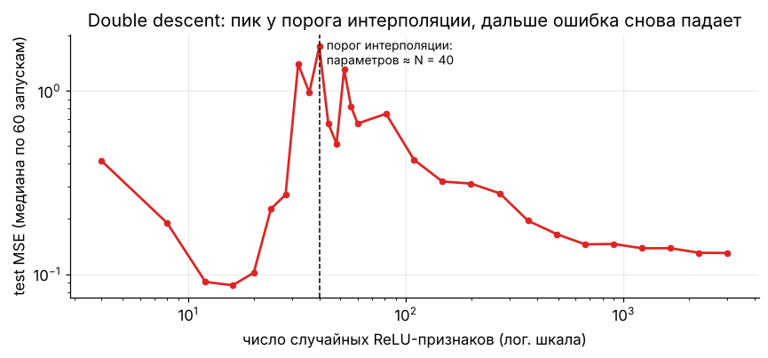

[← 15. 🚀 Продвинутое: графы, спектральная теория и GNN](15_graphs_gnn.md) · [🏠 Оглавление](../README.md#-оглавление) · [17. 🚀 Продвинутое: ядра, гауссовские процессы, оптимальный транспорт →](17_kernels_gp_ot.md)

<a id="m16"></a>

# 16. 🚀 Продвинутое: теория обучения и обобщение

> 📓 [Ноутбук модуля](../notebooks/16_learning_theory.ipynb) · [](https://colab.research.google.com/github/justxor/math-for-ai-2026/blob/main/notebooks/16_learning_theory.ipynb)

> Почему модель, обученная на 10 000 примеров, работает на миллионах новых? Почему нейросеть с миллиардом параметров не переобучается катастрофически? Здесь — язык, на котором об этом говорят исследователи.

## Риск и обобщение

```math
R(f) = \mathbb{E}_{(\mathbf{x}, y) \sim \mathcal{D}}\bigl[\ell(f(\mathbf{x}), y)\bigr] \quad\text{(истинный риск)}, \qquad \hat{R}_N(f) = \frac{1}{N}\sum_{i=1}^{N} \ell(f(\mathbf{x}_i), y_i) \quad\text{(эмпирический)}
```

**Generalization gap** $R(f) - \hat{R}_N(f)$ — то, что мы теряем при переходе с обучающих данных на новые. Вся теория обучения — про оценки этого разрыва.


## Неравенства концентрации

Насколько выборочное среднее может отличаться от истинного? **Неравенство Хёфдинга** для ограниченных $\ell \in [0, 1]$:

```math
P\bigl(\lvert \hat{R}_N(f) - R(f)\rvert > \varepsilon\bigr) \le 2\exp(-2N\varepsilon^2)
```

Для **одной** фиксированной модели при $N = 10\,000$ отклонение больше 0.02 случается с вероятностью ≤ $2e^{-8} \approx 0.0007$. Отсюда же правило «тест-сет нельзя использовать для подбора гиперпараметров»: как только вы выбираете лучшую из многих моделей по тесту, оценка становится оптимистичной.

## PAC-оценка для конечного класса моделей

Объединяя Хёфдинга по всем $\lvert\mathcal{H}\rvert$ моделям (union bound), с вероятностью ≥ $1 - \delta$ для **всех** $f \in \mathcal{H}$:

```math
R(f) \le \hat{R}_N(f) + \sqrt{\frac{\ln\lvert\mathcal{H}\rvert + \ln(2/\delta)}{2N}}
```

Чтобы гарантировать разрыв ε, нужно $N \gtrsim \frac{\ln\lvert\mathcal{H}\rvert}{\varepsilon^2}$ примеров — растёт **логарифмически** по числу моделей. Модель из $d$ параметров по $b$ бит — $\lvert\mathcal{H}\rvert = 2^{db}$, то есть $N \propto d$.

## VC-размерность

Для бесконечных классов сложность меряют **VC-размерностью** — максимальным числом точек, которые класс может разметить **всеми** $2^n$ способами («разбить», shatter).

| Класс | VC-размерность |
|-------|----------------|
| Пороги на прямой $\mathbb{1}[x > t]$ | 1 |
| Интервалы на прямой | 2 |
| Линейные классификаторы в $\mathbb{R}^d$ | $d + 1$ |
| Нейросеть с $W$ весами (ReLU) | $O(W L \log W)$ |

```math
R(f) \le \hat{R}_N(f) + O\!\left(\sqrt{\frac{d_{VC}\log(N/d_{VC}) + \log(1/\delta)}{N}}\right)
```

**Парадокс глубокого обучения:** для современных сетей $d_{VC} \gg N$, и оценка бессодержательна, хотя сети прекрасно обобщают. Сети даже могут идеально выучить **случайные** метки (Zhang et al., 2017) — значит, ёмкость класса не объясняет обобщение. Объяснения ищут в неявной регуляризации SGD, норме весов, плоскости минимумов, PAC-Bayes и сжимаемости моделей.

## Double descent и перепараметризация



- Когда число параметров достигает числа примеров, модель **впервые** может интерполировать данные — решение единственно и крайне неустойчиво к шуму → пик ошибки.
- Дальше среди бесконечного множества интерполирующих решений градиентный спуск выбирает решение **минимальной нормы** (для линейных моделей это доказуемо — см. задачу 16.3 ниже). Чем больше параметров, тем «глаже» это решение → ошибка снова падает.
- То же явление видно по числу эпох (epoch-wise double descent) и по размеру данных.

## Неявная регуляризация градиентного спуска

Для недоопределённой линейной регрессии ($d > N$) GD из нуля сходится к

```math
\mathbf{w}^* = \arg\min \lVert\mathbf{w}\rVert_2 \quad\text{при}\quad X\mathbf{w} = \mathbf{y} \quad\Longrightarrow\quad \mathbf{w}^* = X^\top(XX^\top)^{-1}\mathbf{y} = X^{+}\mathbf{y}
```

потому что все обновления $X^\top(\cdot)$ лежат в пространстве строк $X$. **Алгоритм оптимизации — часть модели**: другой оптимизатор найдёт другое интерполирующее решение с другим обобщением.

## Законы масштабирования

Эмпирически лосс LLM падает по степенному закону от параметров $N$, данных $D$ и вычислений $C$:

```math
L(N, D) \approx E + \frac{A}{N^{\alpha}} + \frac{B}{D^{\beta}}, \qquad \alpha \approx 0.34,\ \beta \approx 0.28 \quad\text{(Chinchilla)}
```

$E$ — неустранимая энтропия текста. Минимизируя $L$ при $C \approx 6ND$ = const, получаем оптимум $N \propto C^{0.5}$, $D \propto C^{0.5}$ — те самые ~20 токенов на параметр. В лог-лог-координатах — прямые, поэтому по маленьким запускам предсказывают большие.

**μP (maximal update parametrization)** — масштабирование инициализации и learning rate по ширине так, чтобы оптимальные гиперпараметры **не менялись** при росте модели: подбираем LR на маленькой модели и переносим на большую.

## Bias–variance для ансамблей и cross-validation

- **k-fold CV**: оценка риска с меньшей дисперсией, чем один hold-out; $k = 5\text{–}10$. Leave-one-out почти несмещённый, но с высокой дисперсией.
- **Вложенная CV** — внешний цикл оценивает качество, внутренний подбирает гиперпараметры; иначе оценка оптимистична.
- **Утечки данных** (leakage) — масштабирование/отбор признаков на всех данных до разбиения, дубликаты между train и test, «признаки из будущего» во временных рядах — ломают любую теорию.

## 🎯 На собеседовании

1. **Что такое generalization gap и что на него влияет?** — Разница риска на тесте и трейне; растёт со сложностью класса, падает с объёмом данных.
2. **Что такое VC-размерность? Чему равна у линейного классификатора?** — Максимум точек, которые класс может разметить всеми способами; $d + 1$.
3. **Почему перепараметризованные сети обобщают?** — Неявная регуляризация SGD (минимальная норма, плоские минимумы), архитектурные априоры, double descent.
4. **Почему нельзя подбирать гиперпараметры по тест-сету?** — Выбор по нему делает оценку смещённой (многократное сравнение).
5. **Что такое законы масштабирования и что из них следует?** — Степенная зависимость лосса от N, D, C; оптимальный баланс параметров и токенов.

## 🏋️ Практика модуля

**16.1.** Сколько примеров в тест-сете нужно, чтобы с вероятностью 95% ошибка оценки accuracy была не больше 1% (по Хёфдингу)?

<details><summary>▶️ Решение</summary>

$2e^{-2N\varepsilon^2} \le 0.05 \Rightarrow N \ge \frac{\ln 40}{2 \cdot 0.0001} \approx 18\,445$. Хёфдинг консервативен (не использует дисперсию); нормальное приближение даёт ~9 600 в худшем случае $p = 0.5$.
</details>

**16.2.** Покажите, что линейный классификатор на плоскости разбивает 3 точки общего положения, но не 4.

<details><summary>▶️ Решение</summary>

3 точки — треугольник: любую из 8 разметок можно отделить прямой (одна точка против двух всегда отделима). 4 точки: либо одна внутри треугольника из трёх (её нельзя отделить от трёх внешних), либо выпуклый четырёхугольник — разметка «XOR» по диагоналям неотделима. Значит, $d_{VC} = 3 = d + 1$.
</details>

**16.3.** Проверьте численно, что GD из нуля на недоопределённой регрессии приходит к решению минимальной нормы.

<details><summary>▶️ Решение</summary>

```python
import numpy as np
rng = np.random.default_rng(0)
X = rng.normal(size=(20, 100)); y = rng.normal(size=20)       # d = 100 > N = 20
w = np.zeros(100)
for _ in range(20_000):
    w -= 0.005 * X.T @ (X @ w - y)
w_min = np.linalg.pinv(X) @ y
print(np.abs(X @ w - y).max(), np.linalg.norm(w - w_min))   # интерполирует и совпадает с pinv
```
Если стартовать не из нуля, GD придёт к другому интерполирующему решению: начальная компонента вне пространства строк $X$ никогда не меняется.
</details>

---

[← 15. 🚀 Продвинутое: графы, спектральная теория и GNN](15_graphs_gnn.md) · [🏠 Оглавление](../README.md#-оглавление) · [17. 🚀 Продвинутое: ядра, гауссовские процессы, оптимальный транспорт →](17_kernels_gp_ot.md)
