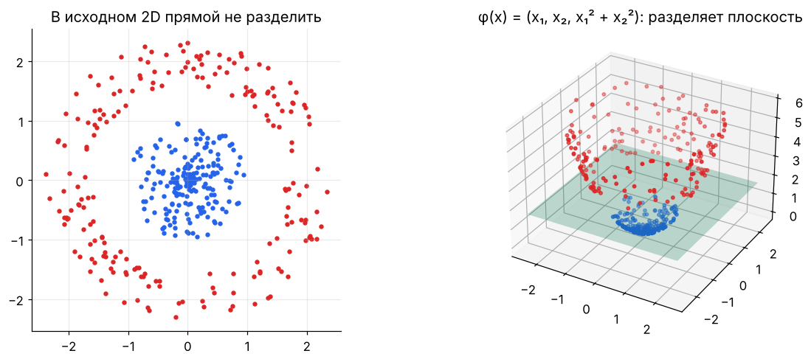
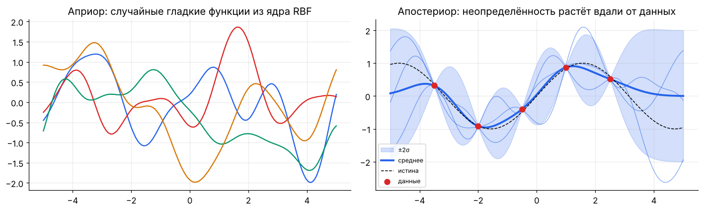
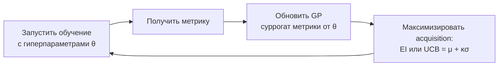
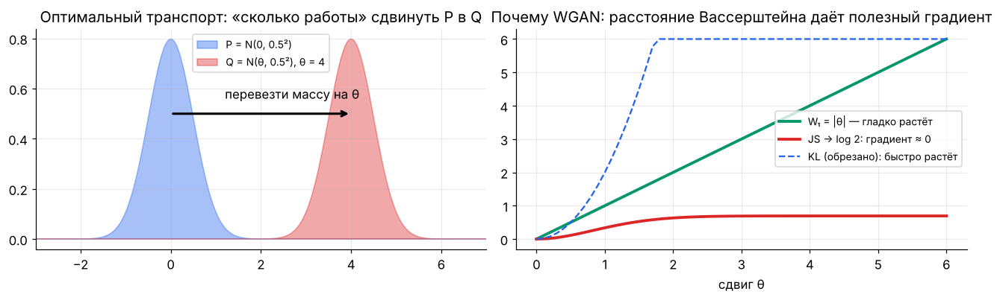

[← 16. 🚀 Продвинутое: теория обучения и обобщение](16_learning_theory.md) · [🏠 Оглавление](../README.md#-оглавление) · [18. 🧰 Прикладное: временные ряды и прогнозирование →](18_time_series.md)

<a id="m17"></a>

# 17. 🚀 Продвинутое: ядра, гауссовские процессы, оптимальный транспорт

> 📓 [Ноутбук модуля](../notebooks/17_kernels_gp_ot.ipynb) · [](https://colab.research.google.com/github/justxor/math-for-ai-2026/blob/main/notebooks/17_kernels_gp_ot.ipynb)

> Три инструмента, которые постоянно всплывают в статьях: ядра (SVM, GP, attention как ядро, NTK), гауссовские процессы (байесовская оптимизация гиперпараметров) и оптимальный транспорт (WGAN, flow matching, метрики генеративных моделей).

## Ядра

**Ядро** $k(\mathbf{x}, \mathbf{x}') = \langle\varphi(\mathbf{x}), \varphi(\mathbf{x}')\rangle$ — скалярное произведение в (возможно бесконечномерном) пространстве признаков, которое считается **без построения** $\varphi$.



| Ядро | Формула | Смысл |
|------|---------|-------|
| Линейное | $\mathbf{x}^\top\mathbf{x}'$ | обычный линейный метод |
| Полиномиальное | $(\mathbf{x}^\top\mathbf{x}' + c)^p$ | все мономы степени ≤ p |
| RBF (гауссово) | $\exp\bigl(-\lVert\mathbf{x} - \mathbf{x}'\rVert^2 / 2\ell^2\bigr)$ | бесконечномерное $\varphi$; $\ell$ — масштаб гладкости |
| Matérn | — | менее гладкие функции, стандарт в байесовской оптимизации |

**Теорема Мерсера:** функция — ядро ⇔ матрица Грама $K_{ij} = k(\mathbf{x}_i, \mathbf{x}_j)$ положительно полуопределена для любых точек.

**Теорема о представителе (representer theorem):** решение регуляризованной задачи в RKHS имеет вид $f(\mathbf{x}) = \sum_i \alpha_i k(\mathbf{x}_i, \mathbf{x})$ — оптимизация по бесконечномерному пространству сводится к $N$ коэффициентам.

**Kernel ridge regression:** $\boldsymbol\alpha = (K + \lambda I)^{-1}\mathbf{y}$. Сложность $O(N^3)$ — поэтому для больших данных используют **случайные признаки Фурье** (Rahimi & Recht): $\varphi(\mathbf{x}) = \sqrt{2/D}\cos(W\mathbf{x} + \mathbf{b})$, $W \sim \mathcal{N}(0, \ell^{-2}I)$ — явная аппроксимация RBF-ядра.

**Связи с глубоким обучением:**
- Attention $\mathrm{softmax}(\mathbf{q}^\top\mathbf{k})$ — это ядерное сглаживание с ядром $\exp(\mathbf{q}^\top\mathbf{k})$; линейные трансформеры (Performer) аппроксимируют его случайными признаками и получают $O(T)$.
- **NTK (neural tangent kernel):** бесконечно широкая сеть при малом LR обучается как kernel regression с ядром $\Theta(\mathbf{x}, \mathbf{x}') = \nabla_\theta f(\mathbf{x})^\top \nabla_\theta f(\mathbf{x}')$.

## Гауссовские процессы

GP — распределение над **функциями**: любые конечные значения $f(\mathbf{x}_1), \dots, f(\mathbf{x}_n)$ совместно нормальны с ковариацией $K$:

```math
f \sim \mathcal{GP}(m, k), \qquad \bigl(f(\mathbf{x}_1), \dots, f(\mathbf{x}_n)\bigr) \sim \mathcal{N}(\mathbf{m}, K)
```

**Апостериор** по данным $(X, \mathbf{y})$ с шумом $\sigma^2$ — формулы условного многомерного нормального (модуль 06):

```math
\mu_* = K_{*X}(K_{XX} + \sigma^2 I)^{-1}\mathbf{y}, \qquad \Sigma_* = K_{**} - K_{*X}(K_{XX} + \sigma^2 I)^{-1}K_{X*}
```



Среднее GP совпадает с kernel ridge regression ($\lambda = \sigma^2$); бонус — **честная неопределённость**, растущая вдали от данных.

### Байесовская оптимизация гиперпараметров



Acquisition-функция балансирует **exploitation** (высокое $\mu$) и **exploration** (высокая $\sigma$) — та же идея, что UCB в бандитах (модуль 14). Используется в Optuna (TPE — родственный подход), Ax, W&B Sweeps.

## Оптимальный транспорт

Сколько «работы» нужно, чтобы перевезти распределение $P$ в $Q$, если перенос массы из $x$ в $y$ стоит $c(x, y)$?

```math
W_p(P, Q) = \left( \inf_{\gamma \in \Pi(P, Q)} \int c(x, y)^p \, d\gamma(x, y) \right)^{1/p}
```

$\Pi(P, Q)$ — все совместные распределения (транспортные планы) с маргиналами $P$ и $Q$.



**Почему это важно:**
- Для распределений с непересекающимися носителями KL бесконечна, JS константна ($\log 2$) — градиента нет. $W$ меняется плавно с расстоянием между ними → **WGAN**.
- **Двойственность Канторовича–Рубинштейна:** $W_1(P, Q) = \sup_{\lVert f\rVert_L \le 1} \mathbb{E}_P[f] - \mathbb{E}_Q[f]$ — критик WGAN ищет 1-липшицеву функцию (gradient penalty).
- В 1D $W_1$ = площадь между функциями распределения; $W_2$ между гауссианами имеет закрытую форму: $\lVert\mu_1 - \mu_2\rVert^2 + \mathrm{tr}\bigl(\Sigma_1 + \Sigma_2 - 2(\Sigma_2^{1/2}\Sigma_1\Sigma_2^{1/2})^{1/2}\bigr)$ — это **FID**, стандартная метрика качества генерации изображений (на признаках Inception).
- **Flow matching / rectified flow** (модуль 12) учат поле скоростей, переносящее шум в данные; с OT-сопряжением пар траектории становятся прямее.
- **Sinkhorn** — энтропийно регуляризованный OT, считается матричными итерациями за $O(n^2)$ и дифференцируем.

```python
import numpy as np
def sinkhorn(a, b, C, eps=0.05, iters=500):
    """a, b — веса точек (суммы 1), C — матрица стоимостей. Возвращает транспортный план."""
    K = np.exp(-C / eps); u = np.ones_like(a)
    for _ in range(iters):
        v = b / (K.T @ u); u = a / (K @ v)
    return u[:, None] * K * v[None, :]

x = np.linspace(0, 1, 50); y = np.linspace(0.3, 1.3, 50)
C = (x[:, None] - y[None, :]) ** 2
P = sinkhorn(np.full(50, 1 / 50), np.full(50, 1 / 50), C)
print(np.sum(P * C))       # ≈ 0.11: W₂² = 0.3² = 0.09 плюс «размытие» плана из-за энтропии (меньше eps → ближе к 0.09)
```

## 🎯 На собеседовании

1. **Что такое ядро и условие Мерсера?** — Скалярное произведение в пространстве признаков; матрица Грама ПП.
2. **Чем GP лучше обычной регрессии?** — Даёт распределение предсказаний с неопределённостью; минус — $O(N^3)$.
3. **Как работает байесовская оптимизация?** — Суррогатная модель (GP) + acquisition function, баланс explore/exploit.
4. **Почему WGAN стабильнее?** — Расстояние Вассерштейна даёт полезный градиент даже при непересекающихся распределениях.
5. **Что такое FID?** — $W_2$ между гауссианами, подогнанными к признакам Inception реальных и сгенерированных изображений.

## 🏋️ Практика модуля

**17.1.** Проверьте, что матрица Грама RBF-ядра на случайных точках положительно полуопределена, а «ядро» $k(x, x') = -\lVert x - x'\rVert$ — нет.

<details><summary>▶️ Решение</summary>

```python
X = np.random.randn(30, 2)
D = np.linalg.norm(X[:, None] - X[None], axis=-1)
print(np.linalg.eigvalsh(np.exp(-D**2 / 2)).min())   # ≥ 0 (с точностью до округления)
print(np.linalg.eigvalsh(-D).min())                  # < 0 — не ядро
```
</details>

**17.2.** Реализуйте предсказание GP и проверьте, что среднее проходит через точки данных при малом шуме.

<details><summary>▶️ Решение</summary>

```python
k = lambda a, b: np.exp(-0.5 * (a[:, None] - b[None, :]) ** 2)
Xtr = np.array([-2., 0., 1.5]); ytr = np.sin(Xtr)
K = k(Xtr, Xtr) + 1e-6 * np.eye(3)
mu = k(Xtr, Xtr) @ np.linalg.solve(K, ytr)
print(np.allclose(mu, ytr, atol=1e-4))               # True
```
</details>

**17.3.** Найдите $W_1$ между выборками из $\mathcal{N}(0, 1)$ и $\mathcal{N}(2, 1)$ через отсортированные значения.

<details><summary>▶️ Решение</summary>

В 1D оптимальный план сопоставляет отсортированные точки:
```python
a = np.sort(np.random.randn(100_000)); b = np.sort(np.random.randn(100_000) + 2)
print(np.mean(np.abs(a - b)))   # ≈ 2.0 — сдвиг среднего
```
</details>

---

[← 16. 🚀 Продвинутое: теория обучения и обобщение](16_learning_theory.md) · [🏠 Оглавление](../README.md#-оглавление) · [18. 🧰 Прикладное: временные ряды и прогнозирование →](18_time_series.md)
