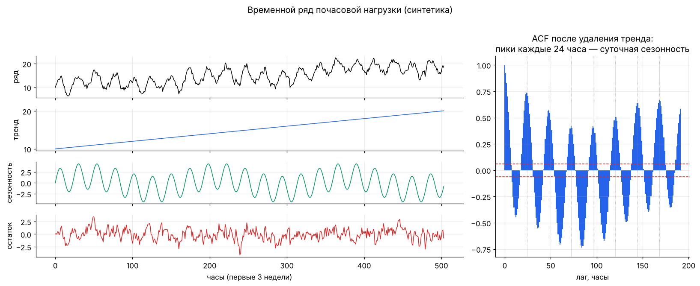
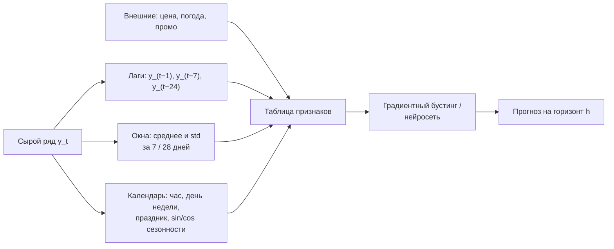
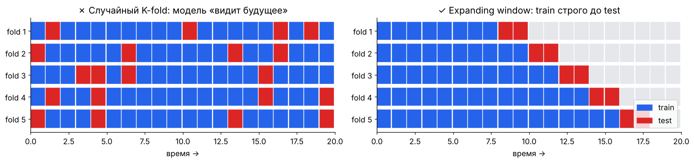

[← 17. 🚀 Продвинутое: ядра, гауссовские процессы, оптимальный транспорт](17_kernels_gp_ot.md) · [🏠 Оглавление](../README.md#-оглавление) · [19. 🧰 Прикладное: причинный вывод и эксперименты →](19_causal_inference.md)

<a id="m18"></a>

# 18. 🧰 Прикладное: временные ряды и прогнозирование

> 📓 [Ноутбук модуля](../notebooks/18_time_series.ipynb) · [](https://colab.research.google.com/github/justxor/math-for-ai-2026/blob/main/notebooks/18_time_series.ipynb)

> Спрос, нагрузка на серверы, цены, метрики продукта, сенсоры — данные во времени есть почти в каждой компании. Главное отличие от обычного ML: **наблюдения зависят друг от друга, и будущее нельзя подсматривать**.

## Из чего состоит ряд

```math
y_t = \underbrace{T_t}_{\text{тренд}} + \underbrace{S_t}_{\text{сезонность}} + \underbrace{R_t}_{\text{остаток}} \qquad \bigl(\text{или } y_t = T_t \cdot S_t \cdot R_t \text{ — мультипликативная модель}\bigr)
```



Мультипликативную модель логарифмом превращают в аддитивную: $\log y_t = \log T_t + \log S_t + \log R_t$ — поэтому продажи и трафик часто прогнозируют в лог-шкале.

## Стационарность и автокорреляция

**Стационарный** ряд — среднее, дисперсия и автокорреляции не меняются со временем. Большинство классических моделей требуют стационарности.

- **Автокорреляция** на лаге $k$: $\rho_k = \mathrm{corr}(y_t, y_{t-k})$. График ACF показывает «память» ряда и сезонность (пики на лагах 24, 168 для почасовых данных).
- **PACF** — корреляция с лагом $k$ «за вычетом» промежуточных лагов — подсказывает порядок AR-модели.
- Привести к стационарности: **разности** $\Delta y_t = y_t - y_{t-1}$ (убирают тренд), сезонные разности $y_t - y_{t-24}$, логарифм (стабилизирует дисперсию). Проверка — тест Дики–Фуллера (ADF).

## Классические модели

| Модель | Формула | Когда |
|--------|---------|-------|
| Наивный прогноз | $\hat{y}_{t+1} = y_t$ (или $y_{t+1-s}$ — сезонный наивный) | **обязательный бейзлайн** |
| Экспоненциальное сглаживание | $\hat{y}_{t+1} = \alpha y_t + (1-\alpha)\hat{y}_t$ | уровень без тренда; Holt–Winters добавляет тренд и сезонность |
| AR(p) | $y_t = c + \sum_{i=1}^{p}\varphi_i y_{t-i} + \varepsilon_t$ | память о прошлых значениях |
| MA(q) | $y_t = \mu + \varepsilon_t + \sum_{j=1}^{q}\theta_j\varepsilon_{t-j}$ | память о прошлых шоках |
| ARIMA(p, d, q) | AR + MA на $d$-кратных разностях | один ряд, умеренная длина |
| SARIMA / Prophet | + сезонные компоненты, праздники | бизнес-ряды |

**AR(1)** $y_t = \varphi y_{t-1} + \varepsilon_t$ стационарен только при $\lvert\varphi\rvert < 1$ (геометрическая прогрессия из модуля Б6); при $\varphi = 1$ — случайное блуждание, дисперсия растёт как $t\sigma^2$.

## ML-подход: ряд → табличные признаки



Циклические признаки кодируют через синус и косинус ($\sin\frac{2\pi \cdot \text{час}}{24}$, $\cos\frac{2\pi \cdot \text{час}}{24}$), чтобы 23:00 и 00:00 оказались рядом (модуль Б5). На большом числе рядов (тысячи товаров) бустинг на лагах обычно сильнее ARIMA; для очень длинных и сложных рядов — трансформеры и foundation-модели временных рядов.

## Валидация: никакого случайного K-fold



- **Expanding / rolling window:** обучаемся на прошлом, проверяемся на следующем отрезке, сдвигаем окно.
- **Утечка через признаки:** скользящее среднее, посчитанное с центрированием (включая будущее), нормализация по всему ряду, таргет-энкодинг по всем данным.
- **Горизонт:** прогноз на 7 дней вперёд нельзя строить на лаге $y_{t-1}$ — его ещё не будет известно. Минимальный лаг ≥ горизонт (или рекурсивный прогноз).

## Метрики прогноза

| Метрика | Формула | Особенность |
|---------|---------|-------------|
| MAE | $\frac{1}{n}\sum\lvert y - \hat{y}\rvert$ | медианный прогноз, понятна бизнесу |
| RMSE | $\sqrt{\frac{1}{n}\sum(y - \hat{y})^2}$ | штрафует крупные промахи |
| MAPE | $\frac{100\%}{n}\sum\left\lvert\frac{y - \hat{y}}{y}\right\rvert$ | ломается при $y \approx 0$, асимметрична |
| sMAPE / WAPE | $\frac{\sum\lvert y - \hat{y}\rvert}{\sum\lvert y\rvert}$ | WAPE — стандарт в ритейле |
| MASE | MAE / MAE сезонного наивного | < 1 — лучше бейзлайна; сравнима между рядами |
| Pinball (квантильная) | модуль 09 | интервальные прогнозы: p10–p90 для закупок |

## 🎯 На собеседовании

1. **Почему нельзя случайный K-fold?** — Утечка будущего в обучение; нужно разбиение по времени.
2. **Что такое стационарность и как её добиться?** — Постоянные статистики во времени; разности, логарифм, удаление сезонности.
3. **Как прогнозировать тысячи рядов?** — Глобальная модель (бустинг или нейросеть) на лагах и календарных признаках по всем рядам сразу.
4. **Чем плох MAPE?** — Деление на маленькие значения, несимметричный штраф за переоценку и недооценку.
5. **Какой бейзлайн первым?** — Сезонный наивный прогноз; модель, которая его не бьёт, не нужна.

## 🏋️ Практика модуля

**18.1.** Сгенерируйте AR(1) с $\varphi = 0.8$, оцените $\varphi$ регрессией $y_t$ на $y_{t-1}$.

<details><summary>▶️ Решение</summary>

```python
import numpy as np
rng = np.random.default_rng(0)
y = np.zeros(5000)
for t in range(1, 5000):
    y[t] = 0.8 * y[t - 1] + rng.normal()
phi = np.sum(y[1:] * y[:-1]) / np.sum(y[:-1] ** 2)   # МНК без свободного члена
print(round(phi, 3))                                   # ≈ 0.8
```
</details>

**18.2.** Сравните сезонный наивный прогноз и скользящее среднее на почасовом ряде с суточной сезонностью по MAE.

<details><summary>▶️ Решение</summary>

```python
t = np.arange(24 * 60)
y = 10 + 3 * np.sin(2 * np.pi * t / 24) + rng.normal(0, 0.5, t.size)
test = slice(24 * 50, None)
naive_season = y[24 * 50 - 24:-24]                    # значение сутки назад
moving_avg = np.convolve(y, np.ones(24) / 24, mode="full")[24 * 50 - 1:-24]
print(np.abs(y[test] - naive_season).mean(), np.abs(y[test] - moving_avg).mean())
# сезонный наивный ≈ 0.53, скользящее среднее ≈ 1.94 — среднее «стирает» сезонность
```
</details>

**18.3.** Прогноз спроса на 14 дней вперёд. Какие лаги можно использовать как признаки при прямом (direct) прогнозе?

<details><summary>▶️ Решение</summary>

Только $y_{t-14}$ и старше (и окна, заканчивающиеся не позже $t - 14$): в момент прогноза более свежих значений ещё нет. Альтернатива — рекурсивный прогноз (подставлять собственные предсказания), но ошибки накапливаются.
</details>

---

[← 17. 🚀 Продвинутое: ядра, гауссовские процессы, оптимальный транспорт](17_kernels_gp_ot.md) · [🏠 Оглавление](../README.md#-оглавление) · [19. 🧰 Прикладное: причинный вывод и эксперименты →](19_causal_inference.md)
