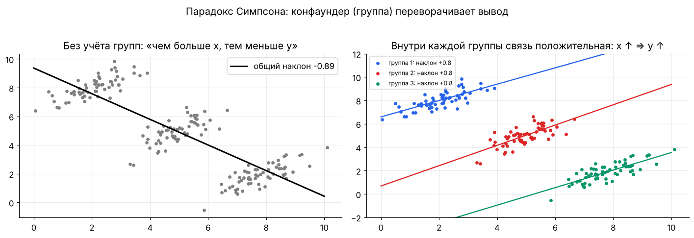
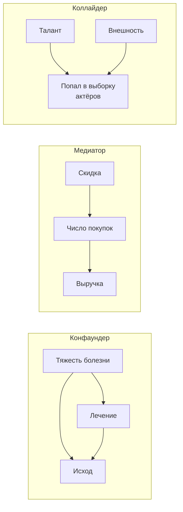

[← 18. 🧰 Прикладное: временные ряды и прогнозирование](18_time_series.md) · [🏠 Оглавление](../README.md#-оглавление) · [20. 🧰 Прикладное: поиск, эмбеддинги и RAG →](20_retrieval_rag.md)

<a id="m19"></a>

# 19. 🧰 Прикладное: причинный вывод и эксперименты

> 📓 [Ноутбук модуля](../notebooks/19_causal_inference.ipynb) · [](https://colab.research.google.com/github/justxor/math-for-ai-2026/blob/main/notebooks/19_causal_inference.ipynb)

> ML отвечает на вопрос «что будет?», бизнес спрашивает «что будет, **если мы сделаем** X?». Скидка, новая фича, рассылка — это вмешательства, и корреляции из данных здесь могут обмануть.

## Корреляция ≠ причинность: парадокс Симпсона



Внутри каждой группы связь положительная, а на всех данных — отрицательная: группа — **конфаундер**, влияющий и на $x$, и на $y$. Классический пример: лекарство выглядит хуже, потому что его чаще дают тяжёлым пациентам.

## Причинные графы (DAG)



| Структура | Контролировать? | Почему |
|-----------|-----------------|--------|
| Конфаундер $X \leftarrow Z \rightarrow Y$ | **да** | иначе ложная связь через $Z$ |
| Медиатор $X \rightarrow M \rightarrow Y$ | нет (если нужен полный эффект) | контроль «отрежет» часть эффекта |
| Коллайдер $X \rightarrow C \leftarrow Y$ | **нет** | контроль создаёт ложную связь (среди отобранных актёров талант и внешность отрицательно коррелируют) |

## Потенциальные исходы и эффект воздействия

У каждого объекта два потенциальных исхода: $Y(1)$ — если воздействовать, $Y(0)$ — если нет. Наблюдаем только один — **фундаментальная проблема причинного вывода**.

```math
\text{ATE} = \mathbb{E}\bigl[Y(1) - Y(0)\bigr], \qquad \text{CATE}(\mathbf{x}) = \mathbb{E}\bigl[Y(1) - Y(0) \mid \mathbf{X} = \mathbf{x}\bigr]
```

**Почему наивная разность врёт:**

```math
\underbrace{\mathbb{E}[Y \mid T=1] - \mathbb{E}[Y \mid T=0]}_{\text{наблюдаем}} = \underbrace{\mathbb{E}[Y(1) - Y(0) \mid T=1]}_{\text{эффект на получивших}} + \underbrace{\mathbb{E}[Y(0) \mid T=1] - \mathbb{E}[Y(0) \mid T=0]}_{\text{смещение отбора}}
```

**Рандомизация** (A/B-тест) делает $T$ независимым от $Y(0), Y(1)$ — смещение отбора обнуляется. Поэтому A/B — золотой стандарт (модуль 07).

## Когда A/B невозможен: методы для наблюдательных данных

| Метод | Идея | Ключевое допущение |
|-------|------|--------------------|
| Регрессия с контролем | включить конфаундеры в модель | все конфаундеры наблюдаемы |
| **Propensity score** $e(\mathbf{x}) = P(T=1 \mid \mathbf{x})$ | сравнивать похожих по вероятности получить воздействие; IPW-веса $\frac{T}{e} + \frac{1-T}{1-e}$ | все конфаундеры наблюдаемы, $0 < e < 1$ |
| **Difference-in-differences** | $(Y^{\text{после}}_{\text{тест}} - Y^{\text{до}}_{\text{тест}}) - (Y^{\text{после}}_{\text{контр}} - Y^{\text{до}}_{\text{контр}})$ | параллельные тренды без воздействия |
| Regression discontinuity | сравнить объекты чуть выше и чуть ниже порога (скоринг, возраст) | у порога объекты «как случайные» |
| Инструментальные переменные | найти $Z$, влияющий на $Y$ только через $T$ | валидность инструмента |
| Synthetic control | взвешенная комбинация контрольных регионов, повторяющая тестовый до воздействия | хороший подбор доноров |

## Uplift-моделирование

Кому отправлять промокод? Не тем, кто купит (они купят и так), а тем, **на кого промокод повлияет**:

```math
\text{uplift}(\mathbf{x}) = P(Y=1 \mid \mathbf{x}, T=1) - P(Y=1 \mid \mathbf{x}, T=0)
```

- **T-learner:** две модели — на тесте и на контроле, разность предсказаний.
- **S-learner:** одна модель с признаком $T$.
- **X-learner, DR-learner, causal forest** — точнее при дисбалансе групп.
- Метрика — **Qini / uplift-кривая**, обучаться нужно на данных рандомизированного эксперимента.

| Сегмент | Купит с промо | Купит без промо | Отправлять? |
|---------|---------------|-----------------|-------------|
| «Уверенные» | да | да | нет — потеря маржи |
| «Убеждаемые» | да | нет | **да** |
| «Потерянные» | нет | нет | нет |
| «Не беспокоить» | нет | да | нет — промо вредит |

## 🎯 На собеседовании

1. **Корреляция ≠ причинность — пример.** — Парадокс Симпсона, конфаундер, обратная причинность.
2. **Что такое конфаундер и коллайдер, что из них контролировать?** — Конфаундер — да, коллайдер — нет.
3. **Как оценить эффект, если A/B невозможен?** — DiD, propensity score, RDD, IV, synthetic control — и назвать допущение каждого.
4. **Чем uplift отличается от response-модели?** — Предсказывает разницу от воздействия, а не вероятность отклика.
5. **Что такое ATE и почему его нельзя посчитать напрямую?** — Видим только один из двух потенциальных исходов.

## 🏋️ Практика модуля

**19.1.** Смоделируйте конфаундинг: тяжесть болезни повышает вероятность лечения и ухудшает исход; лечение улучшает исход на +1. Сравните наивную оценку и регрессию с контролем.

<details><summary>▶️ Решение</summary>

```python
import numpy as np
rng = np.random.default_rng(0); n = 20_000
Z = rng.normal(size=n)                                    # тяжесть
T = (rng.random(n) < 1 / (1 + np.exp(-2 * Z))).astype(float)
Y = 1.0 * T - 2.0 * Z + rng.normal(size=n)                # истинный эффект +1
naive = Y[T == 1].mean() - Y[T == 0].mean()
X = np.c_[np.ones(n), T, Z]
adj = np.linalg.lstsq(X, Y, rcond=None)[0][1]
print(round(naive, 2), round(adj, 2))                     # наивно ≈ −1.4 (лечение «вредит»!), с контролем ≈ +1.0
```
</details>

**19.2.** Тот же пример: оцените эффект через IPW с известным propensity score.

<details><summary>▶️ Решение</summary>

```python
e = 1 / (1 + np.exp(-2 * Z))
ate_ipw = np.mean(T * Y / e) - np.mean((1 - T) * Y / (1 - e))
print(round(ate_ipw, 2))   # ≈ 1.0
```
На практике $e(\mathbf{x})$ оценивают логистической регрессией или бустингом; веса при $e$ близких к 0 или 1 взрываются — их обрезают (trimming).
</details>

**19.3.** В регионе A запустили новую доставку. Выручка A: было 100, стало 130. Регион B без изменений: было 80, стало 96. Оцените эффект методом DiD.

<details><summary>▶️ Решение</summary>

$(130 - 100) - (96 - 80) = 30 - 16 = 14$. Наивное «до/после» дало бы 30, но 16 из них — общий рост рынка. Допущение — без запуска A росла бы так же, как B (параллельные тренды); проверяют по истории до запуска.
</details>

---

[← 18. 🧰 Прикладное: временные ряды и прогнозирование](18_time_series.md) · [🏠 Оглавление](../README.md#-оглавление) · [20. 🧰 Прикладное: поиск, эмбеддинги и RAG →](20_retrieval_rag.md)
