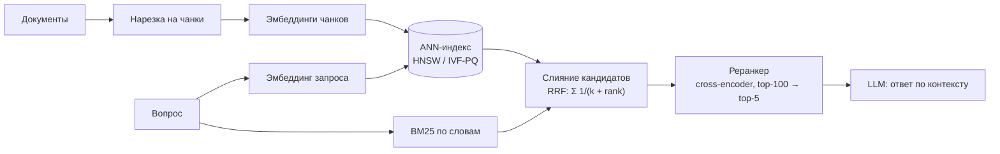
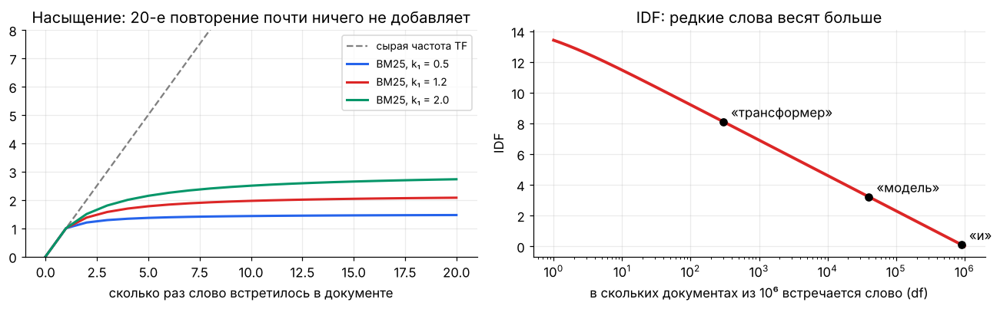

[← 19. 🧰 Прикладное: причинный вывод и эксперименты](19_causal_inference.md) · [🏠 Оглавление](../README.md#-оглавление) · [21. 🧰 Прикладное: рекомендательные системы →](21_recommender_systems.md)

<a id="m20"></a>

# 20. 🧰 Прикладное: поиск, эмбеддинги и RAG

> 📓 [Ноутбук модуля](../notebooks/20_retrieval_rag.ipynb) · [](https://colab.research.google.com/github/justxor/math-for-ai-2026/blob/main/notebooks/20_retrieval_rag.ipynb)

> RAG, поиск по документации, дедупликация, рекомендации «похожих» — всё это задача «найти ближайшие векторы среди миллионов». Здесь математика лексического поиска, плотных эмбеддингов, приближённого поиска соседей и ранжирования.

## Конвейер RAG



## Лексический поиск: TF-IDF и BM25

**TF-IDF:** вес слова в документе = частота в документе × редкость в коллекции, $\mathrm{idf}(w) = \log\frac{N}{\mathrm{df}(w)}$.

**BM25** — стандарт лексического поиска (Elasticsearch, OpenSearch):

```math
\mathrm{BM25}(q, d) = \sum_{w \in q} \mathrm{idf}(w) \cdot \frac{f(w, d)\,(k_1 + 1)}{f(w, d) + k_1\left(1 - b + b\,\frac{\lvert d\rvert}{\mathrm{avgdl}}\right)}
```



- $k_1 \approx 1.2$ — **насыщение**: десятое повторение слова почти ничего не добавляет (защита от «спама ключевыми словами»).
- $b \approx 0.75$ — нормировка на длину: длинный документ не выигрывает только за счёт длины.
- Сильные стороны: точные термины, коды ошибок, артикулы, имена. Слабые — синонимы и перефразирование.

## Плотные эмбеддинги

Энкодер переводит текст в вектор $\mathbf{e} \in \mathbb{R}^d$ так, чтобы близкие по смыслу тексты были близки по косинусу. Обучают **контрастно** (InfoNCE из модуля 09): правильная пара «запрос — документ» против остальных в батче, плюс **hard negatives** — похожие, но неправильные документы.

- После L2-нормировки косинус = скалярное произведение, а $\lVert\mathbf{a} - \mathbf{b}\rVert^2 = 2 - 2\cos(\mathbf{a}, \mathbf{b})$ — поиск по евклиду и по косинусу эквивалентен.
- **Matryoshka-эмбеддинги** обучены так, что первые 256 из 1024 координат уже работают — можно хранить «обрезанные» векторы.
- **Гибридный поиск** BM25 + плотные эмбеддинги почти всегда лучше каждого по отдельности. Слияние списков — **Reciprocal Rank Fusion**: $\mathrm{RRF}(d) = \sum_i \frac{1}{k + \mathrm{rank}_i(d)}$, $k \approx 60$.

## Приближённый поиск ближайших соседей (ANN)

Точный перебор — $O(Nd)$ на запрос: 100 млн × 768 — слишком медленно. ANN-индексы жертвуют частью recall ради скорости.

| Метод | Идея | Компромисс |
|-------|------|------------|
| **IVF** | k-means разбивает пространство на $n_{\text{list}}$ кластеров; ищем только в $n_{\text{probe}}$ ближайших | больше probe → выше recall, медленнее |
| **PQ** (product quantization) | вектор режется на $m$ кусков, каждый кодируется номером центроида (1 байт) | 768 float32 (3 КБ) → 96 байт; расстояния по таблицам |
| **HNSW** | многоуровневый граф «малого мира»: жадный спуск от дальних связей к ближним | ≈ $O(\log N)$, высокий recall, много памяти |
| **ScaNN, DiskANN** | анизотропная квантизация, граф на SSD | миллиарды векторов |

Метрика качества индекса — **recall@k** относительно точного поиска; бизнес-метрика ретривера — recall@k по разметке релевантности (нашёлся ли нужный чанк в топ-k).

## Ранжирование

- **Bi-encoder** (эмбеддинги отдельно для запроса и документа) — быстро, можно индексировать заранее.
- **Cross-encoder** (запрос и документ вместе через трансформер, выход — скор) — точнее, но $O(\text{кандидатов})$ прогонов модели; поэтому только на топ-50–200.
- **MMR** (maximal marginal relevance) — разнообразие выдачи: $\arg\max_d \bigl[\lambda\mathrm{sim}(d, q) - (1-\lambda)\max_{d' \in S}\mathrm{sim}(d, d')\bigr]$ — не брать пять почти одинаковых чанков.
- **Learning to rank:** pointwise (регрессия скора), pairwise (RankNet: $\sigma(s_i - s_j)$ — как Брэдли–Терри), listwise (LambdaMART оптимизирует NDCG).

## 🎯 На собеседовании

1. **BM25 vs плотные эмбеддинги?** — Точные термины vs смысл; гибрид + RRF.
2. **Как работает HNSW / IVF-PQ?** — Граф малого мира с жадным спуском; кластеризация + сжатие векторов кодами центроидов.
3. **Зачем реранкер?** — Cross-encoder точнее, но медленный — применяется к короткому списку.
4. **Почему после нормировки косинус и L2 эквивалентны?** — $\lVert a - b\rVert^2 = 2 - 2\cos$.
5. **Как оценить RAG?** — Отдельно ретривер (recall@k, MRR, NDCG) и генерацию (фактологичность, опора на контекст).

## 🏋️ Практика модуля

**20.1.** Реализуйте BM25 и найдите лучший документ для запроса.

<details><summary>▶️ Решение</summary>

```python
import numpy as np, math
from collections import Counter
docs = ["градиентный спуск обновляет веса модели",
        "adam адаптивный оптимизатор градиентный",
        "кошки любят спать на солнце",
        "спуск с горы на лыжах"]
toks = [d.split() for d in docs]; N = len(docs); avgdl = np.mean([len(t) for t in toks])
df = Counter(w for t in toks for w in set(t))
def bm25(query, k1=1.2, b=0.75):
    scores = []
    for t in toks:
        tf = Counter(t); s = 0.0
        for w in query.split():
            if w in tf:
                idf = math.log((N - df[w] + 0.5) / (df[w] + 0.5) + 1)
                s += idf * tf[w] * (k1 + 1) / (tf[w] + k1 * (1 - b + b * len(t) / avgdl))
        scores.append(round(float(s), 3))
    return scores
print(bm25("градиентный спуск"))   # первый документ — максимальный скор
```
</details>

**20.2.** Сравните точный поиск и IVF (через k-means) по recall@10 и числу вычисленных расстояний.

<details><summary>▶️ Решение</summary>

```python
rng = np.random.default_rng(0)
X = rng.normal(size=(20_000, 64)).astype(np.float32); X /= np.linalg.norm(X, axis=1, keepdims=True)
q = X[:100] + 0.1 * rng.normal(size=(100, 64)).astype(np.float32)
exact = np.argsort(-(q @ X.T), axis=1)[:, :10]
C = X[rng.choice(len(X), 100, replace=False)]                  # 100 кластеров (упрощённо: 5 итераций k-means)
for _ in range(5):
    lab = np.argmax(X @ C.T, 1); C = np.array([X[lab == j].mean(0) for j in range(100)])
lab = np.argmax(X @ C.T, 1)
for nprobe in [1, 5, 20]:
    rec, cost = 0, 0
    for i in range(100):
        cl = np.argsort(-(q[i] @ C.T))[:nprobe]; cand = np.where(np.isin(lab, cl))[0]; cost += len(cand)
        top = cand[np.argsort(-(X[cand] @ q[i]))[:10]]; rec += len(set(top) & set(exact[i])) / 10
    print(f"nprobe={nprobe:2d}: recall@10={rec / 100:.2f}, расстояний на запрос ≈ {cost // 100}")
```
Recall растёт с nprobe, а вычислений всё равно в разы меньше 20 000. Случайные равномерные векторы — худший случай для IVF; у реальных эмбеддингов есть кластерная структура, и recall при том же nprobe заметно выше.
</details>

**20.3.** Покажите на числах, что для нормированных векторов $\lVert\mathbf{a} - \mathbf{b}\rVert^2 = 2 - 2\cos(\mathbf{a}, \mathbf{b})$.

<details><summary>▶️ Решение</summary>

$\lVert\mathbf{a} - \mathbf{b}\rVert^2 = \lVert\mathbf{a}\rVert^2 - 2\mathbf{a}^\top\mathbf{b} + \lVert\mathbf{b}\rVert^2 = 1 - 2\cos + 1$.

```python
a, b = rng.normal(size=8), rng.normal(size=8); a /= np.linalg.norm(a); b /= np.linalg.norm(b)
print(np.sum((a - b) ** 2), 2 - 2 * a @ b)   # совпадают
```
</details>

---

[← 19. 🧰 Прикладное: причинный вывод и эксперименты](19_causal_inference.md) · [🏠 Оглавление](../README.md#-оглавление) · [21. 🧰 Прикладное: рекомендательные системы →](21_recommender_systems.md)
