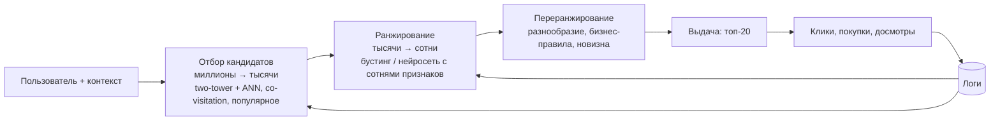
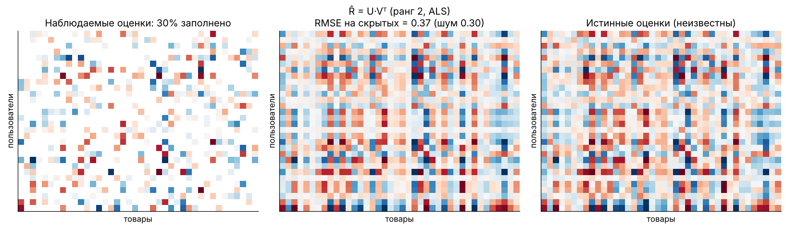

[← 20. 🧰 Прикладное: поиск, эмбеддинги и RAG](20_retrieval_rag.md) · [🏠 Оглавление](../README.md#-оглавление) · [22. 🧰 Прикладное: байесовские методы и неопределённость →](22_bayes_uncertainty.md)

<a id="m21"></a>

# 21. 🧰 Прикладное: рекомендательные системы

> 📓 [Ноутбук модуля](../notebooks/21_recommender_systems.ipynb) · [](https://colab.research.google.com/github/justxor/math-for-ai-2026/blob/main/notebooks/21_recommender_systems.ipynb)

> Лента, «с этим товаром покупают», музыка, видео, реклама — рекомендации приносят существенную долю выручки крупных онлайн-платформ. Математика: разреженные матрицы, низкоранговые разложения, ранжирующие метрики и баланс исследования и эксплуатации.

## Архитектура рекомендаций в продакшене



## Матрица взаимодействий и матричная факторизация

Матрица $R \in \mathbb{R}^{m \times n}$ (пользователи × товары) заполнена на доли процента. Гипотеза: вкусы описываются небольшим числом скрытых факторов (жанр, цена, стиль):

```math
\hat{r}_{ui} = \mathbf{p}_u^\top \mathbf{q}_i + b_u + b_i + \mu, \qquad \min_{P, Q} \sum_{(u,i) \in \Omega} \bigl(r_{ui} - \hat{r}_{ui}\bigr)^2 + \lambda\bigl(\lVert\mathbf{p}_u\rVert^2 + \lVert\mathbf{q}_i\rVert^2\bigr)
```



- Сумма только по **наблюдаемым** $\Omega$ — поэтому это не SVD (модуль 02), а задача восстановления матрицы.
- **ALS:** при фиксированных $Q$ задача по каждому $\mathbf{p}_u$ — ridge-регрессия с закрытым решением $\mathbf{p}_u = (Q_u^\top Q_u + \lambda I)^{-1}Q_u^\top\mathbf{r}_u$; чередуем $P$ и $Q$. Хорошо параллелится.
- **Неявный фидбек** (клики, просмотры): отсутствие взаимодействия ≠ «не нравится». iALS: все пары с весом доверия $c_{ui} = 1 + \alpha\cdot\text{число взаимодействий}$.

## Two-tower модели и нейросетевое ранжирование

```math
s(u, i) = f_\theta(\text{пользователь})^\top g_\phi(\text{товар})
```

- Башни считаются **независимо**: эмбеддинги товаров индексируются в ANN (модуль 20), запрос — один проход пользовательской башни.
- Обучение — softmax по товарам с negative sampling (InfoNCE). **Поправка на популярность** (logQ correction): вычитать $\log P(\text{товар в батче})$ из логита, иначе популярные товары штрафуются как негативы непропорционально часто.
- Ранжирующие модели (DLRM, DCN, трансформеры над историей действий) — признаки взаимодействий, кросс-фичи, последовательность последних событий.

## Метрики

| Метрика | Формула | Что измеряет |
|---------|---------|--------------|
| Precision@k / Recall@k | доля релевантных в топ-k / доля найденных релевантных | попадание |
| MAP@k | среднее precision на позициях релевантных | порядок + попадание |
| **NDCG@k** | $\frac{\text{DCG}}{\text{IDCG}}$, $\text{DCG} = \sum_{i=1}^{k}\frac{2^{rel_i} - 1}{\log_2(i + 1)}$ | ранжирование с градациями релевантности |
| Coverage, diversity, novelty | доля каталога в выдачах, непохожесть, непопулярность | «здоровье» системы |
| Онлайн: CTR, конверсия, время, удержание | A/B-тест (модуль 07) | то, что важно бизнесу |

**Офлайн ≠ онлайн:** модель обучена на логах, порождённых **старой** системой рекомендаций (смещение экспозиции): товары, которые никто не видел, не могли получить клик. Коррекции — inverse propensity scoring (модуль 19), off-policy оценка, обязательная проверка в A/B.

## Холодный старт и исследование

- **Новый товар:** нет взаимодействий → контентные признаки (текст, картинка → эмбеддинги), «прогрев» в выдаче.
- **Новый пользователь:** популярное в сегменте, онбординг-вопросы, быстрая адаптация по первым кликам.
- **Explore/exploit:** бандиты (модуль 14) — Thompson sampling или UCB для новых позиций, чтобы система не замыкалась на уже популярном (петля обратной связи).

## 🎯 На собеседовании

1. **Почему матрица факторизуется, а не просто SVD?** — Большинство значений неизвестны; оптимизируем только по наблюдаемым с регуляризацией.
2. **Explicit vs implicit feedback?** — Оценки vs клики/просмотры; отсутствие клика — не негатив, нужен вес доверия.
3. **Two-tower: плюсы и ограничения?** — Быстрый отбор через ANN; взаимодействие признаков только через скалярное произведение — точность ниже ранжирующей модели.
4. **NDCG — как считается и почему логарифм?** — Дисконт позиций: ошибка вверху выдачи дороже.
5. **Холодный старт?** — Контентные признаки, популярное, бандиты.

## 🏋️ Практика модуля

**21.1.** Посчитайте NDCG@5 для выдачи с релевантностями [3, 2, 0, 1, 0] (идеальный порядок: [3, 2, 1, 0, 0]).

<details><summary>▶️ Решение</summary>

```python
import numpy as np
def dcg(rel): rel = np.asarray(rel, float); return np.sum((2**rel - 1) / np.log2(np.arange(2, len(rel) + 2)))
print(round(dcg([3, 2, 0, 1, 0]) / dcg([3, 2, 1, 0, 0]), 4))   # ≈ 0.9926
```
</details>

**21.2.** Реализуйте ALS для матрицы с пропусками и проверьте ошибку на скрытых значениях.

<details><summary>▶️ Решение</summary>

```python
rng = np.random.default_rng(5)
m, n, k, lam = 30, 40, 2, 0.1
R = rng.normal(size=(m, k)) @ rng.normal(size=(k, n)) + 0.3 * rng.normal(size=(m, n))
mask = rng.random((m, n)) < 0.3
r0 = np.random.default_rng(0); P = r0.normal(0, 0.1, (m, k)); Q = r0.normal(0, 0.1, (n, k))
for _ in range(100):
    for u in range(m):
        A = Q[mask[u]]; P[u] = np.linalg.solve(A.T @ A + lam * np.eye(k), A.T @ R[u, mask[u]])
    for i in range(n):
        A = P[mask[:, i]]; Q[i] = np.linalg.solve(A.T @ A + lam * np.eye(k), A.T @ R[mask[:, i], i])
print(np.sqrt(np.mean(((P @ Q.T) - R)[~mask] ** 2)))   # ≈ 0.39 при шуме 0.3
```
Задача невыпуклая: при неудачной инициализации ALS может застрять в плохой точке — несколько запусков или инициализация через SVD заполненной матрицы.
</details>

**21.3.** Почему самые популярные товары доминируют в негативах при in-batch negative sampling, и как это исправить?

<details><summary>▶️ Решение</summary>

Негативы — товары других пользователей в батче, то есть сэмплируются пропорционально популярности $p_i$. Модель штрафует популярные товары чаще, чем следует. LogQ-коррекция: использовать логит $s(u, i) - \log p_i$ при обучении — это возвращает несмещённую оценку полного softmax (importance sampling, модуль 06).
</details>

---

[← 20. 🧰 Прикладное: поиск, эмбеддинги и RAG](20_retrieval_rag.md) · [🏠 Оглавление](../README.md#-оглавление) · [22. 🧰 Прикладное: байесовские методы и неопределённость →](22_bayes_uncertainty.md)
