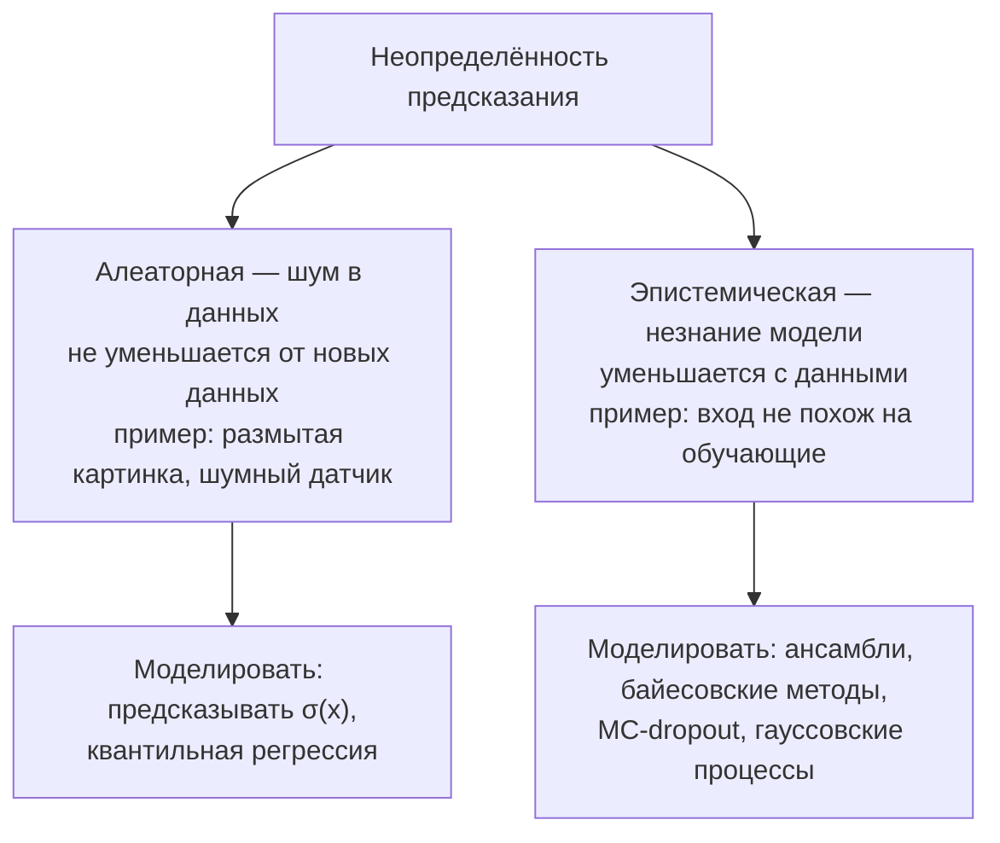
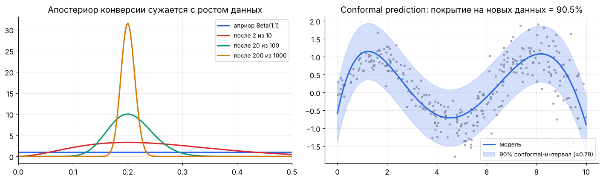

[← 21. 🧰 Прикладное: рекомендательные системы](21_recommender_systems.md) · [🏠 Оглавление](../README.md#-оглавление) · [23. 🧰 Прикладное: Фурье, свёртки и обработка сигналов →](23_fourier_signals.md)

<a id="m22"></a>

# 22. 🧰 Прикладное: байесовские методы и неопределённость

> 📓 [Ноутбук модуля](../notebooks/22_bayes_uncertainty.ipynb) · [](https://colab.research.google.com/github/justxor/math-for-ai-2026/blob/main/notebooks/22_bayes_uncertainty.ipynb)

> Модель сказала «95% кот» — можно ли этому верить? В медицине, финансах, автопилоте и LLM-агентах важно не только предсказание, но и **насколько модель в нём уверена** — и умение сказать «не знаю».

## Два вида неопределённости



## Сопряжённые априоры — байес в закрытой форме

Если апостериорное распределение из того же семейства, что и априорное, обновление сводится к арифметике:

| Правдоподобие | Сопряжённый априор | Обновление после данных |
|---------------|--------------------|--------------------------|
| Бернулли / биномиальное | Beta$(\alpha, \beta)$ | Beta$(\alpha + \text{успехи},\ \beta + \text{неудачи})$ |
| Категориальное | Dirichlet$(\mathbf{\alpha})$ | $\alpha_k$ + число исходов $k$ |
| Пуассон | Gamma$(a, b)$ | Gamma$(a + \sum x_i,\ b + n)$ |
| Нормальное (известная σ) | $\mathcal{N}(\mu_0, \tau^2)$ | точности складываются: $\frac{1}{\tau_n^2} = \frac{1}{\tau^2} + \frac{n}{\sigma^2}$ |



**Байесовский A/B-тест:** апостериоры конверсий $\text{Beta}(1 + x_A, 1 + n_A - x_A)$ и аналогично для B; $P(p_B > p_A)$ считается сэмплированием — отвечает ровно на вопрос бизнеса «насколько вероятно, что B лучше».

## Когда закрытой формы нет

| Метод | Идея | Где |
|-------|------|-----|
| **MCMC** (Metropolis–Hastings, HMC, NUTS) | цепь Маркова со стационарным распределением = апостериорному | PyMC, Stan, Pyro; точные, но медленные |
| **Вариационный вывод** | приблизить апостериор простым $q_\phi$, максимизируя ELBO (модуль 12) | VAE, байесовские нейросети, большие модели |
| **Laplace approximation** | гауссиана вокруг MAP с ковариацией $H^{-1}$ (гессиан лосса) | дешёвая неопределённость поверх обученной сети |

## Неопределённость в глубоком обучении

- **Глубокие ансамбли:** 5 моделей с разной инициализацией; разброс предсказаний — эпистемическая неопределённость. Простой и один из самых надёжных методов.
- **MC-dropout:** dropout включён на инференсе, $T$ прогонов — приближённый байесовский вывод.
- **Предсказание дисперсии:** сеть выдаёт $\mu(\mathbf{x})$ и $\sigma(\mathbf{x})$, лосс — гауссовский NLL $\frac{(y - \mu)^2}{2\sigma^2} + \log\sigma$ (модуль 07) — алеаторная неопределённость.
- **Калибровка** (модуль 09): temperature scaling, ECE.
- **OOD-детекция:** энергия $-\log\sum e^{z_k}$, расстояние Махаланобиса до обучающих эмбеддингов.
- **LLM:** энтропия по токенам, согласованность нескольких сэмплов (self-consistency), вероятность ответа — сигналы для «не знаю» и проверки галлюцинаций.

## Conformal prediction — гарантии без допущений о модели

**Split conformal** для регрессии с уровнем $1 - \alpha$:
1. Обучить любую модель $f$ на train.
2. На отдельной калибровочной выборке посчитать ошибки $s_i = \lvert y_i - f(\mathbf{x}_i)\rvert$.
3. Взять $\hat{q}$ — квантиль ошибок уровня $\lceil (n+1)(1-\alpha)\rceil / n$.
4. Интервал $[f(\mathbf{x}) - \hat{q},\ f(\mathbf{x}) + \hat{q}]$ покрывает истинное $y$ с вероятностью **не меньше** $1 - \alpha$.

Гарантия держится для **любой** модели, если данные обмениваемы (exchangeable — грубо говоря, калибровка и новые данные из одного распределения). Для классификации — множество классов, чей скор выше порога: модель может честно вернуть «кот или рысь».

## 🎯 На собеседовании

1. **Алеаторная vs эпистемическая неопределённость?** — Шум данных vs незнание модели; второе уменьшается с данными.
2. **Что такое сопряжённый априор?** — Апостериор того же семейства; Beta–Бернулли.
3. **MCMC vs вариационный вывод?** — Точный, но медленный сэмплинг vs быстрая оптимизация приближения.
4. **Как получить неопределённость от нейросети?** — Ансамбли, MC-dropout, предсказание дисперсии, Laplace; плюс калибровка.
5. **Что гарантирует conformal prediction?** — Маргинальное покрытие не ниже $1 - \alpha$ для любой модели при обмениваемости данных.

## 🏋️ Практика модуля

**22.1.** Байесовский A/B: A — 120 из 2400, B — 150 из 2400. Найдите $P(p_B > p_A)$.

<details><summary>▶️ Решение</summary>

```python
import numpy as np
rng = np.random.default_rng(0)
pa = rng.beta(1 + 120, 1 + 2280, 200_000); pb = rng.beta(1 + 150, 1 + 2250, 200_000)
print((pb > pa).mean().round(3), np.percentile(pb - pa, [2.5, 97.5]).round(4))
# ≈ 0.97; 95% интервал разницы ≈ [−0.0006, 0.0256]
```
</details>

**22.2.** Обучите ансамбль из 5 полиномиальных моделей на бутстрап-выборках и покажите, что разброс растёт вне области данных.

<details><summary>▶️ Решение</summary>

```python
x = rng.uniform(-2, 2, 60); y = np.sin(x) + rng.normal(0, 0.1, 60)
xs = np.array([0.0, 1.5, 3.0, 4.0])                       # 3 и 4 — вне обучающих данных
preds = []
for _ in range(5):
    idx = rng.integers(0, 60, 60)
    preds.append(np.polyval(np.polyfit(x[idx], y[idx], 5), xs))
print(np.std(preds, axis=0).round(3))                    # маленький разброс внутри [−2, 2], большой снаружи
```
</details>

**22.3.** Реализуйте split conformal для регрессии и проверьте покрытие на новых данных.

<details><summary>▶️ Решение</summary>

```python
X = rng.uniform(0, 10, 2000); Y = np.sin(X) + rng.normal(0, 0.3, 2000)
tr, cal, te = slice(0, 1000), slice(1000, 1500), slice(1500, 2000)
coef = np.polyfit(X[tr], Y[tr], 7)
s = np.abs(Y[cal] - np.polyval(coef, X[cal])); n = s.size
q = np.quantile(s, np.ceil((n + 1) * 0.9) / n)
cover = np.mean(np.abs(Y[te] - np.polyval(coef, X[te])) <= q)
print(round(q, 3), round(cover, 3))                     # покрытие ≈ 0.88–0.92: гарантия «в среднем», конкретная выборка колеблется
```
</details>

---

[← 21. 🧰 Прикладное: рекомендательные системы](21_recommender_systems.md) · [🏠 Оглавление](../README.md#-оглавление) · [23. 🧰 Прикладное: Фурье, свёртки и обработка сигналов →](23_fourier_signals.md)
