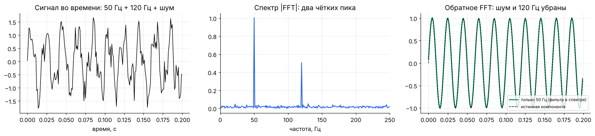
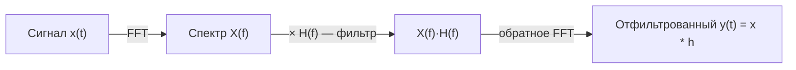
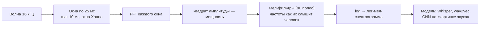

[← 22. 🧰 Прикладное: байесовские методы и неопределённость](22_bayes_uncertainty.md) · [🏠 Оглавление](../README.md#-оглавление) · [Практикум: 100 задач с решениями →](../PRACTICE.md)

<a id="m23"></a>

# 23. 🧰 Прикладное: Фурье, свёртки и обработка сигналов

> 📓 [Ноутбук модуля](../notebooks/23_fourier_signals.ipynb) · [](https://colab.research.google.com/github/justxor/math-for-ai-2026/blob/main/notebooks/23_fourier_signals.ipynb)

> Речь (Whisper), музыка, сенсоры, ЭКГ, вибрации станков, позиционные кодировки трансформеров и даже некоторые архитектуры LLM опираются на одну идею: **любой сигнал — сумма синусоид**.

## Идея преобразования Фурье

Сигнал во времени ↔ набор частот с амплитудами и фазами. **Дискретное преобразование Фурье** (DFT) для $N$ отсчётов:

```math
X_k = \sum_{n=0}^{N-1} x_n\, e^{-2\pi i\, kn/N}, \qquad x_n = \frac{1}{N}\sum_{k=0}^{N-1} X_k\, e^{2\pi i\, kn/N}, \qquad e^{i\varphi} = \cos\varphi + i\sin\varphi
```

$\lvert X_k\rvert$ — амплитуда частоты $k$, $\arg X_k$ — фаза. **FFT** считает DFT за $O(N\log N)$ вместо $O(N^2)$ — один из важнейших алгоритмов XX века.



**Частота дискретизации и Найквист:** при дискретизации $f_s$ различимы частоты до $f_s/2$. Более высокие «отражаются» в низкие (**алиасинг**) — поэтому перед уменьшением частоты дискретизации сигнал фильтруют. Аудио 16 кГц (речь) содержит частоты до 8 кГц.

## Теорема о свёртке

```math
(f * g)(t) = \sum_\tau f(\tau)\, g(t - \tau) \qquad\Longleftrightarrow\qquad \mathcal{F}\{f * g\} = \mathcal{F}\{f\} \cdot \mathcal{F}\{g\}
```

**Свёртка во времени = поэлементное умножение в частотах.**

- Фильтрация: умножить спектр на «маску» (низкие частоты оставить — сглаживание, высокие — выделение краёв).
- Длинные свёртки быстрее через FFT: $O(N\log N)$ вместо $O(NK)$. Так устроены длинные свёрточные модели последовательностей (Hyena, S4-подобные) и FNet, где attention заменён преобразованием Фурье.
- Скользящее среднее (модуль 18) — тоже свёртка, а значит, низкочастотный фильтр.



## Спектрограммы и признаки для речи

Звук меняется во времени, поэтому FFT считают в коротких перекрывающихся окнах — **STFT**:



- **Мел-шкала** $m = 2595\log_{10}(1 + f/700)$: человек лучше различает низкие частоты, поэтому полосы там уже.
- **Окно** (Ханна, Хэмминга) сглаживает края кадра и уменьшает «утечку спектра».
- Компромисс неопределённости: короткое окно — точное время, грубые частоты; длинное — наоборот.

## Фурье в трансформерах

- **Синусоидальные позиционные кодировки** — набор частот $\omega_i = 10000^{-2i/d}$: низкие частоты кодируют «где примерно», высокие — «точная позиция».
- **RoPE** — поворот на углы $p\,\omega_i$ (модуль 11): скалярное произведение зависит от разности позиций — свойство сдвига Фурье.
- **Расширение контекста** (NTK-scaling, YaRN) — изменение спектра частот $\omega_i$, чтобы длинные позиции не выходили за «выученные» обороты.
- **Спектральный сдвиг (spectral bias):** нейросети сначала выучивают низкочастотные компоненты функции; случайные признаки Фурье на входе (как в NeRF; см. модуль 17) помогают выучить высокие частоты.

## 🎯 На собеседовании

1. **Что делает преобразование Фурье?** — Раскладывает сигнал на частоты; FFT — за $O(N\log N)$.
2. **Теорема о свёртке и зачем она нужна?** — Свёртка ↔ умножение спектров; быстрые длинные свёртки и фильтрация.
3. **Что такое частота Найквиста и алиасинг?** — Максимум различимой частоты $f_s/2$; выше — подмена частот.
4. **Как готовят аудио для моделей?** — STFT → мел-фильтры → логарифм.
5. **Как Фурье связан с позиционными кодировками?** — Синусы разных частот; RoPE — повороты.

## 🏋️ Практика модуля

**23.1.** Найдите доминирующие частоты в сигнале с помощью FFT.

<details><summary>▶️ Решение</summary>

```python
import numpy as np
fs = 1000; t = np.arange(0, 1, 1 / fs)
x = np.sin(2 * np.pi * 50 * t) + 0.5 * np.sin(2 * np.pi * 120 * t)
amp = np.abs(np.fft.rfft(x)) * 2 / t.size; f = np.fft.rfftfreq(t.size, 1 / fs)
print(f[np.argsort(-amp)[:2]], amp[np.argsort(-amp)[:2]].round(2))   # [50. 120.] [1.  0.5]
```
</details>

**23.2.** Проверьте теорему о свёртке численно.

<details><summary>▶️ Решение</summary>

```python
a, b = np.random.randn(64), np.random.randn(16)
direct = np.convolve(a, b)                                   # длина 64 + 16 − 1 = 79
n = len(a) + len(b) - 1
via_fft = np.fft.irfft(np.fft.rfft(a, n) * np.fft.rfft(b, n), n)
print(np.allclose(direct, via_fft))                          # True
```
Дополнение нулями до $n$ превращает циклическую свёртку FFT в обычную.
</details>

**23.3.** Сигнал 900 Гц дискретизируют с частотой 1000 Гц. На какой частоте он «окажется»?

<details><summary>▶️ Решение</summary>

Найквист — 500 Гц; 900 Гц отражается в $\lvert 900 - 1000\rvert = 100$ Гц. Проверка: `np.sin(2*np.pi*900*t)` и `-np.sin(2*np.pi*100*t)` на сетке `t = np.arange(0, 1, 1/1000)` совпадают поточечно.
</details>

---

[← 22. 🧰 Прикладное: байесовские методы и неопределённость](22_bayes_uncertainty.md) · [🏠 Оглавление](../README.md#-оглавление) · [Практикум: 100 задач с решениями →](../PRACTICE.md)
